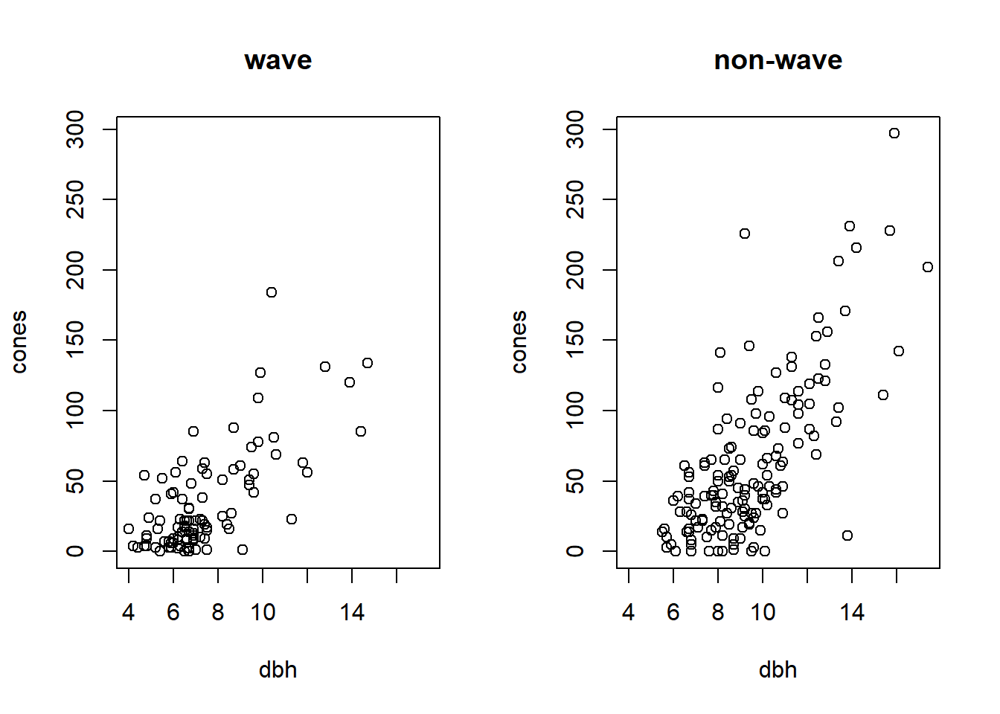

# Beyond the MLE: Confidence regions and hypothesis tests using the likelihood function

Likelihood can be used for more than simply isolating the MLE.  The likelihood can also be used to generate confidence intervals for single parameters, or confidence regions for several parameters.  We'll start by using the horse-kick data to see how to generate a confidence interval for a single parameter, and then move on to considering models with more than one parameter.

## Confidence intervals for single parameters

First we'll read in the data and recreate the negative log likelihood function.


```r
horse <- read.table("data/horse.txt", header = TRUE)

horse.neg.ll <- function(my.lambda) {
  ll.vals <- dpois(x = horse$deaths, lambda = my.lambda, log = TRUE)
  -1 * sum(ll.vals) 
}

# create a vector of lambda values using the 'seq'uence command
lambda.vals <- seq(from = 0.5, to = 1.0, by = 0.01)

# create an empty vector to store the values of the log-likelihood
ll.vals <- double(length = length(lambda.vals))

# use a loop to find the log-likelihood for each value in lambda.vals
for (i.lambda in 1:length(lambda.vals)) {
  ll.vals[i.lambda] <- horse.neg.ll(lambda.vals[i.lambda])
}

plot(ll.vals ~ lambda.vals, xlab = "lambda", ylab = "negative log likelihood", type = "l")
```


To find an asymptotic confidence interval for $\lambda$ with confidence level $100 \times (1-\alpha)\%$, we want to find all the values of $\lambda$ for which the negative log-likelihood is no greater than $\frac{1}{2}\chi^2_1(1-\alpha)$ larger than the negative log-likelihood at the MLE.^[See $\S$6.4.1.1 to see how this follows from a result about the likelihood ratio.]  (In other words, if we think about the negative log likelihood as quantifying the "badness of fit", as Bolker suggests, then we want to find all values of $\lambda$ that give a fit that is no more than $\frac{1}{2}\chi^2_1(1-\alpha)$ worse than the fit at the MLE.)  By $\chi^2_1(1-\alpha)$, we mean $1-\alpha$ quantile of a $\chi^2_1$ distribution, which can be found with the function `qchisq` in R.  The code below uses the function `uniroot` to find the upper and lower bounds of a 95\% CI for $\lambda$.

```r
cutoff.ll <- horse.neg.ll(0.7) + qchisq(0.95, df = 1) / 2

# recreate the plot and add a line
plot(ll.vals ~ lambda.vals, xlab = "lambda", ylab = "negative log likelihood", type = "l")
abline(h = cutoff.ll, col = "red", lty = "dashed")
```


```r
# use uniroot to find the confidence bounds precisely

my.function <- function(my.lambda){
  
  horse.neg.ll(0.7) + qchisq(0.95, df = 1) / 2 - horse.neg.ll(my.lambda)  
}

(lower <- uniroot(f = my.function, interval = c(0.6, 0.7)))
```

```
## $root
## [1] 0.6065198
## 
## $f.root
## [1] -3.556854e-05
## 
## $iter
## [1] 4
## 
## $init.it
## [1] NA
## 
## $estim.prec
## [1] 6.103516e-05
```

```r
(upper <- uniroot(f = my.function, interval = c(0.7, 0.9)))
```

```
## $root
## [1] 0.8026265
## 
## $f.root
## [1] -0.0001007316
## 
## $iter
## [1] 6
## 
## $init.it
## [1] NA
## 
## $estim.prec
## [1] 6.103516e-05
```

As an alternative programming style, we could have defined the objective function on the fly without bothering to create `my.function`.


```r
(lower <- uniroot(f = function(x) horse.neg.ll(0.7) + qchisq(0.95, df = 1) / 2 - horse.neg.ll(x) ,
                 interval = c(0.6, 0.7)))
```

```
## $root
## [1] 0.6065198
## 
## $f.root
## [1] -3.556854e-05
## 
## $iter
## [1] 4
## 
## $init.it
## [1] NA
## 
## $estim.prec
## [1] 6.103516e-05
```

Let's recreate the plot and add vertical lines to indicate the confidence interval.


```r
plot(ll.vals ~ lambda.vals, xlab = "lambda", ylab = "negative log likelihood", type = "l")
abline(h = cutoff.ll, col = "red", lty = "dashed")
abline(v = c(lower$root, upper$root), col = "red")
```


```r
# clean up the workspace
rm(list = ls())
```
Thus, the 95\% CI for $\lambda$ is $(0.607, 0.803)$.

There are two important caveats about the CIs constructed from the likelihood function in this way.  First, the coverage is asymptotic, which means that the actual coverage is only guaranteed to match the nominal coverage (e.g., the 95% value) in the limit as the volume of data grows large.  As Bolker (p.\ 194) notes, though, analysts use these asymptotic CIs "very freely".  Secondly, the CI is only valid if the MLE lies in the interior of its range of allowable values. (In other words, the CI isn't valid if the MLE lies at the edge of the parameter's allowable values.) We'll have to worry about this most when constructing likelihood-based CIs for variances.  To foreshadow, in mixed models we sometimes encounter a variance whose MLE is 0 --- its smallest allowable value.  In those case, we'll have to modify the method detailed here to get a valid CI.

## Confidence regions, profile likelihoods, and associated univariate intervals{#two-param-mle}

With a 2-parameter model, we can plot a confidence region directly.  First some housekeeping to get started:


```r
library(emdbook)
data("ReedfrogFuncresp")

# rename something shorter

frog <- ReedfrogFuncresp
rm(ReedfrogFuncresp)

frog.neg.ll <- function(params){
  
  a <- params[1]
  h <- params[2]
  
  prob.vals <- a / (1 + a * h * frog$Initial)
  
  ll.vals <- dbinom(frog$Killed, size = frog$Initial, prob = prob.vals, log = TRUE)
  -1 * sum(ll.vals)
}

(frog.mle <- optim(par = c(0.5, 1/60),
                   fn  = frog.neg.ll))
```

```
## Warning in dbinom(frog$Killed, size = frog$Initial, prob = prob.vals, log =
## TRUE): NaNs produced
```

```
## $par
## [1] 0.52585566 0.01660104
## 
## $value
## [1] 46.72136
## 
## $counts
## function gradient 
##       61       NA 
## 
## $convergence
## [1] 0
## 
## $message
## NULL
```

```r
a.mle <- frog.mle$par[1]
h.mle <- frog.mle$par[2]

# plot negative likelihood contours

a.vals <- seq(from = 0.3, to = 0.75, by = 0.01)
h.vals <- seq(from = 0.001, to = 0.03, by = 0.001)

ll.vals <- matrix(nrow = length(a.vals), ncol = length(h.vals))

for (i.a in 1:length(a.vals)) {
  for(i.h in 1:length(h.vals)) {
    ll.vals[i.a, i.h] <- frog.neg.ll(c(a.vals[i.a], h.vals[i.h]))
  }
}

contour(x = a.vals, y = h.vals, z = ll.vals, nlevels = 100,
        xlab = "a", ylab = "h")

points(x = a.mle, y = h.mle, col = "red")
```


Equipped with the contour plot, graphing the appropriate confidence region is straightforward.


```r
cut.off <- frog.neg.ll(c(a.mle, h.mle)) + (1 / 2) * qchisq(.95, df = 2)

# recreate the plot and add a line for the 95% confidence region
contour(x = a.vals, y = h.vals, z = ll.vals, nlevels = 100,
        xlab = "a", ylab = "h")

points(x = a.mle, y = h.mle, col = "red")
contour(x = a.vals, y = h.vals, z = ll.vals, 
        levels = cut.off,
        add = TRUE, col = "red", lwd = 2)
```


However, there are several drawbacks to confidence regions.  First, while a two-dimensional confidence region can be readily visualized, it is hard to summarize or describe.  Second, and more importantly, most models have more than two parameters.  In these models, a confidence region would have more than 2 dimensions, and thus would be impractical to visualize.  Thus it is helpful, or even essential, to be able to generate univariate confidence intervals for single parameters from high-dimensional likelihoods.  One approach to doing so is to calculate the so-called profile likelihood for a given parameter, and then to derive the univariate interval from this profile likelihood.  We will illustrate this approach by computing a profile-based confidence interval for the attack rate $a$ in the tadpole data.


```r
# profile log-likelihood function for the attack rate a

profile.ll <- function(my.a) {
  
  # Calculate the minimum log likelihood value for a given value of a, the attack rate
  
  my.ll <- function(h) frog.neg.ll(c(my.a, h))
  my.profile <- optimize(f = my.ll, interval = c(0, 0.03), maximum = FALSE)
  
  my.profile$objective
}

# plot the profile likelihood vs. a
# not necessary for finding the CI, but useful for understanding

a.values <- seq(from = 0.3, to = 0.8, by = 0.01)
a.profile <- double(length = length(a.values))

for (i in 1:length(a.values)) {
  
  a.profile[i] <- profile.ll(a.values[i])
}

plot(x = a.values, y = a.profile, xlab = "a", ylab = "negative log-likelihood", type = "l")
```


Now we'll follow the same steps as before to compute the profile-based 95% CI.


```r
# Now follow the same steps as before to find the profile 95% CI

cut.off <- profile.ll(a.mle) + qchisq(0.95, df = 1) / 2

(lower <- uniroot(f = function(x) cut.off - profile.ll(x) ,
                  interval = c(0.3, a.mle)))
```

```
## $root
## [1] 0.4024268
## 
## $f.root
## [1] -0.0001303772
## 
## $iter
## [1] 6
## 
## $init.it
## [1] NA
## 
## $estim.prec
## [1] 6.103516e-05
```

```r
(upper <- uniroot(f = function(x) cut.off - profile.ll(x) ,
                  interval = c(a.mle, 0.8)))
```

```
## $root
## [1] 0.6824678
## 
## $f.root
## [1] -9.763258e-06
## 
## $iter
## [1] 6
## 
## $init.it
## [1] NA
## 
## $estim.prec
## [1] 6.103516e-05
```

```r
plot(x = a.values, y = a.profile, xlab = "a", ylab = "negative log-likelihood", type = "l")
abline(v = c(lower$root, upper$root), col = "blue")
abline(h = cut.off, col = "blue", lty = "dashed")
```


So, the 95\% profile CI for $a$ is (0.402, 0.682).

## Locally quadratic approximations to confidence intervals and regions

Likelihood profiling provides a straightforward way to summarize a high-dimensional confidence region by univariate confidence intervals.  However, these profile intervals can still involve quite a bit of computation.  Further, they are not able to capture possible correlations among parameter estimates, which are revealed in (two-dimensional) confidence regions.  (Recall the shape of the joint confidence region for the parameters $a$ and $h$ in the tadpole data.)  Locally quadratic approximations provide a way to approximate the (already approximate) univariate confidence intervals and bivariate confidence regions using only information about the curvature of the likelihood surface at the MLE.

We'll first start by revisiting the horse-kick data again.  Of course, with the more precise $\chi^2$ based confidence interval in hand, there is no reason to seek an approximation.  But doing so allows us to illustrate the calculations involved, and to see how well the approximation fares in this case.

First some housekeepign to read the data into memory, etc.


```r
# clean up
rm(list = ls())

# read in the data

horse <- read.table("data/horse.txt", header = TRUE)

horse.neg.ll <- function(my.lambda) {
  ll.vals <- dpois(x = horse$deaths, lambda = my.lambda, log = TRUE)
  -1 * sum(ll.vals) 
}

# use uniroot to find the confidence bounds precisely

my.function <- function(my.lambda){
  
  horse.neg.ll(0.7) + qchisq(0.95, df = 1) / 2 - horse.neg.ll(my.lambda)  
}

lower <- uniroot(f = my.function, interval = c(0.6, 0.7))
upper <- uniroot(f = my.function, interval = c(0.7, 0.9))
```

Now we will proceed to use a locally quadratic approximation to the negative log likelihood.

```r
## this function finds the second derivative at the MLE by finite differences

second.deriv <- function(delta.l) {
  
  (horse.neg.ll(0.7 + delta.l) - 2 * horse.neg.ll(0.7) + horse.neg.ll(0.7 - delta.l)) / delta.l ^ 2
}

(horse.D2 <- second.deriv(1e-04))
```

```
## [1] 400
```

```r
# see how the answer changes if we change delta
second.deriv(1e-05)
```

```
## [1] 400.0003
```

Let's compare this answer to the answer obtained by `numDeriv::hessian`.

```r
numDeriv::hessian(func = horse.neg.ll, x = 0.7)
```

```
##      [,1]
## [1,]  400
```

The approximate standard error of $\hat{\lambda}$ is the square root of the inverse of the second derivative of the likelihood function.


```r
(lambda.se <- sqrt(1 / horse.D2))
```

```
## [1] 0.05
```

Now we can approximate the 95\% confidence interval by using critical values from a standard normal distribution.

```r
(lower.approx <- 0.7 - qnorm(.975) * lambda.se)
```

```
## [1] 0.6020018
```

```r
(upper.approx <- 0.7 + qnorm(.975) * lambda.se)
```

```
## [1] 0.7979982
```

Compare the approximation to the "exact" values

```r
lower$root
```

```
## [1] 0.6065198
```

```r
upper$root
```

```
## [1] 0.8026265
```

Make a plot

```r
# create a vector of lambda values using the 'seq'uence command
lambda.vals <- seq(from = 0.5, to = 1.0, by = 0.01)

# create an empty vector to store the values of the log-likelihood
ll.vals <- double(length = length(lambda.vals))

# use a loop to find the log-likelihood for each value in lambda.vals
for (i.lambda in 1:length(lambda.vals)) {
  ll.vals[i.lambda] <- horse.neg.ll(lambda.vals[i.lambda])
}

plot(ll.vals ~ lambda.vals, xlab = "lambda", ylab = "negative log likelihood", type = "l")

###################################
## Now find the confidence interval, and plot it
####################################

cutoff.ll <- horse.neg.ll(0.7) + qchisq(0.95, df = 1) / 2

# add a line to the plot
abline(h = cutoff.ll, col = "red", lty = "dashed")
abline(v = c(lower$root, upper$root), col = "red")
abline(v = c(lower.approx, upper.approx), col = "blue")

legend(x = 0.65, y = 326, 
       leg = c("exact", "approximate"), 
       pch = 16, 
       col = c("red", "blue"),
       bty = "n")
```


```r
# clean up
rm(list = ls())
```

Notice that the full $\chi^2$-based confidence intervals capture the asymmetry in the information about $\lambda$.  The intervals based on the quadratic approximation are symmetric.

Now, use the quadratic approximation to find standard errors for $\hat{a}$ and $\hat{h}$ in the tadpole predation data.  

The first part is preparatory work from old classes.

```r
library(emdbook)
data("ReedfrogFuncresp")

# rename something shorter

frog <- ReedfrogFuncresp
rm(ReedfrogFuncresp)

frog.neg.ll <- function(params){
  
  a <- params[1]
  h <- params[2]
  
  prob.vals <- a / (1 + a * h * frog$Initial)
  
  ll.vals <- dbinom(frog$Killed, size = frog$Initial, prob = prob.vals, log = TRUE)
  -1 * sum(ll.vals)
}

frog.mle <- optim(par = c(0.5, 1/60),
                  fn  = frog.neg.ll)
```

```
## Warning in dbinom(frog$Killed, size = frog$Initial, prob = prob.vals, log =
## TRUE): NaNs produced
```

```r
(a.mle <- frog.mle$par[1])
```

```
## [1] 0.5258557
```

```r
(h.mle <- frog.mle$par[2])
```

```
## [1] 0.01660104
```

Now find the hessian:

```r
(D2 <- numDeriv::hessian(func = frog.neg.ll, x = c(a.mle, h.mle)))
```

```
##            [,1]       [,2]
## [1,]   616.5606  -7394.263
## [2,] -7394.2628 130640.685
```

The matrix inverse of the hessian is the variance-covariance matrix of the parameters.  Note that R uses the function `solve` to find the inverse of a matrix.

```r
# invert to get var-cov matrix
(var.matrix <- solve(D2))
```

```
##              [,1]         [,2]
## [1,] 0.0050493492 2.857932e-04
## [2,] 0.0002857932 2.383048e-05
```

We can use the handy `cov2cor` function to convert the variance matrix into a correlation matrix:

```r
cov2cor(var.matrix)
```

```
##           [,1]      [,2]
## [1,] 1.0000000 0.8238872
## [2,] 0.8238872 1.0000000
```

Note the large correlation between $\hat{a}$ and $\hat{h}$.  Compare with Figure 6.13 of Bolker.

The standard errors of $\hat{a}$ and $\hat{h}$ are the square roots of the diagaonal elements of the variance-covariance matrix.

```r
(a.se <- sqrt(var.matrix[1, 1]))
```

```
## [1] 0.07105877
```

```r
(h.se <- sqrt(var.matrix[2, 2]))
```

```
## [1] 0.004881647
```
Note the large correlation between $\hat{a}$ and $\hat{h}$.

Let's use the (approximate) standard error of $\hat{a}$ to calculate an (approximate) 95\% confidence interval:

```r
(ci.approx <- a.mle + qnorm(c(0.025, .975)) * a.se)
```

```
## [1] 0.3865830 0.6651283
```
Recall that the 95\% confidence interval we calculated by the profile likelihood was $(0.402, 0.682)$.  So the quadratic approximation has gotten the width of the interval more or less correct, but it has fared less at capturing the asymmetry of the interval.

## Comparing models: Likelihood ratio test and AIC

Obtaining a parsimonious statistical description of data often requires arbitrating between competing model fits.  Likelihood provides two tools for comparing models: likelihood ratio tests (LRTs) and information criteria.  Of the latter, the best known information criterion is due to Akaike, and takes the name AIC.  (Akaike didn't name AIC after himself; he used AIC to refer to "An information criterion".  In his honor, the acronym is now largely taken to stand for "Akaike's information criterion".)

LRTs and information criteria have complementary strengths and weaknesses.  LRTs are direct, head-to-head comparisons of nested models.  By "nested", we mean that one model can be obtained as a special case of the other.  The "reduced", or less flexible (and thus more parsimonious) model plays the role of the null hypothesis, and the "full", or more flexible (and thus less parsimonious) model plays the role of the alternative hypothesis.  The LRT then formally evaluates whether the improvement in fit offered by the full model is statistically significant, that is, greater than what we would expect merely by chance.  

On the other hand, information criteria provide a penalized goodness-of-fit measure that can be used to compare many models at once.  Information criteria produce a ranking of model fits, and thus a best-fitting model.  The downside to information criteria is that there are no hard and fast guidelines to determine when one model provides a significantly better fit than another. The properties of information criteria are also less well understood than the properties of LRTs.

To illustrate both, we will use the study of cone production by fir trees studied in $\S$ 6.6 of Bolker.  These data are originally from work by Dodd and Silvertown.  The data are much richer than we will examine here.  Like Bolker, we will focus on whether the relationship between tree size (as measured by diameter at breast height, or dbh) and the number of cones produces differs between populations that "have experienced wave-like die-offs" and those that have not.

First some preparatory work to import and assemble the data:


```r
require(emdbook)
data("FirDBHFec")

# give the data a simpler name

fir <- FirDBHFec
rm(FirDBHFec)

fir <- fir[, c("WAVE_NON", "DBH", "TOTCONES")]  # select just the variables we want

summary(fir)
```

```
##  WAVE_NON      DBH            TOTCONES    
##  n:166    Min.   : 3.200   Min.   :  0.0  
##  w:205    1st Qu.: 6.400   1st Qu.: 14.0  
##           Median : 7.600   Median : 36.0  
##           Mean   : 8.169   Mean   : 49.9  
##           3rd Qu.: 9.700   3rd Qu.: 66.0  
##           Max.   :17.400   Max.   :297.0  
##           NA's   :26       NA's   :114
```

```r
names(fir) <- c("wave", "dbh", "cones")  # rename the variables

# get rid of the incomplete records

fir <- na.omit(fir)

par(mfrow = c(1, 2))

plot(cones ~ dbh, data = fir, type = "n", main = "wave")
points(cones ~ dbh, data = subset(fir, wave == "w"))

plot(cones ~ dbh, data = fir, type = "n", main = "non-wave")
points(cones ~ dbh, data = subset(fir, wave == "n"))
```


```r
# any non-integral responses?

with(fir, table(cones == round(cones)))  # illustrate the use of 'with'
```

```
## 
## FALSE  TRUE 
##     6   236
```

```r
# round the non-integral values
fir$cones <- round(fir$cones)

# check
with(fir, table(cones == round(cones)))
```

```
## 
## TRUE 
##  242
```

Like Bolker, we will assume that the average number of cones produced ($\mu$) has a power-law relationship with tree dbh ($x$).  We will also assume that the actual number of cones produced ($Y$) takes a negative binomial distribution with size-dependent mean and overdispersion parameter $k$.  That is, our model is
\begin{align*}
\mu(x) & = a x ^ b \\
Y & \sim \mbox{NB}(\mu(x), k) 
\end{align*}

To head in a slightly different direction from Bolker, we will compare two models.  In the first, or reduced, model the same parameters will prevail for both wave and non-wave populations.  Thus this model has three parameters: $a$, $b$, and $k$.  In the second, or full, model, we will allow the $a$ and $b$ parameters to differ between the wave and non-wave populations.  (We will continue to assume a common $k$ for both population types.)  Using subscripts on $a$ and $b$ to distinguish population types, the full model then has 5 parameters: $a_w$, $a_n$, $b_w$, $b_n$, and $k$.  We'll fit the reduced model first.  To do so, we'll use the `dnbinom` function in R, in which the $k$ parameter is located in the formal argument "size".


```r
fir.neg.ll <- function(parms, x, y){
 
  a <- parms[1]
  b <- parms[2]
  k <- parms[3]
   
  my.mu <- a * x^b
  ll.values <- dnbinom(y, size = k, mu = my.mu, log = TRUE)
  
  neg.ll <- -1 * sum(ll.values)
  return(neg.ll)
}
```

Note a subtle difference here.  In preparation for fitting this same model to different subsets of the data, the function `fir.neg.ll` has formal arguments that receive the values of the $x$ and $y$ variables.  In the call to `optim`, we can supply those additional values as subsequent arguments in the `optim` function, as illustrated below. 


```r
# fit reduced model

(fir.reduced <- optim(f   = fir.neg.ll,
                      par = c(a = 1, b = 1, k = 1),
                      x   = fir$dbh,
                      y   = fir$cones))
```

```
## $par
##         a         b         k 
## 0.3041425 2.3190142 1.5033525 
## 
## $value
## [1] 1136.015
## 
## $counts
## function gradient 
##      134       NA 
## 
## $convergence
## [1] 0
## 
## $message
## NULL
```

```r
a.mle <- fir.reduced$par[1]
b.mle <- fir.reduced$par[2]
k.mle <- fir.reduced$par[3]
```
Make a plot of the reduced model fit, with both populations pooled together:

```r
dbh.vals <- seq(from = min(fir$dbh), to = max(fir$dbh), length = 100)
fit.vals <- double(length = length(dbh.vals))

for (i in seq(along = dbh.vals)) {
 
  fit.vals[i] <- a.mle * dbh.vals[i] ^ b.mle  
}

par(mfrow = c(1, 1))  # don't break the next figure into two panels
with(fir, plot(cones ~ dbh))  # plot the data points
lines(fit.vals ~ dbh.vals, col = "blue")  
```


Now fit the full model with separate values of $a$ and $b$ for each population:

```r
fir.neg.ll.full <- function(parms) {
  
  a.w <- parms[1]
  b.w <- parms[2]
  
  a.n <- parms[3]
  b.n <- parms[4]
  
  k   <- parms[5]
  
  wave    <- subset(fir, wave == "w")
  nonwave <- subset(fir, wave == "n") 
  
  # note how we call fir.neg.ll here, but each time only
  # passing a subset of the data
  
  neg.ll.wave     <- fir.neg.ll(parms = c(a = a.w, b = b.w, k = k),
                                x     = wave$dbh,
                                y     = wave$cones)
  
  neg.ll.nonwave  <- fir.neg.ll(parms = c(a = a.n, b = b.n, k = k),
                                x     = nonwave$dbh,
                                y     = nonwave$cones)
  
  total.ll <- neg.ll.wave + neg.ll.nonwave
  
  return(total.ll)
}

(fir.full <- optim(f      = fir.neg.ll.full,
                  par    = c(a.w = 1, b.w = 1, a.n = 1, b.n = 1, k = 1)))
```

```
## $par
##       a.w       b.w       a.n       b.n         k 
## 0.4136414 2.1417941 0.2874122 2.3550753 1.5083974 
## 
## $value
## [1] 1135.677
## 
## $counts
## function gradient 
##      502       NA 
## 
## $convergence
## [1] 1
## 
## $message
## NULL
```
Let's make a plot to show the different fits.


```r
a.w.mle <- fir.full$par[1]
b.w.mle <- fir.full$par[2]
a.n.mle <- fir.full$par[3]
b.n.mle <- fir.full$par[4]

par(mfrow = c(1, 2))

# wave populations

fit.vals.wave <- fit.vals.non <- double(length = length(dbh.vals))

plot(cones ~ dbh, data = fir, type = "n", main = "wave")
points(cones ~ dbh, data = subset(fir, wave == "w"))

for (i in seq(along = dbh.vals)) {
 
  fit.vals.wave[i] <- a.w.mle * dbh.vals[i] ^ b.w.mle  
}

lines(fit.vals.wave ~ dbh.vals, col = "blue")  

# non-wave populations

plot(cones ~ dbh, data = fir, type = "n", main = "non-wave")
points(cones ~ dbh, data = subset(fir, wave == "n"))

for (i in seq(along = dbh.vals)) {
 
  fit.vals.non[i] <- a.n.mle * dbh.vals[i] ^ b.n.mle  
}

lines(fit.vals.non ~ dbh.vals, col = "red")  
```



Note that to compute the negative log likelihood for the full model, we compute the negative log likelihood for each population separately, and then sum the two negative log likelihoods.  We can see the justification for doing so by writing out the log likelihood function explicitly:
\begin{eqnarray*}
\ln L(a_w, a_n, b_w, b_n, k; \mathbf{y}) & = & \ln \prod_{i \in \left\{w, n \right\}} \prod_{j=1}^{n_i} f(y_{ij}; a_w, a_n, b_w, b_n, k) \\
& = & \sum_{i \in \left\{w, n \right\}} \sum_{j=1}^{n_i} \ln  f(y_{ij}; a_w, a_n, b_w, b_n, k) \\
& = & \sum_{j=1}^{n_w} \ln  f(y_{w,j}; a_w, b_w, k) + \sum_{j=1}^{n_n} \ln  f(y_{2, n}; a_n, b_n, k)
\end{eqnarray*}

Now conduct the likelihood ratio test:


```r
(lrt.stat <- 2 * (fir.reduced$value - fir.full$value))  # compute the likelihood ratio test statistic
```

```
## [1] 0.6762567
```

```r
(lrt.pvalue <- pchisq(q = lrt.stat, df = 2, lower.tail = FALSE))  # calculate the p-vlaue
```

```
## [1] 0.7131037
```
The LRT suggests that the full model does not provide a significantly better fit than the reduced model ($\chi^2_2 = 0.676$, $p=0.71$).  In other words, there is no evidence that the two population types have different relationships between tree size and avearage fecundity.

Now compare AIC values for the two models.  Because we have already done the LRT, this AIC comparison is for illustration.

```r
(aic.reduced <- 2 * fir.reduced$value + 2 * 3)
```

```
## [1] 2278.03
```

```r
(aic.full    <- 2 * fir.full$value    + 2 * 5)
```

```
## [1] 2281.354
```

```r
(delta.aic   <- aic.full - aic.reduced) 
```

```
## [1] 3.323743
```
The reduced model is AIC-best, although the $\Delta AIC$ is only moderately large.

We can also fit a Poisson model to these data.  Because we have ruled out the need for different models for the two population type, we fit a Poisson model to the data with the two populations pooled together.


```r
fir.neg.ll.pois <- function(parms, x, y){
  
  a <- parms[1]
  b <- parms[2]
  
  my.mu <- a * x^b
  ll.values <- dpois(y, lambda = my.mu, log = TRUE)
  
  -1 * sum(ll.values)
}

(fir.pois <- optim(f   = fir.neg.ll.pois,
                  par = c(a = 1, b = 1),
                  x   = fir$dbh,
                  y   = fir$cones))
```

```
## $par
##         a         b 
## 0.2613297 2.3883860 
## 
## $value
## [1] 3161.832
## 
## $counts
## function gradient 
##      115       NA 
## 
## $convergence
## [1] 0
## 
## $message
## NULL
```

```r
a.mle.pois <- fir.pois$par[1]
b.mle.pois <- fir.pois$par[2]
```
Calculate the AIC for this model:

```r
# calculate AIC
(aic.pois <- 2 * fir.pois$value + 2 * 2)
```

```
## [1] 6327.664
```
Whoa!  The AIC suggests the negative binomial model is an overwhelmingly better fit.

Finally, make a plot to compare the two fits:

```r
with(fir, plot(cones ~ dbh))

lines(fit.vals ~ dbh.vals, col = "blue")  # plot the fit from the NegBin model

## calculate and plot the fit for the Poisson model
fit.vals.pois <- double(length = length(dbh.vals))

for (i in seq(along = dbh.vals)) {
  
  fit.vals.pois[i] <- a.mle.pois * dbh.vals[i] ^ b.mle.pois  
}

lines(fit.vals.pois ~ dbh.vals, col = "red")
legend(x = 4, y = 280, 
       leg = c("Neg Bin", "Poisson"),
       col = c("blue", "red"),
       pch = 16,
       bty = "n")
```


## Transformable constraints

So far, we have not thought much about the numerical optimization routines that R uses to find MLEs.  If time allowed, we really should think more deeply about how these routines work.  Indeed, Bolker devotes an entire chapter (his chapter 7) to numerical optimization.  Because time is short, we won't go that deeply into understanding these methods now, although Bolker's chapter is worth a read if you are so inclined.  

There is one topic that deserves more of our attention, which is the issue of constriants on the allowable parameter space.  (Bolker touches on this in his $\S$ 7.4.5.)  Many times, we write down models with parameters that only make biological sense in a certain range.  For example, in the fir data, we know that the parameter $a$ (the average cone production for trees of size $x = 1$) must be positive.  We also know that $k$, the overdispersion parameter in the negative binomial model, must also be positive.  However, most numerical optimization routines are not terribly well suited to optimizing over a constrained space.  (The presence of constraints is one of the reasons why it is important to initiate numerical optimization routines with reasonalbe starting values.)  One exception is the "L-BFGS-B" method, available in `optim`, which will permit so-called rectangular constraints.  An alternative approach that will work with any numerical optimization scheme is to transform the constraints away.  That is, transform the parameterization to a new scale that is unconstrained.  Because of the invariance principle of MLEs, these transformations won't change the MLEs that we eventually find, as long as the MLEs are not on the edge of the original, constrained space.

To illustrate, consider the fir data again, and consider the negative-binomial model fit to the entire data set, ignoring differences between wave vs.\ non-wave populations.  To transform away the constraints on $a$ and $k$, re-parameterize the model in terms of the logs of both parameters.  That is, define
\begin{align*}
a^* & = \ln (a) \\
k^* & = \ln (k) \\
\end{align*}
so that the model is now
\begin{align*}
\mu(x) & = \exp(a^*) \times x ^ b \\
Y & \sim \mbox{NB}(\mu(x), \exp(k^*)) 
\end{align*}
Fitting proceeds in the usual way:

```r
fir.neg.ll <- function(parms, x, y){
  
  a <- exp(parms[1])
  b <- parms[2]
  k <- exp(parms[3])
  
  my.mu <- a * x^b
  ll.values <- dnbinom(y, size = k, mu = my.mu, log = TRUE)
  
  -1 * sum(ll.values)
}

(fir.reduced <- optim(f   = fir.neg.ll,
                      par = c(a = 0, b = 1, k = 0),
                      x   = fir$dbh,
                      y   = fir$cones))
```

```
## $par
##          a          b          k 
## -1.1914367  2.3195050  0.4074672 
## 
## $value
## [1] 1136.015
## 
## $counts
## function gradient 
##      158       NA 
## 
## $convergence
## [1] 0
## 
## $message
## NULL
```

Back-transforming to the original scale recovers the previous MLEs:

```r
(a.mle <- exp(fir.reduced$par[1]))
```

```
##         a 
## 0.3037845
```

```r
(b.mle <- fir.reduced$par[2])
```

```
##        b 
## 2.319505
```

```r
(k.mle <- exp(fir.reduced$par[3]))
```

```
##        k 
## 1.503006
```

The constraint issue also explains why we received warnings from R when we first found the MLEs for the tadpole predation data in Section \@ref(two-param-mle).

Another example that one frequently encounters in ecology are parameters that are constrained to lie between 0 and 1, such as a survival probability.  A logit (or log odds) transformation will eliminate the constraints on a parameter that lies between 0 and 1.  

<!-- Finally, one might also encounter parameters whose sum must lie between 0 and 1.  For example, in size-based demographic modeling, it is common to describe the demographic fates of individuals in a particular age or size class by two parameters --- survival without growth (say) and survival with growth.  Writing these two parameters as  -->

## The negative binomial distriution, revisited

The negative binomial distribution is a funny distribution that is frequently misunderstood by ecologists.  In ecology, the negative binomial distribution is typically parameterized by the distribution's mean (which we typically write as $\mu$) and the "overdispersion parameter", almost always written as $k$.  In this parameterization, if $X$ has a negative binomial distribution with mean $\mu$ and overdispersion parameter $k$, then the variance of $X$ is
$$
Var(X) = \mu + \frac{\mu^2}{k}
$$
Thus, for fixed $\mu$, the variance increases as $k$ decreases.  As $k$ gets large, the variance approaches $\mu$, and the negative binomial distribution approaches a Poisson distribution.

There are a few occasions in ecology where the overdispersion parameter $k$ has a mechanistic interpretation.  In all other cases, though, $k$ is merely a phenomenological descriptor that captures the relationship between the mean and variance for one particular value of $\mu$.  The error that most ecologists make is to assume that a single value of $k$ should prevail across several values of $\mu$.  If $k$ is phenomenological, there is no reason that $k$ should remain fixed as $\mu$ changes.  The fit to the fir data exemplifies this error, as so far we have assumed that one value of $k$ must prevail across all sizes of trees.  By assuming that $k$ is fixed, we impose a relationship on the data where the variance must increase quadratically as the mean increases.  This may be a reasonable model for the relationship between the variance and the mean, or it may not be. 

Instead of assuming $k$ constant, another equally viable approach might be to assume that $k$ is a linear function of $\mu$.  In other words, We might set $k = \kappa \mu$ for some value of $\kappa$.  In this case, for a given mean $\mu$, the variance would be $\mu + \frac{\mu^2}{\kappa \mu} = \mu \left(1 + \frac{1}{\kappa}\right)$, so that the variance would increase linearly as the mean increases.  We can try fitting this alternative model to the fir tree data, again pooling wave and non-wave populations together.

```r
fir.alt.neg.ll <- function(parms, x, y){
  
  a <- exp(parms[1])
  b <- parms[2]
  k <- exp(parms[3])
  
  my.mu <- a * x^b
  ll.values <- dnbinom(y, size = k * my.mu, mu = my.mu, log = TRUE)
  
  -1 * sum(ll.values)
}

(fir.alt <- optim(f   = fir.alt.neg.ll,
                  par = c(a = 0, b = 1, k = 0),
                  x   = fir$dbh,
                  y   = fir$cones))
```

```
## $par
##         a         b         k 
## -1.008373  2.243545 -3.278311 
## 
## $value
## [1] 1128.403
## 
## $counts
## function gradient 
##      182       NA 
## 
## $convergence
## [1] 0
## 
## $message
## NULL
```

```r
(a.mle.alt <- exp(fir.alt$par[1]))
```

```
##         a 
## 0.3648121
```

```r
(b.mle.alt <- fir.alt$par[2])
```

```
##        b 
## 2.243545
```

```r
(k.mle.alt <- exp(fir.alt$par[3]))
```

```
##          k 
## 0.03769186
```

If we compare the fits graphically, the alternative model doesn't generate a dramatically different fit for the relationship between the average cone production and tree size:

```r
fit.vals.alt <- double(length = length(dbh.vals))

for (i in seq(along = dbh.vals)) {
  
  fit.vals.alt[i] <- a.mle.alt * dbh.vals[i] ^ b.mle.alt  
}

with(fir, plot(cones ~ dbh))
lines(fit.vals ~ dbh.vals, col = "blue")
lines(fit.vals.alt ~ dbh.vals, col = "red")
legend("topleft", col = c("blue", "red"), pch = 16, leg = c("original", "alternate"))
```


However, the two models imply very different relationships between the variance in cone production and tree size.  Let's look at the implied relationship between the standard deviation of cone production and tree size:

```r
mu.vals <- seq(from = 0, to = max(fit.vals), length = 100)

sd.vals.nb1 <- sqrt(mu.vals + mu.vals ^ 2 / k.mle)
sd.vals.nb2 <- sqrt(mu.vals * (1 + 1 / k.mle.alt))

plot(mu.vals, sd.vals.nb1, xlab = "mean", ylab = "SD", type = "l", col = "blue")
lines(mu.vals, sd.vals.nb2, col = "red")
legend("topleft", col = c("blue", "red"), pch = 16, leg = c("original", "alternate"))
```


We can calculate the AIC for this alternate parameterization as well:

```r
(aic.alt <- 2 * fir.alt$value + 2 * 3)
```

```
## [1] 2262.805
```
Recall that the AIC value for the original fit was 2278.0.  Thus the model with the alternative parameterization is considerably better by AIC.

