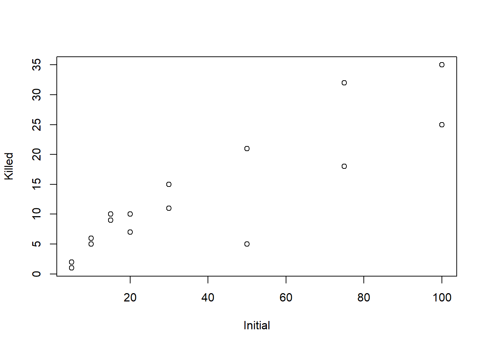
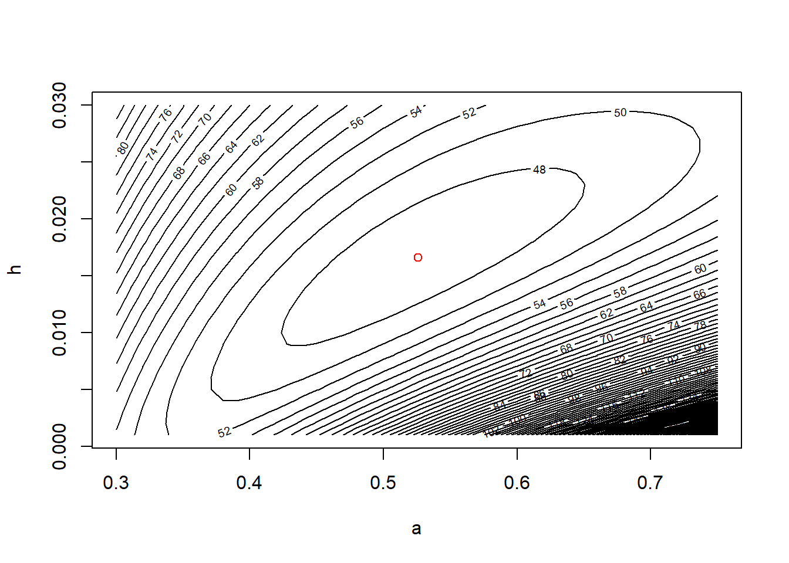

# MLEs for tadpole predation data


```r
library(emdbook)
data("ReedfrogFuncresp")

# rename something shorter

frog <- ReedfrogFuncresp
rm(ReedfrogFuncresp)

summary(frog)
```

```
##     Initial           Killed     
##  Min.   :  5.00   Min.   : 1.00  
##  1st Qu.: 13.75   1st Qu.: 5.75  
##  Median : 25.00   Median :10.00  
##  Mean   : 38.12   Mean   :13.25  
##  3rd Qu.: 56.25   3rd Qu.:18.75  
##  Max.   :100.00   Max.   :35.00
```

```r
head(frog)
```

```
##   Initial Killed
## 1       5      1
## 2       5      2
## 3      10      5
## 4      10      6
## 5      15     10
## 6      15      9
```

```r
plot(Killed ~ Initial, data = frog)
```



At this point in class we had a brief discussion of the search path, which you can find in R using the command


```r
search()
```

```
##  [1] ".GlobalEnv"        "package:emdbook"   "package:stats"    
##  [4] "package:graphics"  "package:grDevices" "package:utils"    
##  [7] "package:datasets"  "package:methods"   "Autoloads"        
## [10] "package:base"
```
Back to the tadpole data:


```r
# negative log-likelihood, for use with optim

frog.neg.ll <- function(params){
  
  a <- params[1]
  h <- params[2]
  
  prob.vals <- a / (1 + a * h * frog$Initial)
  
  ll.vals <- dbinom(frog$Killed, size = frog$Initial, prob = prob.vals, log = TRUE)
  neg.ll <- -1 * sum(ll.vals)
  
  return(neg.ll)
}

# find MLEs with optim

frog.mle <- optim(par = c(0.5, 1/40),
                  fn  = frog.neg.ll)
```

```
## Warning in dbinom(frog$Killed, size = frog$Initial, prob = prob.vals, log =
## TRUE): NaNs produced
```

```r
frog.mle
```

```
## $par
## [1] 0.52592567 0.01660454
## 
## $value
## [1] 46.72136
## 
## $counts
## function gradient 
##       59       NA 
## 
## $convergence
## [1] 0
## 
## $message
## NULL
```

```r
# note the warnings

a.mle <- frog.mle$par[1]
h.mle <- frog.mle$par[2]

# add a line to our plot to show the fitted curve

plot(Killed ~ Initial, data = frog)

init.values <- seq(from = min(frog$Initial), to = max(frog$Initial), length = 100)
pred.values <- a.mle * init.values / (1 + a.mle * h.mle * init.values)

lines(x = init.values, y = pred.values, col = "red")
```


```r
# plot negative likelihood contours

a.vals <- seq(from = 0.3, to = 0.75, by = 0.01)
h.vals <- seq(from = 0.001, to = 0.03, by = 0.001)

ll.vals <- matrix(nrow = length(a.vals), ncol = length(h.vals))

for (i.a in 1:length(a.vals)) {
  for(i.h in 1:length(h.vals)) {
    ll.vals[i.a, i.h] <- frog.neg.ll(c(a.vals[i.a], h.vals[i.h]))
  }
}

contour(x = a.vals, y = h.vals, z = ll.vals, nlevels = 100,
        xlab = "a", ylab = "h")

points(x = a.mle, y = h.mle, col = "red")
```


