# Bayesian computation

This chapter of the computing companion will focus solely on the computing aspects of Bayesian computation in R.  See the course notes or relevant sections of Bolker for the underlying theory.

The landscape of computing tools available to fit Bayesian models is fluid.  Here, we will look at three tools currently available: `R2jags`, which is based on the JAGS (Just Another Gibbs Sampler) platform, `rstan`, which is based on the computer program Stan (itself based on Hamiltonian Monte Carlo, or HMC), and the recent `rstanarm`, which seeks to put much of the computational details in the background.  (The "arm" portion of the name `rstanarm` is an acronym for applied regression modeling.)  

Throughout, we will be working with two data sets: the horse kick data (again), and a data set that details how the rate at which a cricket chirps depends on the air temperature.  The horse kick data are useful in this context because a Gamma distribution is a conjugate prior for Poisson data.  Thus, if we use a Gamma prior, then we know the posterior exactly.  Therefore, we can compare the approximations provided by stochastic sampling schemes to the known posterior.  The cricket data set will be used as an example of a simple linear regression, even though the data hint that the actual relationship between temperature and the rate of chirping is nonlinear.

## Computations with conjugate priors

Suppose that we observe an iid random sample $X_1, \ldots, X_n$ from a Poisson distribution with unknown parameter $\lambda$.  (This is the setting for the horse-kick data.)  If we place a Gamma prior with shape parameter $a$ and rate parameter $r$ on $\lambda$, then the posterior distribution is also Gamma with shape parameter $a + \sum_n X_n$ and rate parameter $r + n$.  In other words,
\begin{align*}
\lambda & \sim \mbox{Gamma}(a, r) \\
X_1, \ldots, X_n & \sim \mbox{Pois}(\lambda) \\
\lambda | X_1, \ldots, X_n & \sim \mbox{Gamma}(a + \sum_n X_n, r + n) \\
\end{align*}

In the horse kick data, $\sum_n x_n = 196$ and $n = 280$.  Suppose we start with the vague Gamma prior $a=.01$, $r = .01$ on $\lambda$.  This prior has mean $a/r = 1$ and variance $a/r^2 = 100$.  The posterior distribution for $\lambda$ is then a Gamma with shape parameter $a = 196.01$ and rate parameter $280.01$.  We can plot it:


```r
horse <- read.table("data/horse.txt", 
                    header = TRUE,
                    stringsAsFactors = TRUE)

l.vals <- seq(from = 0, to = 2, length = 200)
plot(l.vals, dgamma(l.vals, shape = 196.01, rate = 280.01), type = "l", 
     xlab = expression(lambda), ylab = "")
lines(l.vals, dgamma(l.vals, shape = .01, rate = .01), lty = "dashed")

abline(v = 0.7, col = "red")

legend("topleft", leg = c("prior", "posterior"), 
       lty = c("dashed", "solid"))
```

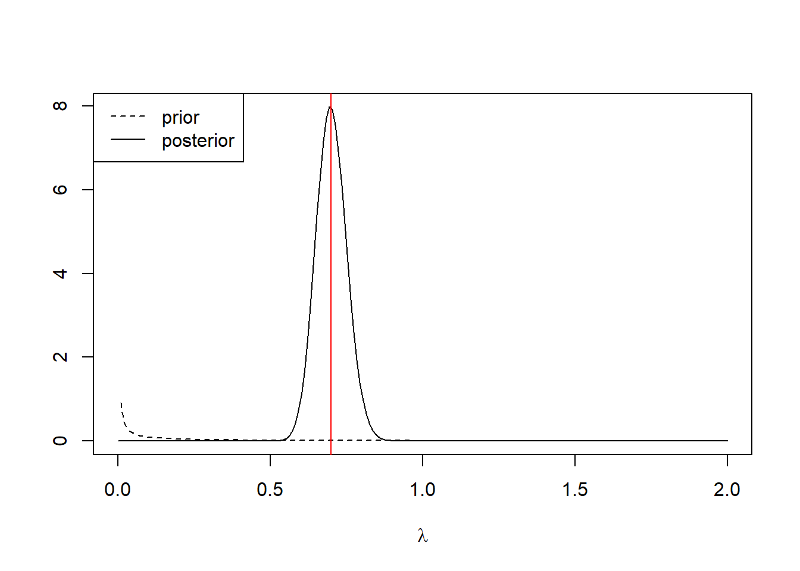

The red line shows the MLE, which is displaced slightly from the posterior mode.

As a point estimate, we might consider any of the following.  The posterior mean can be found exactly as $a/r$ = 0.70001.  Alternatively, we might consider the posterior median

```r
qgamma(0.5, shape = 196.01, rate = 280.01)
```

```
## [1] 0.6988206
```

Finally, we might conisder the posterior mode:

```r
optimize(f = function(x) dgamma(x, shape = 196.01, rate = 280.01), interval = c(0.5, 1), maximum = TRUE)
```

```
## $maximum
## [1] 0.6964383
## 
## $objective
## [1] 7.995941
```

To find a 95\% confidence interval, we might consider the central 95\% interval:

```r
qgamma(c(0.025, 0.975), shape = 196.01, rate = 280.01)
```

```
## [1] 0.6054387 0.8013454
```

A 95\% highest posterior density (HPD) interval takes a bit more work:

```r
diff.in.pdf <- function(x){
  
  upper <- qgamma(p = x, shape = 196.01, rate = 280.01)
  lower <- qgamma(p = x - .95, shape = 196.01, rate = 280.01)
  
  dgamma(upper, shape = 196.01, rate = 280.01) - dgamma(lower, shape = 196.01, rate = 280.01)
}

(upper.qtile <- uniroot(diff.in.pdf, interval = c(0.95, 1))$root)
```

```
## [1] 0.9722176
```

```r
(hpd.ci <- qgamma(p = c(upper.qtile - .95, upper.qtile), shape = 196.01, rate = 280.01))
```

```
## [1] 0.6031732 0.7988576
```

We might also ask questions like: What is the posterior probability that $\lambda > 2/3$?  These caluclations are straightforward in a Bayesian context, and they make full sense.

```r
pgamma(2/3, shape = 196.01, rate = 280.01, lower.tail = FALSE)
```

```
## [1] 0.7434032
```

Thus we would say that there is a 0.743 posterior probability that $\lambda > 2/3$.

As an illustration, note that if we had begun with a more informative prior --- say, a gamma distribution with shape parameter $a = 50$ and rate parameter = $100$ --- then the posterior would have been more of a compromise between the prior and the information in the data:


```r
plot(l.vals, dgamma(l.vals, shape = 196 + 50, rate = 100 + 280), type = "l", 
     xlab = expression(lambda), ylab = "")
lines(l.vals, dgamma(l.vals, shape = 50, rate = 100), lty = "dashed")

abline(v = 0.7, col = "red")

legend("topleft", leg = c("prior", "posterior"), 
       lty = c("dashed", "solid"))
```

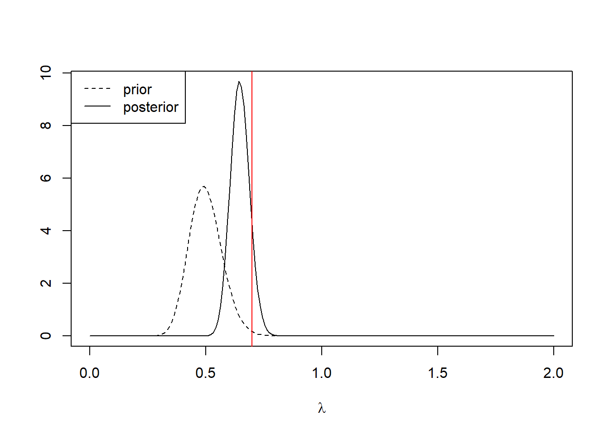

## JAGS in R

All of the computational tools that we will examine in this section involve some form of stochastic sampling from the posterior.  This computing companion will largely use the default settings, though in real practice the analyst will often have to do considerable work adjusting the settings to obtain a satisfactory approximation.

We'll use JAGS through R, using the library `r2jags`.  Here is JAGS code to approximate the posterior to $\lambda$ for the horse kick data, using the vague prior.


```r
require(R2jags)
```

```
## Loading required package: R2jags
```

```
## Warning: package 'R2jags' was built under R version 4.1.1
```

```
## Loading required package: rjags
```

```
## Warning: package 'rjags' was built under R version 4.1.1
```

```
## Loading required package: coda
```

```
## Linked to JAGS 4.3.0
```

```
## Loaded modules: basemod,bugs
```

```
## 
## Attaching package: 'R2jags'
```

```
## The following object is masked from 'package:coda':
## 
##     traceplot
```


```r
horse.model <- function() {
  
  for (j in 1:J) {             # J = 280, number of data points
    y[j] ~ dpois (lambda)      # data model:  the likelihood      
  }
  
  lambda ~ dgamma (0.01, 0.01) # prior 
                               # note that BUGS / JAGS parameterizes 
                               # gamma by shape, rate
}

jags.data <- list(y = horse$deaths, J = length(horse$deaths))

jags.params <- c("lambda")

jags.inits <- function(){
  list("lambda" = rgamma(0.01, 0.01))
}

jagsfit <- jags(data               = jags.data, 
                inits              = jags.inits, 
                parameters.to.save = jags.params,
                model.file         = horse.model,
                n.chains           = 3,
                n.iter             = 5000)
```

```
## module glm loaded
```

```
## Compiling model graph
##    Resolving undeclared variables
##    Allocating nodes
## Graph information:
##    Observed stochastic nodes: 280
##    Unobserved stochastic nodes: 1
##    Total graph size: 283
## 
## Initializing model
```

Let's take a look at some summary statistics of the fit

```r
print(jagsfit)
```

```
## Inference for Bugs model at "C:/Users/krgross/AppData/Local/Temp/RtmpkNru5X/model22904ae71ca7.txt", fit using jags,
##  3 chains, each with 5000 iterations (first 2500 discarded), n.thin = 2
##  n.sims = 3750 iterations saved
##          mu.vect sd.vect    2.5%     25%     50%     75%   97.5%  Rhat n.eff
## lambda     0.700   0.051   0.604   0.665   0.699   0.734   0.803 1.001  2500
## deviance 629.364   1.522 628.311 628.421 628.785 629.696 633.562 1.004  2400
## 
## For each parameter, n.eff is a crude measure of effective sample size,
## and Rhat is the potential scale reduction factor (at convergence, Rhat=1).
## 
## DIC info (using the rule, pD = var(deviance)/2)
## pD = 1.2 and DIC = 630.5
## DIC is an estimate of expected predictive error (lower deviance is better).
```

The Rhat values suggest that our chains have converged, as we might hope for such a simple model.  We can generate a trace plot using `traceplot` to inspect convergence visually, but beware that visual assessment of convergence is prone to error.

For an rjags object, the raw MCMC samples are stored in `BUGSoutput$sims.list`.  Sometimes it is helpful to analyze these samples directly.  For example, with these samples we  can estimate other posterior quantities, such as the posterior median of $\lambda$, or generate a 95\% central posterior confidence interval directly:

```r
mcmc.output <- as.data.frame(jagsfit$BUGSoutput$sims.list)
summary(mcmc.output)
```

```
##     deviance         lambda      
##  Min.   :628.3   Min.   :0.5365  
##  1st Qu.:628.4   1st Qu.:0.6647  
##  Median :628.8   Median :0.6992  
##  Mean   :629.4   Mean   :0.6999  
##  3rd Qu.:629.7   3rd Qu.:0.7337  
##  Max.   :644.2   Max.   :0.9188
```

```r
median(mcmc.output$lambda)
```

```
## [1] 0.6991852
```

```r
quantile(mcmc.output$lambda, c(.025, .975))
```

```
##      2.5%     97.5% 
## 0.6036116 0.8028820
```

We can also use the `lattice` package to construct smoothed estimates of the posterior density:

```r
require(lattice)
```

```
## Loading required package: lattice
```

```r
jagsfit.mcmc <- as.mcmc(jagsfit)
densityplot(jagsfit.mcmc)
```

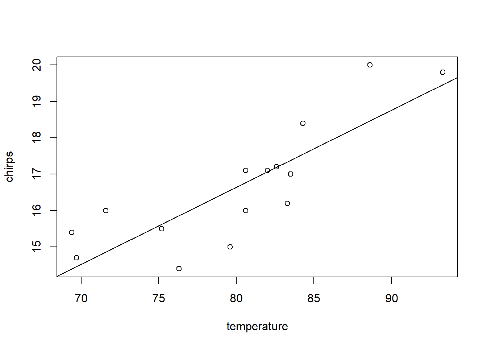

For a more involved example, let's take a look at the simple regression fit to the cricket data.  First, we'll make a plot of the data and fit a SLR model by least squares.  

```r
cricket <- read.table("data/cricket.txt", header = TRUE)

cricket.slr <- lm(chirps ~ temperature, data = cricket)
summary(cricket.slr)
```

```
## 
## Call:
## lm(formula = chirps ~ temperature, data = cricket)
## 
## Residuals:
##      Min       1Q   Median       3Q      Max 
## -1.56009 -0.57930  0.03129  0.59020  1.53259 
## 
## Coefficients:
##             Estimate Std. Error t value Pr(>|t|)    
## (Intercept) -0.30914    3.10858  -0.099 0.922299    
## temperature  0.21193    0.03871   5.475 0.000107 ***
## ---
## Signif. codes:  0 '***' 0.001 '**' 0.01 '*' 0.05 '.' 0.1 ' ' 1
## 
## Residual standard error: 0.9715 on 13 degrees of freedom
## Multiple R-squared:  0.6975,	Adjusted R-squared:  0.6742 
## F-statistic: 29.97 on 1 and 13 DF,  p-value: 0.0001067
```

```r
plot(chirps ~ temperature, data = cricket)
abline(cricket.slr)
```

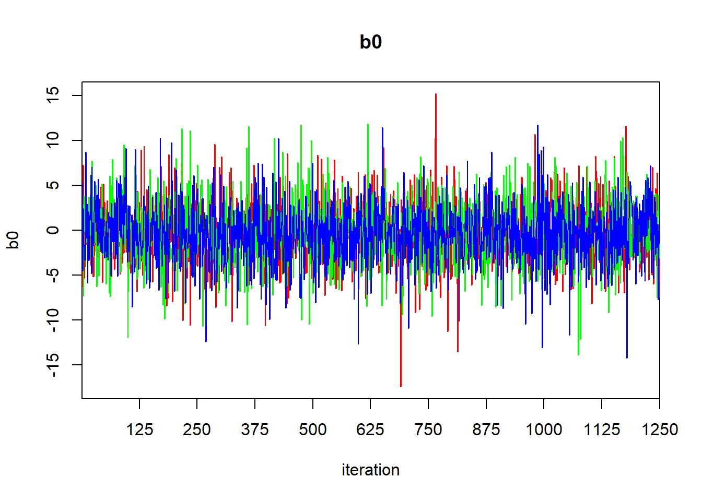

Now we'll fit the same model in JAGS, using vague priors for all model parameters

```r
cricket.model <- function() {
  
  for (j in 1:J) {             # J = number of data points
    
    y[j] ~ dnorm (mu[j], tau)  # data model:  the likelihood 
                               # note that BUGS / JAGS uses precision
                               # instead of variance
    
    mu[j] <- b0 + b1 * x[j]    # compute the mean for each observation
  }
  
  b0 ~ dnorm (0.0, 1E-6)       # prior for intercept
  b1 ~ dnorm (0.0, 1E-6)       # prior for slope
  tau ~ dgamma (0.01, 0.01)    # prior for tau
                               # note that BUGS / JAGS parameterizes 
                               # gamma by shape, rate
  
  sigma <- pow(tau, -1/2)      # the SD of the residaul errors
}

jags.data <- list(y = cricket$chirps, 
                  x = cricket$temperature,
                  J = nrow(cricket))

jags.params <- c("b0", "b1", "tau", "sigma")

jags.inits <- function(){
  list("b0" = rnorm(1), "b1" = rnorm(1), "tau" = runif(1))
}

jagsfit <- jags(data               = jags.data, 
                inits              = jags.inits, 
                parameters.to.save = jags.params,
                model.file         = cricket.model,
                n.chains           = 3,
                n.iter             = 5000)
```

```
## Compiling model graph
##    Resolving undeclared variables
##    Allocating nodes
## Graph information:
##    Observed stochastic nodes: 15
##    Unobserved stochastic nodes: 3
##    Total graph size: 70
## 
## Initializing model
```

```r
print(jagsfit)
```

```
## Inference for Bugs model at "C:/Users/krgross/AppData/Local/Temp/RtmpkNru5X/model229040922cb7.txt", fit using jags,
##  3 chains, each with 5000 iterations (first 2500 discarded), n.thin = 2
##  n.sims = 3750 iterations saved
##          mu.vect sd.vect   2.5%    25%    50%    75%  97.5%  Rhat n.eff
## b0        -0.269   3.364 -6.743 -2.470 -0.280  1.859  6.430 1.001  3800
## b1         0.211   0.042  0.129  0.185  0.212  0.239  0.293 1.001  3800
## sigma      1.031   0.224  0.706  0.876  0.995  1.147  1.549 1.001  3700
## tau        1.063   0.415  0.417  0.760  1.009  1.305  2.005 1.001  3700
## deviance  42.888   2.715 39.827 40.925 42.204 44.055 49.855 1.002  1500
## 
## For each parameter, n.eff is a crude measure of effective sample size,
## and Rhat is the potential scale reduction factor (at convergence, Rhat=1).
## 
## DIC info (using the rule, pD = var(deviance)/2)
## pD = 3.7 and DIC = 46.6
## DIC is an estimate of expected predictive error (lower deviance is better).
```

```r
traceplot(jagsfit)
```

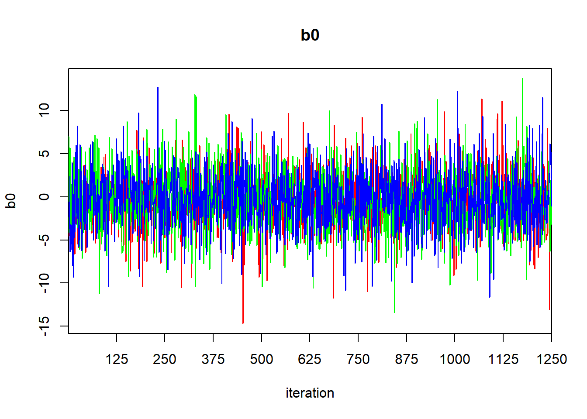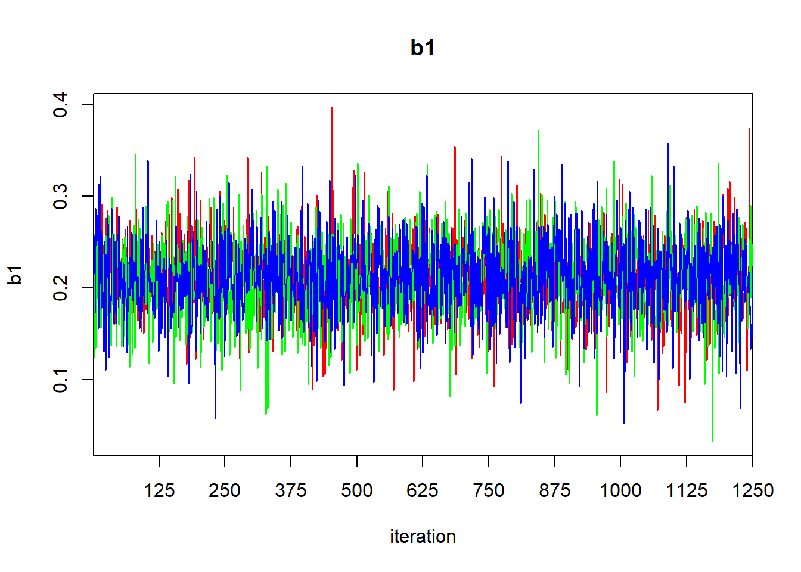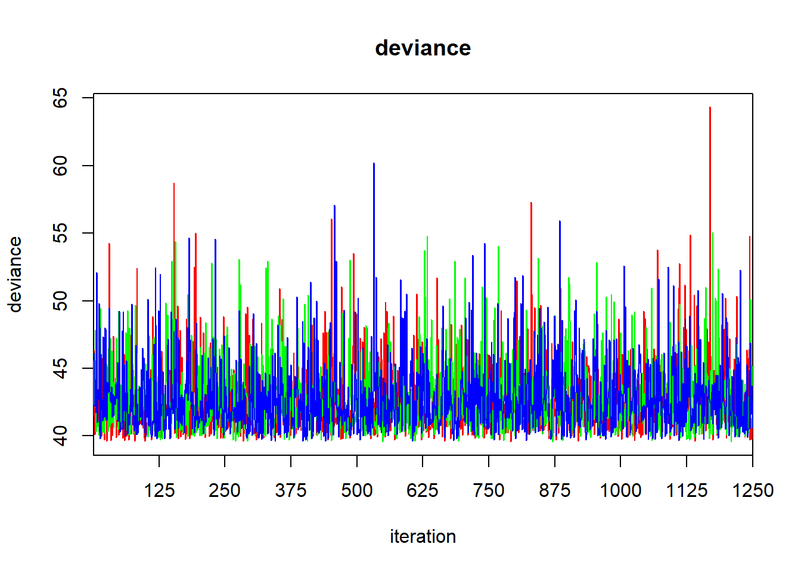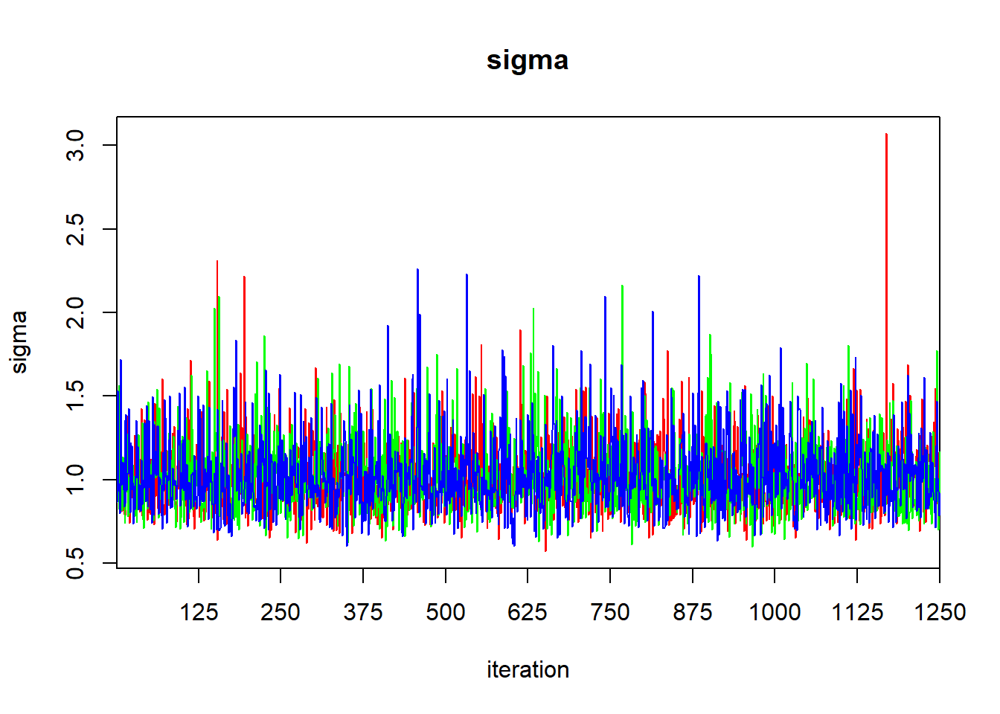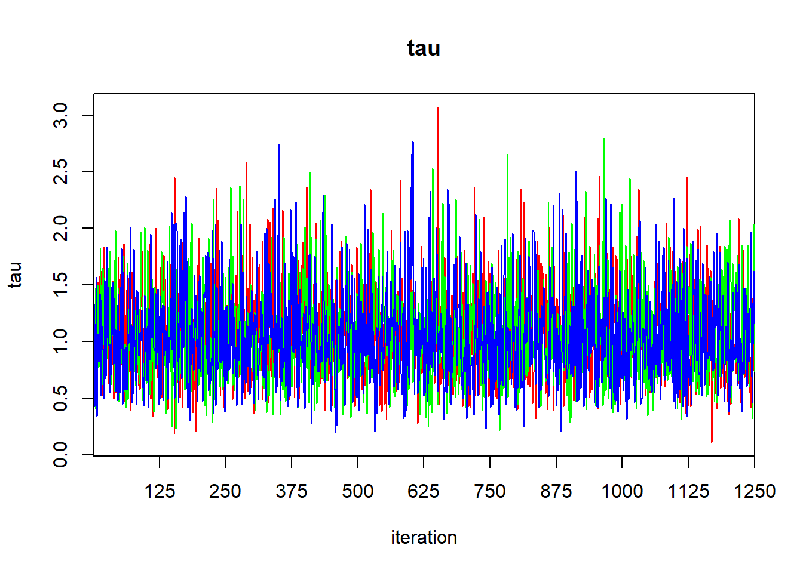

The traces for the intercept aren't great, but we haven't centered the predictor either.  In the usual way, the slope and intercept are strongly negatively correlated in the posterior.  We can visualize this posterior correlation:


```r
library(hexbin)
```

```
## Warning: package 'hexbin' was built under R version 4.1.1
```

```r
library(RColorBrewer)
rf <- colorRampPalette(rev(brewer.pal(11, 'Spectral')))
with(jagsfit$BUGSoutput$sims.list, hexbinplot(b1 ~ b0, colramp = rf))
```

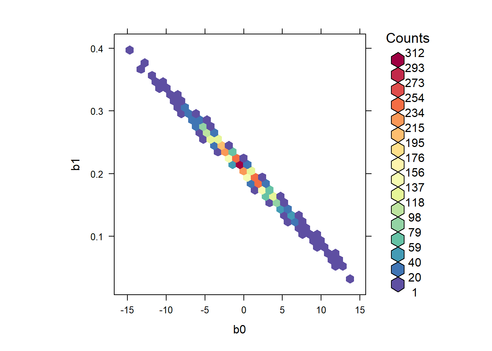

We can estimate the posterior correlation between the intercept and the slope by accessing the raw MCMC samples  

```r
mcmc.output <- as.data.frame(jagsfit$BUGSoutput$sims.list)
summary(mcmc.output)
```

```
##        b0                 b1             deviance         sigma       
##  Min.   :-14.6988   Min.   :0.03208   Min.   :39.57   Min.   :0.5708  
##  1st Qu.: -2.4700   1st Qu.:0.18505   1st Qu.:40.93   1st Qu.:0.8755  
##  Median : -0.2801   Median :0.21158   Median :42.20   Median :0.9954  
##  Mean   : -0.2686   Mean   :0.21137   Mean   :42.89   Mean   :1.0308  
##  3rd Qu.:  1.8588   3rd Qu.:0.23852   3rd Qu.:44.05   3rd Qu.:1.1474  
##  Max.   : 13.7429   Max.   :0.39724   Max.   :64.34   Max.   :3.0699  
##       tau        
##  Min.   :0.1061  
##  1st Qu.:0.7596  
##  Median :1.0092  
##  Mean   :1.0631  
##  3rd Qu.:1.3046  
##  Max.   :3.0692
```

```r
cor(mcmc.output[, -c(3:4)])
```

```
##                b0           b1          tau
## b0   1.000000e+00 -0.996634026 2.176845e-05
## b1  -9.966340e-01  1.000000000 1.487399e-03
## tau  2.176845e-05  0.001487399 1.000000e+00
```

Thus we estimate that the intercept and slope have a posterior correlation of -0.997.

We could make life easier on ourselves by centering the predictor and trying again:


```r
cricket$temp.ctr <- cricket$temperature - mean(cricket$temperature)

jags.data <- list(y = cricket$chirps, 
                  x = cricket$temp.ctr,
                  J = nrow(cricket))

jags.params <- c("b0", "b1", "tau", "sigma")

jags.inits <- function(){
  list("b0" = rnorm(1), "b1" = rnorm(1), "tau" = runif(1))
}

jagsfit <- jags(data               = jags.data, 
                inits              = jags.inits, 
                parameters.to.save = jags.params,
                model.file         = cricket.model,
                n.chains           = 3,
                n.iter             = 5000)
```

```
## Compiling model graph
##    Resolving undeclared variables
##    Allocating nodes
## Graph information:
##    Observed stochastic nodes: 15
##    Unobserved stochastic nodes: 3
##    Total graph size: 70
## 
## Initializing model
```

```r
print(jagsfit)
```

```
## Inference for Bugs model at "C:/Users/krgross/AppData/Local/Temp/RtmpkNru5X/model2290450834ec.txt", fit using jags,
##  3 chains, each with 5000 iterations (first 2500 discarded), n.thin = 2
##  n.sims = 3750 iterations saved
##          mu.vect sd.vect   2.5%    25%    50%    75%  97.5%  Rhat n.eff
## b0        16.651   0.275 16.102 16.475 16.653 16.832 17.179 1.003   780
## b1         0.211   0.042  0.128  0.186  0.211  0.238  0.298 1.002  3800
## sigma      1.035   0.221  0.702  0.877  1.002  1.150  1.563 1.001  3800
## tau        1.053   0.412  0.409  0.756  0.995  1.301  2.030 1.001  3800
## deviance  42.911   2.737 39.769 40.911 42.180 44.247 50.021 1.001  3800
## 
## For each parameter, n.eff is a crude measure of effective sample size,
## and Rhat is the potential scale reduction factor (at convergence, Rhat=1).
## 
## DIC info (using the rule, pD = var(deviance)/2)
## pD = 3.7 and DIC = 46.7
## DIC is an estimate of expected predictive error (lower deviance is better).
```

```r
traceplot(jagsfit)
```

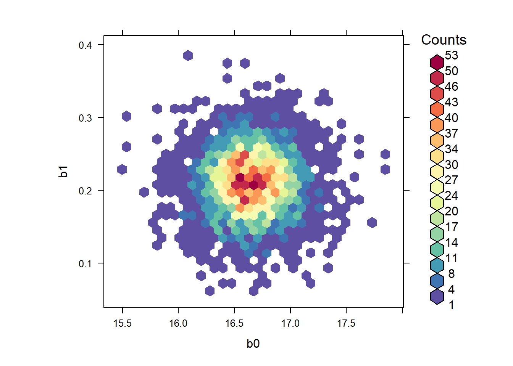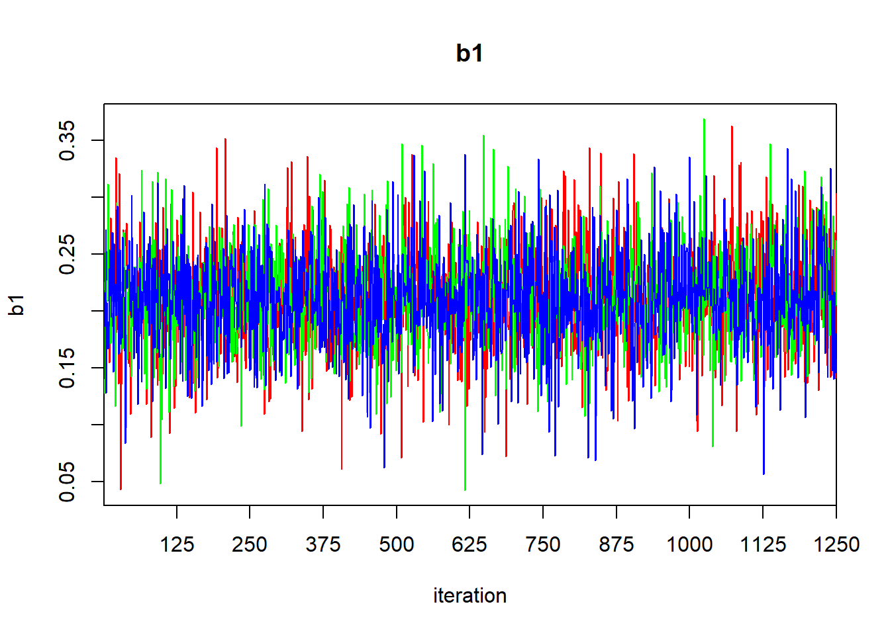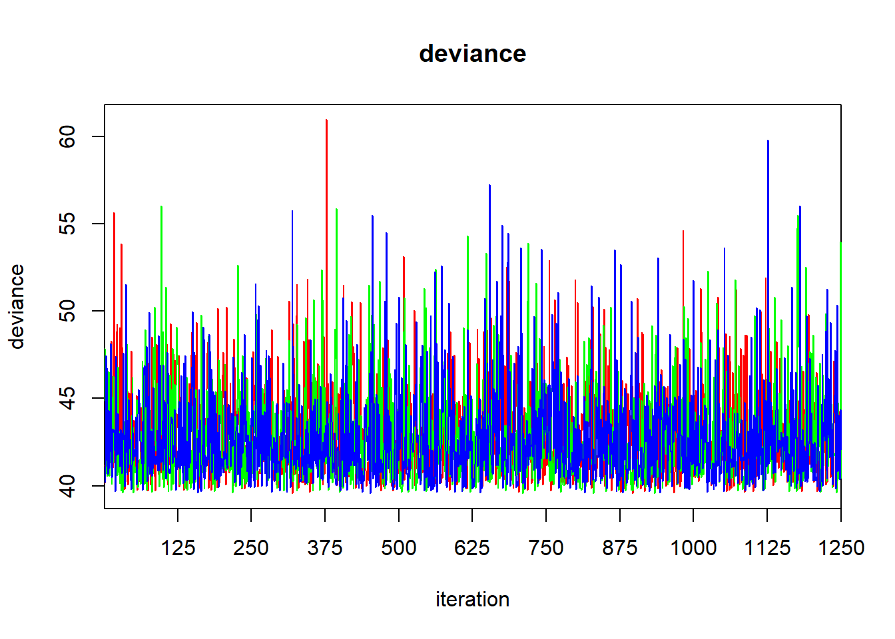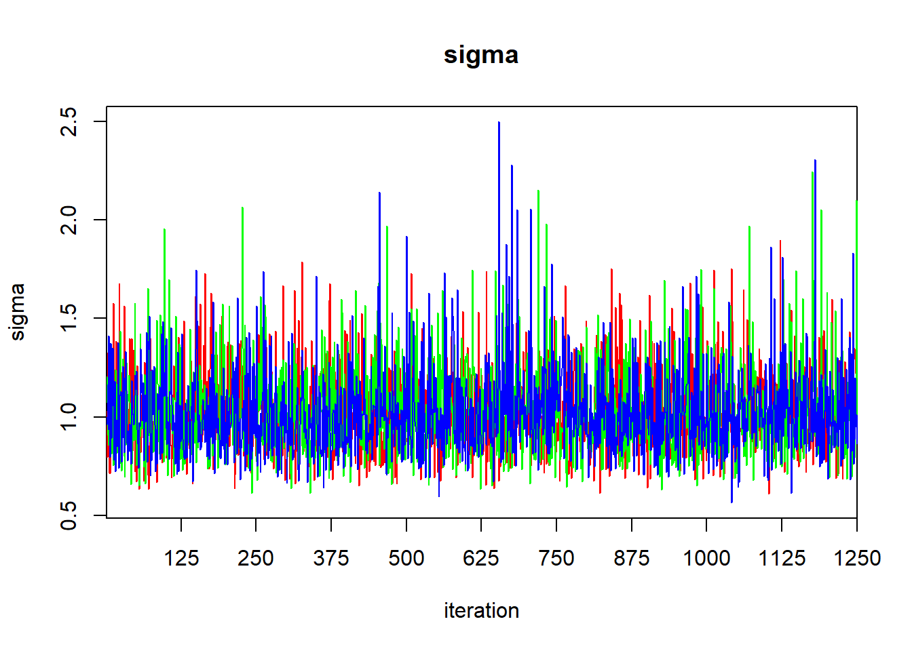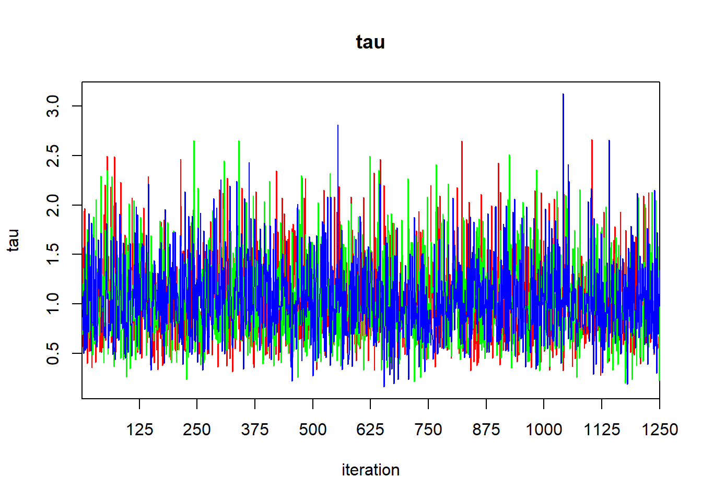

The posteriors for the intercept and slope are now uncorrelated:


```r
library(hexbin)
library(RColorBrewer)
rf <- colorRampPalette(rev(brewer.pal(11, 'Spectral')))
with(jagsfit$BUGSoutput$sims.list, hexbinplot(b1 ~ b0, colramp = rf))
```

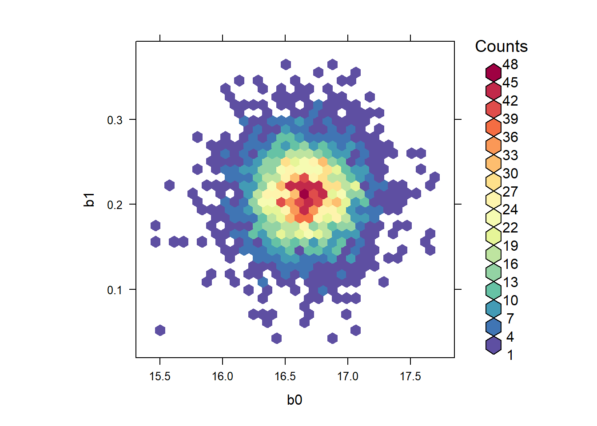

```r
mcmc.output <- as.data.frame(jagsfit$BUGSoutput$sims.list)
cor(mcmc.output[, -c(3:4)])
```

```
##               b0           b1          tau
## b0   1.000000000 -0.004609648  0.006585541
## b1  -0.004609648  1.000000000 -0.004604030
## tau  0.006585541 -0.004604030  1.000000000
```

## rstanarm

The `rstanarm` package is a recent set of routines that seeks to provide a user-friendly front end to Bayesian analysis with Stan. Specifically, `rstanarm` provides functions for fitting standard statistical models that are meant to mimic the analogous fitting functions in R.  For example, the basic routine for fitting linear models in R is `lm`; `rstanarm` provides a function `stan_lm` that strives to have the same functionality and interface as `lm`, albeit using Stan "under the hood" to generate Bayesian inference.  (That said, the main workhorse function in `rstanarm` for model fitting is `stan_glm`, which attempts to mimic the native R function `glm` for fitting generalized linear models.  Separately, the developers of `rstanarm` have taken the not unreasonable stance that generalized linear models should supplant general linear models as the analyst's default approach to model fitting.)

To provide functionality that is similar to R's native model-fitting routines, the functions in `rstanarm` make a number of operational decisions behind the scenes.  Most notably, the model fitting routines in `rstanarm` will select default priors and default HMC parameters.  While these defaults can always be modified by the analyst, the implementation of software that chooses priors by default is radical.  First, the developers of `rstanarm` have their own particular view about what the role of the prior should be in data analysis.  While their view is a considered one, by no means does it reflect a consensus that extends beyond the developers of the software.  If you use `rstanarm`'s routines out of the box, you are accepting this view as your own if you do not specify the priors yourself.  Second, as best I understand, the methods by which `rstanarm` chooses default priors still appear to be in some flux.  That means that future versions of `rstanarm` may supply different default priors than those that are supplied today.  As a result, the behavior of `rstanarm` today may differ from its behavior tomorrow, if you use the default priors.

All that said, here is how you might use `rstanarm` most simply to fit the two working examples in this chapter.  We'll begin by fitting the horse-kick data:

```r
require(rstanarm)
```

```
## Loading required package: rstanarm
```

```
## Loading required package: Rcpp
```

```
## This is rstanarm version 2.21.1
```

```
## - See https://mc-stan.org/rstanarm/articles/priors for changes to default priors!
```

```
## - Default priors may change, so it's safest to specify priors, even if equivalent to the defaults.
```

```
## - For execution on a local, multicore CPU with excess RAM we recommend calling
```

```
##   options(mc.cores = parallel::detectCores())
```


```r
stanarm.horse.fit <- stan_glm(deaths ~ 1, data = horse, family = poisson, seed = 1)
```

```
## 
## SAMPLING FOR MODEL 'count' NOW (CHAIN 1).
## Chain 1: 
## Chain 1: Gradient evaluation took 0 seconds
## Chain 1: 1000 transitions using 10 leapfrog steps per transition would take 0 seconds.
## Chain 1: Adjust your expectations accordingly!
## Chain 1: 
## Chain 1: 
## Chain 1: Iteration:    1 / 2000 [  0%]  (Warmup)
## Chain 1: Iteration:  200 / 2000 [ 10%]  (Warmup)
## Chain 1: Iteration:  400 / 2000 [ 20%]  (Warmup)
## Chain 1: Iteration:  600 / 2000 [ 30%]  (Warmup)
## Chain 1: Iteration:  800 / 2000 [ 40%]  (Warmup)
## Chain 1: Iteration: 1000 / 2000 [ 50%]  (Warmup)
## Chain 1: Iteration: 1001 / 2000 [ 50%]  (Sampling)
## Chain 1: Iteration: 1200 / 2000 [ 60%]  (Sampling)
## Chain 1: Iteration: 1400 / 2000 [ 70%]  (Sampling)
## Chain 1: Iteration: 1600 / 2000 [ 80%]  (Sampling)
## Chain 1: Iteration: 1800 / 2000 [ 90%]  (Sampling)
## Chain 1: Iteration: 2000 / 2000 [100%]  (Sampling)
## Chain 1: 
## Chain 1:  Elapsed Time: 0.234 seconds (Warm-up)
## Chain 1:                0.227 seconds (Sampling)
## Chain 1:                0.461 seconds (Total)
## Chain 1: 
## 
## SAMPLING FOR MODEL 'count' NOW (CHAIN 2).
## Chain 2: 
## Chain 2: Gradient evaluation took 0 seconds
## Chain 2: 1000 transitions using 10 leapfrog steps per transition would take 0 seconds.
## Chain 2: Adjust your expectations accordingly!
## Chain 2: 
## Chain 2: 
## Chain 2: Iteration:    1 / 2000 [  0%]  (Warmup)
## Chain 2: Iteration:  200 / 2000 [ 10%]  (Warmup)
## Chain 2: Iteration:  400 / 2000 [ 20%]  (Warmup)
## Chain 2: Iteration:  600 / 2000 [ 30%]  (Warmup)
## Chain 2: Iteration:  800 / 2000 [ 40%]  (Warmup)
## Chain 2: Iteration: 1000 / 2000 [ 50%]  (Warmup)
## Chain 2: Iteration: 1001 / 2000 [ 50%]  (Sampling)
## Chain 2: Iteration: 1200 / 2000 [ 60%]  (Sampling)
## Chain 2: Iteration: 1400 / 2000 [ 70%]  (Sampling)
## Chain 2: Iteration: 1600 / 2000 [ 80%]  (Sampling)
## Chain 2: Iteration: 1800 / 2000 [ 90%]  (Sampling)
## Chain 2: Iteration: 2000 / 2000 [100%]  (Sampling)
## Chain 2: 
## Chain 2:  Elapsed Time: 0.213 seconds (Warm-up)
## Chain 2:                0.279 seconds (Sampling)
## Chain 2:                0.492 seconds (Total)
## Chain 2: 
## 
## SAMPLING FOR MODEL 'count' NOW (CHAIN 3).
## Chain 3: 
## Chain 3: Gradient evaluation took 0 seconds
## Chain 3: 1000 transitions using 10 leapfrog steps per transition would take 0 seconds.
## Chain 3: Adjust your expectations accordingly!
## Chain 3: 
## Chain 3: 
## Chain 3: Iteration:    1 / 2000 [  0%]  (Warmup)
## Chain 3: Iteration:  200 / 2000 [ 10%]  (Warmup)
## Chain 3: Iteration:  400 / 2000 [ 20%]  (Warmup)
## Chain 3: Iteration:  600 / 2000 [ 30%]  (Warmup)
## Chain 3: Iteration:  800 / 2000 [ 40%]  (Warmup)
## Chain 3: Iteration: 1000 / 2000 [ 50%]  (Warmup)
## Chain 3: Iteration: 1001 / 2000 [ 50%]  (Sampling)
## Chain 3: Iteration: 1200 / 2000 [ 60%]  (Sampling)
## Chain 3: Iteration: 1400 / 2000 [ 70%]  (Sampling)
## Chain 3: Iteration: 1600 / 2000 [ 80%]  (Sampling)
## Chain 3: Iteration: 1800 / 2000 [ 90%]  (Sampling)
## Chain 3: Iteration: 2000 / 2000 [100%]  (Sampling)
## Chain 3: 
## Chain 3:  Elapsed Time: 0.205 seconds (Warm-up)
## Chain 3:                0.265 seconds (Sampling)
## Chain 3:                0.47 seconds (Total)
## Chain 3: 
## 
## SAMPLING FOR MODEL 'count' NOW (CHAIN 4).
## Chain 4: 
## Chain 4: Gradient evaluation took 0 seconds
## Chain 4: 1000 transitions using 10 leapfrog steps per transition would take 0 seconds.
## Chain 4: Adjust your expectations accordingly!
## Chain 4: 
## Chain 4: 
## Chain 4: Iteration:    1 / 2000 [  0%]  (Warmup)
## Chain 4: Iteration:  200 / 2000 [ 10%]  (Warmup)
## Chain 4: Iteration:  400 / 2000 [ 20%]  (Warmup)
## Chain 4: Iteration:  600 / 2000 [ 30%]  (Warmup)
## Chain 4: Iteration:  800 / 2000 [ 40%]  (Warmup)
## Chain 4: Iteration: 1000 / 2000 [ 50%]  (Warmup)
## Chain 4: Iteration: 1001 / 2000 [ 50%]  (Sampling)
## Chain 4: Iteration: 1200 / 2000 [ 60%]  (Sampling)
## Chain 4: Iteration: 1400 / 2000 [ 70%]  (Sampling)
## Chain 4: Iteration: 1600 / 2000 [ 80%]  (Sampling)
## Chain 4: Iteration: 1800 / 2000 [ 90%]  (Sampling)
## Chain 4: Iteration: 2000 / 2000 [100%]  (Sampling)
## Chain 4: 
## Chain 4:  Elapsed Time: 0.194 seconds (Warm-up)
## Chain 4:                0.254 seconds (Sampling)
## Chain 4:                0.448 seconds (Total)
## Chain 4:
```

The model formula ("deaths ~ 1") requires a bit of explanation.  Essentially, we are fitting a regression model that only includes an intercept.  In R, the way to fit a model with only an intercept is to include a "1" on the right-hand side of the model formula.  The call to `stan_glm` is meant to mimic the call Here we have supplied the random number seed for the HMC sampling.  Let's take a look:


```r
print(stanarm.horse.fit, digits = 3)
```

```
## stan_glm
##  family:       poisson [log]
##  formula:      deaths ~ 1
##  observations: 280
##  predictors:   1
## ------
##             Median MAD_SD
## (Intercept) -0.355  0.073
## 
## ------
## * For help interpreting the printed output see ?print.stanreg
## * For info on the priors used see ?prior_summary.stanreg
```

The parameter labeled (Intercept) is $\log(\lambda)$.

Now we'll fit the simple regression to the cricket data:


```r
stanarm.cricket.fit <- stan_glm(chirps ~ temp.ctr, data = cricket, family = gaussian, seed = 1)
```

```
## 
## SAMPLING FOR MODEL 'continuous' NOW (CHAIN 1).
## Chain 1: 
## Chain 1: Gradient evaluation took 0 seconds
## Chain 1: 1000 transitions using 10 leapfrog steps per transition would take 0 seconds.
## Chain 1: Adjust your expectations accordingly!
## Chain 1: 
## Chain 1: 
## Chain 1: Iteration:    1 / 2000 [  0%]  (Warmup)
## Chain 1: Iteration:  200 / 2000 [ 10%]  (Warmup)
## Chain 1: Iteration:  400 / 2000 [ 20%]  (Warmup)
## Chain 1: Iteration:  600 / 2000 [ 30%]  (Warmup)
## Chain 1: Iteration:  800 / 2000 [ 40%]  (Warmup)
## Chain 1: Iteration: 1000 / 2000 [ 50%]  (Warmup)
## Chain 1: Iteration: 1001 / 2000 [ 50%]  (Sampling)
## Chain 1: Iteration: 1200 / 2000 [ 60%]  (Sampling)
## Chain 1: Iteration: 1400 / 2000 [ 70%]  (Sampling)
## Chain 1: Iteration: 1600 / 2000 [ 80%]  (Sampling)
## Chain 1: Iteration: 1800 / 2000 [ 90%]  (Sampling)
## Chain 1: Iteration: 2000 / 2000 [100%]  (Sampling)
## Chain 1: 
## Chain 1:  Elapsed Time: 0.11 seconds (Warm-up)
## Chain 1:                0.095 seconds (Sampling)
## Chain 1:                0.205 seconds (Total)
## Chain 1: 
## 
## SAMPLING FOR MODEL 'continuous' NOW (CHAIN 2).
## Chain 2: 
## Chain 2: Gradient evaluation took 0 seconds
## Chain 2: 1000 transitions using 10 leapfrog steps per transition would take 0 seconds.
## Chain 2: Adjust your expectations accordingly!
## Chain 2: 
## Chain 2: 
## Chain 2: Iteration:    1 / 2000 [  0%]  (Warmup)
## Chain 2: Iteration:  200 / 2000 [ 10%]  (Warmup)
## Chain 2: Iteration:  400 / 2000 [ 20%]  (Warmup)
## Chain 2: Iteration:  600 / 2000 [ 30%]  (Warmup)
## Chain 2: Iteration:  800 / 2000 [ 40%]  (Warmup)
## Chain 2: Iteration: 1000 / 2000 [ 50%]  (Warmup)
## Chain 2: Iteration: 1001 / 2000 [ 50%]  (Sampling)
## Chain 2: Iteration: 1200 / 2000 [ 60%]  (Sampling)
## Chain 2: Iteration: 1400 / 2000 [ 70%]  (Sampling)
## Chain 2: Iteration: 1600 / 2000 [ 80%]  (Sampling)
## Chain 2: Iteration: 1800 / 2000 [ 90%]  (Sampling)
## Chain 2: Iteration: 2000 / 2000 [100%]  (Sampling)
## Chain 2: 
## Chain 2:  Elapsed Time: 0.089 seconds (Warm-up)
## Chain 2:                0.073 seconds (Sampling)
## Chain 2:                0.162 seconds (Total)
## Chain 2: 
## 
## SAMPLING FOR MODEL 'continuous' NOW (CHAIN 3).
## Chain 3: 
## Chain 3: Gradient evaluation took 0 seconds
## Chain 3: 1000 transitions using 10 leapfrog steps per transition would take 0 seconds.
## Chain 3: Adjust your expectations accordingly!
## Chain 3: 
## Chain 3: 
## Chain 3: Iteration:    1 / 2000 [  0%]  (Warmup)
## Chain 3: Iteration:  200 / 2000 [ 10%]  (Warmup)
## Chain 3: Iteration:  400 / 2000 [ 20%]  (Warmup)
## Chain 3: Iteration:  600 / 2000 [ 30%]  (Warmup)
## Chain 3: Iteration:  800 / 2000 [ 40%]  (Warmup)
## Chain 3: Iteration: 1000 / 2000 [ 50%]  (Warmup)
## Chain 3: Iteration: 1001 / 2000 [ 50%]  (Sampling)
## Chain 3: Iteration: 1200 / 2000 [ 60%]  (Sampling)
## Chain 3: Iteration: 1400 / 2000 [ 70%]  (Sampling)
## Chain 3: Iteration: 1600 / 2000 [ 80%]  (Sampling)
## Chain 3: Iteration: 1800 / 2000 [ 90%]  (Sampling)
## Chain 3: Iteration: 2000 / 2000 [100%]  (Sampling)
## Chain 3: 
## Chain 3:  Elapsed Time: 0.065 seconds (Warm-up)
## Chain 3:                0.065 seconds (Sampling)
## Chain 3:                0.13 seconds (Total)
## Chain 3: 
## 
## SAMPLING FOR MODEL 'continuous' NOW (CHAIN 4).
## Chain 4: 
## Chain 4: Gradient evaluation took 0 seconds
## Chain 4: 1000 transitions using 10 leapfrog steps per transition would take 0 seconds.
## Chain 4: Adjust your expectations accordingly!
## Chain 4: 
## Chain 4: 
## Chain 4: Iteration:    1 / 2000 [  0%]  (Warmup)
## Chain 4: Iteration:  200 / 2000 [ 10%]  (Warmup)
## Chain 4: Iteration:  400 / 2000 [ 20%]  (Warmup)
## Chain 4: Iteration:  600 / 2000 [ 30%]  (Warmup)
## Chain 4: Iteration:  800 / 2000 [ 40%]  (Warmup)
## Chain 4: Iteration: 1000 / 2000 [ 50%]  (Warmup)
## Chain 4: Iteration: 1001 / 2000 [ 50%]  (Sampling)
## Chain 4: Iteration: 1200 / 2000 [ 60%]  (Sampling)
## Chain 4: Iteration: 1400 / 2000 [ 70%]  (Sampling)
## Chain 4: Iteration: 1600 / 2000 [ 80%]  (Sampling)
## Chain 4: Iteration: 1800 / 2000 [ 90%]  (Sampling)
## Chain 4: Iteration: 2000 / 2000 [100%]  (Sampling)
## Chain 4: 
## Chain 4:  Elapsed Time: 0.071 seconds (Warm-up)
## Chain 4:                0.061 seconds (Sampling)
## Chain 4:                0.132 seconds (Total)
## Chain 4:
```

```r
print(stanarm.cricket.fit, digits = 3)
```

```
## stan_glm
##  family:       gaussian [identity]
##  formula:      chirps ~ temp.ctr
##  observations: 15
##  predictors:   2
## ------
##             Median MAD_SD
## (Intercept) 16.648  0.257
## temp.ctr     0.210  0.041
## 
## Auxiliary parameter(s):
##       Median MAD_SD
## sigma 1.008  0.198 
## 
## ------
## * For help interpreting the printed output see ?print.stanreg
## * For info on the priors used see ?prior_summary.stanreg
```

