# Bayesian computation

This chapter of the computing companion will focus solely on the computing aspects of Bayesian computation in R.  See the course notes or relevant sections of Bolker for the underlying theory.

The landscape of computing tools available to fit Bayesian models is fluid.  Here, we will look at three tools currently available: `R2jags`, which is based on the JAGS (Just Another Gibbs Sampler) platform, `rstan`, which is based on the computer program Stan (itself based on Hamiltonian Monte Carlo, or HMC), and the recent `rstanarm`, which seeks to put much of the computational details in the background.  (The "arm" portion of the name `rstanarm` is an acronym for applied regression modeling.)  

Throughout, we will be working with two data sets: the horse kick data (again), and a data set that details how the rate at which a cricket chirps depends on the air temperature.  The horse kick data are useful in this context because a Gamma distribution is a conjugate prior for Poisson data.  Thus, if we use a Gamma prior, then we know the posterior exactly.  Therefore, we can compare the approximations provided by stochastic sampling schemes to the known posterior.  The cricket data set will be used as an example of a simple linear regression, even though the data hint that the actual relationship between temperature and the rate of chirping is nonlinear.

## Computations with conjugate priors

Suppose that we observe an iid random sample $X_1, \ldots, X_n$ from a Poisson distribution with unknown parameter $\lambda$.  (This is the setting for the horse-kick data.)  If we place a Gamma prior with shape parameter $a$ and rate parameter $r$ on $\lambda$, then the posterior distribution is also Gamma with shape parameter $a + \sum_n X_n$ and rate parameter $r + n$.  In other words,
\begin{align*}
\lambda & \sim \mbox{Gamma}(a, r) \\
X_1, \ldots, X_n & \sim \mbox{Pois}(\lambda) \\
\lambda | X_1, \ldots, X_n & \sim \mbox{Gamma}(a + \sum_n X_n, r + n) \\
\end{align*}

In the horse kick data, $\sum_n x_n = 196$ and $n = 280$.  Suppose we start with the vague Gamma prior $a=.01$, $r = .01$ on $\lambda$.  This prior has mean $a/r = 1$ and variance $a/r^2 = 100$.  The posterior distribution for $\lambda$ is then a Gamma with shape parameter $a = 196.01$ and rate parameter $280.01$.  We can plot it:


```r
horse <- read.table("data/horse.txt", 
                    header = TRUE,
                    stringsAsFactors = TRUE)

l.vals <- seq(from = 0, to = 2, length = 200)
plot(l.vals, dgamma(l.vals, shape = 196.01, rate = 280.01), type = "l", 
     xlab = expression(lambda), ylab = "")
lines(l.vals, dgamma(l.vals, shape = .01, rate = .01), lty = "dashed")

abline(v = 0.7, col = "red")

legend("topleft", leg = c("prior", "posterior"), 
       lty = c("dashed", "solid"))
```


The red line shows the MLE, which is displaced slightly from the posterior mode.

As a point estimate, we might consider any of the following.  The posterior mean can be found exactly as $a/r$ = 0.70001.  Alternatively, we might consider the posterior median

```r
qgamma(0.5, shape = 196.01, rate = 280.01)
```

```
## [1] 0.6988206
```

Finally, we might conisder the posterior mode:

```r
optimize(f = function(x) dgamma(x, shape = 196.01, rate = 280.01), interval = c(0.5, 1), maximum = TRUE)
```

```
## $maximum
## [1] 0.6964383
## 
## $objective
## [1] 7.995941
```

To find a 95\% confidence interval, we might consider the central 95\% interval:

```r
qgamma(c(0.025, 0.975), shape = 196.01, rate = 280.01)
```

```
## [1] 0.6054387 0.8013454
```

A 95\% highest posterior density (HPD) interval takes a bit more work:

```r
diff.in.pdf <- function(x){
  
  upper <- qgamma(p = x, shape = 196.01, rate = 280.01)
  lower <- qgamma(p = x - .95, shape = 196.01, rate = 280.01)
  
  dgamma(upper, shape = 196.01, rate = 280.01) - dgamma(lower, shape = 196.01, rate = 280.01)
}

(upper.qtile <- uniroot(diff.in.pdf, interval = c(0.95, 1))$root)
```

```
## [1] 0.9722176
```

```r
(hpd.ci <- qgamma(p = c(upper.qtile - .95, upper.qtile), shape = 196.01, rate = 280.01))
```

```
## [1] 0.6031732 0.7988576
```

We might also ask questions like: What is the posterior probability that $\lambda > 2/3$?  These caluclations are straightforward in a Bayesian context, and they make full sense.

```r
pgamma(2/3, shape = 196.01, rate = 280.01, lower.tail = FALSE)
```

```
## [1] 0.7434032
```

Thus we would say that there is a 0.743 posterior probability that $\lambda > 2/3$.

As an illustration, note that if we had begun with a more informative prior --- say, a gamma distribution with shape parameter $a = 50$ and rate parameter = $100$ --- then the posterior would have been more of a compromise between the prior and the information in the data:


```r
plot(l.vals, dgamma(l.vals, shape = 196 + 50, rate = 100 + 280), type = "l", 
     xlab = expression(lambda), ylab = "")
lines(l.vals, dgamma(l.vals, shape = 50, rate = 100), lty = "dashed")

abline(v = 0.7, col = "red")

legend("topleft", leg = c("prior", "posterior"), 
       lty = c("dashed", "solid"))
```

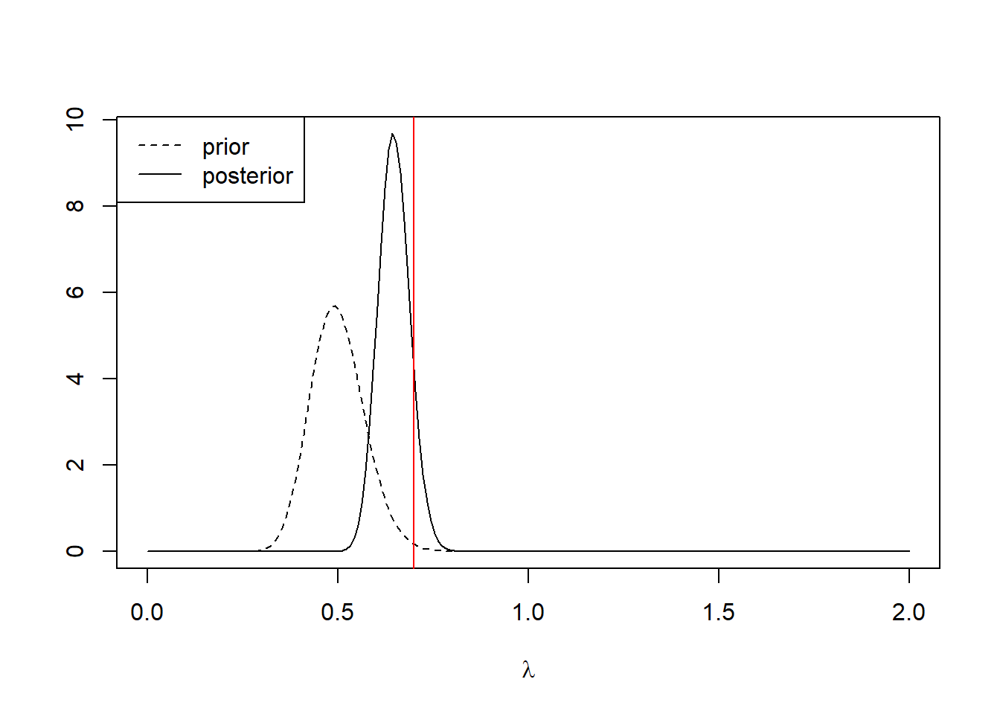

## JAGS in R

All of the computational tools that we will examine in this section involve some form of stochastic sampling from the posterior.  This computing companion will largely use the default settings, though in real practice the analyst will often have to do considerable work adjusting the settings to obtain a satisfactory approximation.

We'll use JAGS through R, using the library `r2jags`.  Here is JAGS code to approximate the posterior to $\lambda$ for the horse kick data, using the vague prior.


```r
require(R2jags)
```

```
## Loading required package: R2jags
```

```
## Warning: package 'R2jags' was built under R version 4.1.1
```

```
## Loading required package: rjags
```

```
## Warning: package 'rjags' was built under R version 4.1.1
```

```
## Loading required package: coda
```

```
## Linked to JAGS 4.3.0
```

```
## Loaded modules: basemod,bugs
```

```
## 
## Attaching package: 'R2jags'
```

```
## The following object is masked from 'package:coda':
## 
##     traceplot
```


```r
horse.model <- function() {
  
  for (j in 1:J) {             # J = 280, number of data points
    y[j] ~ dpois (lambda)      # data model:  the likelihood      
  }
  
  lambda ~ dgamma (0.01, 0.01) # prior 
                               # note that BUGS / JAGS parameterizes 
                               # gamma by shape, rate
}

jags.data <- list(y = horse$deaths, J = length(horse$deaths))

jags.params <- c("lambda")

jags.inits <- function(){
  list("lambda" = rgamma(0.01, 0.01))
}

jagsfit <- jags(data               = jags.data, 
                inits              = jags.inits, 
                parameters.to.save = jags.params,
                model.file         = horse.model,
                n.chains           = 3,
                n.iter             = 5000)
```

```
## module glm loaded
```

```
## Compiling model graph
##    Resolving undeclared variables
##    Allocating nodes
## Graph information:
##    Observed stochastic nodes: 280
##    Unobserved stochastic nodes: 1
##    Total graph size: 283
## 
## Initializing model
```

Let's take a look at some summary statistics of the fit

```r
print(jagsfit)
```

```
## Inference for Bugs model at "C:/Users/krgross/AppData/Local/Temp/RtmpIjhFJ3/model22442a251d96.txt", fit using jags,
##  3 chains, each with 5000 iterations (first 2500 discarded), n.thin = 2
##  n.sims = 3750 iterations saved
##          mu.vect sd.vect    2.5%     25%     50%     75%   97.5%  Rhat n.eff
## lambda     0.700   0.049   0.607   0.668   0.699   0.733   0.801 1.001  3800
## deviance 629.278   1.401 628.310 628.400 628.730 629.592 633.235 1.003  1500
## 
## For each parameter, n.eff is a crude measure of effective sample size,
## and Rhat is the potential scale reduction factor (at convergence, Rhat=1).
## 
## DIC info (using the rule, pD = var(deviance)/2)
## pD = 1.0 and DIC = 630.3
## DIC is an estimate of expected predictive error (lower deviance is better).
```

The Rhat values suggest that our chains have converged, as we might hope for such a simple model.  We can generate a trace plot using `traceplot` to inspect convergence visually, but beware that visual assessment of convergence is prone to error.

For an rjags object, the raw MCMC samples are stored in `BUGSoutput$sims.list`.  Sometimes it is helpful to analyze these samples directly.  For example, with these samples we  can estimate other posterior quantities, such as the posterior median of $\lambda$, or generate a 95\% central posterior confidence interval directly:

```r
mcmc.output <- as.data.frame(jagsfit$BUGSoutput$sims.list)
summary(mcmc.output)
```

```
##     deviance         lambda      
##  Min.   :628.3   Min.   :0.5450  
##  1st Qu.:628.4   1st Qu.:0.6675  
##  Median :628.7   Median :0.6987  
##  Mean   :629.3   Mean   :0.7003  
##  3rd Qu.:629.6   3rd Qu.:0.7326  
##  Max.   :644.4   Max.   :0.9203
```

```r
median(mcmc.output$lambda)
```

```
## [1] 0.6986855
```

```r
quantile(mcmc.output$lambda, c(.025, .975))
```

```
##      2.5%     97.5% 
## 0.6065716 0.8009784
```

We can also use the `lattice` package to construct smoothed estimates of the posterior density:

```r
require(lattice)
```

```
## Loading required package: lattice
```

```r
jagsfit.mcmc <- as.mcmc(jagsfit)
densityplot(jagsfit.mcmc)
```

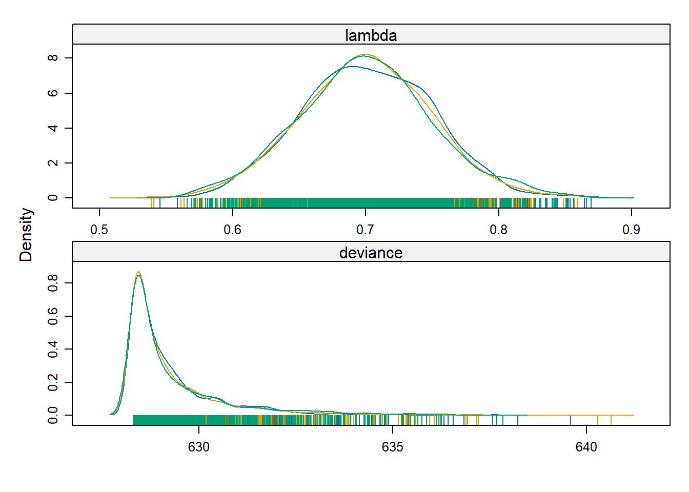

For a more involved example, let's take a look at the simple regression fit to the cricket data.  First, we'll make a plot of the data and fit a SLR model by least squares.  

```r
cricket <- read.table("data/cricket.txt", header = TRUE)

cricket.slr <- lm(chirps ~ temperature, data = cricket)
summary(cricket.slr)
```

```
## 
## Call:
## lm(formula = chirps ~ temperature, data = cricket)
## 
## Residuals:
##      Min       1Q   Median       3Q      Max 
## -1.56009 -0.57930  0.03129  0.59020  1.53259 
## 
## Coefficients:
##             Estimate Std. Error t value Pr(>|t|)    
## (Intercept) -0.30914    3.10858  -0.099 0.922299    
## temperature  0.21193    0.03871   5.475 0.000107 ***
## ---
## Signif. codes:  0 '***' 0.001 '**' 0.01 '*' 0.05 '.' 0.1 ' ' 1
## 
## Residual standard error: 0.9715 on 13 degrees of freedom
## Multiple R-squared:  0.6975,	Adjusted R-squared:  0.6742 
## F-statistic: 29.97 on 1 and 13 DF,  p-value: 0.0001067
```

```r
plot(chirps ~ temperature, data = cricket)
abline(cricket.slr)
```

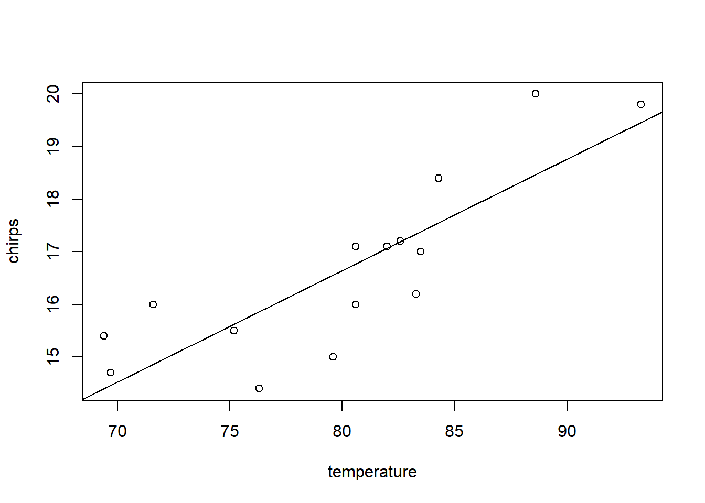

Now we'll fit the same model in JAGS, using vague priors for all model parameters

```r
cricket.model <- function() {
  
  for (j in 1:J) {             # J = number of data points
    
    y[j] ~ dnorm (mu[j], tau)  # data model:  the likelihood 
                               # note that BUGS / JAGS uses precision
                               # instead of variance
    
    mu[j] <- b0 + b1 * x[j]    # compute the mean for each observation
  }
  
  b0 ~ dnorm (0.0, 1E-6)       # prior for intercept
  b1 ~ dnorm (0.0, 1E-6)       # prior for slope
  tau ~ dgamma (0.01, 0.01)    # prior for tau
                               # note that BUGS / JAGS parameterizes 
                               # gamma by shape, rate
  
  sigma <- pow(tau, -1/2)      # the SD of the residaul errors
}

jags.data <- list(y = cricket$chirps, 
                  x = cricket$temperature,
                  J = nrow(cricket))

jags.params <- c("b0", "b1", "tau", "sigma")

jags.inits <- function(){
  list("b0" = rnorm(1), "b1" = rnorm(1), "tau" = runif(1))
}

jagsfit <- jags(data               = jags.data, 
                inits              = jags.inits, 
                parameters.to.save = jags.params,
                model.file         = cricket.model,
                n.chains           = 3,
                n.iter             = 5000)
```

```
## Compiling model graph
##    Resolving undeclared variables
##    Allocating nodes
## Graph information:
##    Observed stochastic nodes: 15
##    Unobserved stochastic nodes: 3
##    Total graph size: 70
## 
## Initializing model
```

```r
print(jagsfit)
```

```
## Inference for Bugs model at "C:/Users/krgross/AppData/Local/Temp/RtmpIjhFJ3/model22446ce23923.txt", fit using jags,
##  3 chains, each with 5000 iterations (first 2500 discarded), n.thin = 2
##  n.sims = 3750 iterations saved
##          mu.vect sd.vect   2.5%    25%    50%    75%  97.5%  Rhat n.eff
## b0        -0.272   3.330 -6.845 -2.382 -0.282  1.858  6.381 1.001  3800
## b1         0.211   0.041  0.128  0.184  0.211  0.238  0.295 1.001  3800
## sigma      1.027   0.219  0.703  0.879  0.990  1.140  1.550 1.001  3800
## tau        1.068   0.412  0.416  0.769  1.020  1.295  2.026 1.001  3800
## deviance  42.889   2.721 39.794 40.927 42.150 44.165 49.792 1.001  3000
## 
## For each parameter, n.eff is a crude measure of effective sample size,
## and Rhat is the potential scale reduction factor (at convergence, Rhat=1).
## 
## DIC info (using the rule, pD = var(deviance)/2)
## pD = 3.7 and DIC = 46.6
## DIC is an estimate of expected predictive error (lower deviance is better).
```

```r
traceplot(jagsfit)
```

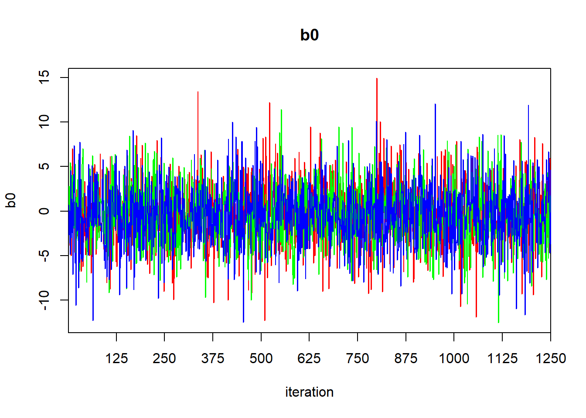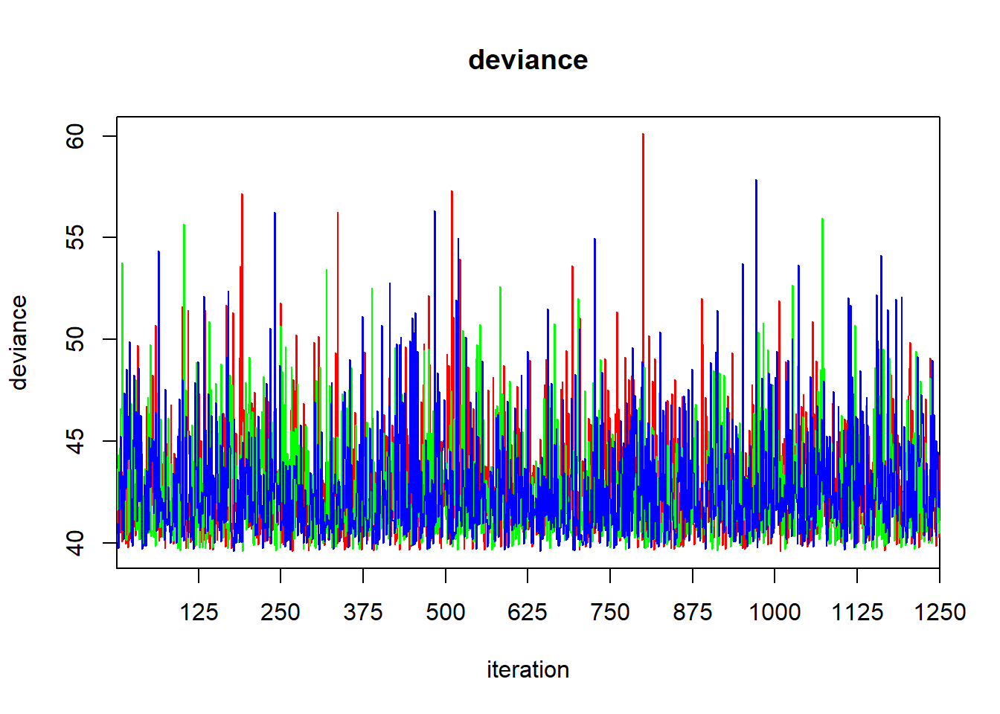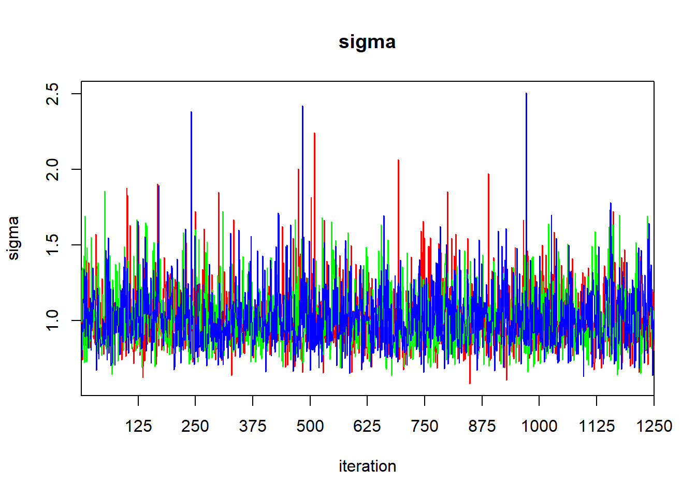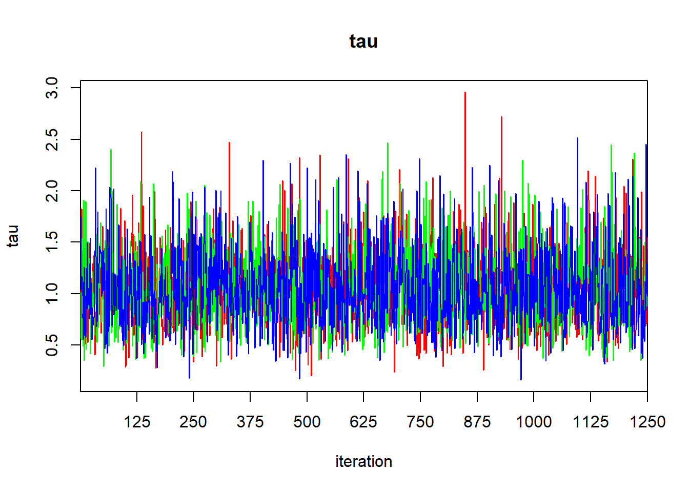

The output of the `print` function gives the quantiles that one would use to calculate a 95\% central credible interval.  To find a HPD credible interval, we can use the `HPDinterval` function in the `coda` library.  The `coda` library contains a variety of routines for post-processing of MCMC ouput.  If we simply pass the `jagsfit` object to the `HPDinterval` function, it will return an HPD interval for each of the three chains.  This isn't what we want, so we'll extract the raw MCMC samples first, and then coerce them to a data frame.


```r
mcmc.output <- as.data.frame(jagsfit$BUGSoutput$sims.list)
summary(mcmc.output)
```

```
##        b0                 b1             deviance         sigma       
##  Min.   :-13.7462   Min.   :0.03698   Min.   :39.56   Min.   :0.5625  
##  1st Qu.: -2.3818   1st Qu.:0.18443   1st Qu.:40.93   1st Qu.:0.8788  
##  Median : -0.2817   Median :0.21100   Median :42.15   Median :0.9903  
##  Mean   : -0.2720   Mean   :0.21147   Mean   :42.89   Mean   :1.0265  
##  3rd Qu.:  1.8579   3rd Qu.:0.23781   3rd Qu.:44.16   3rd Qu.:1.1404  
##  Max.   : 13.4629   Max.   :0.37901   Max.   :58.68   Max.   :2.5169  
##       tau        
##  Min.   :0.1579  
##  1st Qu.:0.7689  
##  Median :1.0196  
##  Mean   :1.0681  
##  3rd Qu.:1.2950  
##  Max.   :3.1602
```

Now we'll coerce the data frame `mcmc.output` to an MCMC object, and pass it to `HPDinterval`:

```r
HPDinterval(as.mcmc(mcmc.output))
```

```
##               lower      upper
## b0       -6.7459743  6.3889596
## b1        0.1325799  0.2976261
## deviance 39.5578412 48.2868296
## sigma     0.6569800  1.4450579
## tau       0.3537242  1.9167961
## attr(,"Probability")
## [1] 0.9498667
```

One of the merits of the Bayesian approach is that the posterior samples provide an immediate tool for propagating uncertainty to (possibly derived) quantities of interest.  We can summarize the uncertainty in the regression fit graphically by randomly sampling a subset of these samples (say, 100 of them) and using them to plot a collection of regression lines:

```r
plot(chirps ~ temperature, data = cricket, type = "n")
# we'll add the points later so that they lie on top of the lines,
# instead of the other way around

subset.samples <- sample(nrow(mcmc.output), size = 100)

for(i in subset.samples) {
  
  with(mcmc.output, abline(a = b0[i], b = b1[i], col = "deepskyblue", lwd = 0.25))
}

with(cricket, points(chirps ~ temperature))
```

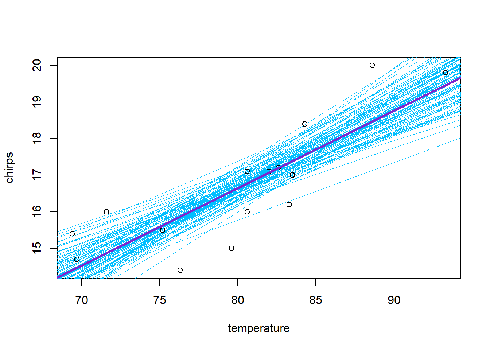

We can also propagate the uncertainty to estimate, say, the posterior distribution for the value of the regression line when the temperature is 85 F.  This quantifies the uncertainty in the average number of chirps at this temperature.  (We can think of it as a vertical slice through the above plot.)


```r
avg.chirps.85 <- with(mcmc.output, b0 + b1 * 85)
summary(avg.chirps.85)
```

```
##    Min. 1st Qu.  Median    Mean 3rd Qu.    Max. 
##   16.24   17.47   17.70   17.70   17.92   19.38
```

```r
quantile(avg.chirps.85, probs = c(.025, 0.975))
```

```
##     2.5%    97.5% 
## 17.03318 18.41790
```

We could use the `density` function to get a quick idea of the shape of the distribution:

```r
plot(density(avg.chirps.85))
```


Thus, we might say that the posterior mean for the average number of chirps at 85 F is 17.7, and a central 95\% credible interval is (17.03, 18.42).

Finally, we can use the posterior samples to estimate the uncertainty in a future observation.  When we use a posterior distribution to estimate the distribution of a future observation, we refer to it as a posterior predictive distribution.  The posterior predictive distribution must also include the error around the regression line.  We can estimate the posterior predictive distribution as follows.  Suppose we denote sample $i$ from the posterior as $\beta_{0, i}$, $\beta_{1, i}$, and $\sigma_i$.  Then for each posterior sample we will generate a new hypothetical observation $y_i^\star$ by sampling from a Gaussian distribution with mean equal to $\beta_{0,i} + \beta_{1,i} x $ and standard deviation $\sigma_i$, where $x = 85$.  The distribution of the $y_i^*$'s then gives the posterior predictive distribution that we seek.

```r
n.sims <- nrow(mcmc.output)
new.errors <- with(mcmc.output, rnorm(n.sims, mean = 0, sd = sigma))
new.chirps.85 <- with(mcmc.output, b0 + b1 * 85) + new.errors
plot(density(new.chirps.85))
```


```r
summary(new.chirps.85)
```

```
##    Min. 1st Qu.  Median    Mean 3rd Qu.    Max. 
##   13.56   17.00   17.71   17.70   18.40   22.81
```

```r
quantile(new.chirps.85, probs = c(.025, 0.975))
```

```
##     2.5%    97.5% 
## 15.60933 19.83045
```

Thus, the posterior predictive distribution has a central 95\% credible interval of (15.61, 19.83).

Although it hasn't caused any difficulty here, the slope and intercept are strongly negatively correlated in the posterior.  We can visualize this posterior correlation:


```r
library(hexbin)
```

```
## Warning: package 'hexbin' was built under R version 4.1.1
```

```r
library(RColorBrewer)
rf <- colorRampPalette(rev(brewer.pal(11, 'Spectral')))
with(jagsfit$BUGSoutput$sims.list, hexbinplot(b1 ~ b0, colramp = rf))
```

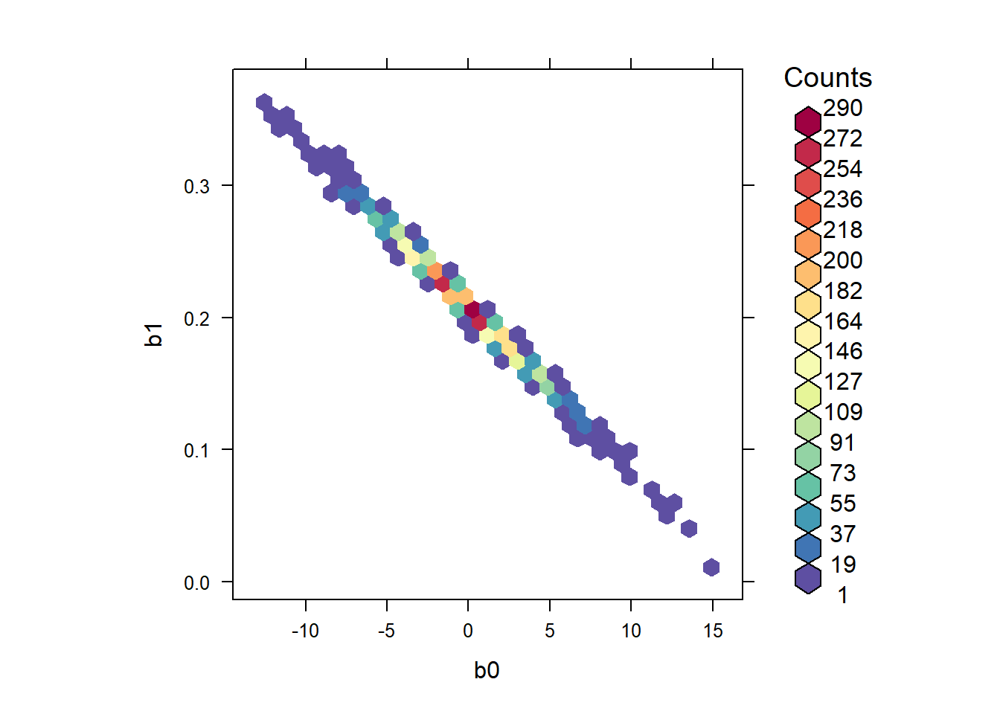

We can estimate the posterior correlation between the intercept and the slope by accessing the raw MCMC samples  

```r
cor(mcmc.output[, -c(3:4)])
```

```
##              b0          b1         tau
## b0   1.00000000 -0.99648726 -0.01158758
## b1  -0.99648726  1.00000000  0.01036251
## tau -0.01158758  0.01036251  1.00000000
```

Thus we estimate that the intercept and slope have a posterior correlation of -0.996.

We could make life easier on ourselves by centering the predictor and trying again:


```r
cricket$temp.ctr <- cricket$temperature - mean(cricket$temperature)
```


```r
jags.data <- list(y = cricket$chirps, 
                  x = cricket$temp.ctr,
                  J = nrow(cricket))

jags.params <- c("b0", "b1", "tau", "sigma")

jags.inits <- function(){
  list("b0" = rnorm(1), "b1" = rnorm(1), "tau" = runif(1))
}

jagsfit <- jags(data               = jags.data, 
                inits              = jags.inits, 
                parameters.to.save = jags.params,
                model.file         = cricket.model,
                n.chains           = 3,
                n.iter             = 5000)
```

```
## Compiling model graph
##    Resolving undeclared variables
##    Allocating nodes
## Graph information:
##    Observed stochastic nodes: 15
##    Unobserved stochastic nodes: 3
##    Total graph size: 70
## 
## Initializing model
```

```r
print(jagsfit)
```

```
## Inference for Bugs model at "C:/Users/krgross/AppData/Local/Temp/RtmpIjhFJ3/model2244177715b2.txt", fit using jags,
##  3 chains, each with 5000 iterations (first 2500 discarded), n.thin = 2
##  n.sims = 3750 iterations saved
##          mu.vect sd.vect   2.5%    25%    50%    75%  97.5%  Rhat n.eff
## b0        16.660   0.273 16.105 16.486 16.663 16.839 17.181 1.001  3800
## b1         0.213   0.044  0.125  0.186  0.213  0.240  0.298 1.001  3800
## sigma      1.033   0.227  0.710  0.872  0.995  1.150  1.577 1.002  1700
## tau        1.060   0.415  0.402  0.756  1.011  1.315  1.984 1.002  1700
## deviance  42.944   2.822 39.788 40.901 42.214 44.228 50.154 1.002  1600
## 
## For each parameter, n.eff is a crude measure of effective sample size,
## and Rhat is the potential scale reduction factor (at convergence, Rhat=1).
## 
## DIC info (using the rule, pD = var(deviance)/2)
## pD = 4.0 and DIC = 46.9
## DIC is an estimate of expected predictive error (lower deviance is better).
```

```r
traceplot(jagsfit)
```

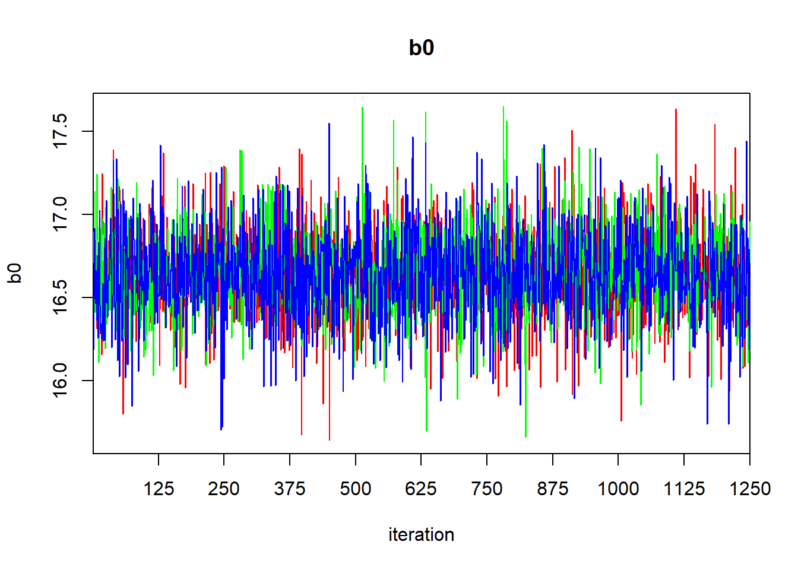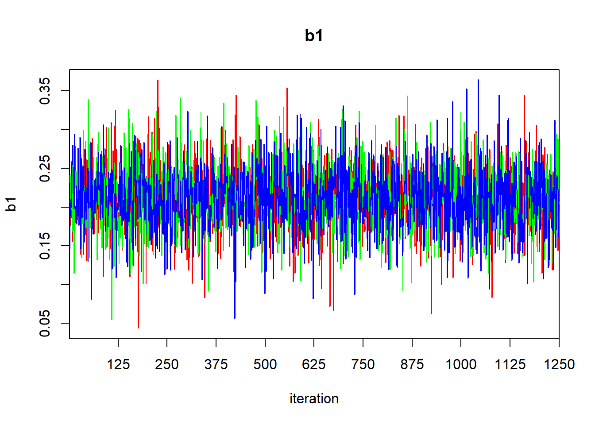

The posteriors for the intercept and slope are now uncorrelated:


```r
library(hexbin)
library(RColorBrewer)
rf <- colorRampPalette(rev(brewer.pal(11, 'Spectral')))
with(jagsfit$BUGSoutput$sims.list, hexbinplot(b1 ~ b0, colramp = rf))
```


```r
mcmc.output <- as.data.frame(jagsfit$BUGSoutput$sims.list)
cor(mcmc.output[, -c(3:4)])
```

```
##              b0          b1         tau
## b0  1.000000000 0.030444766 0.007524284
## b1  0.030444766 1.000000000 0.005081907
## tau 0.007524284 0.005081907 1.000000000
```

## rstanarm

The `rstanarm` package is a recent set of routines that seeks to provide a user-friendly front end to Bayesian analysis with Stan. Specifically, `rstanarm` provides functions for fitting standard statistical models that are meant to mimic the analogous fitting functions in R.  For example, the basic routine for fitting linear models in R is `lm`; `rstanarm` provides a function `stan_lm` that strives to have the same functionality and interface as `lm`, albeit using Stan "under the hood" to generate Bayesian inference.  (That said, the main workhorse function in `rstanarm` for model fitting is `stan_glm`, which attempts to mimic the native R function `glm` for fitting generalized linear models.  Separately, the developers of `rstanarm` have taken the not unreasonable stance that generalized linear models should supplant general linear models as the analyst's default approach to model fitting.)

To provide functionality that is similar to R's native model-fitting routines, the functions in `rstanarm` make a number of operational decisions behind the scenes.  Most notably, the model fitting routines in `rstanarm` will select default priors and default HMC parameters.  While these defaults can always be modified by the analyst, the implementation of software that chooses priors by default is radical.  First, the developers of `rstanarm` have their own particular view about what the role of the prior should be in data analysis.  While their view is a considered one, by no means does it reflect a consensus that extends beyond the developers of the software.  If you use `rstanarm`'s routines out of the box, you are accepting this view as your own if you do not specify the priors yourself.  Second, as best I understand, the methods by which `rstanarm` chooses default priors still appear to be in some flux.  That means that future versions of `rstanarm` may supply different default priors than those that are supplied today.  As a result, the behavior of `rstanarm` today may differ from its behavior tomorrow, if you use the default priors.

All that said, here is how you might use `rstanarm` to fit the simple regression to the cricket data:

```r
require(rstanarm)
```

```
## Loading required package: rstanarm
```

```
## Loading required package: Rcpp
```

```
## This is rstanarm version 2.21.1
```

```
## - See https://mc-stan.org/rstanarm/articles/priors for changes to default priors!
```

```
## - Default priors may change, so it's safest to specify priors, even if equivalent to the defaults.
```

```
## - For execution on a local, multicore CPU with excess RAM we recommend calling
```

```
##   options(mc.cores = parallel::detectCores())
```


```r
stanarm.cricket.fit <- stan_glm(chirps ~ temp.ctr, data = cricket, family = gaussian, seed = 1)
```

```
## 
## SAMPLING FOR MODEL 'continuous' NOW (CHAIN 1).
## Chain 1: 
## Chain 1: Gradient evaluation took 0 seconds
## Chain 1: 1000 transitions using 10 leapfrog steps per transition would take 0 seconds.
## Chain 1: Adjust your expectations accordingly!
## Chain 1: 
## Chain 1: 
## Chain 1: Iteration:    1 / 2000 [  0%]  (Warmup)
## Chain 1: Iteration:  200 / 2000 [ 10%]  (Warmup)
## Chain 1: Iteration:  400 / 2000 [ 20%]  (Warmup)
## Chain 1: Iteration:  600 / 2000 [ 30%]  (Warmup)
## Chain 1: Iteration:  800 / 2000 [ 40%]  (Warmup)
## Chain 1: Iteration: 1000 / 2000 [ 50%]  (Warmup)
## Chain 1: Iteration: 1001 / 2000 [ 50%]  (Sampling)
## Chain 1: Iteration: 1200 / 2000 [ 60%]  (Sampling)
## Chain 1: Iteration: 1400 / 2000 [ 70%]  (Sampling)
## Chain 1: Iteration: 1600 / 2000 [ 80%]  (Sampling)
## Chain 1: Iteration: 1800 / 2000 [ 90%]  (Sampling)
## Chain 1: Iteration: 2000 / 2000 [100%]  (Sampling)
## Chain 1: 
## Chain 1:  Elapsed Time: 0.148 seconds (Warm-up)
## Chain 1:                0.214 seconds (Sampling)
## Chain 1:                0.362 seconds (Total)
## Chain 1: 
## 
## SAMPLING FOR MODEL 'continuous' NOW (CHAIN 2).
## Chain 2: 
## Chain 2: Gradient evaluation took 0 seconds
## Chain 2: 1000 transitions using 10 leapfrog steps per transition would take 0 seconds.
## Chain 2: Adjust your expectations accordingly!
## Chain 2: 
## Chain 2: 
## Chain 2: Iteration:    1 / 2000 [  0%]  (Warmup)
## Chain 2: Iteration:  200 / 2000 [ 10%]  (Warmup)
## Chain 2: Iteration:  400 / 2000 [ 20%]  (Warmup)
## Chain 2: Iteration:  600 / 2000 [ 30%]  (Warmup)
## Chain 2: Iteration:  800 / 2000 [ 40%]  (Warmup)
## Chain 2: Iteration: 1000 / 2000 [ 50%]  (Warmup)
## Chain 2: Iteration: 1001 / 2000 [ 50%]  (Sampling)
## Chain 2: Iteration: 1200 / 2000 [ 60%]  (Sampling)
## Chain 2: Iteration: 1400 / 2000 [ 70%]  (Sampling)
## Chain 2: Iteration: 1600 / 2000 [ 80%]  (Sampling)
## Chain 2: Iteration: 1800 / 2000 [ 90%]  (Sampling)
## Chain 2: Iteration: 2000 / 2000 [100%]  (Sampling)
## Chain 2: 
## Chain 2:  Elapsed Time: 0.175 seconds (Warm-up)
## Chain 2:                0.113 seconds (Sampling)
## Chain 2:                0.288 seconds (Total)
## Chain 2: 
## 
## SAMPLING FOR MODEL 'continuous' NOW (CHAIN 3).
## Chain 3: 
## Chain 3: Gradient evaluation took 0 seconds
## Chain 3: 1000 transitions using 10 leapfrog steps per transition would take 0 seconds.
## Chain 3: Adjust your expectations accordingly!
## Chain 3: 
## Chain 3: 
## Chain 3: Iteration:    1 / 2000 [  0%]  (Warmup)
## Chain 3: Iteration:  200 / 2000 [ 10%]  (Warmup)
## Chain 3: Iteration:  400 / 2000 [ 20%]  (Warmup)
## Chain 3: Iteration:  600 / 2000 [ 30%]  (Warmup)
## Chain 3: Iteration:  800 / 2000 [ 40%]  (Warmup)
## Chain 3: Iteration: 1000 / 2000 [ 50%]  (Warmup)
## Chain 3: Iteration: 1001 / 2000 [ 50%]  (Sampling)
## Chain 3: Iteration: 1200 / 2000 [ 60%]  (Sampling)
## Chain 3: Iteration: 1400 / 2000 [ 70%]  (Sampling)
## Chain 3: Iteration: 1600 / 2000 [ 80%]  (Sampling)
## Chain 3: Iteration: 1800 / 2000 [ 90%]  (Sampling)
## Chain 3: Iteration: 2000 / 2000 [100%]  (Sampling)
## Chain 3: 
## Chain 3:  Elapsed Time: 0.139 seconds (Warm-up)
## Chain 3:                0.129 seconds (Sampling)
## Chain 3:                0.268 seconds (Total)
## Chain 3: 
## 
## SAMPLING FOR MODEL 'continuous' NOW (CHAIN 4).
## Chain 4: 
## Chain 4: Gradient evaluation took 0 seconds
## Chain 4: 1000 transitions using 10 leapfrog steps per transition would take 0 seconds.
## Chain 4: Adjust your expectations accordingly!
## Chain 4: 
## Chain 4: 
## Chain 4: Iteration:    1 / 2000 [  0%]  (Warmup)
## Chain 4: Iteration:  200 / 2000 [ 10%]  (Warmup)
## Chain 4: Iteration:  400 / 2000 [ 20%]  (Warmup)
## Chain 4: Iteration:  600 / 2000 [ 30%]  (Warmup)
## Chain 4: Iteration:  800 / 2000 [ 40%]  (Warmup)
## Chain 4: Iteration: 1000 / 2000 [ 50%]  (Warmup)
## Chain 4: Iteration: 1001 / 2000 [ 50%]  (Sampling)
## Chain 4: Iteration: 1200 / 2000 [ 60%]  (Sampling)
## Chain 4: Iteration: 1400 / 2000 [ 70%]  (Sampling)
## Chain 4: Iteration: 1600 / 2000 [ 80%]  (Sampling)
## Chain 4: Iteration: 1800 / 2000 [ 90%]  (Sampling)
## Chain 4: Iteration: 2000 / 2000 [100%]  (Sampling)
## Chain 4: 
## Chain 4:  Elapsed Time: 0.171 seconds (Warm-up)
## Chain 4:                0.125 seconds (Sampling)
## Chain 4:                0.296 seconds (Total)
## Chain 4:
```

Note that `rstanarm` has made a variety of decisions about how many chains to run, how long to run them, etc.  We can obtain a summary of the model fit by the `print` command:

```r
print(stanarm.cricket.fit, digits = 3)
```

```
## stan_glm
##  family:       gaussian [identity]
##  formula:      chirps ~ temp.ctr
##  observations: 15
##  predictors:   2
## ------
##             Median MAD_SD
## (Intercept) 16.648  0.257
## temp.ctr     0.210  0.041
## 
## Auxiliary parameter(s):
##       Median MAD_SD
## sigma 1.008  0.198 
## 
## ------
## * For help interpreting the printed output see ?print.stanreg
## * For info on the priors used see ?prior_summary.stanreg
```

There are a few parts of this output that deserve comment.  First, this summary reports the posterior median of the parameters instead of the posterior mean.  Second, the authors of `rstanarm` have made the curious decision to replace the posterior standard deviation (itself the Bayesian counterpart to the frequentist's standard error) with someting they call "MAD SD".  This takes a bit of explanation.  The "MAD" part stands for median absolute deviation.  It is the median of the absolute deviations of the posterior samples from the posterior median.  In other words, if we have a generic parameter $\theta$ and label its posterior samples as $\theta_1, \theta_2, \ldots, \theta_n$, then the MAD of $\theta$ is

$$
\mathrm{median}_i(| \theta_i - \mathrm{median}_i(\theta_i) |)
$$

According to the authors of `rstanarm`, "Because we are so used to working with standard deviations, when we compute the median absolute deviation, we then rescale it by multiplying by 1.483, which reproduces the standard deviation in the special case of the normal distribution.  We call this the mad sd."  In other words, the MAD SD is a measure of posterior uncertainty that is meant to be comparable to the posterior standard deviation.  (The authors of `rstanarm` clearly must think this is a more desirable estimate of the posterior uncertainty than the posterior standard deviation; though their reasoning here is not immediately clear to me.)

<!-- See p 73 of Gelman "Regression and other stories" -->

If we want to compute our own summary statistics, we can extract the MCMC samples from the `stam_glm` fit using the `as.matrix` command:


```r
mcmc.sims <- as.matrix(stanarm.cricket.fit)
summary(mcmc.sims)
```

```
##   (Intercept)       temp.ctr           sigma       
##  Min.   :15.65   Min.   :0.02782   Min.   :0.5582  
##  1st Qu.:16.48   1st Qu.:0.18191   1st Qu.:0.8869  
##  Median :16.65   Median :0.21023   Median :1.0079  
##  Mean   :16.65   Mean   :0.20955   Mean   :1.0457  
##  3rd Qu.:16.83   3rd Qu.:0.23740   3rd Qu.:1.1627  
##  Max.   :17.68   Max.   :0.36177   Max.   :2.3400
```

We might, for example, then use this output to find the posterior standard deviation of each of the parameters, or to find central 95\% credible intervals:

```r
apply(mcmc.sims, 2, sd)
```

```
## (Intercept)    temp.ctr       sigma 
##  0.27003507  0.04262539  0.22262375
```

```r
apply(mcmc.sims, 2, function(x) quantile(x, c(0.025, 0.975)))
```

```
##        parameters
##         (Intercept)  temp.ctr     sigma
##   2.5%     16.10111 0.1240071 0.7171401
##   97.5%    17.17942 0.2906848 1.5816217
```

Compare these values to the posterior standard deviations and 95\% central credible intervals reported in the JAGS fit.
