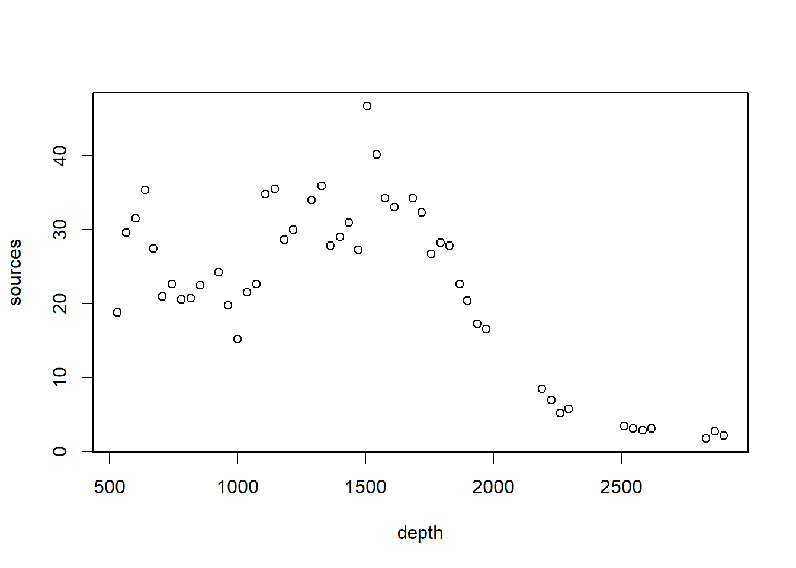
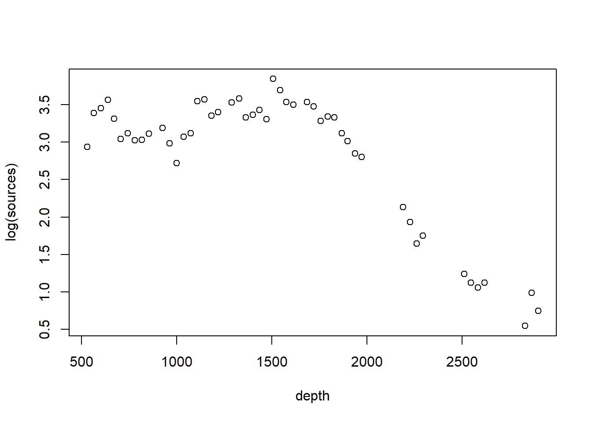
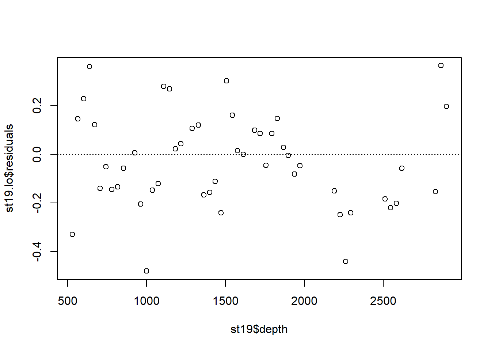
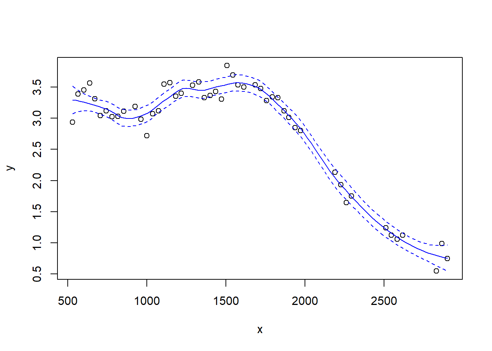
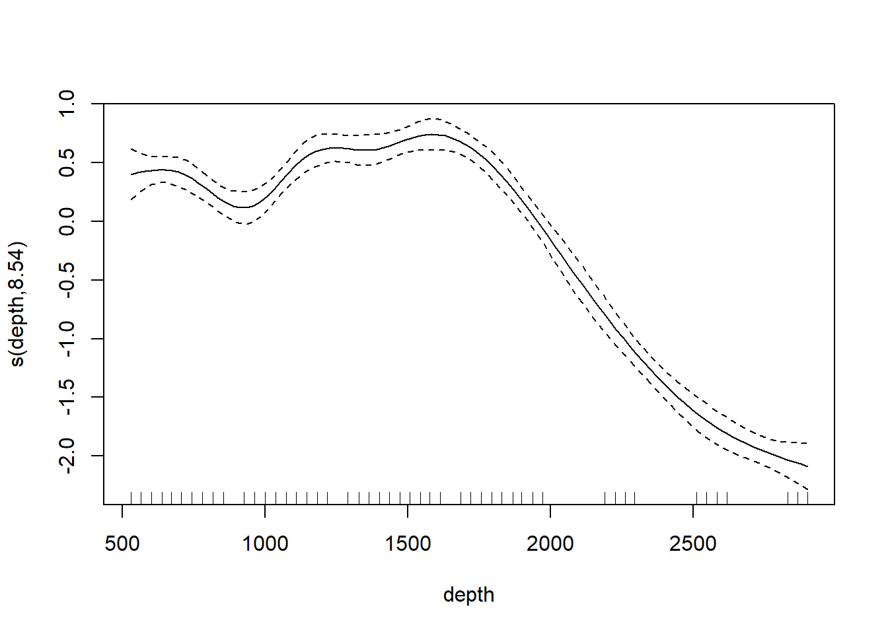
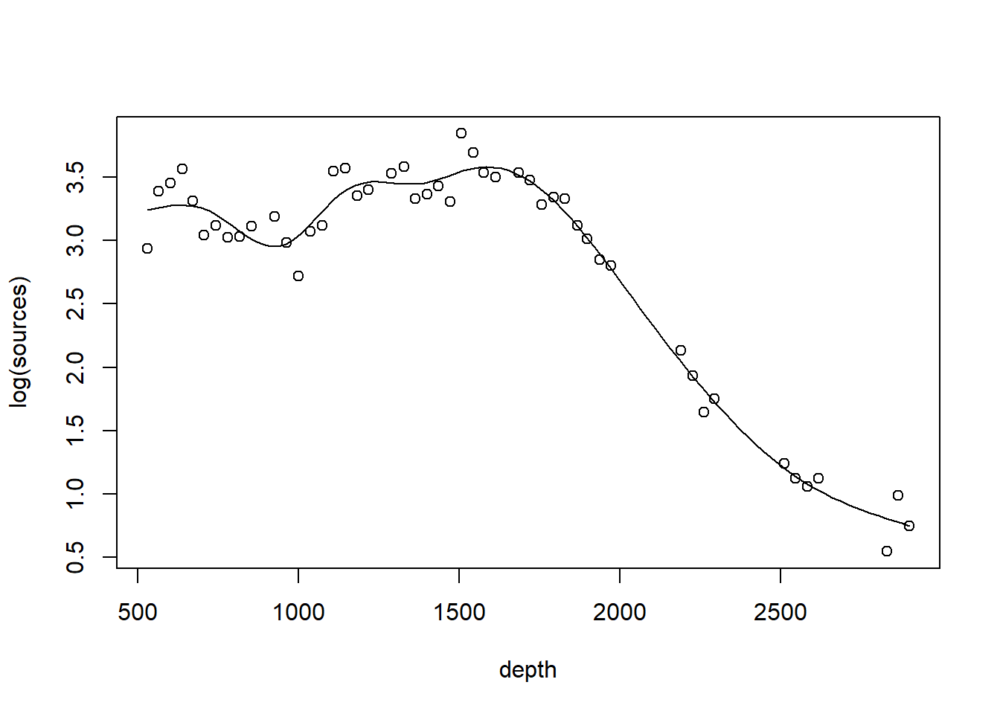
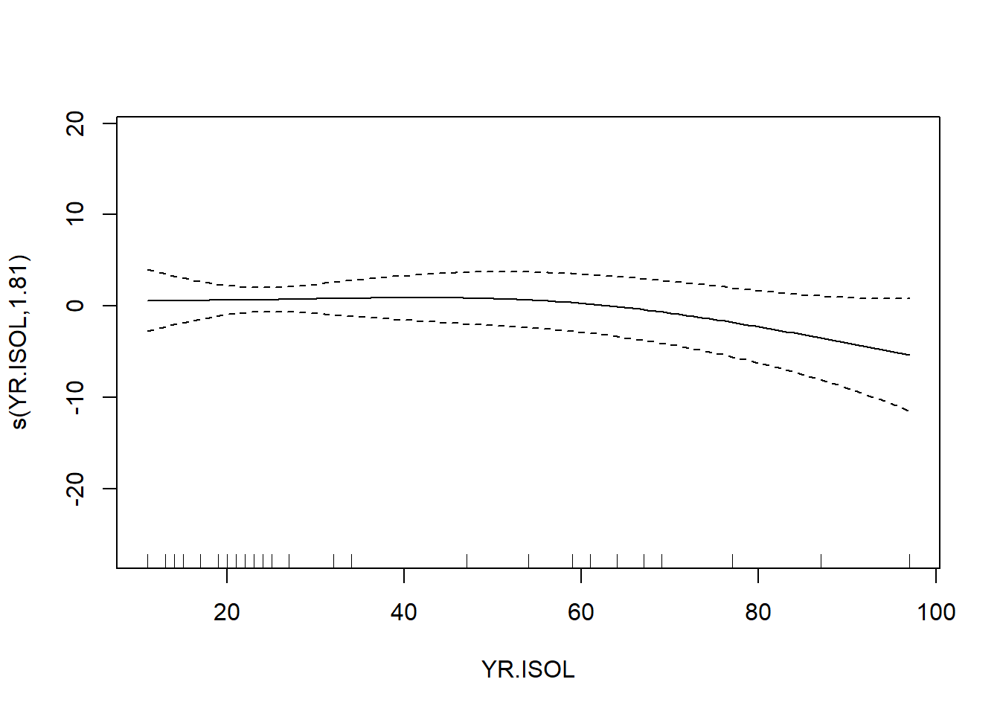
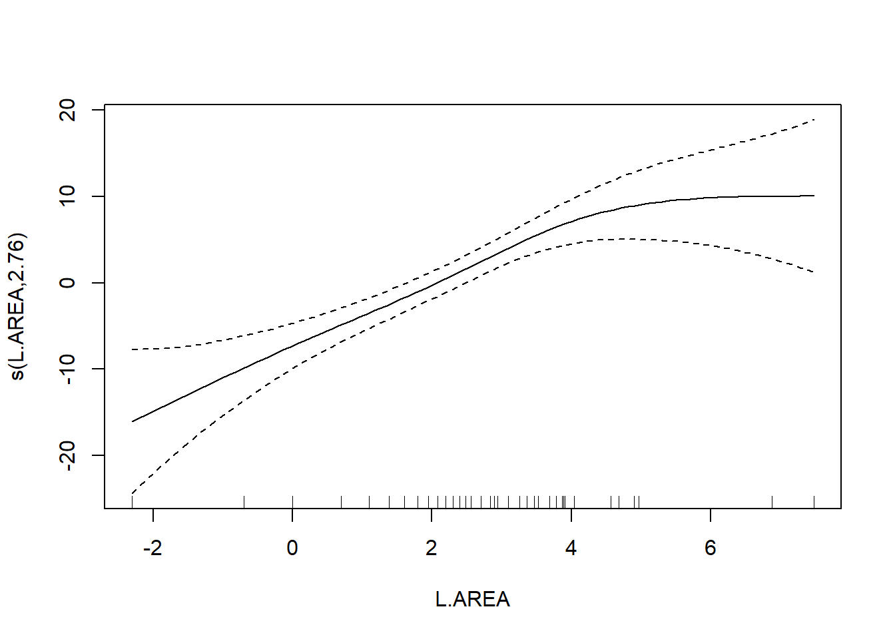
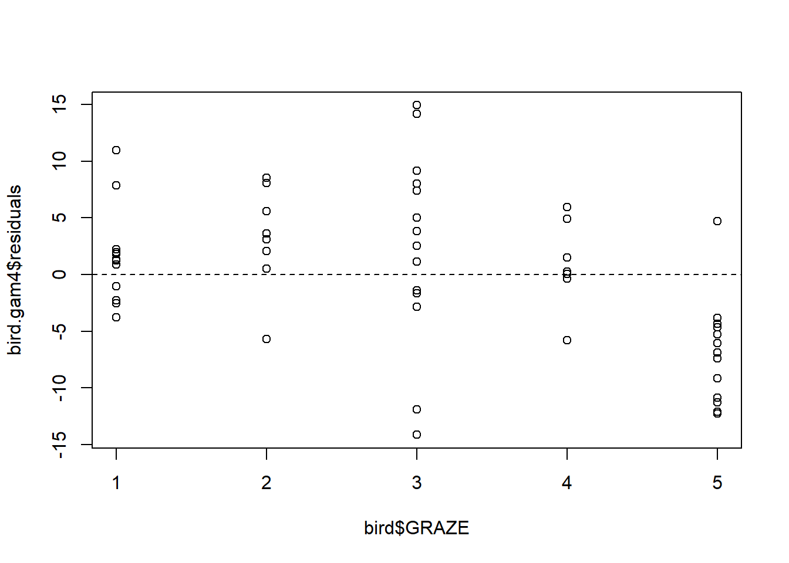

# Smoothing and GAMs


In this chapter, we examine methods for fitting a flexible trend between a response and a predictor that don't require first committing ourselves to a particular mathematical assumption about the shape of that trend.  In the first sections, we will explore fitting a flexible trend line for a single predictor and a single response.  Later, we will see how these flexible trends can be included in regression models with several predictors. 

As a running example, we will consider a data set originally published by @gillibrand2007seasonal, and analyzed extensively in the textbook by @zuur2009.  Zuur et al. say that these data describe the number of sources of "pelagic bioluminescence along a depth gradient in the northeast Atlantic Ocean."  The name of the data set ("ISIT") refers to the type of camera used in the study.  We focus particularly on the data at station 19.  The pattern that we wish to characterize is shown below.


``` r
## download the data from the book's website
isit <- read.table("data/ISIT.txt", head = T)

## extract the data from station 19

st19 <- subset(isit, Station == 19)

## retain just the variables that we want, and rename

st19 <- st19[, c("SampleDepth", "Sources")]
names(st19) <- c("depth", "sources")
with(st19, plot(sources ~ depth))
```



As a preliminary consideration, all of the methods we discuss are variations on regression.  As such, they inherent all of the usual regression assumptions about the distribution of the errors, namely, that the errors are iid draws from a Gaussian distribution.

The bioluminescence data discussed in this chapter violate these assumptions rather severely. We see right away that, as typically happens when measuring the abundance of a particular organism or taxa, larger responses are more variable.  To cope with this non-constant variance, we will take the usual step of modeling the (natural) log of the response, shown below.


``` r
with(st19, plot(log(sources) ~ depth))
```



The log transformation successfully stabilizes the variance.

In addition, because these data are collected at locations along a transect, they are likely characterized by substantial autocorrelation.  For the sake of illustration, we ignore the autocorrelation in the analyses that follow.  See the discussion of [GAMMs] to learn about coping with autocorrelation in generalized additive models.

## Loess smoothers

We illustrate a LOESS smoother first, using the `loess` function. We will first fit the smoother with the factory settings. 


``` r
st19.lo <- loess(log(sources) ~ depth, data = st19)
summary(st19.lo)
```

```
## Call:
## loess(formula = log(sources) ~ depth, data = st19)
## 
## Number of Observations: 49 
## Equivalent Number of Parameters: 4.67 
## Residual Standard Error: 0.2054 
## Trace of smoother matrix: 5.12  (exact)
## 
## Control settings:
##   span     :  0.75 
##   degree   :  2 
##   family   :  gaussian
##   surface  :  interpolate	  cell = 0.2
##   normalize:  TRUE
##  parametric:  FALSE
## drop.square:  FALSE
```

Plot the fit, this takes a little work

``` r
depth.vals <- with(st19, seq(from   = min(depth), 
                             to     = max(depth), 
                             length = 100))

st19.fit <- predict(object  = st19.lo,
                    newdata = depth.vals,
                    se      = TRUE)

with(st19, plot(log(sources) ~ depth))
lines(x = depth.vals, y = st19.fit$fit, col = "blue")

# add 95% error bars
lines(x   = depth.vals, 
      y   = st19.fit$fit + st19.fit$se.fit * qt(p = .975, df = st19.fit$df),
      col = "blue",
      lty = "dashed")

lines(x   = depth.vals, 
      y   = st19.fit$fit - st19.fit$se.fit * qt(p = .975, df = st19.fit$df),
      col = "blue",
      lty = "dashed")
```


Examine the residuals:

``` r
plot(st19.lo$residuals ~ st19$depth)
abline(h = 0, lty = "dotted")
```



Note the autocorrelation in the residuals.

Let's look at how changing the span changes the fit.  We'll write a custom function to fit a LOESS curve, and then call the function with various values for the span.


``` r
PlotLoessFit <- function(x, y, return.fit = FALSE, ...){
  
  # Caluclates a loess fit with the 'loess' function, and makes a plot
  #
  # Args:
  #   x: predictor
  #   y: response
  #   return.fit: logical
  #   ...: Optional arguments to loess
  #
  # Returns:
  #   the loess fit
  
  my.lo <- loess(y ~ x, ...)
  
  x.vals <- seq(from = min(x), to = max(x), length = 100)
  
  my.fit <- predict(object  = my.lo,
                    newdata = x.vals,
                    se      = TRUE)
  
  plot(x, y)
  lines(x = x.vals, y = my.fit$fit, col = "blue")
  
  lines(x   = x.vals, 
        y   = my.fit$fit + my.fit$se.fit * qt(p = .975, df = my.fit$df),
        col = "blue",
        lty = "dashed")
  
  lines(x   = x.vals, 
        y   = my.fit$fit - my.fit$se.fit * qt(p = .975, df = my.fit$df),
        col = "blue",
        lty = "dashed")
  
  if (return.fit) {
    return(my.lo)
  }
}
```

Now we'll call the function several times, each time chanigng the value of the `span` argument to the `loess` function:


``` r
PlotLoessFit(x = st19$depth, y = log(st19$sources), span = 0.6)
```


``` r
PlotLoessFit(x = st19$depth, y = log(st19$sources), span = 0.4)
```



``` r
PlotLoessFit(x = st19$depth, y = log(st19$sources), span = 0.2)
```


Notice how the fit becomes rougher as the span decreases.

The `loess` function includes an argument `degree` that specifies the degree of the polynomial regression fit at each location.  The default value for `degree` is 2, so the fits that we have seen so far are local quadratic regressions.  Let's try a loess fit with a locally linear regression:


``` r
PlotLoessFit(x = st19$depth, y = log(st19$sources), span = 0.4, degree = 1)
```


## Splines

Next we consider splines. There are many types of splines, and, correspondingly, there are many `R` tools for fitting splines.  Most ecologists use the `mgcv` package to fit splines (and GAMs that include splines).  While `mgcv` is a remarkable package, it's a complicated piece of machinery.  I've found the `splines` library to be more accessible to the non-expert, at least for regression splines.  The downside to the `splines` library is that it doesn't fit smoothing splines. The discussion in this section draws from Chapter 7 of @james2021introduction.

### Regression splines

The code below fits a regression spline to the bioluminescence data.  Actually, the code uses the command `bs` (no bull) to create the basis functions for a cubic regression spline, which are then treated as predictors in a standard regression fit with `lm`.  For expository purposes, we will construct a spline with two knots, arbitrarily placed at 1000 m and 2000 m depth.


``` r
library(splines)
fm1 <- lm(log(sources) ~ bs(depth, knots = c(1000, 2000)), data = st19)

# plot using predict.lm; code adapted from James et al (2021)

depth.vals <- seq(from = min(st19$depth), to = max(st19$depth), length = 100)
fm1.pred <- predict(fm1, newdata = list(depth = depth.vals), se = T)
with(st19, plot(log(sources) ~ depth))
lines(depth.vals, fm1.pred$fit, lwd = 2, col = "red")
lines(depth.vals, fm1.pred$fit + qt(0.975, df = 43) * fm1.pred$se, lty = "dashed", col = "red")
lines(depth.vals, fm1.pred$fit + qt(0.025, df = 43) * fm1.pred$se, lty = "dashed", col = "red")
```


Just for fun, let's fit a linear regression spline with a single knot at 1500m. We'll use the `degree` argument of `bs` to specify a linear (as opposed to cubic) spline.


``` r
fm2 <- lm(log(sources) ~ bs(depth, knots = c(1500), degree = 1), data = st19)

fm2.pred <- predict(fm2, newdata = list(depth = depth.vals), se = T)
with(st19, plot(log(sources) ~ depth))
lines(depth.vals, fm2.pred$fit, lwd = 2, col = "red")
lines(depth.vals, fm2.pred$fit + qt(0.975, df = 43) * fm2.pred$se, lty = "dashed", col = "red")
lines(depth.vals, fm2.pred$fit + qt(0.025, df = 43) * fm2.pred$se, lty = "dashed", col = "red")
```


Alternatively, instead of using the `knots` argument to specify the knots, we can use the `df` argument to specify the number of basis functions.  For a cubic regression spline, the number of knots will then be the value of `df` minus 4 (because there are four basis functions, or degrees of freedom, needed for a cubic regression without any knots).  According to the documentation for `bs`, the knots are placed at "suitable quantiles of $x$".  Here is code for a (cubic) regression spline with 4 knots (and thus `df = 8`).


``` r
fm3 <- lm(log(sources) ~ bs(depth, df = 8), data = st19)

fm3.pred <- predict(fm3, newdata = list(depth = depth.vals), se = T)
with(st19, plot(log(sources) ~ depth))
lines(depth.vals, fm3.pred$fit, lwd = 2, col = "red")
lines(depth.vals, fm3.pred$fit + qt(0.975, df = 43) * fm3.pred$se, lty = "dashed", col = "red")
lines(depth.vals, fm3.pred$fit + qt(0.025, df = 43) * fm3.pred$se, lty = "dashed", col = "red")
```


Note that if we want to test for the significance of the regression spline, we can conduct an $F$-test in the usual way.

``` r
fm0 <- lm(log(sources) ~ 1, data = st19)
anova(fm0, fm3)
```

```
## Analysis of Variance Table
## 
## Model 1: log(sources) ~ 1
## Model 2: log(sources) ~ bs(depth, df = 8)
##   Res.Df    RSS Df Sum of Sq      F    Pr(>F)    
## 1     48 38.652                                  
## 2     40  0.914  8    37.739 206.54 < 2.2e-16 ***
## ---
## Signif. codes:  0 '***' 0.001 '**' 0.01 '*' 0.05 '.' 0.1 ' ' 1
```

It can be a bit enlightening to see how `bs` creates basis functions.  Here are the basis functions for the linear spline with a single knot at 1500m.

``` r
linear.basis <- bs(st19$depth, knots = c(1500), degree = 1)
par(mfrow = c(1, 2))
for (i in 1:2) plot(st19$depth, linear.basis[, i], xlab = "depth", ylab = "basis function")
```


And the basis function for the cubic regression spline with 6 df.

``` r
cubic.basis <- bs(st19$depth, df = 6)
par(mfrow = c(2, 3))
for (i in 1:6) plot(st19$depth, cubic.basis[, i], xlab = "depth", ylab = "basis function")
```


### Natural splines

A (cubic) regression spline typically suffers from having too much flexibility in the regions outside the outermost knots.  A *natural spline* is a regression spline that (a) places boundary knots at the minimun and maximum of the predictor values (in addition to any internal knots), and then (b) uses cubic fits for the segments between the knots, and linear fits for the segments outside the boundary knots.  The effect of requiring a linear fit outside the boundary knots is to temper the flexibility of the spline near the extreme predictor values.  In the `splines` library, the function `ns` generates basis functions for a natural spline.  Here is an example of a natural spline with two internal knots, compared to a cubic regression spline with the same internal knots.


``` r
fm4 <- lm(log(sources) ~ ns(depth, knots = c(1000, 2000)), data = st19)

fm4.pred <- predict(fm4, newdata = list(depth = depth.vals), se = T)

par(mfrow = c(1, 2))

with(st19, plot(log(sources) ~ depth, main = "regression spline"))
lines(depth.vals, fm1.pred$fit, lwd = 2, col = "red")
lines(depth.vals, fm1.pred$fit + qt(0.975, df = 43) * fm1.pred$se, lty = "dashed", col = "red")
lines(depth.vals, fm1.pred$fit + qt(0.025, df = 43) * fm1.pred$se, lty = "dashed", col = "red")

with(st19, plot(log(sources) ~ depth, main = "natural spline"))
lines(depth.vals, fm4.pred$fit, lwd = 2, col = "red")
lines(depth.vals, fm4.pred$fit + qt(0.975, df = 43) * fm4.pred$se, lty = "dashed", col = "red")
lines(depth.vals, fm4.pred$fit + qt(0.025, df = 43) * fm4.pred$se, lty = "dashed", col = "red")
```


### Smoothing splines

In regression splines, the analyst chooses the degree of the spline (typically 3, for a cubic spline) and the number and location of the knots.  In a smoothing spline, also known as a penalized regression spline, one begins with a large number of knots and then optimizes with respect to an objective function that is the sum of the residual sum of squares plus a penalty term for the roughness of the fit.  The strength of the penalty is set by a tuning parameter that is typically determined by cross-validation.

Most ecologists these days would use the `gam` function in the `mgcv` library.  The code below illustrates.  The `mgcv::gam` program is a complicated piece of machinery; see @wood2017generalized for the necessary background theory.  The `bs` argument specifies the type of basis function; the smooth shown below is based on a cubic regression (`cr`) basis.

``` r
library(mgcv)
```

```
## Loading required package: nlme
```

```
## This is mgcv 1.9-3. For overview type 'help("mgcv-package")'.
```

``` r
st19.sspline <- mgcv::gam(log(sources) ~ s(depth, bs = "cr"), data = st19)
plot(st19.sspline, se = TRUE)
```



The plot shows only the spline component, which thus does not include the intercept. To visualize the fit, we'll need to do a bit more work.

``` r
with(st19, plot(log(sources) ~ depth))  

st19.fit <- predict(st19.sspline, 
                    newdata = data.frame(depth = depth.vals), 
                    se      = TRUE)

lines(x = depth.vals, y = st19.fit$fit)
```



Let's ask for a summary:

``` r
summary(st19.sspline)
```

```
## 
## Family: gaussian 
## Link function: identity 
## 
## Formula:
## log(sources) ~ s(depth, bs = "cr")
## 
## Parametric coefficients:
##             Estimate Std. Error t value Pr(>|t|)    
## (Intercept)  2.83855    0.02226   127.5   <2e-16 ***
## ---
## Signif. codes:  0 '***' 0.001 '**' 0.01 '*' 0.05 '.' 0.1 ' ' 1
## 
## Approximate significance of smooth terms:
##            edf Ref.df     F p-value    
## s(depth) 8.541  8.928 173.6  <2e-16 ***
## ---
## Signif. codes:  0 '***' 0.001 '**' 0.01 '*' 0.05 '.' 0.1 ' ' 1
## 
## R-sq.(adj) =   0.97   Deviance explained = 97.5%
## GCV = 0.030161  Scale est. = 0.024288  n = 49
```

Note the `edf` component in the "Approximate significance of smooth terms" section.  The label `edf` stands for effective degrees of freedom.  We can think of the edf as the effective number of new predictors (basis functions) that have been added to the model to accommodate the spline.  

<!-- For a penalized regression spline, the number and values of the newly created predictors are determined by fitting the model to the data.  Because the predictors are calculated in this way, the usual theory of $F$-testing does not apply.  This is why the $F$-test shown for the penalized regression spline is labeled as "approximate". -->

We can use the edf to determine the appropriate confidence bounds on our smooth.  There are 49 data points in this data set, so the estimate of the residual error is based on 49 - (8.5 + 1) = 39.5 df.


``` r
with(st19, plot(log(sources) ~ depth))  

st19.fit <- predict(st19.sspline, 
                    newdata = data.frame(depth = depth.vals), 
                    se      = TRUE)

lines(x = depth.vals, y = st19.fit$fit)

lines(x = depth.vals, y = st19.fit$fit + qt(0.975, df = 39.5) * st19.fit$se.fit, lty = "dashed")
lines(x = depth.vals, y = st19.fit$fit + qt(0.025, df = 39.5) * st19.fit$se.fit, lty = "dashed")
```


The `s()` component of the model formula designates a spline, and specifies details about the particular type of spline to be fit.  To fit a regression spline, fix the number of basis functions with the `fx = TRUE` argument.  The default value for the `fx` argument is `fx = FALSE`, in which case the amount of smoothing is determined by (generalized) cross-validation.  When `fx = TRUE`, the parameter `k` determines the dimensionality (degree of flexibility) of the spline.  Larger values of `k` correspond to greater flexibility, and a less smooth fit. 

The `AIC` function will generate an AIC value for the penalized regression spline fit:


``` r
AIC(st19.sspline)
```

```
## [1] -32.64326
```

## Generalized additive models (GAMs) {#GAMs}

Generalized additive models replace the usual linear terms that appear in multiple regression models with splines.  That is, suppose we seek to model the relationship between a response $y$ and two predictors, $x_1$ and $x_2$.  A standard regression model without polynomial effects or interactions would be written as 
$$
y = \beta_0 + \beta_1 x_1 +\beta_2 x_2 + \varepsilon
$$
where $\varepsilon$ is assumed to be an iid Gaussian random variate with variance $\sigma^2_\varepsilon$.  This is an additive model, in the sense that the combined effects of the two predictors equal the sum of their individual effects.  

A generalized additive model (GAM) replaces the individual regression terms with splines.  Continuing with the generic example, a GAM would instead model the effects of the two predictors as
$$
y = \beta_0 + s(x_1) +s(x_2) + \varepsilon
$$
where $s(\cdot)$ represents a spline.  We continue to assume that, conditional on the covariate effects, the responses are normally distributed with constant variance $\sigma^2_\varepsilon$.  

We will illustrate additive modeling using the bird data found in Appendix A of @zuur2009.  Zuur et al. report that these data originally appeared in @loyn1987effects and were featured in Quinn & Keough (2002)'s text.  Zuur et al. describe these data in the following way:

> Forest bird densities were measured in 56 forest patches in south-eastern Victoria, Australia. The aim of the study was to relate bird densities to six habitat variables; size of the forest patch, distance to the nearest patch, distance to the nearest larger patch, mean altitude of the patch, year of isolation by clearing, and an index of stock grazing history (1 = light, 5 = intensive).

We first read the data and perform some light exploratory analysis and housekeeping.


``` r
rm(list = ls())
require(mgcv)

bird <- read.table("data/Loyn.txt", head = T)

summary(bird)
```

```
##       Site           ABUND            AREA              DIST       
##  Min.   : 1.00   Min.   : 1.50   Min.   :   0.10   Min.   :  26.0  
##  1st Qu.:14.75   1st Qu.:12.40   1st Qu.:   2.00   1st Qu.:  93.0  
##  Median :28.50   Median :21.05   Median :   7.50   Median : 234.0  
##  Mean   :28.50   Mean   :19.51   Mean   :  69.27   Mean   : 240.4  
##  3rd Qu.:42.25   3rd Qu.:28.30   3rd Qu.:  29.75   3rd Qu.: 333.2  
##  Max.   :56.00   Max.   :39.60   Max.   :1771.00   Max.   :1427.0  
##      LDIST           YR.ISOL         GRAZE            ALT       
##  Min.   :  26.0   Min.   :1890   Min.   :1.000   Min.   : 60.0  
##  1st Qu.: 158.2   1st Qu.:1928   1st Qu.:2.000   1st Qu.:120.0  
##  Median : 338.5   Median :1962   Median :3.000   Median :140.0  
##  Mean   : 733.3   Mean   :1950   Mean   :2.982   Mean   :146.2  
##  3rd Qu.: 913.8   3rd Qu.:1966   3rd Qu.:4.000   3rd Qu.:182.5  
##  Max.   :4426.0   Max.   :1976   Max.   :5.000   Max.   :260.0
```

``` r
# get rid of the 'Site' variable; it is redundant with the row label

bird <- bird[, -1]

# log-transform area, distance, ldistance, to remove right-skew

bird$L.AREA <- log(bird$AREA)
bird$L.DIST <- log(bird$DIST)
bird$L.LDIST <- log(bird$LDIST)

# change YR.ISOL to years since isolation (study was published in 1987)

bird$YR.ISOL <- 1987 - bird$YR.ISOL

# keep the only the variables we want

bird <- bird[, c("ABUND", "L.AREA", "L.DIST", "L.LDIST", "YR.ISOL", "ALT", "GRAZE")]
summary(bird)
```

```
##      ABUND           L.AREA            L.DIST         L.LDIST     
##  Min.   : 1.50   Min.   :-2.3026   Min.   :3.258   Min.   :3.258  
##  1st Qu.:12.40   1st Qu.: 0.6931   1st Qu.:4.533   1st Qu.:5.064  
##  Median :21.05   Median : 2.0127   Median :5.455   Median :5.824  
##  Mean   :19.51   Mean   : 2.1459   Mean   :5.102   Mean   :5.859  
##  3rd Qu.:28.30   3rd Qu.: 3.3919   3rd Qu.:5.809   3rd Qu.:6.816  
##  Max.   :39.60   Max.   : 7.4793   Max.   :7.263   Max.   :8.395  
##     YR.ISOL           ALT            GRAZE      
##  Min.   :11.00   Min.   : 60.0   Min.   :1.000  
##  1st Qu.:21.00   1st Qu.:120.0   1st Qu.:2.000  
##  Median :24.50   Median :140.0   Median :3.000  
##  Mean   :37.25   Mean   :146.2   Mean   :2.982  
##  3rd Qu.:59.50   3rd Qu.:182.5   3rd Qu.:4.000  
##  Max.   :97.00   Max.   :260.0   Max.   :5.000
```

Our first attempt at a GAM will use penalized regression splines for all of the continuous predictors in the model.  We will use a linear term for GRAZE because there are too few unique values to support a smooth term:

``` r
bird.gam1 <- mgcv::gam(ABUND ~ s(L.AREA) + s(L.DIST) + s(L.LDIST) + s(YR.ISOL) + GRAZE + s(ALT), data = bird)

summary(bird.gam1)
```

```
## 
## Family: gaussian 
## Link function: identity 
## 
## Formula:
## ABUND ~ s(L.AREA) + s(L.DIST) + s(L.LDIST) + s(YR.ISOL) + GRAZE + 
##     s(ALT)
## 
## Parametric coefficients:
##             Estimate Std. Error t value Pr(>|t|)    
## (Intercept)  25.4443     2.7798   9.153 9.42e-12 ***
## GRAZE        -1.9885     0.8968  -2.217   0.0318 *  
## ---
## Signif. codes:  0 '***' 0.001 '**' 0.01 '*' 0.05 '.' 0.1 ' ' 1
## 
## Approximate significance of smooth terms:
##              edf Ref.df      F  p-value    
## s(L.AREA)  2.446  3.089 12.635 3.98e-06 ***
## s(L.DIST)  3.693  4.559  0.855    0.461    
## s(L.LDIST) 1.000  1.000  0.386    0.538    
## s(YR.ISOL) 1.814  2.238  1.231    0.262    
## s(ALT)     1.000  1.000  0.629    0.432    
## ---
## Signif. codes:  0 '***' 0.001 '**' 0.01 '*' 0.05 '.' 0.1 ' ' 1
## 
## R-sq.(adj) =   0.72   Deviance explained = 77.6%
## GCV = 40.987  Scale est. = 32.238    n = 56
```

The output reports the partial regression coefficient for the lone quantitative predictor GRAZE, and approximate significance tests for the smooth terms for each of the other predictors.  We can visualize these smooth terms with a call to `plot`:

``` r
plot(bird.gam1)
```



The usual theory of $F$-testing does not apply to smoothing splines, which is why the $F$-test shown for the penalized regression spline is labeled as "approximate".  The variable selection that follows is thus rather casual.  We'll drop smooth terms with large $p$-values to obtain:

``` r
bird.gam2 <- mgcv::gam(ABUND ~ s(L.AREA) + GRAZE, data = bird)
summary(bird.gam2)
```

```
## 
## Family: gaussian 
## Link function: identity 
## 
## Formula:
## ABUND ~ s(L.AREA) + GRAZE
## 
## Parametric coefficients:
##             Estimate Std. Error t value Pr(>|t|)    
## (Intercept)   28.400      2.201  12.903  < 2e-16 ***
## GRAZE         -2.980      0.686  -4.344 6.56e-05 ***
## ---
## Signif. codes:  0 '***' 0.001 '**' 0.01 '*' 0.05 '.' 0.1 ' ' 1
## 
## Approximate significance of smooth terms:
##             edf Ref.df     F p-value    
## s(L.AREA) 2.284  2.903 13.18 3.4e-06 ***
## ---
## Signif. codes:  0 '***' 0.001 '**' 0.01 '*' 0.05 '.' 0.1 ' ' 1
## 
## R-sq.(adj) =   0.68   Deviance explained = 69.9%
## GCV = 39.992  Scale est. = 36.932    n = 56
```

``` r
plot(bird.gam2)
```


Note that the GRAZE variable is currently treated as a numerical predictor.  We'll try fitting a model with GRAZE as a factor.  First we'll create a new variable that treats GRAZE as a factor.  We'll use the `summary` command to confirm that the new variable fGRAZE is indeed a factor.

``` r
bird$fGRAZE <- as.factor(bird$GRAZE)
summary(bird)
```

```
##      ABUND           L.AREA            L.DIST         L.LDIST     
##  Min.   : 1.50   Min.   :-2.3026   Min.   :3.258   Min.   :3.258  
##  1st Qu.:12.40   1st Qu.: 0.6931   1st Qu.:4.533   1st Qu.:5.064  
##  Median :21.05   Median : 2.0127   Median :5.455   Median :5.824  
##  Mean   :19.51   Mean   : 2.1459   Mean   :5.102   Mean   :5.859  
##  3rd Qu.:28.30   3rd Qu.: 3.3919   3rd Qu.:5.809   3rd Qu.:6.816  
##  Max.   :39.60   Max.   : 7.4793   Max.   :7.263   Max.   :8.395  
##     YR.ISOL           ALT            GRAZE       fGRAZE
##  Min.   :11.00   Min.   : 60.0   Min.   :1.000   1:13  
##  1st Qu.:21.00   1st Qu.:120.0   1st Qu.:2.000   2: 8  
##  Median :24.50   Median :140.0   Median :3.000   3:15  
##  Mean   :37.25   Mean   :146.2   Mean   :2.982   4: 7  
##  3rd Qu.:59.50   3rd Qu.:182.5   3rd Qu.:4.000   5:13  
##  Max.   :97.00   Max.   :260.0   Max.   :5.000
```

Now we'll proceed to fit the model

``` r
bird.gam3 <- gam(ABUND ~ s(L.AREA) + fGRAZE, data = bird)
plot(bird.gam3)
```



``` r
summary(bird.gam3)
```

```
## 
## Family: gaussian 
## Link function: identity 
## 
## Formula:
## ABUND ~ s(L.AREA) + fGRAZE
## 
## Parametric coefficients:
##               Estimate Std. Error t value Pr(>|t|)    
## (Intercept)  22.727275   1.944080  11.691 1.11e-15 ***
## fGRAZE2       0.006623   2.845343   0.002 0.998152    
## fGRAZE3      -0.660124   2.585878  -0.255 0.799592    
## fGRAZE4      -2.170994   3.050736  -0.712 0.480122    
## fGRAZE5     -11.913966   2.872911  -4.147 0.000136 ***
## ---
## Signif. codes:  0 '***' 0.001 '**' 0.01 '*' 0.05 '.' 0.1 ' ' 1
## 
## Approximate significance of smooth terms:
##             edf Ref.df     F  p-value    
## s(L.AREA) 2.761  3.478 11.67 4.71e-06 ***
## ---
## Signif. codes:  0 '***' 0.001 '**' 0.01 '*' 0.05 '.' 0.1 ' ' 1
## 
## R-sq.(adj) =  0.723   Deviance explained = 75.7%
## GCV = 37.013  Scale est. = 31.883    n = 56
```

To formally compare the models with GRAZE as a numerical vs.\ categorical predictor, we'll have to use AIC.  We can't use an $F$-test here because we have used penalized regression splines to capture the effect of L.AREA.  Thus, the models are not nested.  (If we had used regression splines for L.AREA, then the models would have been nested.)  We can extract the AICs for these models by a simple call to the `AIC` function.


``` r
AIC(bird.gam2)
```

```
## [1] 367.1413
```

``` r
AIC(bird.gam3)
```

```
## [1] 361.9655
```

<!-- Compare the design matrices for these two models (only the first few rows of each matrix are shown in this transcript): -->
<!-- ```{r} -->
<!-- head(model.matrix(bird.gam3)) -->
<!-- head(model.matrix(bird.gam4)) -->
<!-- ``` -->
We can see the contrasts used to incorporate the factor fGRAZE in the model by a call to `contrasts`:

``` r
with(bird, contrasts(fGRAZE))
```

```
##   2 3 4 5
## 1 0 0 0 0
## 2 1 0 0 0
## 3 0 1 0 0
## 4 0 0 1 0
## 5 0 0 0 1
```

The output here is somewhat opaque because the levels of fGRAZE are 1, 2, $\ldots$, 5.  The output of the call to `contrasts` shows each of the newly created indicator variables as a column.  For example, the first column shows that the predictor named `fGRAZE2` takes the value of 1 when the variable fGRAZE equals 2, and is 0 otherwise.

Fit an additive model with only a smooth effect of L.AREA, in order to show residuals vs.\ GRAZE:

``` r
bird.gam4 <- gam(ABUND ~ s(L.AREA), data = bird)

plot(x = bird$GRAZE, y = bird.gam4$residuals)
abline(h = 0, lty = "dashed")
```



Both the plot and the model output suggest that the effect of grazing is primarily due to lower bird abundance in the most heavily grazed category.

To conclude, we'll conduct a formal test of whether the model with GRAZE as a factor provides a significantly better fit than the model with a linear effect of GRAZE.  In this case, we have to use regression splines for the smooth effect of L.AREA.  If we want to continue working in `mgcv::gam`, we need to fix the number of knots by setting `fx = TRUE`. If we fix the number of knots, then we need to specify the number of knots with the argument `k`.  Here, the edf of the log area effect is about 3, so we will set `k=4`.

``` r
bird.gam5 <- gam(ABUND ~ s(L.AREA, k = 4, fx = TRUE) + GRAZE, data = bird)
bird.gam6 <- gam(ABUND ~ s(L.AREA, k = 4, fx = TRUE) + fGRAZE, data = bird)

anova(bird.gam5, bird.gam6, test = "F")  
```

```
## Analysis of Deviance Table
## 
## Model 1: ABUND ~ s(L.AREA, k = 4, fx = TRUE) + GRAZE
## Model 2: ABUND ~ s(L.AREA, k = 4, fx = TRUE) + fGRAZE
##   Resid. Df Resid. Dev Df Deviance      F  Pr(>F)  
## 1        51     1869.0                             
## 2        48     1543.1  3   325.93 3.3796 0.02565 *
## ---
## Signif. codes:  0 '***' 0.001 '**' 0.01 '*' 0.05 '.' 0.1 ' ' 1
```
Alternatively, we could use the spline basis from the `splines` library.

``` r
bird.gam7 <- lm(ABUND ~ bs(L.AREA, df = 3) + GRAZE, data = bird)
bird.gam8 <- lm(ABUND ~ bs(L.AREA, df = 3) + fGRAZE, data = bird)

anova(bird.gam7, bird.gam8, test = "F")  
```

```
## Analysis of Variance Table
## 
## Model 1: ABUND ~ bs(L.AREA, df = 3) + GRAZE
## Model 2: ABUND ~ bs(L.AREA, df = 3) + fGRAZE
##   Res.Df    RSS Df Sum of Sq      F  Pr(>F)  
## 1     51 1877.2                              
## 2     48 1561.0  3    316.23 3.2414 0.03003 *
## ---
## Signif. codes:  0 '***' 0.001 '**' 0.01 '*' 0.05 '.' 0.1 ' ' 1
```

I don't know why the results differ slightly, but they don't differ much.

Both AIC and the $F$-test suggest that the model with GRAZE as a factor provides a significantly better fit than the model with a linear effect of GRAZE ($F_{3,48} = 3.24, p = 0.030$).

As a final note, Zuur et al. (p.550) observe that "the non-linear L.AREA effect is mainly due to two large patches. It would be useful to sample more of this type of patch in the future."  (Note the rug plots in any of the plots of the area effect above.)
