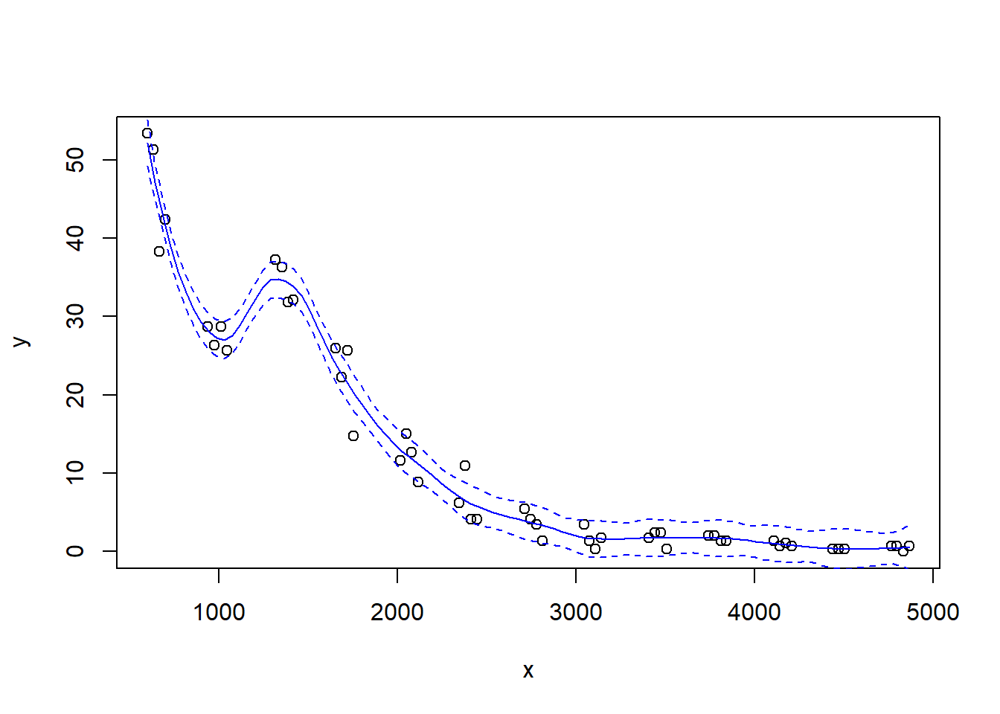
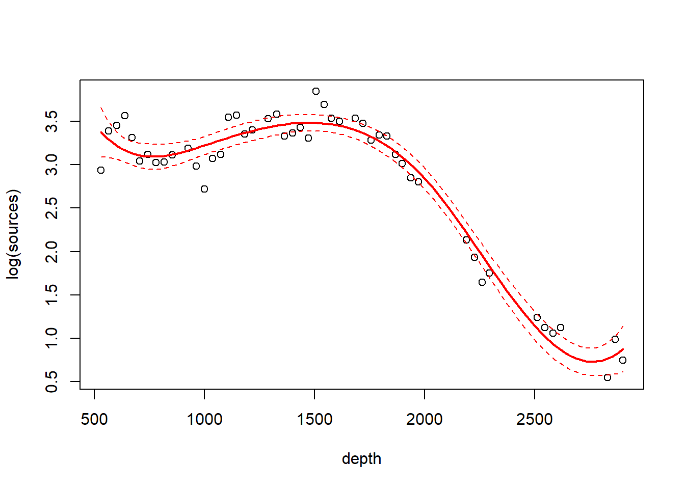
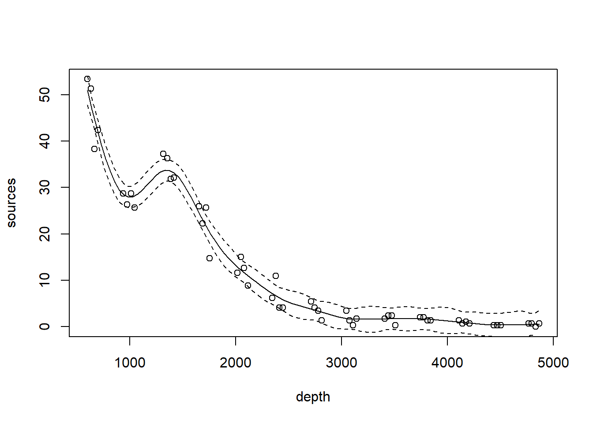

# Smooth regression


## Lo(w)ess smoothers

We will illustrate LOESS smoothers with the bioluminescence data found in the ISIT data set.  These data can be found by visiting the webpage for the book ``Mixed Effects Models and Extensions in Ecology with R'' by Zuur et al. (2009).  A link to this webpage appears on the course website.


```r
## download the data from the book's website

isit <- read.table("data/ISIT.txt", head = T)

## extract the data from station 16

st16 <- subset(isit, Station == 16)

## retain just the variables that we want, and rename

st16 <- st16[, c("SampleDepth", "Sources")]
names(st16) <- c("depth", "sources")
with(st16, plot(sources ~ depth))
```


Fit a loess smoother using the factory settings:


```r
st16.lo <- loess(sources ~ depth, data = st16)
summary(st16.lo)
```

```
## Call:
## loess(formula = sources ~ depth, data = st16)
## 
## Number of Observations: 51 
## Equivalent Number of Parameters: 4.33 
## Residual Standard Error: 4.18 
## Trace of smoother matrix: 4.73  (exact)
## 
## Control settings:
##   span     :  0.75 
##   degree   :  2 
##   family   :  gaussian
##   surface  :  interpolate	  cell = 0.2
##   normalize:  TRUE
##  parametric:  FALSE
## drop.square:  FALSE
```

Plot the fit, this takes a little work

```r
depth.vals <- with(st16, seq(from   = min(depth), 
                             to     = max(depth), 
                             length = 100))

st16.fit <- predict(object  = st16.lo,
                    newdata = depth.vals,
                    se      = TRUE)

with(st16, plot(sources ~ depth))
lines(x = depth.vals, y = st16.fit$fit, col = "blue")

# add 95% error bars
lines(x   = depth.vals, 
      y   = st16.fit$fit + st16.fit$se.fit * qt(p = .975, df = st16.fit$df),
      col = "blue",
      lty = "dashed")

lines(x   = depth.vals, 
      y   = st16.fit$fit - st16.fit$se.fit * qt(p = .975, df = st16.fit$df),
      col = "blue",
      lty = "dashed")
```


Examine the residuals:

```r
## see what the fit returns; maybe the residuals are already there

names(st16.lo)  # they are!
```

```
##  [1] "n"         "fitted"    "residuals" "enp"       "s"         "one.delta"
##  [7] "two.delta" "trace.hat" "divisor"   "robust"    "pars"      "kd"       
## [13] "call"      "terms"     "xnames"    "x"         "y"         "weights"
```

```r
plot(st16.lo$residuals ~ st16$depth)
abline(h = 0, lty = "dotted")
```


Let's look at how changing the span changes the fit.  We'll write a custom function to fit a LOESS curve, and then call the function with various values for the span.


```r
PlotLoessFit <- function(x, y, return.fit = FALSE, ...){
  
  # Caluclates a loess fit with the 'loess' function, and makes a plot
  #
  # Args:
  #   x: predictor
  #   y: response
  #   return.fit: logical
  #   ...: Optional arguments to loess
  #
  # Returns:
  #   the loess fit
  
  my.lo <- loess(y ~ x, ...)
  
  x.vals <- seq(from = min(x), to = max(x), length = 100)
  
  my.fit <- predict(object  = my.lo,
                    newdata = x.vals,
                    se      = TRUE)
  
  plot(x, y)
  lines(x = x.vals, y = my.fit$fit, col = "blue")
  
  lines(x   = x.vals, 
        y   = my.fit$fit + my.fit$se.fit * qt(p = .975, df = my.fit$df),
        col = "blue",
        lty = "dashed")
  
  lines(x   = x.vals, 
        y   = my.fit$fit - my.fit$se.fit * qt(p = .975, df = my.fit$df),
        col = "blue",
        lty = "dashed")
  
  if (return.fit) {
    return(my.lo)
  }
}
```

Now we'll call the function several times, each time chanigng the value of the `span` argument to the `loess` function:


```r
PlotLoessFit(x = st16$depth, y = st16$sources, span = 0.5)
```


```r
PlotLoessFit(x = st16$depth, y = st16$sources, span = 0.25)
```



```r
PlotLoessFit(x = st16$depth, y = st16$sources, span = 0.1)
```


Let's try a loess fit with a locally linear regression:


```r
PlotLoessFit(x = st16$depth, y = st16$sources, span = 0.25, degree = 1)
```


## Splines

We'll use the `gam` function in the `mgcv` package to fit splines and additive models.  The name of the package is an acronym for "Mixed GAM Computation Vehicle".  GAM is an acronym for Generalized Additive Model.  **Warning**.  I do not understand much of the functionality of `mgcv::gam`.  What follows is my best guess of how the procedure works.

The code below fits a regression spline to the bioluminescence data.  Actually, the code fits an additive model with the spline as the only predictor. We will say more about additive models later.  For now, it is sufficient to think about an additive model as a type of regression in which the linear effect of the predictor has been replaced by a spline.  In other words, in terms of a word equation, the model can be represented as
$$
\mbox{response = intercept + spline + error}
$$

The `s()` component of the model formula designates a spline, and specifies details about the particular type of spline to be fit.  The `fx = TRUE` component of the formula indicates that the amount of smoothing is fixed.  The default value for the `fx` argument is `fx = FALSE`, in which case the amount of smoothing is determined by (generalized) cross-validation.  When `fx = TRUE`, the parameter `k` determines the dimensionality (degree of flexibility) of the spline.  Larger values of `k` correspond to greater flexibility, and a less smooth fit.  I think that the number of knots is $k-4$, such that setting $k=4$ fits a familiar cubic polynomial with no knots.  Setting $k=5$ then fits a regression spline with one knot, etc.  I have not been able to figure out where the knots are placed.

In any case, we'll fit a regression spline with two knots:


```r
library(mgcv)
```

```
## Loading required package: nlme
```

```
## This is mgcv 1.8-35. For overview type 'help("mgcv-package")'.
```

```r
st16.rspline <- mgcv::gam(sources ~ s(depth, k = 6, fx = TRUE), data = st16)
plot(st16.rspline, se = TRUE)
```


Note that the plot includes only the portion of the model attributable to the covariate effect.  This is because we have actually fit an additive model (e.g., a GAM).  

The plot shows only the spline component, which thus does not include the intercept. To visualize the fit, we'll need to do a bit more work.

```r
with(st16, plot(sources ~ depth))  

st16.fit <- predict(st16.rspline, 
                    newdata = data.frame(depth = depth.vals), 
                    se      = TRUE)

lines(x = depth.vals, y = st16.fit$fit)

## add +/- 2 SE following Zuur; this is only approximate.
## should probably use a critical value from a t-dist with n - edf df, that is, 51 - 5 = 46 df

lines(x = depth.vals, y = st16.fit$fit + 2 * st16.fit$se.fit, lty = "dashed")
lines(x = depth.vals, y = st16.fit$fit - 2 * st16.fit$se.fit, lty = "dashed")
```



We see that this particular fit is not flexible enough to capture the trend in luminescence at low depth.

Let's take a look at the information produced by a call to `summary`:


```r
summary(st16.rspline)
```

```
## 
## Family: gaussian 
## Link function: identity 
## 
## Formula:
## sources ~ s(depth, k = 6, fx = TRUE)
## 
## Parametric coefficients:
##             Estimate Std. Error t value Pr(>|t|)    
## (Intercept)  12.4771     0.5858    21.3   <2e-16 ***
## ---
## Signif. codes:  0 '***' 0.001 '**' 0.01 '*' 0.05 '.' 0.1 ' ' 1
## 
## Approximate significance of smooth terms:
##          edf Ref.df     F p-value    
## s(depth)   5      5 122.6  <2e-16 ***
## ---
## Signif. codes:  0 '***' 0.001 '**' 0.01 '*' 0.05 '.' 0.1 ' ' 1
## 
## R-sq.(adj) =  0.924   Deviance explained = 93.2%
## GCV = 19.837  Scale est. = 17.503    n = 51
```

This summary requires a bit more explanation as well.  In this GAM, the spline component of the model effectively creates a set of new predictor variables.  A regression spline with $x$ knots requires $x+3$ new regression predictors to fit the spline.  In this fit, there are two knots, so the spline requires 5 new predictor variables. Because the predictors are determined in advance with regression splines, we can use the usual theory of $F$-tests from regression to assess the statistical significance of the spline terms.  In the section of the output labeled "Approximate significance of smooth terms", we see that these 5 predictors together provide a significantly better fit than a model that does not include the spline.  I believe this test is actually exact.  I think that it is labeled "approximate" because the default behavior of `mgcv::gam` is to fit a smoothing spline, for which the test is indeed only approximate.  We'll discuss this more when we study a smoothing spline fit.

Now we'll fit and plot a smoothing spline.  A smoothing spline differs from a regression spline by using generalized cross-validation to determine the appropriate smoothness.

```r
st16.spline <- mgcv::gam(sources ~ s(depth), data = st16)
plot(st16.spline, se = TRUE)  # note that the plot does not include the intercept
```


Again, we make a plot that includes both the points and the fit


```r
with(st16, plot(sources ~ depth))  

st16.fit <- predict(st16.spline, 
                    newdata = data.frame(depth = depth.vals), 
                    se      = TRUE)

lines(x = depth.vals, y = st16.fit$fit)

## add +/- 2 SE following Zuur; this is only approximate.
## should probably use a critical value from a t-dist with n - edf df, that is, 51 - 9.81 = 41.19 df

lines(x = depth.vals, y = st16.fit$fit + 2 * st16.fit$se.fit, lty = "dashed")
lines(x = depth.vals, y = st16.fit$fit - 2 * st16.fit$se.fit, lty = "dashed")
```



Let's ask for a summary:

```r
summary(st16.spline)
```

```
## 
## Family: gaussian 
## Link function: identity 
## 
## Formula:
## sources ~ s(depth)
## 
## Parametric coefficients:
##             Estimate Std. Error t value Pr(>|t|)    
## (Intercept)  12.4771     0.3921   31.82   <2e-16 ***
## ---
## Signif. codes:  0 '***' 0.001 '**' 0.01 '*' 0.05 '.' 0.1 ' ' 1
## 
## Approximate significance of smooth terms:
##            edf Ref.df     F p-value    
## s(depth) 8.813   8.99 158.2  <2e-16 ***
## ---
## Signif. codes:  0 '***' 0.001 '**' 0.01 '*' 0.05 '.' 0.1 ' ' 1
## 
## R-sq.(adj) =  0.966   Deviance explained = 97.2%
## GCV = 9.7081  Scale est. = 7.8402    n = 51
```

Note especially the `edf` component in the "Approximate significance of smooth terms" section.  The label `edf` stands for effective degrees of freedom.  We can think of the edf as the effective number of new predictors that have been added to the model to accommodate the spline.  For a smoothing spline, the number and values of the newly created predictors are determined by fitting the model to the data.  Because the predictors are calculated in this way, the usual theory of $F$-testing does not apply.  This is why the $F$-test shown for the smoothing spline is labeled as "approximate".  

Find the AIC for the smoothing spline fit:


```r
AIC(st16.spline)
```

```
## [1] 260.4811
```
Here's a small detail.  Notice that the syntax of the call to `predict` is slightly different when making a prediction for a `loess`  object vs.\ making a prediction for a `gam` object (which the spline fit is).  For a call to `predict` with a `loess` object, the new predictor values can be provided in the form of a vector.  So, we were able to use

```r
depth.vals <- with(st16, seq(from   = min(depth), 
                             to     = max(depth), 
                             length = 100))

st16.fit <- predict(object  = st16.lo,
                    newdata = depth.vals,
                    se      = TRUE)
```

However, for a call to `predict` with a `gam` object, the new predictor values must be provided in the form of a new data frame, with variable names that match the variables in the `gam` model.  So, to get predicted values for the spline fit, we needed to use the more cumbersome


```r
depth.vals <- with(st16, seq(from   = min(depth), 
                             to     = max(depth), 
                             length = 100))

st16.fit <- predict(st16.spline, 
                    newdata = data.frame(depth = depth.vals), 
                    se      = TRUE)
```

## Additive models
