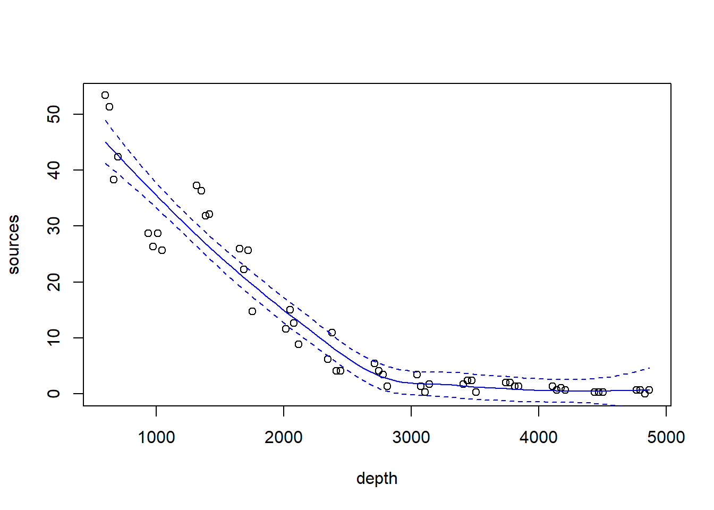
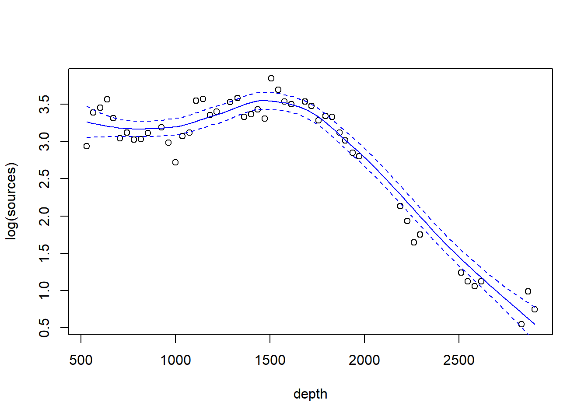
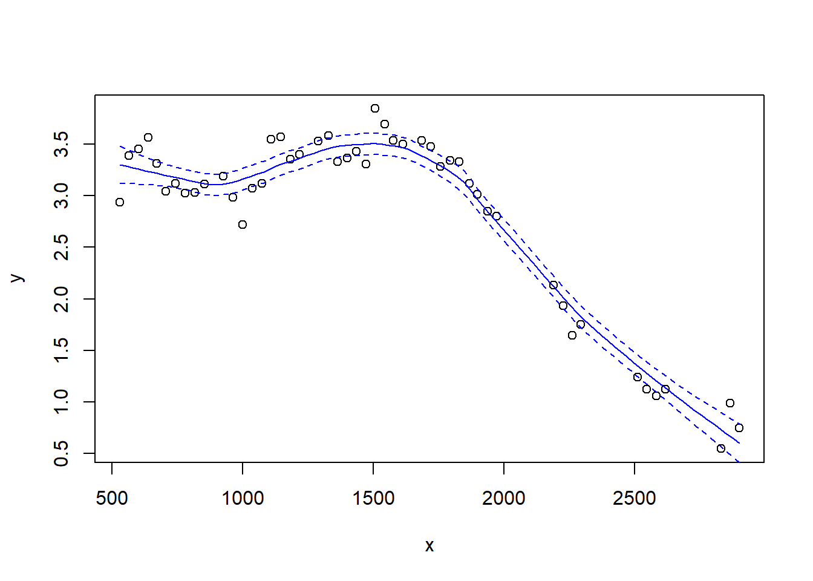

# Smooth regression


## Lo(w)ess smoothers

We will illustrate LOESS smoothers with the bioluminescence data found in the ISIT data set.  These data can be found by visiting the webpage for the book ``Mixed Effects Models and Extensions in Ecology with R'' by Zuur et al. (2009).  A link to this webpage appears on the course website.


```r
## download the data from the book's website

isit <- read.table("data/ISIT.txt", head = T)

## extract the data from station 16

st16 <- subset(isit, Station == 16)

## retain just the variables that we want, and rename

st16 <- st16[, c("SampleDepth", "Sources")]
names(st16) <- c("depth", "sources")
with(st16, plot(sources ~ depth))
```


Fit a loess smoother using the factory settings:


```r
st16.lo <- loess(sources ~ depth, data = st16)
summary(st16.lo)
```

```
## Call:
## loess(formula = sources ~ depth, data = st16)
## 
## Number of Observations: 51 
## Equivalent Number of Parameters: 4.33 
## Residual Standard Error: 4.18 
## Trace of smoother matrix: 4.73  (exact)
## 
## Control settings:
##   span     :  0.75 
##   degree   :  2 
##   family   :  gaussian
##   surface  :  interpolate	  cell = 0.2
##   normalize:  TRUE
##  parametric:  FALSE
## drop.square:  FALSE
```

Plot the fit, this takes a little work

```r
depth.vals <- with(st16, seq(from   = min(depth), 
                             to     = max(depth), 
                             length = 100))

st16.fit <- predict(object  = st16.lo,
                    newdata = depth.vals,
                    se      = TRUE)

with(st16, plot(sources ~ depth))
lines(x = depth.vals, y = st16.fit$fit, col = "blue")

# add 95% error bars
lines(x   = depth.vals, 
      y   = st16.fit$fit + st16.fit$se.fit * qt(p = .975, df = st16.fit$df),
      col = "blue",
      lty = "dashed")

lines(x   = depth.vals, 
      y   = st16.fit$fit - st16.fit$se.fit * qt(p = .975, df = st16.fit$df),
      col = "blue",
      lty = "dashed")
```



Examine the residuals:

```r
## see what the fit returns; maybe the residuals are already there

names(st16.lo)  # they are!
```

```
##  [1] "n"         "fitted"    "residuals" "enp"       "s"         "one.delta"
##  [7] "two.delta" "trace.hat" "divisor"   "robust"    "pars"      "kd"       
## [13] "call"      "terms"     "xnames"    "x"         "y"         "weights"
```

```r
plot(st16.lo$residuals ~ st16$depth)
abline(h = 0, lty = "dotted")
```



Let's look at how changing the span changes the fit.  We'll write a custom function to fit a LOESS curve, and then call the function with various values for the span.


```r
PlotLoessFit <- function(x, y, return.fit = FALSE, ...){
  
  # Caluclates a loess fit with the 'loess' function, and makes a plot
  #
  # Args:
  #   x: predictor
  #   y: response
  #   return.fit: logical
  #   ...: Optional arguments to loess
  #
  # Returns:
  #   the loess fit
  
  my.lo <- loess(y ~ x, ...)
  
  x.vals <- seq(from = min(x), to = max(x), length = 100)
  
  my.fit <- predict(object  = my.lo,
                    newdata = x.vals,
                    se      = TRUE)
  
  plot(x, y)
  lines(x = x.vals, y = my.fit$fit, col = "blue")
  
  lines(x   = x.vals, 
        y   = my.fit$fit + my.fit$se.fit * qt(p = .975, df = my.fit$df),
        col = "blue",
        lty = "dashed")
  
  lines(x   = x.vals, 
        y   = my.fit$fit - my.fit$se.fit * qt(p = .975, df = my.fit$df),
        col = "blue",
        lty = "dashed")
  
  if (return.fit) {
    return(my.lo)
  }
}
```

Now we'll call the function several times, each time chanigng the value of the `span` argument to the `loess` function:


```r
PlotLoessFit(x = st16$depth, y = st16$sources, span = 0.5)
```


```r
PlotLoessFit(x = st16$depth, y = st16$sources, span = 0.25)
```


```r
PlotLoessFit(x = st16$depth, y = st16$sources, span = 0.1)
```


Let's try a loess fit with a locally linear regression:


```r
PlotLoessFit(x = st16$depth, y = st16$sources, span = 0.25, degree = 1)
```


## Splines

We'll first fit and plot a smoothing spline.

```r
library(mgcv)
```

```
## Loading required package: nlme
```

```
## This is mgcv 1.8-35. For overview type 'help("mgcv-package")'.
```

```r
st16.spline <- gam(sources ~ s(depth), data = st16)
plot(st16.spline, se = TRUE)  # note that the plot does not include the intercept
```



Note that the plot includes only the portion of the model attributable to the covariate effect.  By definition, the fit has effectively subtracted out the mean.  Let's take a look at the information produced by a call to `summary`:


```r
summary(st16.spline)
```

```
## 
## Family: gaussian 
## Link function: identity 
## 
## Formula:
## sources ~ s(depth)
## 
## Parametric coefficients:
##             Estimate Std. Error t value Pr(>|t|)    
## (Intercept)  12.4771     0.3921   31.82   <2e-16 ***
## ---
## Signif. codes:  0 '***' 0.001 '**' 0.01 '*' 0.05 '.' 0.1 ' ' 1
## 
## Approximate significance of smooth terms:
##            edf Ref.df     F p-value    
## s(depth) 8.813   8.99 158.2  <2e-16 ***
## ---
## Signif. codes:  0 '***' 0.001 '**' 0.01 '*' 0.05 '.' 0.1 ' ' 1
## 
## R-sq.(adj) =  0.966   Deviance explained = 97.2%
## GCV = 9.7081  Scale est. = 7.8402    n = 51
```
Make a plot that includes both the points and the fit


```r
with(st16, plot(sources ~ depth))  

st16.fit <- predict(st16.spline, 
                    newdata = data.frame(depth = depth.vals), 
                    se      = TRUE)

lines(x = depth.vals, y = st16.fit$fit)

## add +/- 2 SE following Zuur; this is only approximate.
## should probably use a critical value from a t-dist with n - edf df, that is, 51 - 9.81 = 41.19 df

lines(x = depth.vals, y = st16.fit$fit + 2 * st16.fit$se.fit, lty = "dashed")
lines(x = depth.vals, y = st16.fit$fit - 2 * st16.fit$se.fit, lty = "dashed")
```


Find the AIC for the smoothing spline fit:


```r
AIC(st16.spline)
```

```
## [1] 260.4811
```
Here's a small detail.  Notice that the syntax of the call to `predict` is slightly different when making a prediction for a `loess`  object vs.\ making a prediction for a `gam` object (which the spline fit is).  For a call to `predict` with a `loess` object, the new predictor values can be provided in the form of a vector.  So, we were able to use

```r
depth.vals <- with(st16, seq(from   = min(depth), 
                             to     = max(depth), 
                             length = 100))

st16.fit <- predict(object  = st16.lo,
                    newdata = depth.vals,
                    se      = TRUE)
```

However, for a call to `predict` with a `gam` object, the new predictor values must be provided in the form of a new data frame, with variable names that match the variables in the `gam` model.  So, to get predicted values for the spline fit, we needed to use the more cumbersome


```r
depth.vals <- with(st16, seq(from   = min(depth), 
                             to     = max(depth), 
                             length = 100))

st16.fit <- predict(st16.spline, 
                    newdata = data.frame(depth = depth.vals), 
                    se      = TRUE)
```

## Additive models
