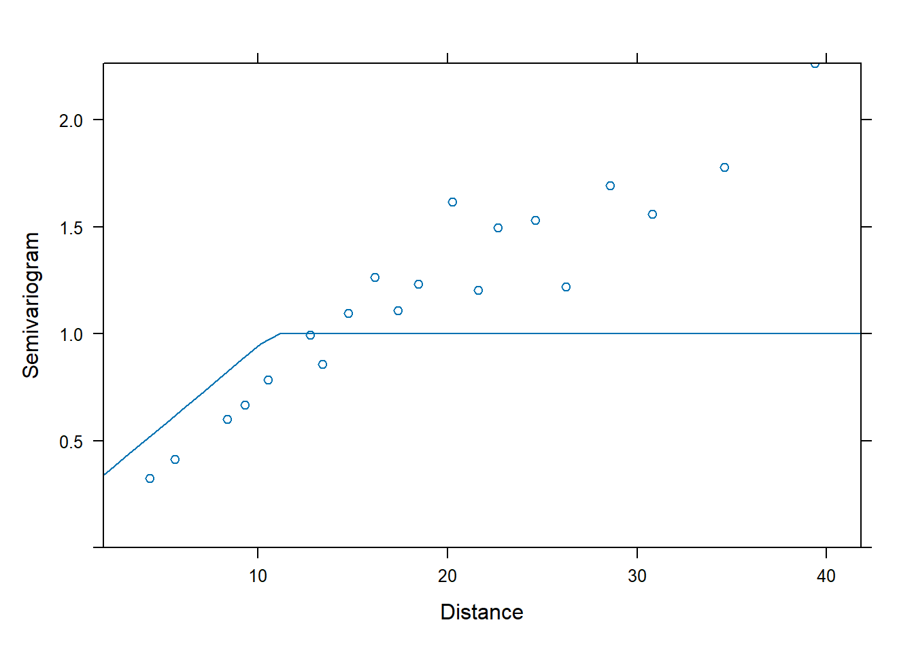

# Generalized Least Squares


## Heterogeneous variance

We will illustrate generalized least squares (GLS) using a data set that gives the percentage of male births for four countries (Canada, Denmark, the Netherlands, and the US) for several decades in the late twentieth century.  The data were originally reported in Davis et al., JAMA 279:1018--1023 (1998).  The data set that we will work with was scraped from this publication by Ramsey and Schafer for their book "The Statistical Sleuth" (2e, 2002).  The data can be found as the data set 'ex0726' in the r library 'sleuth2'.  We will begin by reading the data and performing some housekeeping.


``` r
#--------------------
# Ex 07.26 from the Statistical Sleuth, 2e
#--------------------

library(Sleuth2)

str(ex0726)
```

```
## 'data.frame':	45 obs. of  5 variables:
##  $ Year       : num  1950 1951 1952 1953 1954 ...
##  $ Denmark    : num  0.512 0.517 0.515 0.517 0.515 ...
##  $ Netherlands: num  0.516 0.516 0.516 0.516 0.516 ...
##  $ Canada     : num  NaN NaN NaN NaN NaN NaN NaN NaN NaN NaN ...
##  $ Usa        : num  NaN NaN NaN NaN NaN NaN NaN NaN NaN NaN ...
```

``` r
births <- ex0726

require(reshape2)
```

```
## Loading required package: reshape2
```

``` r
names(births) <- c("year", "DK", "NL", "CA", "US")
births.melt <- melt(births, id.vars = c("year"))

births <- births.melt
rm(births.melt)

names(births) <- c("year", "country", "pct.male")

births$pct.male <- 100 * births$pct.male
```

We will focus only on the years 1970 -- 1990, for which data are available for all countries:

``` r
births <- subset(births, year >= 1970 & year <= 1990)
summary(births)
```

```
##       year      country    pct.male    
##  Min.   :1970   DK:21   Min.   :50.87  
##  1st Qu.:1975   NL:21   1st Qu.:51.22  
##  Median :1980   CA:21   Median :51.28  
##  Mean   :1980   US:21   Mean   :51.30  
##  3rd Qu.:1985           3rd Qu.:51.38  
##  Max.   :1990           Max.   :51.73
```

``` r
head(births)
```

```
##    year country pct.male
## 21 1970      DK    51.40
## 22 1971      DK    51.70
## 23 1972      DK    51.26
## 24 1973      DK    51.33
## 25 1974      DK    51.27
## 26 1975      DK    51.08
```
Let's have a look at the time trends in percentage male births in each of the four countries:


``` r
  par(mfrow = c(2, 2), las = 1)

  with(births, plot(pct.male ~ year, type = "n", ylab = "percent male", main = "Canada"))
  with(subset(births, country == "CA"), points(pct.male ~ year))

  with(births, plot(pct.male ~ year, type = "n", ylab = "percent male", main = "USA"))
  with(subset(births, country == "US"), points(pct.male ~ year))
  
  with(births, plot(pct.male ~ year, type = "n", ylab = "percent male", main = "Denmark"))
  with(subset(births, country == "DK"), points(pct.male ~ year))
  
  with(births, plot(pct.male ~ year, type = "n", ylab = "percent male", main = "Netherlands"))
  with(subset(births, country == "NL"), points(pct.male ~ year))
```


For these data, we might want to ask: Is there evidence that the percentage of male births is changing through time?  If so, does the rate of change differ among countries? Among continents?

These are the types of questions that we would usually address with a regression model.  However, there's a lot going on with these data that would cause us to question the appropriateness of the usual ordinary least squares (OLS) assumptions.  

  1.  The responses are proportions.  We know that when the response is a proportion, the variance in the response depends on the mean, with the variance decreasing as the mean approaches 0\% or 100\%, and obtaining its maximal value when the mean response is at 50\%.  For these data, however, all of the responses are sufficiently close to 50\% that we don't need to worry about heterogeneous variances that arise from the proportional nature of the response.
  
  2. The variance of the response also depends inversely on the number of births.  Evidently, this will be a major issue, because these countries differ substantially in the sizes of their populations.  If we knew the number of births in each country in each year (in other words, if we knew the denominator of the each data point), then could account for these differences using grouped logistic regression.  However, the data as we have them do not contain any information about the number of births that underlie each data point.  So, we will need a different approach to deal with the heterogeneous variances among countries.
  
  3. The data are time series.  We will devote our attention to time-series data more fully later in the course.  For now, it suffices to realize that time series data are typically autocorrelated.  In other words, the residual errors for consecutive data points are often correlated (and usually positively correlated), and this correlation typically decays as the time between data points increases.  For these data, it is less clear why the errors might be autocorrelated, but we want to allow for the possibility all the same.

We'll regress the percentage of male births on year and country.  Following @zuur2009's good advice, we'll begin with a model with richly specified fixed effects.   In this case, that means country specific intercepts and slopes.   In an equation, this model is
\begin{equation}
y_{it} = a_i + b_i x_{it} + \varepsilon_{it}
\end{equation}
where $i = 1, \ldots, 4$ is an index that distinguishes among the four countries, and $t = 1, \ldots, 21$ is an index that distinguishes among the 21 years.  The response $y_{it}$ is the percentage of male births in country $i$ in year $t$, $x_{it}$ is the year to which measurement $y_{it}$ corresponds, the $a_i$ are the country-specific intercepts, the $b_i$ are the country-specific slopes, and the $\varepsilon_{it}$'s are the errors. We'll shift the predictor $x_{it}$ so that it gives the number of years before or after 1980, so that the intercepts will give the fitted percentage of male births in the year 1980. (If we set $x_{it}$ to the actual year, then the intercepts would give the percentage of male births extrapolated back to the year 1 BCE, which isn't very useful.) To begin, we make the usual OLS assumption that the errors are iid, that is, $\varepsilon_{it} \sim \mathcal{N}(0, \sigma^2)$.  


``` r
births$yr.ctr <- births$year - 1980
fm1 <- with(births, lm(pct.male ~ yr.ctr * country))
summary(fm1)
```

```
## 
## Call:
## lm(formula = pct.male ~ yr.ctr * country)
## 
## Residuals:
##      Min       1Q   Median       3Q      Max 
## -0.30707 -0.05931  0.00100  0.04787  0.35314 
## 
## Coefficients:
##                    Estimate Std. Error  t value Pr(>|t|)    
## (Intercept)      51.3709524  0.0275387 1865.408  < 2e-16 ***
## yr.ctr            0.0008442  0.0045479    0.186  0.85324    
## countryNL        -0.1547619  0.0389456   -3.974  0.00016 ***
## countryCA        -0.0038095  0.0389456   -0.098  0.92234    
## countryUS        -0.1109524  0.0389456   -2.849  0.00564 ** 
## yr.ctr:countryNL -0.0073636  0.0064317   -1.145  0.25584    
## yr.ctr:countryCA -0.0119610  0.0064317   -1.860  0.06680 .  
## yr.ctr:countryUS -0.0062727  0.0064317   -0.975  0.33251    
## ---
## Signif. codes:  0 '***' 0.001 '**' 0.01 '*' 0.05 '.' 0.1 ' ' 1
## 
## Residual standard error: 0.1262 on 76 degrees of freedom
## Multiple R-squared:  0.3052,	Adjusted R-squared:  0.2412 
## F-statistic: 4.768 on 7 and 76 DF,  p-value: 0.0001753
```
Let's plot the percentage of male births vs. year for each country, and overlay the fit of regression lines.  To make it easy to extract the country-specific slopes and intercepts, we'll first re-fit the model without the global intercept:

``` r
fm1a <- with(births, lm(pct.male ~ country + yr.ctr:country- 1))
summary(fm1a)
```

```
## 
## Call:
## lm(formula = pct.male ~ country + yr.ctr:country - 1)
## 
## Residuals:
##      Min       1Q   Median       3Q      Max 
## -0.30707 -0.05931  0.00100  0.04787  0.35314 
## 
## Coefficients:
##                    Estimate Std. Error  t value Pr(>|t|)    
## countryDK        51.3709524  0.0275387 1865.408   <2e-16 ***
## countryNL        51.2161905  0.0275387 1859.788   <2e-16 ***
## countryCA        51.3671429  0.0275387 1865.270   <2e-16 ***
## countryUS        51.2600000  0.0275387 1861.379   <2e-16 ***
## countryDK:yr.ctr  0.0008442  0.0045479    0.186   0.8532    
## countryNL:yr.ctr -0.0065195  0.0045479   -1.434   0.1558    
## countryCA:yr.ctr -0.0111169  0.0045479   -2.444   0.0168 *  
## countryUS:yr.ctr -0.0054286  0.0045479   -1.194   0.2363    
## ---
## Signif. codes:  0 '***' 0.001 '**' 0.01 '*' 0.05 '.' 0.1 ' ' 1
## 
## Residual standard error: 0.1262 on 76 degrees of freedom
## Multiple R-squared:      1,	Adjusted R-squared:      1 
## F-statistic: 1.735e+06 on 8 and 76 DF,  p-value: < 2.2e-16
```

There's probably a more elegant way to extract the slope and intercept, but we'll use the crude approach for now.

``` r
  par(mfrow = c(2, 2), las = 1)

  with(births, plot(pct.male ~ year, type = "n", ylab = "percent male", main = "Canada"))
  with(subset(births, country == "CA"), points(pct.male ~ year))
  
  abline(a = 51.3671 - (-0.01112 * 1980), b = -0.01112)

  with(births, plot(pct.male ~ year, type = "n", ylab = "percent male", main = "USA"))
  with(subset(births, country == "US"), points(pct.male ~ year))
  
  abline(a = 51.26 - (-0.0054286 * 1980), b = -0.0054286)
  
  with(births, plot(pct.male ~ year, type = "n", ylab = "percent male", main = "Denmark"))
  with(subset(births, country == "DK"), points(pct.male ~ year))
  
  abline(a = 51.3709 - (0.0008442 * 1980), b = 0.0008442)
  
  with(births, plot(pct.male ~ year, type = "n", ylab = "percent male", main = "Netherlands"))
  with(subset(births, country == "NL"), points(pct.male ~ year))
  
  abline(a = 51.2162 - (-0.00652 * 1980), b = -0.0065195)
```


We would like to draw inferences about the time and country effects.  However, the error variance clearly differs among the countries, because of the different sizes of the countries' populations. Thus, we can't trust the usual inference procedures that assume iid errors.  

We will cope by fitting a GLS model that allows the error variances to differ among the countries.  The model equation is nearly the same as above:
\begin{equation}
y_{it} = a_i + b_i x_{it} + \varepsilon_{it}.
\end{equation}
The only difference is that now we assume that the variance of the errors differs among the countries: $\varepsilon_{it} \sim \mathcal{N}(0, \sigma^2_i)$.  This change looks trivial in the notation, but it's an important change to the model!


``` r
require(nlme)
```

```
## Loading required package: nlme
```

``` r
gls1 <- gls(pct.male ~ yr.ctr * country, data = births, weights = varIdent(form = ~ 1 | country))
summary(gls1)
```

```
## Generalized least squares fit by REML
##   Model: pct.male ~ yr.ctr * country 
##   Data: births 
##         AIC       BIC   logLik
##   -94.69995 -66.73115 59.34998
## 
## Variance function:
##  Structure: Different standard deviations per stratum
##  Formula: ~1 | country 
##  Parameter estimates:
##        DK        NL        CA        US 
## 1.0000000 0.7264997 0.3971728 0.1347962 
## 
## Coefficients:
##                     Value  Std.Error   t-value p-value
## (Intercept)      51.37095 0.04219635 1217.4264  0.0000
## yr.ctr            0.00084 0.00696850    0.1211  0.9039
## countryNL        -0.15476 0.05215650   -2.9673  0.0040
## countryCA        -0.00381 0.04540269   -0.0839  0.9334
## countryUS        -0.11095 0.04257798   -2.6059  0.0110
## yr.ctr:countryNL -0.00736 0.00861336   -0.8549  0.3953
## yr.ctr:countryCA -0.01196 0.00749801   -1.5952  0.1148
## yr.ctr:countryUS -0.00627 0.00703152   -0.8921  0.3752
## 
##  Correlation: 
##                  (Intr) yr.ctr cntrNL cntrCA cntrUS yr.:NL yr.:CA
## yr.ctr            0.000                                          
## countryNL        -0.809  0.000                                   
## countryCA        -0.929  0.000  0.752                            
## countryUS        -0.991  0.000  0.802  0.921                     
## yr.ctr:countryNL  0.000 -0.809  0.000  0.000  0.000              
## yr.ctr:countryCA  0.000 -0.929  0.000  0.000  0.000  0.752       
## yr.ctr:countryUS  0.000 -0.991  0.000  0.000  0.000  0.802  0.921
## 
## Standardized residuals:
##         Min          Q1         Med          Q3         Max 
## -2.18586069 -0.69331440 -0.01165266  0.66706364  1.82625135 
## 
## Residual standard error: 0.193368 
## Degrees of freedom: 84 total; 76 residual
```
The `summary` doesn't provide the residual variances for each country directly. Instead, in the portion of the summary labeled "Variance function", we find the estimated ratio of the residual standard deviation for each country to the residual standard deviation for the reference country, Denmark.  Thus, for example, the residual standard deviation for the Netherlands is $0.726$ times the residual standard deviation for Denmark, and so on. 

<!-- Note that, remarkably, there is a discrepancy between the help documentation for varIdent and Pinheiro and Bates.  PB say the parameters are the ratios of the SDs, the help documentation says the parameters are the ratios of the variances. -->

We would like to ask if model with country-specific variances provides a statistically significant improvement in fit relative to the model with homogeneous error variances.  Here, it is crucial to remember that the default fitting scheme in `nlme::gls` is REML.  However, because the models share the same fixed-effect structure, we can compare AIC values from the REML fits directly.  Further, because the modes are nested, we can use the REML fits for a likelihood ratio test.  The `anova.gls` command provides both.

``` r
gls0 <- gls(pct.male ~ yr.ctr * country, data = births)  # OLS fit
anova(gls0, gls1)
```

```
##      Model df       AIC       BIC   logLik   Test  L.Ratio p-value
## gls0     1  9 -42.18264 -21.20604 30.09132                        
## gls1     2 12 -94.69995 -66.73115 59.34998 1 vs 2 58.51731  <.0001
```

Both the LRT and the AIC suggest that the GLS model with country-specific variances provides a statistically significant improvement over the OLS model with homogeneous error variances.

If the fixed-effect structures had not been the same, it would not have been correct to compare the models using the REML fits.  Instead, we would have to re-fit the models using ML.  For the sake of illustration, let's do this anyway, and see if and how the results differ.


``` r
gls0ML <- gls(pct.male ~ yr.ctr * country, data = births, method = "ML")
gls1ML <- gls(pct.male ~ yr.ctr * country, data = births, 
               weights = varIdent(form = ~ 1 | country), method = "ML")
anova(gls0ML, gls1ML)
```

```
##        Model df        AIC        BIC   logLik   Test  L.Ratio p-value
## gls0ML     1  9  -99.76871  -77.89136 58.88435                        
## gls1ML     2 12 -158.44573 -129.27593 91.22287 1 vs 2 64.67702  <.0001
```

We obtain somewhat different numerical results based on the ML fit, even though the qualitative outcome of the test is unchanged (the model with country-specific variances is still strongly favored).  

In any event, we can also compare the variance estimates from the ML fit to those from the REML fit.


``` r
summary(gls1ML)
```

```
## Generalized least squares fit by maximum likelihood
##   Model: pct.male ~ yr.ctr * country 
##   Data: births 
##         AIC       BIC   logLik
##   -158.4457 -129.2759 91.22287
## 
## Variance function:
##  Structure: Different standard deviations per stratum
##  Formula: ~1 | country 
##  Parameter estimates:
##        DK        NL        CA        US 
## 1.0000000 0.7264997 0.3971729 0.1347962 
## 
## Coefficients:
##                     Value  Std.Error   t-value p-value
## (Intercept)      51.37095 0.04219635 1217.4265  0.0000
## yr.ctr            0.00084 0.00696850    0.1211  0.9039
## countryNL        -0.15476 0.05215650   -2.9673  0.0040
## countryCA        -0.00381 0.04540269   -0.0839  0.9334
## countryUS        -0.11095 0.04257798   -2.6059  0.0110
## yr.ctr:countryNL -0.00736 0.00861336   -0.8549  0.3953
## yr.ctr:countryCA -0.01196 0.00749801   -1.5952  0.1148
## yr.ctr:countryUS -0.00627 0.00703152   -0.8921  0.3752
## 
##  Correlation: 
##                  (Intr) yr.ctr cntrNL cntrCA cntrUS yr.:NL yr.:CA
## yr.ctr            0.000                                          
## countryNL        -0.809  0.000                                   
## countryCA        -0.929  0.000  0.752                            
## countryUS        -0.991  0.000  0.802  0.921                     
## yr.ctr:countryNL  0.000 -0.809  0.000  0.000  0.000              
## yr.ctr:countryCA  0.000 -0.929  0.000  0.000  0.000  0.752       
## yr.ctr:countryUS  0.000 -0.991  0.000  0.000  0.000  0.802  0.921
## 
## Standardized residuals:
##         Min          Q1         Med          Q3         Max 
## -2.29802807 -0.72889177 -0.01225061  0.70129397  1.91996548 
## 
## Residual standard error: 0.1839296 
## Degrees of freedom: 84 total; 76 residual
```

Note that the estimate of the residual standard deviation (mislabeled as the "residual standard error" in the R output) is smaller for the ML fit than for the REML fit, as we expect.

To continue, we can also fit a first-order autoregressive correlation structure to the residual errors within each country.  Here, because the data are evenly spaced and are already sorted in the data set, it's simple to add the within country autocorrelation.  To write this model as an equation, the fixed-effect specification remains unchanged:
\begin{equation}
y_{it} = a_i + b_i x_{it} + \varepsilon_{it}.
\end{equation}
The marginal distribution of the errors is also unchanged: $\varepsilon_{it} \sim \mathcal{N}(0, \sigma^2_i)$.  However, the within-country errors are now correlated:
\begin{equation}
\mathrm{Corr}(\varepsilon_{it_1}, \varepsilon_{jt_2}) = \begin{cases} \rho^{|t_1 - t_2|} & i = j \\ 0 & i \neq j \end{cases}
\end{equation}


``` r
gls2 <- gls(pct.male ~ yr.ctr * country, data = births, weights = varIdent(form = ~ 1 | country),
                                                        correlation = corAR1(form = ~ 1 | country))
summary(gls2)
```

```
## Generalized least squares fit by REML
##   Model: pct.male ~ yr.ctr * country 
##   Data: births 
##         AIC       BIC   logLik
##   -93.01222 -62.71269 59.50611
## 
## Correlation Structure: AR(1)
##  Formula: ~1 | country 
##  Parameter estimate(s):
##        Phi 
## 0.07081995 
## Variance function:
##  Structure: Different standard deviations per stratum
##  Formula: ~1 | country 
##  Parameter estimates:
##        DK        NL        CA        US 
## 1.0000000 0.7416576 0.4009707 0.1338036 
## 
## Coefficients:
##                     Value  Std.Error   t-value p-value
## (Intercept)      51.37134 0.04520738 1136.3486  0.0000
## yr.ctr            0.00088 0.00741198    0.1187  0.9058
## countryNL        -0.15484 0.05628375   -2.7510  0.0074
## countryCA        -0.00385 0.04870615   -0.0791  0.9371
## countryUS        -0.11127 0.04561027   -2.4396  0.0170
## yr.ctr:countryNL -0.00713 0.00922801   -0.7727  0.4421
## yr.ctr:countryCA -0.01188 0.00798562   -1.4872  0.1411
## yr.ctr:countryUS -0.00634 0.00747803   -0.8481  0.3991
## 
##  Correlation: 
##                  (Intr) yr.ctr cntrNL cntrCA cntrUS yr.:NL yr.:CA
## yr.ctr            0.000                                          
## countryNL        -0.803  0.000                                   
## countryCA        -0.928  0.000  0.746                            
## countryUS        -0.991  0.000  0.796  0.920                     
## yr.ctr:countryNL  0.000 -0.803  0.000  0.000  0.000              
## yr.ctr:countryCA  0.000 -0.928  0.000  0.000  0.000  0.746       
## yr.ctr:countryUS  0.000 -0.991  0.000  0.000  0.000  0.796  0.920
## 
## Standardized residuals:
##         Min          Q1         Med          Q3         Max 
## -2.15117280 -0.70400503 -0.02488281  0.66159776  1.82002897 
## 
## Residual standard error: 0.1936784 
## Degrees of freedom: 84 total; 76 residual
```

The estimate of the within-country correlation is small: only 0.071.  The model with autocorrelated errors is nested within the model with heterogeneous variances, and both have the same fixed-effect structure, so we can compare the two REML fits directly:


``` r
anova(gls0, gls1, gls2)
```

```
##      Model df       AIC       BIC   logLik   Test  L.Ratio p-value
## gls0     1  9 -42.18264 -21.20604 30.09132                        
## gls1     2 12 -94.69995 -66.73115 59.34998 1 vs 2 58.51731  <.0001
## gls2     3 13 -93.01222 -62.71269 59.50611 2 vs 3  0.31227  0.5763
```

By either AIC or the LRT, the model with the autocorrelated errors does not provide a statistically significant improvement in fit. 

We can now use the model with heterogeneous variances and independent errors to conduct the usual inferences on the fixed effects.  Because we now compare models with different fixed-effect structures, we must work on the ML fits.  Let's start with a model that removes the interaction between time and country.  The model is:
\begin{equation}
y_{it} = a_i + b x_{it} + \varepsilon_{it}.
\end{equation}
In other words, there is a common slope among the countries. 


``` r
gls3ML <- gls(pct.male ~ yr.ctr + country, data = births, weights = varIdent(form = ~ 1 | country),
               method = "ML")
summary(gls3ML)
```

```
## Generalized least squares fit by maximum likelihood
##   Model: pct.male ~ yr.ctr + country 
##   Data: births 
##         AIC       BIC  logLik
##   -159.5456 -137.6682 88.7728
## 
## Variance function:
##  Structure: Different standard deviations per stratum
##  Formula: ~1 | country 
##  Parameter estimates:
##        DK        NL        CA        US 
## 1.0000000 0.7098035 0.4232237 0.1323319 
## 
## Coefficients:
##                Value  Std.Error   t-value p-value
## (Intercept) 51.37095 0.04238044 1212.1383  0.0000
## yr.ctr      -0.00585 0.00086365   -6.7731  0.0000
## countryNL   -0.15476 0.05197129   -2.9778  0.0039
## countryCA   -0.00381 0.04601974   -0.0828  0.9342
## countryUS   -0.11095 0.04274991   -2.5954  0.0113
## 
##  Correlation: 
##           (Intr) yr.ctr cntrNL cntrCA
## yr.ctr     0.000                     
## countryNL -0.815  0.000              
## countryCA -0.921  0.000  0.751       
## countryUS -0.991  0.000  0.808  0.913
## 
## Standardized residuals:
##         Min          Q1         Med          Q3         Max 
## -2.32703514 -0.72533260  0.03426803  0.82167128  2.12375963 
## 
## Residual standard error: 0.1883428 
## Degrees of freedom: 84 total; 79 residual
```

``` r
anova(gls3ML, gls1ML)
```

```
##        Model df       AIC       BIC   logLik   Test  L.Ratio p-value
## gls3ML     1  9 -159.5456 -137.6683 88.77280                        
## gls1ML     2 12 -158.4457 -129.2759 91.22287 1 vs 2 4.900132  0.1793
```

Both AIC and the LRT favor a model with a common slope.  Let's go further to see if the intercepts differ among the countries.  In other words, we can entertain the model
\begin{equation}
y_{it} = a + b x_{it} + \varepsilon_{it}.
\end{equation}


``` r
gls4ML <- gls(pct.male ~ yr.ctr, data = births, weights = varIdent(form = ~ 1 | country),
               method = "ML")
summary(gls4ML)
```

```
## Generalized least squares fit by maximum likelihood
##   Model: pct.male ~ yr.ctr 
##   Data: births 
##         AIC       BIC  logLik
##   -136.0564 -121.4715 74.0282
## 
## Variance function:
##  Structure: Different standard deviations per stratum
##  Formula: ~1 | country 
##  Parameter estimates:
##        DK        NL        CA        US 
## 1.0000000 0.6559362 0.6051856 0.1159405 
## 
## Coefficients:
##                Value   Std.Error  t-value p-value
## (Intercept) 51.26375 0.005328997 9619.775       0
## yr.ctr      -0.00558 0.000880055   -6.335       0
## 
##  Correlation: 
##        (Intr)
## yr.ctr 0     
## 
## Standardized residuals:
##        Min         Q1        Med         Q3        Max 
## -2.5381852 -0.3580929  0.1883530  0.9250208  2.3348069 
## 
## Residual standard error: 0.2164103 
## Degrees of freedom: 84 total; 82 residual
```

``` r
anova(gls4ML, gls3ML, gls1ML)
```

```
##        Model df       AIC       BIC   logLik   Test   L.Ratio p-value
## gls4ML     1  6 -136.0564 -121.4715 74.02820                         
## gls3ML     2  9 -159.5456 -137.6683 88.77280 1 vs 2 29.489202  <.0001
## gls1ML     3 12 -158.4457 -129.2759 91.22287 2 vs 3  4.900132  0.1793
```

There is strong evidence that the percentage of male births differs among countries, after accounting for the effect of the temporal trend.

We can visualize the model by making scatterplots and overlaying fitted regression lines.  Having finished with model selection, we'll revert to the REML fits for final parameter estimation.  

``` r
gls3.reml <- gls(pct.male ~ yr.ctr + country, data = births, weights = varIdent(form = ~ 1 | country))
summary(gls3.reml)
```

```
## Generalized least squares fit by REML
##   Model: pct.male ~ yr.ctr + country 
##   Data: births 
##         AIC       BIC   logLik
##   -122.7459 -101.4209 70.37297
## 
## Variance function:
##  Structure: Different standard deviations per stratum
##  Formula: ~1 | country 
##  Parameter estimates:
##        DK        NL        CA        US 
## 1.0000000 0.7099907 0.4237511 0.1352729 
## 
## Coefficients:
##                Value  Std.Error   t-value p-value
## (Intercept) 51.37095 0.04213583 1219.1750  0.0000
## yr.ctr      -0.00586 0.00087529   -6.7004  0.0000
## countryNL   -0.15476 0.05167590   -2.9949  0.0037
## countryCA   -0.00381 0.04576279   -0.0832  0.9339
## countryUS   -0.11095 0.04251960   -2.6094  0.0108
## 
##  Correlation: 
##           (Intr) yr.ctr cntrNL cntrCA
## yr.ctr     0.000                     
## countryNL -0.815  0.000              
## countryCA -0.921  0.000  0.751       
## countryUS -0.991  0.000  0.808  0.912
## 
## Standardized residuals:
##         Min          Q1         Med          Q3         Max 
## -2.26855289 -0.70087717  0.03371643  0.79968077  2.07208997 
## 
## Residual standard error: 0.1930906 
## Degrees of freedom: 84 total; 79 residual
```


``` r
  par(mfrow = c(2, 2), las = 1)

  with(births, plot(pct.male ~ year, type = "n", ylab = "percent male", main = "Canada"))
  with(subset(births, country == "CA"), points(pct.male ~ year))
  
  abline(a = 51.3671 + 0.00586 * 1980, b = -0.00586)

  with(births, plot(pct.male ~ year, type = "n", ylab = "percent male", main = "USA"))
  with(subset(births, country == "US"), points(pct.male ~ year))
  
  abline(a = 51.26 + 0.00586 * 1980, b = -0.00586)
  
  with(births, plot(pct.male ~ year, type = "n", ylab = "percent male", main = "Denmark"))
  with(subset(births, country == "DK"), points(pct.male ~ year))
  
  abline(a = 51.371 + 0.00586 * 1980, b = -0.00586)
  
  with(births, plot(pct.male ~ year, type = "n", ylab = "percent male", main = "Netherlands"))
  with(subset(births, country == "NL"), points(pct.male ~ year))
  
  abline(a = 51.2162 + 0.00586 * 1980, b = -0.00586)
```


It is interesting to compare the estimate of the slope between the GLS model and the naive OLS fit.  In the GLS model, the slope is estimated to be $-0.00586\%$ per year, with a standard error of $8.8 \times 10^{-4}$.  In the OLS fit, the estimate is $-0.00556\%$ per year, with a standard error of $2.3 \times 10^{-3}$.  Thus the GLS fit has substantially improved the precision of the estimate of the temporal trend.

``` r
summary(gls(pct.male ~ yr.ctr + country, data = births))
```

```
## Generalized least squares fit by REML
##   Model: pct.male ~ yr.ctr + country 
##   Data: births 
##         AIC      BIC   logLik
##   -70.12178 -55.9051 41.06089
## 
## Coefficients:
##                Value  Std.Error   t-value p-value
## (Intercept) 51.37095 0.02762942 1859.2846  0.0000
## yr.ctr      -0.00556 0.00228142   -2.4350  0.0171
## countryNL   -0.15476 0.03907390   -3.9607  0.0002
## countryCA   -0.00381 0.03907390   -0.0975  0.9226
## countryUS   -0.11095 0.03907390   -2.8396  0.0057
## 
##  Correlation: 
##           (Intr) yr.ctr cntrNL cntrCA
## yr.ctr     0.000                     
## countryNL -0.707  0.000              
## countryCA -0.707  0.000  0.500       
## countryUS -0.707  0.000  0.500  0.500
## 
## Standardized residuals:
##          Min           Q1          Med           Q3          Max 
## -2.517325067 -0.553487986  0.009393865  0.508672668  3.142893232 
## 
## Residual standard error: 0.1266139 
## Degrees of freedom: 84 total; 79 residual
```

## Temporal (serial) correlation

Temporal structure often induces a (positive) correlation between data points that occur close together in time.  These are the same types of correlations that we would expect to find for any data that occur as part of a series, or serial correlation.  (Other data types may display serial correlations that are not driven by time, such as positions along a one-dimensional spatial transect.)  We will illustrate how to handle temporal correlations using a time series of annual moorhen abundance on the island of Kauai.  These data are analyzed in Ch.\ 6 of @zuur2009, and are originally from Reed et al.\ (2007).  The data are available for download from the website associated with @zuur2009's text.  More details about the models available to handle serial correlations in `nlme::gls` can be found in $\S$ 5.3.1 of @pinheiro2000.

First we load the data and do some housekeeping.

``` r
rm(list = ls())
require(nlme)

birds <- read.table("data/Hawaii.txt", head = T)

## extract moorhen data
moorhen <- birds[, c("Year", "Rainfall", "Moorhen.Kauai")]

## rename variables
names(moorhen) <- c("year", "rainfall", "abundance")

## remove NAs
moorhen <- na.omit(moorhen)

with(moorhen, plot(abundance ~ year))
```


``` r
with(moorhen, plot(log(abundance) ~ year))
```


``` r
with(moorhen, plot(log(abundance) ~ rainfall))
```


Suppose we want to characterize any possible (linear) temporal trend in moorhen abundance, and/or any association between moorhen abundance and annual rainfall.  We log transform the abundance data to convert any multiplicative time trends into linear trends.  First we will fit an OLS model and use the function `acf` to plot the autocorrelation function (ACF) of the residuals.


``` r
fm1 <- nlme::gls(log(abundance) ~ rainfall + year, data = moorhen)
plot(residuals(fm1) ~ moorhen$year)
```


``` r
acf(residuals(fm1))
```


The significant first-order autocorrelation suggests a first-order autoregressive model might be appropriate for these errors.  We will fit such a model using the `corAR1` correlation structure.  In doing so, we use the formula `form = ~ year` to indicate that the `year` variable in the data set provides the time index.  This is a necessary step with these data because some years are missing.


``` r
fm2 <- nlme::gls(log(abundance) ~ rainfall + year, data = moorhen, 
                 correlation = corAR1(form = ~ year))
summary(fm2)
```

```
## Generalized least squares fit by REML
##   Model: log(abundance) ~ rainfall + year 
##   Data: moorhen 
##        AIC      BIC   logLik
##   124.6062 133.2946 -57.3031
## 
## Correlation Structure: ARMA(1,0)
##  Formula: ~year 
##  Parameter estimate(s):
##      Phi1 
## 0.5599778 
## 
## Coefficients:
##                  Value Std.Error   t-value p-value
## (Intercept) -161.17809  32.93180 -4.894299  0.0000
## rainfall      -0.00783   0.01433 -0.546369  0.5877
## year           0.08326   0.01663  5.005461  0.0000
## 
##  Correlation: 
##          (Intr) ranfll
## rainfall -0.006       
## year     -1.000 -0.001
## 
## Standardized residuals:
##        Min         Q1        Med         Q3        Max 
## -3.3338721 -0.5125953  0.2117251  0.6813604  1.5181543 
## 
## Residual standard error: 0.9112434 
## Degrees of freedom: 45 total; 42 residual
```

The fit suggests that the residuals from adjacent years have a reasonably strong positive correlation of $\approx 0.56$.

To see if the AR1 model has successfully accounted for the correlation structure in the residuals, we will inspect the "normalized" residuals (see the R help for `residuals.gls` for details).  If all the structure in the residuals has been successfully accounted for, then the normalized residuals should look like iid draws from a standard Gaussian distribution.


``` r
acf(residuals(fm2, type = "normalized"))
```


None of the autocorrelations among the normalized residuals differ significantly from zero.

Finally, because the AR1 model nests the OLS model, we can use a LRT to inspect whether the first-order autoregression provides a significant improvement in fit.


``` r
anova(fm1, fm2)
```

```
##     Model df      AIC      BIC    logLik   Test  L.Ratio p-value
## fm1     1  4 134.5734 141.5240 -63.28668                        
## fm2     2  5 124.6062 133.2946 -57.30310 1 vs 2 11.96716   5e-04
```

The LRT suggests that the model with a first-order autocorrelation signficantly improves on the OLS model.  We would then proceed to use this model to characterize the temporal trend in moorhen abundance, and the (lack of) association between moorhen abundance and rainfall.

## Spatial data

Data that are organized in space are also often correlated, with data points that occur close together in space being strongly (positively) correlated with one another.  To illustrate spatial correlations, we will use the `Wheat2` data provided as part of the `nlme` package.  @pinheiro2000 (p.\ 260) introduce the data as follows:

> "Stroup and Baenziger (1994) describe an agronomic experiment to compare the yield of 56 different varieties of wheat planted in four blocks arranged according to a randomized complete complete block design. All 56 varieties of wheat were used in each block. The latitude and longitude of each experimental unit in the trial were also recorded."


``` r
data("Wheat2")
summary(Wheat2)
```

```
##  Block       variety        yield          latitude       longitude    
##  4:56   ARAPAHOE :  4   Min.   : 1.05   Min.   : 4.30   Min.   : 1.20  
##  2:56   BRULE    :  4   1st Qu.:23.52   1st Qu.:17.20   1st Qu.: 7.20  
##  3:56   BUCKSKIN :  4   Median :26.85   Median :25.80   Median :14.40  
##  1:56   CENTURA  :  4   Mean   :25.53   Mean   :27.22   Mean   :14.08  
##         CENTURK78:  4   3rd Qu.:30.39   3rd Qu.:38.70   3rd Qu.:20.40  
##         CHEYENNE :  4   Max.   :42.00   Max.   :47.30   Max.   :26.40  
##         (Other)  :200
```

A plot of the spatial locations of these data shows that the blocks hide a lot of information about the actual spatial position of the individual plots.  While a traditional RCBD analysis might account for some of the spatial variation, we could perhaps do better by ignoring the block designations and modeling spatial correlations based on the actual location of each plot.


``` r
with(Wheat2, plot(x = longitude, y = latitude, 
                  pch = as.numeric(Block)))
```


Our goal is simply to characterizes the differences in mean yield among the 56 varieties while accounting for possible spatial correlations.  We begin by fitting a simple one-factor ANOVA model and inspecting the residuals.  First, we will use the `plot_ly` function to generate a three-dimensional view of the residuals.  This 3D plot can be rotated in R, although the rotation is not possible in this Rbook.  


``` r
fm1 <- nlme::gls(yield ~ variety, data = Wheat2)

require(plotly)
```

```
## Loading required package: plotly
```

```
## Loading required package: ggplot2
```

```
## 
## Attaching package: 'plotly'
```

```
## The following object is masked from 'package:ggplot2':
## 
##     last_plot
```

```
## The following object is masked from 'package:stats':
## 
##     filter
```

```
## The following object is masked from 'package:graphics':
## 
##     layout
```

``` r
plot_ly(x = Wheat2$latitude, 
        y = Wheat2$longitude, 
        z = resid(fm1), 
        type = "scatter3d", 
        mode = "markers", 
        color = resid(fm1))
```

```{=html}
<div class="plotly html-widget html-fill-item" id="htmlwidget-e768d7eb8aa7f2afd481" style="width:672px;height:480px;"></div>
<script type="application/json" data-for="htmlwidget-e768d7eb8aa7f2afd481">{"x":{"visdat":{"506c4f37c59":["function () ","plotlyVisDat"]},"cur_data":"506c4f37c59","attrs":{"506c4f37c59":{"x":[4.2999999999999998,4.2999999999999998,4.2999999999999998,4.2999999999999998,4.2999999999999998,4.2999999999999998,4.2999999999999998,8.5999999999999996,8.5999999999999996,8.5999999999999996,8.5999999999999996,8.5999999999999996,8.5999999999999996,8.5999999999999996,8.5999999999999996,8.5999999999999996,8.5999999999999996,8.5999999999999996,8.5999999999999996,8.5999999999999996,8.5999999999999996,8.5999999999999996,8.5999999999999996,8.5999999999999996,8.5999999999999996,8.5999999999999996,8.5999999999999996,8.5999999999999996,8.5999999999999996,12.9,12.9,12.9,12.9,12.9,12.9,12.9,12.9,12.9,12.9,12.9,12.9,12.9,12.9,12.9,12.9,12.9,12.9,12.9,12.9,12.9,12.9,17.199999999999999,17.199999999999999,17.199999999999999,17.199999999999999,17.199999999999999,17.199999999999999,17.199999999999999,17.199999999999999,17.199999999999999,17.199999999999999,17.199999999999999,17.199999999999999,17.199999999999999,17.199999999999999,17.199999999999999,17.199999999999999,17.199999999999999,17.199999999999999,17.199999999999999,17.199999999999999,17.199999999999999,21.5,21.5,21.5,21.5,21.5,21.5,21.5,21.5,21.5,21.5,21.5,21.5,21.5,21.5,21.5,21.5,21.5,21.5,21.5,21.5,21.5,21.5,25.800000000000001,25.800000000000001,25.800000000000001,25.800000000000001,25.800000000000001,25.800000000000001,25.800000000000001,25.800000000000001,25.800000000000001,25.800000000000001,25.800000000000001,25.800000000000001,25.800000000000001,25.800000000000001,25.800000000000001,25.800000000000001,25.800000000000001,25.800000000000001,25.800000000000001,25.800000000000001,25.800000000000001,30.100000000000001,30.100000000000001,30.100000000000001,30.100000000000001,30.100000000000001,30.100000000000001,30.100000000000001,30.100000000000001,30.100000000000001,30.100000000000001,30.100000000000001,30.100000000000001,30.100000000000001,30.100000000000001,30.100000000000001,30.100000000000001,30.100000000000001,30.100000000000001,30.100000000000001,30.100000000000001,30.100000000000001,30.100000000000001,34.399999999999999,34.399999999999999,34.399999999999999,34.399999999999999,34.399999999999999,34.399999999999999,34.399999999999999,34.399999999999999,34.399999999999999,34.399999999999999,34.399999999999999,34.399999999999999,34.399999999999999,34.399999999999999,34.399999999999999,34.399999999999999,34.399999999999999,34.399999999999999,34.399999999999999,34.399999999999999,34.399999999999999,34.399999999999999,38.700000000000003,38.700000000000003,38.700000000000003,38.700000000000003,38.700000000000003,38.700000000000003,38.700000000000003,38.700000000000003,38.700000000000003,38.700000000000003,38.700000000000003,38.700000000000003,38.700000000000003,38.700000000000003,38.700000000000003,38.700000000000003,38.700000000000003,38.700000000000003,38.700000000000003,38.700000000000003,38.700000000000003,43,43,43,43,43,43,43,43,43,43,43,43,43,43,43,43,43,43,43,43,43,43,47.299999999999997,47.299999999999997,47.299999999999997,47.299999999999997,47.299999999999997,47.299999999999997,47.299999999999997,47.299999999999997,47.299999999999997,47.299999999999997,47.299999999999997,47.299999999999997,47.299999999999997,47.299999999999997,47.299999999999997,47.299999999999997,47.299999999999997,47.299999999999997,47.299999999999997,47.299999999999997,47.299999999999997,47.299999999999997],"y":[19.199999999999999,20.399999999999999,21.600000000000001,22.800000000000001,24,25.199999999999999,26.399999999999999,1.2,2.3999999999999999,3.6000000000000001,4.7999999999999998,6,7.2000000000000002,8.4000000000000004,9.5999999999999996,10.800000000000001,12,13.199999999999999,14.4,15.6,16.800000000000001,18,19.199999999999999,20.399999999999999,21.600000000000001,22.800000000000001,24,25.199999999999999,26.399999999999999,1.2,2.3999999999999999,3.6000000000000001,4.7999999999999998,6,7.2000000000000002,8.4000000000000004,9.5999999999999996,10.800000000000001,12,13.199999999999999,14.4,15.6,16.800000000000001,18,19.199999999999999,20.399999999999999,21.600000000000001,22.800000000000001,24,25.199999999999999,26.399999999999999,1.2,2.3999999999999999,3.6000000000000001,4.7999999999999998,6,8.4000000000000004,9.5999999999999996,10.800000000000001,12,13.199999999999999,14.4,15.6,16.800000000000001,18,19.199999999999999,20.399999999999999,21.600000000000001,22.800000000000001,24,25.199999999999999,26.399999999999999,1.2,2.3999999999999999,3.6000000000000001,4.7999999999999998,6,7.2000000000000002,8.4000000000000004,9.5999999999999996,10.800000000000001,12,13.199999999999999,14.4,15.6,16.800000000000001,18,19.199999999999999,20.399999999999999,21.600000000000001,22.800000000000001,24,25.199999999999999,26.399999999999999,1.2,2.3999999999999999,3.6000000000000001,4.7999999999999998,6,7.2000000000000002,8.4000000000000004,9.5999999999999996,10.800000000000001,12,13.199999999999999,14.4,15.6,16.800000000000001,18,19.199999999999999,20.399999999999999,21.600000000000001,24,25.199999999999999,26.399999999999999,1.2,2.3999999999999999,3.6000000000000001,4.7999999999999998,6,7.2000000000000002,8.4000000000000004,9.5999999999999996,10.800000000000001,12,13.199999999999999,14.4,15.6,16.800000000000001,18,19.199999999999999,20.399999999999999,21.600000000000001,22.800000000000001,24,25.199999999999999,26.399999999999999,1.2,2.3999999999999999,3.6000000000000001,4.7999999999999998,6,7.2000000000000002,8.4000000000000004,9.5999999999999996,10.800000000000001,12,13.199999999999999,14.4,15.6,16.800000000000001,18,19.199999999999999,20.399999999999999,21.600000000000001,22.800000000000001,24,25.199999999999999,26.399999999999999,1.2,2.3999999999999999,3.6000000000000001,4.7999999999999998,6,7.2000000000000002,8.4000000000000004,9.5999999999999996,10.800000000000001,13.199999999999999,14.4,15.6,16.800000000000001,18,19.199999999999999,20.399999999999999,21.600000000000001,22.800000000000001,24,25.199999999999999,26.399999999999999,1.2,2.3999999999999999,3.6000000000000001,4.7999999999999998,6,7.2000000000000002,8.4000000000000004,9.5999999999999996,10.800000000000001,12,13.199999999999999,14.4,15.6,16.800000000000001,18,19.199999999999999,20.399999999999999,21.600000000000001,22.800000000000001,24,25.199999999999999,26.399999999999999,1.2,2.3999999999999999,3.6000000000000001,4.7999999999999998,6,7.2000000000000002,8.4000000000000004,9.5999999999999996,10.800000000000001,12,13.199999999999999,14.4,15.6,16.800000000000001,18,19.199999999999999,20.399999999999999,21.600000000000001,22.800000000000001,24,25.199999999999999,26.399999999999999],"z":[0.68749999999996803,5.4749999999999659,4.5499999999999972,8.8875000000000597,3.6124999999999794,2.8624999999999616,10.924999999999976,-3.2874999999999979,2.6999999999999389,-1.9750000000000014,-1.9000000000000412,-5.5250000000000306,4.9250000000000149,-6.3250000000000046,5.2624999999999744,3.9249999999999616,1.2999999999999901,-2.1125000000000007,10.074999999999989,-0.13750000000002061,3.7124999999999986,0.66249999999999787,-0.8500000000000334,0.81249999999999645,9.3500000000000014,7.1125000000000007,6.0499999999999865,-4.350000000000005,0.13749999999998863,4.2874999999999908,6.9874999999999972,-3.6375000000000099,-3.4625000000000092,-3.475000000000005,2.7625000000000028,1.6999999999999993,-3.0124999999999993,1.1374999999999922,3.6374999999999886,-3.1375000000000099,-3.2750000000000199,0.69999999999998153,10.17499999999999,2.8249999999999744,7.3374999999999844,6.6374999999999922,1.3374999999999844,9.4874999999999901,9.5499999999999972,1.0374999999999908,-0.70000000000000995,6.3499999999999979,-2.4500000000000099,-0.58750000000000924,-1.0125000000000099,-3.0750000000000064,6.1499999999999382,6.7249999999999623,1.5375000000000583,2.1624999999999908,-0.6500000000000199,2.8374999999999844,11.274999999999995,-5.4000000000000128,4.0874999999999879,11.024999999999988,4.3874999999999886,4.3749999999999964,5.2124999999999808,-0.062500000000031974,1.0499999999999936,0.050000000000000711,3.1999999999999993,-2.0625000000000142,3.6125000000000007,4.5374999999999908,3.5625000000000036,3.3374999999999986,-1.5250000000000021,-1.8500000000000121,-0.41250000000000853,8.0750000000000171,2.5749999999999851,0.73749999999999361,2.4874999999999901,1.8874999999999922,-0.012500000000009948,5.2249999999999908,7.2749999999999666,1.6124999999999616,3.5249999999999737,6.9875000000000007,1.8624999999999972,0.41249999999999787,-3.0500000000000007,3.7125000000000021,0.52499999999997726,7.9874999999999901,6.7749999999999737,3.7499999999999574,2.1499999999999879,5.8874999999999993,6.0124999999999886,4.1124999999999758,3.1124999999999794,-0.45000000000003126,-2.6999999999999993,8.5124999999999957,2.0749999999999638,10.900000000000002,7.4999999999999893,-3.1375000000000099,1.8249999999999922,0.3999999999999666,3.9874999999999901,-4.4000000000000199,6.912500000000005,-0.16250000000000142,-3.3999999999999986,-3.0750000000000135,-3.0500000000000433,5.2874999999999979,6.3999999999999986,6.0999999999999943,2.7999999999999901,4.9749999999999943,4.2624999999999922,8.2624999999999922,-0.58750000000000213,-6.1000000000000121,5.8374999999999879,3.6374999999999993,9.3374999999999879,0.48749999999999361,-0.46250000000003055,-2.6750000000000256,6.0124999999999993,-4.3624999999999403,-4.6999999999999993,-14.362500000000008,-19.024999999999984,-8.8125000000000107,-1.6374999999999993,-2.0375000000000227,-5.8500000000000085,-4.3875000000000171,5.7249999999999979,-1.1250000000000213,10.024999999999963,-2.8000000000000114,12.062499999999979,-1.7875000000000014,5.4124999999999588,2.4500000000000028,6.5124999999999922,1.8874999999999886,3.0874999999999844,2.3874999999999886,14.824999999999964,-7.5625000000000107,-22.125000000000028,-17.625000000000011,-17.462500000000009,-12.950000000000063,-8.6750000000000043,-10.9,1.2625000000000028,-3.2250000000000334,2.0124999999999922,3.8749999999999787,4.3999999999999986,-3.6750000000000256,4.0999999999999375,-9.0999999999999979,4.3499999999999801,1.1999999999999567,-0.1625000000000334,4.4249999999999723,-3.5750000000000064,-7.6125000000000007,-12.550000000000001,-1.2625000000000099,-21.437500000000025,-22.375000000000036,-9.0874999999999986,-7.5874999999999968,-11.300000000000001,-9.8875000000000384,-6.0624999999999414,-2.3625000000000149,-5.0375000000000085,6.0874999999999915,-3.6125000000000007,-2.2250000000000014,-9.4125000000000121,1.0874999999999879,1.2999999999999901,-6.2750000000000057,1.4874999999999901,-0.26250000000000995,-1.4000000000000128,0.8999999999999666,-9.5750000000000135,-18.237500000000001,-20.675000000000036,-15.612500000000002,-19.512500000000017,-3.5750000000000099,-2.3625000000000078,-7.3374999999999968,-13.687500000000011,-4.4375000000000178,-5.9625000000000092,-1.1999999999999993,3.7249999999999943,-3.3625000000000114,1.4749999999999694,0.79999999999999005,-0.63750000000000284,-0.93750000000002132,4.6499999999999879,6.0250000000000163,-2.8000000000000043,-0.73750000000000426],"mode":"markers","color":[0.68749999999996803,5.4749999999999659,4.5499999999999972,8.8875000000000597,3.6124999999999794,2.8624999999999616,10.924999999999976,-3.2874999999999979,2.6999999999999389,-1.9750000000000014,-1.9000000000000412,-5.5250000000000306,4.9250000000000149,-6.3250000000000046,5.2624999999999744,3.9249999999999616,1.2999999999999901,-2.1125000000000007,10.074999999999989,-0.13750000000002061,3.7124999999999986,0.66249999999999787,-0.8500000000000334,0.81249999999999645,9.3500000000000014,7.1125000000000007,6.0499999999999865,-4.350000000000005,0.13749999999998863,4.2874999999999908,6.9874999999999972,-3.6375000000000099,-3.4625000000000092,-3.475000000000005,2.7625000000000028,1.6999999999999993,-3.0124999999999993,1.1374999999999922,3.6374999999999886,-3.1375000000000099,-3.2750000000000199,0.69999999999998153,10.17499999999999,2.8249999999999744,7.3374999999999844,6.6374999999999922,1.3374999999999844,9.4874999999999901,9.5499999999999972,1.0374999999999908,-0.70000000000000995,6.3499999999999979,-2.4500000000000099,-0.58750000000000924,-1.0125000000000099,-3.0750000000000064,6.1499999999999382,6.7249999999999623,1.5375000000000583,2.1624999999999908,-0.6500000000000199,2.8374999999999844,11.274999999999995,-5.4000000000000128,4.0874999999999879,11.024999999999988,4.3874999999999886,4.3749999999999964,5.2124999999999808,-0.062500000000031974,1.0499999999999936,0.050000000000000711,3.1999999999999993,-2.0625000000000142,3.6125000000000007,4.5374999999999908,3.5625000000000036,3.3374999999999986,-1.5250000000000021,-1.8500000000000121,-0.41250000000000853,8.0750000000000171,2.5749999999999851,0.73749999999999361,2.4874999999999901,1.8874999999999922,-0.012500000000009948,5.2249999999999908,7.2749999999999666,1.6124999999999616,3.5249999999999737,6.9875000000000007,1.8624999999999972,0.41249999999999787,-3.0500000000000007,3.7125000000000021,0.52499999999997726,7.9874999999999901,6.7749999999999737,3.7499999999999574,2.1499999999999879,5.8874999999999993,6.0124999999999886,4.1124999999999758,3.1124999999999794,-0.45000000000003126,-2.6999999999999993,8.5124999999999957,2.0749999999999638,10.900000000000002,7.4999999999999893,-3.1375000000000099,1.8249999999999922,0.3999999999999666,3.9874999999999901,-4.4000000000000199,6.912500000000005,-0.16250000000000142,-3.3999999999999986,-3.0750000000000135,-3.0500000000000433,5.2874999999999979,6.3999999999999986,6.0999999999999943,2.7999999999999901,4.9749999999999943,4.2624999999999922,8.2624999999999922,-0.58750000000000213,-6.1000000000000121,5.8374999999999879,3.6374999999999993,9.3374999999999879,0.48749999999999361,-0.46250000000003055,-2.6750000000000256,6.0124999999999993,-4.3624999999999403,-4.6999999999999993,-14.362500000000008,-19.024999999999984,-8.8125000000000107,-1.6374999999999993,-2.0375000000000227,-5.8500000000000085,-4.3875000000000171,5.7249999999999979,-1.1250000000000213,10.024999999999963,-2.8000000000000114,12.062499999999979,-1.7875000000000014,5.4124999999999588,2.4500000000000028,6.5124999999999922,1.8874999999999886,3.0874999999999844,2.3874999999999886,14.824999999999964,-7.5625000000000107,-22.125000000000028,-17.625000000000011,-17.462500000000009,-12.950000000000063,-8.6750000000000043,-10.9,1.2625000000000028,-3.2250000000000334,2.0124999999999922,3.8749999999999787,4.3999999999999986,-3.6750000000000256,4.0999999999999375,-9.0999999999999979,4.3499999999999801,1.1999999999999567,-0.1625000000000334,4.4249999999999723,-3.5750000000000064,-7.6125000000000007,-12.550000000000001,-1.2625000000000099,-21.437500000000025,-22.375000000000036,-9.0874999999999986,-7.5874999999999968,-11.300000000000001,-9.8875000000000384,-6.0624999999999414,-2.3625000000000149,-5.0375000000000085,6.0874999999999915,-3.6125000000000007,-2.2250000000000014,-9.4125000000000121,1.0874999999999879,1.2999999999999901,-6.2750000000000057,1.4874999999999901,-0.26250000000000995,-1.4000000000000128,0.8999999999999666,-9.5750000000000135,-18.237500000000001,-20.675000000000036,-15.612500000000002,-19.512500000000017,-3.5750000000000099,-2.3625000000000078,-7.3374999999999968,-13.687500000000011,-4.4375000000000178,-5.9625000000000092,-1.1999999999999993,3.7249999999999943,-3.3625000000000114,1.4749999999999694,0.79999999999999005,-0.63750000000000284,-0.93750000000002132,4.6499999999999879,6.0250000000000163,-2.8000000000000043,-0.73750000000000426],"alpha_stroke":1,"sizes":[10,100],"spans":[1,20],"type":"scatter3d"}},"layout":{"margin":{"b":40,"l":60,"t":25,"r":10},"scene":{"xaxis":{"title":[]},"yaxis":{"title":[]},"zaxis":{"title":[]}},"hovermode":"closest","showlegend":false,"legend":{"yanchor":"top","y":0.5}},"source":"A","config":{"modeBarButtonsToAdd":["hoverclosest","hovercompare"],"showSendToCloud":false},"data":[{"x":[4.2999999999999998,4.2999999999999998,4.2999999999999998,4.2999999999999998,4.2999999999999998,4.2999999999999998,4.2999999999999998,8.5999999999999996,8.5999999999999996,8.5999999999999996,8.5999999999999996,8.5999999999999996,8.5999999999999996,8.5999999999999996,8.5999999999999996,8.5999999999999996,8.5999999999999996,8.5999999999999996,8.5999999999999996,8.5999999999999996,8.5999999999999996,8.5999999999999996,8.5999999999999996,8.5999999999999996,8.5999999999999996,8.5999999999999996,8.5999999999999996,8.5999999999999996,8.5999999999999996,12.9,12.9,12.9,12.9,12.9,12.9,12.9,12.9,12.9,12.9,12.9,12.9,12.9,12.9,12.9,12.9,12.9,12.9,12.9,12.9,12.9,12.9,17.199999999999999,17.199999999999999,17.199999999999999,17.199999999999999,17.199999999999999,17.199999999999999,17.199999999999999,17.199999999999999,17.199999999999999,17.199999999999999,17.199999999999999,17.199999999999999,17.199999999999999,17.199999999999999,17.199999999999999,17.199999999999999,17.199999999999999,17.199999999999999,17.199999999999999,17.199999999999999,17.199999999999999,21.5,21.5,21.5,21.5,21.5,21.5,21.5,21.5,21.5,21.5,21.5,21.5,21.5,21.5,21.5,21.5,21.5,21.5,21.5,21.5,21.5,21.5,25.800000000000001,25.800000000000001,25.800000000000001,25.800000000000001,25.800000000000001,25.800000000000001,25.800000000000001,25.800000000000001,25.800000000000001,25.800000000000001,25.800000000000001,25.800000000000001,25.800000000000001,25.800000000000001,25.800000000000001,25.800000000000001,25.800000000000001,25.800000000000001,25.800000000000001,25.800000000000001,25.800000000000001,30.100000000000001,30.100000000000001,30.100000000000001,30.100000000000001,30.100000000000001,30.100000000000001,30.100000000000001,30.100000000000001,30.100000000000001,30.100000000000001,30.100000000000001,30.100000000000001,30.100000000000001,30.100000000000001,30.100000000000001,30.100000000000001,30.100000000000001,30.100000000000001,30.100000000000001,30.100000000000001,30.100000000000001,30.100000000000001,34.399999999999999,34.399999999999999,34.399999999999999,34.399999999999999,34.399999999999999,34.399999999999999,34.399999999999999,34.399999999999999,34.399999999999999,34.399999999999999,34.399999999999999,34.399999999999999,34.399999999999999,34.399999999999999,34.399999999999999,34.399999999999999,34.399999999999999,34.399999999999999,34.399999999999999,34.399999999999999,34.399999999999999,34.399999999999999,38.700000000000003,38.700000000000003,38.700000000000003,38.700000000000003,38.700000000000003,38.700000000000003,38.700000000000003,38.700000000000003,38.700000000000003,38.700000000000003,38.700000000000003,38.700000000000003,38.700000000000003,38.700000000000003,38.700000000000003,38.700000000000003,38.700000000000003,38.700000000000003,38.700000000000003,38.700000000000003,38.700000000000003,43,43,43,43,43,43,43,43,43,43,43,43,43,43,43,43,43,43,43,43,43,43,47.299999999999997,47.299999999999997,47.299999999999997,47.299999999999997,47.299999999999997,47.299999999999997,47.299999999999997,47.299999999999997,47.299999999999997,47.299999999999997,47.299999999999997,47.299999999999997,47.299999999999997,47.299999999999997,47.299999999999997,47.299999999999997,47.299999999999997,47.299999999999997,47.299999999999997,47.299999999999997,47.299999999999997,47.299999999999997],"y":[19.199999999999999,20.399999999999999,21.600000000000001,22.800000000000001,24,25.199999999999999,26.399999999999999,1.2,2.3999999999999999,3.6000000000000001,4.7999999999999998,6,7.2000000000000002,8.4000000000000004,9.5999999999999996,10.800000000000001,12,13.199999999999999,14.4,15.6,16.800000000000001,18,19.199999999999999,20.399999999999999,21.600000000000001,22.800000000000001,24,25.199999999999999,26.399999999999999,1.2,2.3999999999999999,3.6000000000000001,4.7999999999999998,6,7.2000000000000002,8.4000000000000004,9.5999999999999996,10.800000000000001,12,13.199999999999999,14.4,15.6,16.800000000000001,18,19.199999999999999,20.399999999999999,21.600000000000001,22.800000000000001,24,25.199999999999999,26.399999999999999,1.2,2.3999999999999999,3.6000000000000001,4.7999999999999998,6,8.4000000000000004,9.5999999999999996,10.800000000000001,12,13.199999999999999,14.4,15.6,16.800000000000001,18,19.199999999999999,20.399999999999999,21.600000000000001,22.800000000000001,24,25.199999999999999,26.399999999999999,1.2,2.3999999999999999,3.6000000000000001,4.7999999999999998,6,7.2000000000000002,8.4000000000000004,9.5999999999999996,10.800000000000001,12,13.199999999999999,14.4,15.6,16.800000000000001,18,19.199999999999999,20.399999999999999,21.600000000000001,22.800000000000001,24,25.199999999999999,26.399999999999999,1.2,2.3999999999999999,3.6000000000000001,4.7999999999999998,6,7.2000000000000002,8.4000000000000004,9.5999999999999996,10.800000000000001,12,13.199999999999999,14.4,15.6,16.800000000000001,18,19.199999999999999,20.399999999999999,21.600000000000001,24,25.199999999999999,26.399999999999999,1.2,2.3999999999999999,3.6000000000000001,4.7999999999999998,6,7.2000000000000002,8.4000000000000004,9.5999999999999996,10.800000000000001,12,13.199999999999999,14.4,15.6,16.800000000000001,18,19.199999999999999,20.399999999999999,21.600000000000001,22.800000000000001,24,25.199999999999999,26.399999999999999,1.2,2.3999999999999999,3.6000000000000001,4.7999999999999998,6,7.2000000000000002,8.4000000000000004,9.5999999999999996,10.800000000000001,12,13.199999999999999,14.4,15.6,16.800000000000001,18,19.199999999999999,20.399999999999999,21.600000000000001,22.800000000000001,24,25.199999999999999,26.399999999999999,1.2,2.3999999999999999,3.6000000000000001,4.7999999999999998,6,7.2000000000000002,8.4000000000000004,9.5999999999999996,10.800000000000001,13.199999999999999,14.4,15.6,16.800000000000001,18,19.199999999999999,20.399999999999999,21.600000000000001,22.800000000000001,24,25.199999999999999,26.399999999999999,1.2,2.3999999999999999,3.6000000000000001,4.7999999999999998,6,7.2000000000000002,8.4000000000000004,9.5999999999999996,10.800000000000001,12,13.199999999999999,14.4,15.6,16.800000000000001,18,19.199999999999999,20.399999999999999,21.600000000000001,22.800000000000001,24,25.199999999999999,26.399999999999999,1.2,2.3999999999999999,3.6000000000000001,4.7999999999999998,6,7.2000000000000002,8.4000000000000004,9.5999999999999996,10.800000000000001,12,13.199999999999999,14.4,15.6,16.800000000000001,18,19.199999999999999,20.399999999999999,21.600000000000001,22.800000000000001,24,25.199999999999999,26.399999999999999],"z":[0.68749999999996803,5.4749999999999659,4.5499999999999972,8.8875000000000597,3.6124999999999794,2.8624999999999616,10.924999999999976,-3.2874999999999979,2.6999999999999389,-1.9750000000000014,-1.9000000000000412,-5.5250000000000306,4.9250000000000149,-6.3250000000000046,5.2624999999999744,3.9249999999999616,1.2999999999999901,-2.1125000000000007,10.074999999999989,-0.13750000000002061,3.7124999999999986,0.66249999999999787,-0.8500000000000334,0.81249999999999645,9.3500000000000014,7.1125000000000007,6.0499999999999865,-4.350000000000005,0.13749999999998863,4.2874999999999908,6.9874999999999972,-3.6375000000000099,-3.4625000000000092,-3.475000000000005,2.7625000000000028,1.6999999999999993,-3.0124999999999993,1.1374999999999922,3.6374999999999886,-3.1375000000000099,-3.2750000000000199,0.69999999999998153,10.17499999999999,2.8249999999999744,7.3374999999999844,6.6374999999999922,1.3374999999999844,9.4874999999999901,9.5499999999999972,1.0374999999999908,-0.70000000000000995,6.3499999999999979,-2.4500000000000099,-0.58750000000000924,-1.0125000000000099,-3.0750000000000064,6.1499999999999382,6.7249999999999623,1.5375000000000583,2.1624999999999908,-0.6500000000000199,2.8374999999999844,11.274999999999995,-5.4000000000000128,4.0874999999999879,11.024999999999988,4.3874999999999886,4.3749999999999964,5.2124999999999808,-0.062500000000031974,1.0499999999999936,0.050000000000000711,3.1999999999999993,-2.0625000000000142,3.6125000000000007,4.5374999999999908,3.5625000000000036,3.3374999999999986,-1.5250000000000021,-1.8500000000000121,-0.41250000000000853,8.0750000000000171,2.5749999999999851,0.73749999999999361,2.4874999999999901,1.8874999999999922,-0.012500000000009948,5.2249999999999908,7.2749999999999666,1.6124999999999616,3.5249999999999737,6.9875000000000007,1.8624999999999972,0.41249999999999787,-3.0500000000000007,3.7125000000000021,0.52499999999997726,7.9874999999999901,6.7749999999999737,3.7499999999999574,2.1499999999999879,5.8874999999999993,6.0124999999999886,4.1124999999999758,3.1124999999999794,-0.45000000000003126,-2.6999999999999993,8.5124999999999957,2.0749999999999638,10.900000000000002,7.4999999999999893,-3.1375000000000099,1.8249999999999922,0.3999999999999666,3.9874999999999901,-4.4000000000000199,6.912500000000005,-0.16250000000000142,-3.3999999999999986,-3.0750000000000135,-3.0500000000000433,5.2874999999999979,6.3999999999999986,6.0999999999999943,2.7999999999999901,4.9749999999999943,4.2624999999999922,8.2624999999999922,-0.58750000000000213,-6.1000000000000121,5.8374999999999879,3.6374999999999993,9.3374999999999879,0.48749999999999361,-0.46250000000003055,-2.6750000000000256,6.0124999999999993,-4.3624999999999403,-4.6999999999999993,-14.362500000000008,-19.024999999999984,-8.8125000000000107,-1.6374999999999993,-2.0375000000000227,-5.8500000000000085,-4.3875000000000171,5.7249999999999979,-1.1250000000000213,10.024999999999963,-2.8000000000000114,12.062499999999979,-1.7875000000000014,5.4124999999999588,2.4500000000000028,6.5124999999999922,1.8874999999999886,3.0874999999999844,2.3874999999999886,14.824999999999964,-7.5625000000000107,-22.125000000000028,-17.625000000000011,-17.462500000000009,-12.950000000000063,-8.6750000000000043,-10.9,1.2625000000000028,-3.2250000000000334,2.0124999999999922,3.8749999999999787,4.3999999999999986,-3.6750000000000256,4.0999999999999375,-9.0999999999999979,4.3499999999999801,1.1999999999999567,-0.1625000000000334,4.4249999999999723,-3.5750000000000064,-7.6125000000000007,-12.550000000000001,-1.2625000000000099,-21.437500000000025,-22.375000000000036,-9.0874999999999986,-7.5874999999999968,-11.300000000000001,-9.8875000000000384,-6.0624999999999414,-2.3625000000000149,-5.0375000000000085,6.0874999999999915,-3.6125000000000007,-2.2250000000000014,-9.4125000000000121,1.0874999999999879,1.2999999999999901,-6.2750000000000057,1.4874999999999901,-0.26250000000000995,-1.4000000000000128,0.8999999999999666,-9.5750000000000135,-18.237500000000001,-20.675000000000036,-15.612500000000002,-19.512500000000017,-3.5750000000000099,-2.3625000000000078,-7.3374999999999968,-13.687500000000011,-4.4375000000000178,-5.9625000000000092,-1.1999999999999993,3.7249999999999943,-3.3625000000000114,1.4749999999999694,0.79999999999999005,-0.63750000000000284,-0.93750000000002132,4.6499999999999879,6.0250000000000163,-2.8000000000000043,-0.73750000000000426],"mode":"markers","type":"scatter3d","marker":{"colorbar":{"title":"","ticklen":2},"cmin":-22.375000000000036,"cmax":14.824999999999964,"colorscale":[["0","rgba(68,1,84,1)"],["0.0416666666666667","rgba(70,19,97,1)"],["0.0833333333333334","rgba(72,32,111,1)"],["0.125","rgba(71,45,122,1)"],["0.166666666666667","rgba(68,58,128,1)"],["0.208333333333333","rgba(64,70,135,1)"],["0.25","rgba(60,82,138,1)"],["0.291666666666667","rgba(56,93,140,1)"],["0.333333333333333","rgba(49,104,142,1)"],["0.375","rgba(46,114,142,1)"],["0.416666666666667","rgba(42,123,142,1)"],["0.458333333333333","rgba(38,133,141,1)"],["0.5","rgba(37,144,140,1)"],["0.541666666666667","rgba(33,154,138,1)"],["0.583333333333333","rgba(39,164,133,1)"],["0.625","rgba(47,174,127,1)"],["0.666666666666667","rgba(53,183,121,1)"],["0.708333333333333","rgba(79,191,110,1)"],["0.75","rgba(98,199,98,1)"],["0.791666666666667","rgba(119,207,85,1)"],["0.833333333333333","rgba(147,214,70,1)"],["0.875","rgba(172,220,52,1)"],["0.916666666666667","rgba(199,225,42,1)"],["0.958333333333333","rgba(226,228,40,1)"],["1","rgba(253,231,37,1)"]],"showscale":false,"color":[0.68749999999996803,5.4749999999999659,4.5499999999999972,8.8875000000000597,3.6124999999999794,2.8624999999999616,10.924999999999976,-3.2874999999999979,2.6999999999999389,-1.9750000000000014,-1.9000000000000412,-5.5250000000000306,4.9250000000000149,-6.3250000000000046,5.2624999999999744,3.9249999999999616,1.2999999999999901,-2.1125000000000007,10.074999999999989,-0.13750000000002061,3.7124999999999986,0.66249999999999787,-0.8500000000000334,0.81249999999999645,9.3500000000000014,7.1125000000000007,6.0499999999999865,-4.350000000000005,0.13749999999998863,4.2874999999999908,6.9874999999999972,-3.6375000000000099,-3.4625000000000092,-3.475000000000005,2.7625000000000028,1.6999999999999993,-3.0124999999999993,1.1374999999999922,3.6374999999999886,-3.1375000000000099,-3.2750000000000199,0.69999999999998153,10.17499999999999,2.8249999999999744,7.3374999999999844,6.6374999999999922,1.3374999999999844,9.4874999999999901,9.5499999999999972,1.0374999999999908,-0.70000000000000995,6.3499999999999979,-2.4500000000000099,-0.58750000000000924,-1.0125000000000099,-3.0750000000000064,6.1499999999999382,6.7249999999999623,1.5375000000000583,2.1624999999999908,-0.6500000000000199,2.8374999999999844,11.274999999999995,-5.4000000000000128,4.0874999999999879,11.024999999999988,4.3874999999999886,4.3749999999999964,5.2124999999999808,-0.062500000000031974,1.0499999999999936,0.050000000000000711,3.1999999999999993,-2.0625000000000142,3.6125000000000007,4.5374999999999908,3.5625000000000036,3.3374999999999986,-1.5250000000000021,-1.8500000000000121,-0.41250000000000853,8.0750000000000171,2.5749999999999851,0.73749999999999361,2.4874999999999901,1.8874999999999922,-0.012500000000009948,5.2249999999999908,7.2749999999999666,1.6124999999999616,3.5249999999999737,6.9875000000000007,1.8624999999999972,0.41249999999999787,-3.0500000000000007,3.7125000000000021,0.52499999999997726,7.9874999999999901,6.7749999999999737,3.7499999999999574,2.1499999999999879,5.8874999999999993,6.0124999999999886,4.1124999999999758,3.1124999999999794,-0.45000000000003126,-2.6999999999999993,8.5124999999999957,2.0749999999999638,10.900000000000002,7.4999999999999893,-3.1375000000000099,1.8249999999999922,0.3999999999999666,3.9874999999999901,-4.4000000000000199,6.912500000000005,-0.16250000000000142,-3.3999999999999986,-3.0750000000000135,-3.0500000000000433,5.2874999999999979,6.3999999999999986,6.0999999999999943,2.7999999999999901,4.9749999999999943,4.2624999999999922,8.2624999999999922,-0.58750000000000213,-6.1000000000000121,5.8374999999999879,3.6374999999999993,9.3374999999999879,0.48749999999999361,-0.46250000000003055,-2.6750000000000256,6.0124999999999993,-4.3624999999999403,-4.6999999999999993,-14.362500000000008,-19.024999999999984,-8.8125000000000107,-1.6374999999999993,-2.0375000000000227,-5.8500000000000085,-4.3875000000000171,5.7249999999999979,-1.1250000000000213,10.024999999999963,-2.8000000000000114,12.062499999999979,-1.7875000000000014,5.4124999999999588,2.4500000000000028,6.5124999999999922,1.8874999999999886,3.0874999999999844,2.3874999999999886,14.824999999999964,-7.5625000000000107,-22.125000000000028,-17.625000000000011,-17.462500000000009,-12.950000000000063,-8.6750000000000043,-10.9,1.2625000000000028,-3.2250000000000334,2.0124999999999922,3.8749999999999787,4.3999999999999986,-3.6750000000000256,4.0999999999999375,-9.0999999999999979,4.3499999999999801,1.1999999999999567,-0.1625000000000334,4.4249999999999723,-3.5750000000000064,-7.6125000000000007,-12.550000000000001,-1.2625000000000099,-21.437500000000025,-22.375000000000036,-9.0874999999999986,-7.5874999999999968,-11.300000000000001,-9.8875000000000384,-6.0624999999999414,-2.3625000000000149,-5.0375000000000085,6.0874999999999915,-3.6125000000000007,-2.2250000000000014,-9.4125000000000121,1.0874999999999879,1.2999999999999901,-6.2750000000000057,1.4874999999999901,-0.26250000000000995,-1.4000000000000128,0.8999999999999666,-9.5750000000000135,-18.237500000000001,-20.675000000000036,-15.612500000000002,-19.512500000000017,-3.5750000000000099,-2.3625000000000078,-7.3374999999999968,-13.687500000000011,-4.4375000000000178,-5.9625000000000092,-1.1999999999999993,3.7249999999999943,-3.3625000000000114,1.4749999999999694,0.79999999999999005,-0.63750000000000284,-0.93750000000002132,4.6499999999999879,6.0250000000000163,-2.8000000000000043,-0.73750000000000426],"line":{"colorbar":{"title":"","ticklen":2},"cmin":-22.375000000000036,"cmax":14.824999999999964,"colorscale":[["0","rgba(68,1,84,1)"],["0.0416666666666667","rgba(70,19,97,1)"],["0.0833333333333334","rgba(72,32,111,1)"],["0.125","rgba(71,45,122,1)"],["0.166666666666667","rgba(68,58,128,1)"],["0.208333333333333","rgba(64,70,135,1)"],["0.25","rgba(60,82,138,1)"],["0.291666666666667","rgba(56,93,140,1)"],["0.333333333333333","rgba(49,104,142,1)"],["0.375","rgba(46,114,142,1)"],["0.416666666666667","rgba(42,123,142,1)"],["0.458333333333333","rgba(38,133,141,1)"],["0.5","rgba(37,144,140,1)"],["0.541666666666667","rgba(33,154,138,1)"],["0.583333333333333","rgba(39,164,133,1)"],["0.625","rgba(47,174,127,1)"],["0.666666666666667","rgba(53,183,121,1)"],["0.708333333333333","rgba(79,191,110,1)"],["0.75","rgba(98,199,98,1)"],["0.791666666666667","rgba(119,207,85,1)"],["0.833333333333333","rgba(147,214,70,1)"],["0.875","rgba(172,220,52,1)"],["0.916666666666667","rgba(199,225,42,1)"],["0.958333333333333","rgba(226,228,40,1)"],["1","rgba(253,231,37,1)"]],"showscale":false,"color":[0.68749999999996803,5.4749999999999659,4.5499999999999972,8.8875000000000597,3.6124999999999794,2.8624999999999616,10.924999999999976,-3.2874999999999979,2.6999999999999389,-1.9750000000000014,-1.9000000000000412,-5.5250000000000306,4.9250000000000149,-6.3250000000000046,5.2624999999999744,3.9249999999999616,1.2999999999999901,-2.1125000000000007,10.074999999999989,-0.13750000000002061,3.7124999999999986,0.66249999999999787,-0.8500000000000334,0.81249999999999645,9.3500000000000014,7.1125000000000007,6.0499999999999865,-4.350000000000005,0.13749999999998863,4.2874999999999908,6.9874999999999972,-3.6375000000000099,-3.4625000000000092,-3.475000000000005,2.7625000000000028,1.6999999999999993,-3.0124999999999993,1.1374999999999922,3.6374999999999886,-3.1375000000000099,-3.2750000000000199,0.69999999999998153,10.17499999999999,2.8249999999999744,7.3374999999999844,6.6374999999999922,1.3374999999999844,9.4874999999999901,9.5499999999999972,1.0374999999999908,-0.70000000000000995,6.3499999999999979,-2.4500000000000099,-0.58750000000000924,-1.0125000000000099,-3.0750000000000064,6.1499999999999382,6.7249999999999623,1.5375000000000583,2.1624999999999908,-0.6500000000000199,2.8374999999999844,11.274999999999995,-5.4000000000000128,4.0874999999999879,11.024999999999988,4.3874999999999886,4.3749999999999964,5.2124999999999808,-0.062500000000031974,1.0499999999999936,0.050000000000000711,3.1999999999999993,-2.0625000000000142,3.6125000000000007,4.5374999999999908,3.5625000000000036,3.3374999999999986,-1.5250000000000021,-1.8500000000000121,-0.41250000000000853,8.0750000000000171,2.5749999999999851,0.73749999999999361,2.4874999999999901,1.8874999999999922,-0.012500000000009948,5.2249999999999908,7.2749999999999666,1.6124999999999616,3.5249999999999737,6.9875000000000007,1.8624999999999972,0.41249999999999787,-3.0500000000000007,3.7125000000000021,0.52499999999997726,7.9874999999999901,6.7749999999999737,3.7499999999999574,2.1499999999999879,5.8874999999999993,6.0124999999999886,4.1124999999999758,3.1124999999999794,-0.45000000000003126,-2.6999999999999993,8.5124999999999957,2.0749999999999638,10.900000000000002,7.4999999999999893,-3.1375000000000099,1.8249999999999922,0.3999999999999666,3.9874999999999901,-4.4000000000000199,6.912500000000005,-0.16250000000000142,-3.3999999999999986,-3.0750000000000135,-3.0500000000000433,5.2874999999999979,6.3999999999999986,6.0999999999999943,2.7999999999999901,4.9749999999999943,4.2624999999999922,8.2624999999999922,-0.58750000000000213,-6.1000000000000121,5.8374999999999879,3.6374999999999993,9.3374999999999879,0.48749999999999361,-0.46250000000003055,-2.6750000000000256,6.0124999999999993,-4.3624999999999403,-4.6999999999999993,-14.362500000000008,-19.024999999999984,-8.8125000000000107,-1.6374999999999993,-2.0375000000000227,-5.8500000000000085,-4.3875000000000171,5.7249999999999979,-1.1250000000000213,10.024999999999963,-2.8000000000000114,12.062499999999979,-1.7875000000000014,5.4124999999999588,2.4500000000000028,6.5124999999999922,1.8874999999999886,3.0874999999999844,2.3874999999999886,14.824999999999964,-7.5625000000000107,-22.125000000000028,-17.625000000000011,-17.462500000000009,-12.950000000000063,-8.6750000000000043,-10.9,1.2625000000000028,-3.2250000000000334,2.0124999999999922,3.8749999999999787,4.3999999999999986,-3.6750000000000256,4.0999999999999375,-9.0999999999999979,4.3499999999999801,1.1999999999999567,-0.1625000000000334,4.4249999999999723,-3.5750000000000064,-7.6125000000000007,-12.550000000000001,-1.2625000000000099,-21.437500000000025,-22.375000000000036,-9.0874999999999986,-7.5874999999999968,-11.300000000000001,-9.8875000000000384,-6.0624999999999414,-2.3625000000000149,-5.0375000000000085,6.0874999999999915,-3.6125000000000007,-2.2250000000000014,-9.4125000000000121,1.0874999999999879,1.2999999999999901,-6.2750000000000057,1.4874999999999901,-0.26250000000000995,-1.4000000000000128,0.8999999999999666,-9.5750000000000135,-18.237500000000001,-20.675000000000036,-15.612500000000002,-19.512500000000017,-3.5750000000000099,-2.3625000000000078,-7.3374999999999968,-13.687500000000011,-4.4375000000000178,-5.9625000000000092,-1.1999999999999993,3.7249999999999943,-3.3625000000000114,1.4749999999999694,0.79999999999999005,-0.63750000000000284,-0.93750000000002132,4.6499999999999879,6.0250000000000163,-2.8000000000000043,-0.73750000000000426]}},"frame":null},{"x":[4.2999999999999998,47.299999999999997],"y":[1.2,26.399999999999999],"type":"scatter3d","mode":"markers","opacity":0,"hoverinfo":"none","showlegend":false,"marker":{"colorbar":{"title":"","ticklen":2,"len":0.5,"lenmode":"fraction","y":1,"yanchor":"top"},"cmin":-22.375000000000036,"cmax":14.824999999999964,"colorscale":[["0","rgba(68,1,84,1)"],["0.0416666666666667","rgba(70,19,97,1)"],["0.0833333333333334","rgba(72,32,111,1)"],["0.125","rgba(71,45,122,1)"],["0.166666666666667","rgba(68,58,128,1)"],["0.208333333333333","rgba(64,70,135,1)"],["0.25","rgba(60,82,138,1)"],["0.291666666666667","rgba(56,93,140,1)"],["0.333333333333333","rgba(49,104,142,1)"],["0.375","rgba(46,114,142,1)"],["0.416666666666667","rgba(42,123,142,1)"],["0.458333333333333","rgba(38,133,141,1)"],["0.5","rgba(37,144,140,1)"],["0.541666666666667","rgba(33,154,138,1)"],["0.583333333333333","rgba(39,164,133,1)"],["0.625","rgba(47,174,127,1)"],["0.666666666666667","rgba(53,183,121,1)"],["0.708333333333333","rgba(79,191,110,1)"],["0.75","rgba(98,199,98,1)"],["0.791666666666667","rgba(119,207,85,1)"],["0.833333333333333","rgba(147,214,70,1)"],["0.875","rgba(172,220,52,1)"],["0.916666666666667","rgba(199,225,42,1)"],["0.958333333333333","rgba(226,228,40,1)"],["1","rgba(253,231,37,1)"]],"showscale":true,"color":[-22.375000000000036,14.824999999999964],"line":{"color":"rgba(255,127,14,1)"}},"z":[-22.375000000000036,14.824999999999964],"frame":null}],"highlight":{"on":"plotly_click","persistent":false,"dynamic":false,"selectize":false,"opacityDim":0.20000000000000001,"selected":{"opacity":1},"debounce":0},"shinyEvents":["plotly_hover","plotly_click","plotly_selected","plotly_relayout","plotly_brushed","plotly_brushing","plotly_clickannotation","plotly_doubleclick","plotly_deselect","plotly_afterplot","plotly_sunburstclick"],"base_url":"https://plot.ly"},"evals":[],"jsHooks":[]}</script>
```

The residuals suggest a clear spatial trend in fertility.  Next, We plot the semivariogram using `nlme::Variogram`.  This command will actually plot the semivariance normalized by the sill, such that the quantity plotted is 1 minus the correlation between two points.  In the plot below, the smooth curve is a loess curve fit to the calculated points.


``` r
plot(Variogram(fm1, form = ~ latitude + longitude))
```


The semivariogram suggests a non-zero nugget.  Here, we will fit spherical, Gaussian, and linear correlation models based on the latitude and longitude coordinates of each data point.  For each fit, we will then plot a semivariogram of the normalized residuals.  Again, if the model has done a good job accounting for the correlation structure in the data, then the normalized residuals should be independent.  See $\S$ 5.3.2 of @pinheiro2000 for more details about the different spatial correlation structures available in `nlme::gls`.  In particular, see their Fig.\ 5.9 for a display of how different spatial correlation models compare.

For each model, we must supply starting values for the range and nugget.  Rough starting values based on the semivariogram of the raw residuals will suffice.  Calls to `Variogram` will plot the calculated semivariances and overlay the fitted semivariogram.


``` r
## spherical covariance

fm2 <- nlme::gls(yield ~ variety, data = Wheat2, 
                 correlation = corSpher(c(28, 0.2), 
                                        form = ~ latitude + longitude, 
                                        nugget = TRUE))  # need to supply starting values

plot(Variogram(fm2, form = ~ latitude + longitude))
```


``` r
## Gaussian covariance

fm3 <- nlme::gls(yield ~ variety, data = Wheat2, 
                 correlation = corGaus(c(28, 0.2),
                                       form = ~ latitude + longitude,
                                       nugget = TRUE))  # need to supply starting values

plot(Variogram(fm3, form = ~ latitude + longitude))
```


``` r
## linear covariance

fm4 <- nlme::gls(yield ~ variety, data = Wheat2, 
                 correlation = corLin(c(28, 0.2),
                                       form = ~ latitude + longitude,
                                       nugget = TRUE))  # need to supply starting values

plot(Variogram(fm4, form = ~ latitude + longitude))
```



If we wish, we can extract the estimated nugget and range from each model by calling `print`.

``` r
print(fm4)
```

```
## Generalized least squares fit by REML
##   Model: yield ~ variety 
##   Data: Wheat2 
##   Log-restricted-likelihood: -533.2815
## 
## Coefficients:
##       (Intercept)      varietyBRULE   varietyBUCKSKIN    varietyCENTURA 
##       28.41005933       -1.71161334        6.99635483       -2.58344151 
##  varietyCENTURK78   varietyCHEYENNE       varietyCODY       varietyCOLT 
##       -2.46550574       -3.07214768       -4.49895886       -2.22833768 
##       varietyGAGE  varietyHOMESTEAD   varietyKS831374     varietyLANCER 
##       -4.26332881       -6.20641501       -1.18492850       -4.53944671 
##    varietyLANCOTA    varietyNE83404    varietyNE83406    varietyNE83407 
##       -6.32251412       -2.92856070       -1.17290874       -2.62264363 
##    varietyNE83432    varietyNE83498    varietyNE83T12    varietyNE84557 
##       -5.65619040        2.20715030       -5.32860054       -5.50430895 
##    varietyNE85556    varietyNE85623    varietyNE86482    varietyNE86501 
##       -0.19445894       -3.51776928       -2.99576076       -2.22781284 
##    varietyNE86503    varietyNE86507    varietyNE86509    varietyNE86527 
##       -0.13437309       -0.49972260       -5.64308018       -1.70998353 
##    varietyNE86582    varietyNE86606    varietyNE86607   varietyNE86T666 
##       -4.52784048       -0.04400593       -1.87905786      -11.34834217 
##    varietyNE87403    varietyNE87408    varietyNE87409    varietyNE87446 
##       -7.07640881       -3.87938223       -1.07868064       -5.46517624 
##    varietyNE87451    varietyNE87457    varietyNE87463    varietyNE87499 
##       -2.90699758       -3.59541052       -4.49563865       -5.67322707 
##    varietyNE87512    varietyNE87513    varietyNE87522    varietyNE87612 
##       -5.60494961       -4.84498289       -7.64855589        0.48268951 
##    varietyNE87613    varietyNE87615    varietyNE87619    varietyNE87627 
##        1.37319577       -3.69500935        1.18693565      -10.07566895 
##     varietyNORKAN    varietyREDLAND varietyROUGHRIDER    varietySCOUT66 
##       -5.27977336        0.36480075       -1.53131835        0.30979481 
##  varietySIOUXLAND     varietyTAM107     varietyTAM200       varietyVONA 
##       -2.75246638       -5.45138542       -9.11014805       -3.25735184 
## 
## Correlation Structure: Linear spatial correlation
##  Formula: ~latitude + longitude 
##  Parameter estimate(s):
##      range     nugget 
## 10.7962043  0.2050487 
## Degrees of freedom: 224 total; 168 residual
## Residual standard error: 6.960609
```

We can use AIC to compare the fits of the two different spatial correlation structures.


``` r
anova(fm1, fm2, fm3, fm4)
```

```
##     Model df      AIC      BIC    logLik   Test  L.Ratio p-value
## fm1     1 57 1354.742 1532.808 -620.3709                        
## fm2     2 59 1185.863 1370.177 -533.9315 1 vs 2 172.8787  <.0001
## fm3     3 59 1185.102 1369.416 -533.5509                        
## fm4     4 59 1184.563 1368.877 -533.2815
```

The linear correlation structure is AIC best. 

At this point, if we were really interested in these data, we would proceed to analyze for significant differences among the 56 wheat varieties.  For our present purposes, we will merely note that the usual $F$-test rejects the null hypothesis of equality of means when we account for the spatial correlation in the residuals, but does not do so when we assumed the residuals were independent.


``` r
anova(fm1)
```

```
## Denom. DF: 168 
##             numDF  F-value p-value
## (Intercept)     1 2454.621  <.0001
## variety        55    0.730  0.9119
```

``` r
anova(fm4)
```

```
## Denom. DF: 168 
##             numDF   F-value p-value
## (Intercept)     1 233.98320  <.0001
## variety        55   2.65823  <.0001
```
