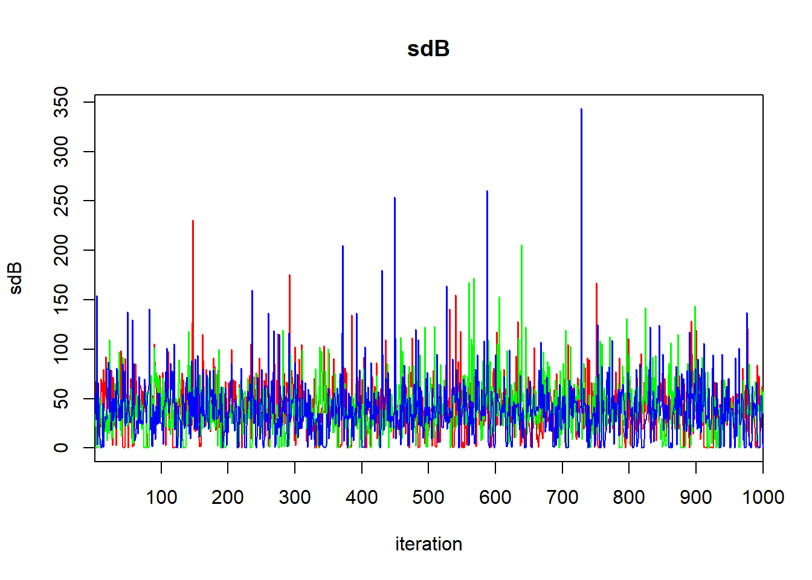
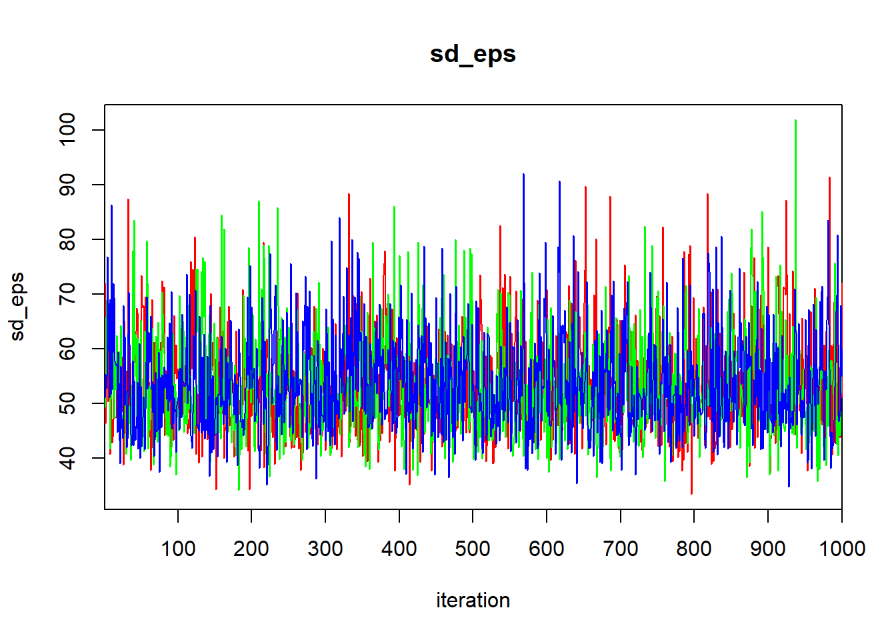
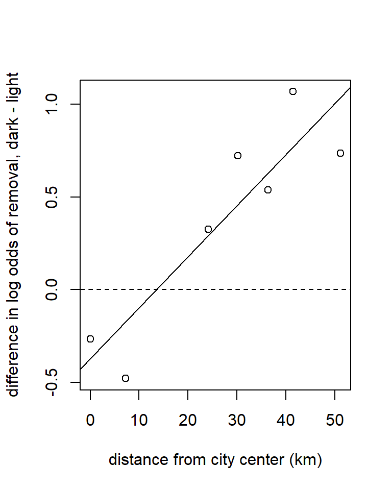
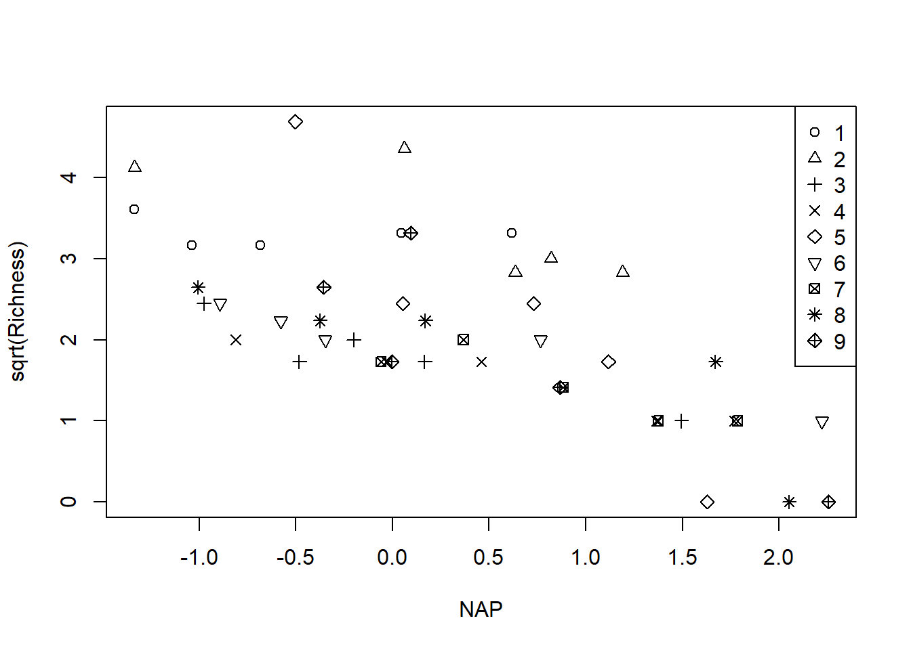

# Hierarchical Models


## One-factor layout: Dyestuff data


We will illustrate the basic ideas of hierarchical models with the `Dyestuff` data contained in `lme4`.  According to Bates (2012+), these data originally appeared in Davies (1947), and "are described in Davies and Goldsmith (1972, Table 6.3, p. 131) ... as coming from 'an investigation to find out how much the variation from batch to bach in the quality of an intermediate product contributes to the variation in the yield of the dyestuff made from it'".  The data consist of 6 batches, each of which gives rise to 5 observations. 

Preparatory work:

```r
require(lme4)
```

```
## Loading required package: lme4
```

```
## Loading required package: Matrix
```

```r
data(Dyestuff)
summary(Dyestuff)
```

```
##  Batch     Yield     
##  A:5   Min.   :1440  
##  B:5   1st Qu.:1469  
##  C:5   Median :1530  
##  D:5   Mean   :1528  
##  E:5   3rd Qu.:1575  
##  F:5   Max.   :1635
```

```r
with(Dyestuff, stripchart(Yield ~ Batch, pch = 16))
```


To develop some notation, let $i = 1, \ldots, 6$ index the batches, let $j = 1, \ldots, 5$ index the observations within each batch, and let $y_{ij}$ denote observation $j$ from batch $i$.

As a starting point, we will fit the usual one-factor ANOVA model to these data.  This model is
\begin{align}
y_{ij} & = \mu_i + \varepsilon_{ij} \\
\varepsilon_{ij} & \stackrel{\text{iid}}{\sim} \mathcal{N}(0, \sigma^2). 
\end{align}

```r
fm0 <- lm(Yield ~ 1, data = Dyestuff)          # model with common mean
fm1 <- lm(Yield ~ Batch - 1, data = Dyestuff)  # mean varies by group
anova(fm0, fm1)  # usual F-test for differences among group means
```

```
## Analysis of Variance Table
## 
## Model 1: Yield ~ 1
## Model 2: Yield ~ Batch - 1
##   Res.Df    RSS Df Sum of Sq      F   Pr(>F)   
## 1     29 115187                                
## 2     24  58830  5     56358 4.5983 0.004398 **
## ---
## Signif. codes:  0 '***' 0.001 '**' 0.01 '*' 0.05 '.' 0.1 ' ' 1
```

```r
summary(fm1)  # eliminating the intercept gives sample means for each group
```

```
## 
## Call:
## lm(formula = Yield ~ Batch - 1, data = Dyestuff)
## 
## Residuals:
##    Min     1Q Median     3Q    Max 
## -85.00 -33.00   3.00  31.75  97.00 
## 
## Coefficients:
##        Estimate Std. Error t value Pr(>|t|)    
## BatchA  1505.00      22.14   67.97   <2e-16 ***
## BatchB  1528.00      22.14   69.01   <2e-16 ***
## BatchC  1564.00      22.14   70.64   <2e-16 ***
## BatchD  1498.00      22.14   67.66   <2e-16 ***
## BatchE  1600.00      22.14   72.26   <2e-16 ***
## BatchF  1470.00      22.14   66.39   <2e-16 ***
## ---
## Signif. codes:  0 '***' 0.001 '**' 0.01 '*' 0.05 '.' 0.1 ' ' 1
## 
## Residual standard error: 49.51 on 24 degrees of freedom
## Multiple R-squared:  0.9992,	Adjusted R-squared:  0.999 
## F-statistic:  4763 on 6 and 24 DF,  p-value: < 2.2e-16
```

Now we will use `nlme::gls` to fit a model that assumes that the data within each batch are correlated.  In other words, we fit the model
\begin{align}
y_{ij} & = \mu + \varepsilon_{ij} \\
\varepsilon_{ij} & \sim \mathcal{N}(0, \sigma^2) \\
\mathrm{Corr}(y_{ij}, y_{ik}) & = \rho
\end{align}


```r
require(nlme)
```

```
## Loading required package: nlme
```

```
## 
## Attaching package: 'nlme'
```

```
## The following object is masked from 'package:lme4':
## 
##     lmList
```

```r
fm2 <- gls(Yield ~ 1, data = Dyestuff, correlation = corCompSymm(form = ~ 1 | Batch))
summary(fm2)
```

```
## Generalized least squares fit by REML
##   Model: Yield ~ 1 
##   Data: Dyestuff 
##        AIC      BIC    logLik
##   325.6543 329.7562 -159.8271
## 
## Correlation Structure: Compound symmetry
##  Formula: ~1 | Batch 
##  Parameter estimate(s):
##       Rho 
## 0.4184874 
## 
## Coefficients:
##              Value Std.Error  t-value p-value
## (Intercept) 1527.5  19.38341 78.80449       0
## 
## Standardized residuals:
##         Min          Q1         Med          Q3         Max 
## -1.34770180 -0.90488550  0.03850577  0.73160955  1.65574793 
## 
## Residual standard error: 64.92534 
## Degrees of freedom: 30 total; 29 residual
```

The most salient components of this output are the estimate of the overall mean, and the estimate of the within-batch correlation ($\hat{\rho} = 0.42$).

Now we will fit a hierarchical model that includes a random effect for the batch.  We can write the model as
\begin{align}
y_{ij} & = \mu + B_i + \varepsilon_{ij} \\
B_i & \stackrel{\text{iid}}{\sim} \mathcal{N}(0, \sigma_B^2) \\
\varepsilon_{ij} & \stackrel{\text{iid}}{\sim} \mathcal{N}(0, \sigma_\varepsilon^2).
\end{align}


```r
fm3 <- lmer(Yield ~ 1 + (1 | Batch), data = Dyestuff)
summary(fm3)
```

```
## Linear mixed model fit by REML ['lmerMod']
## Formula: Yield ~ 1 + (1 | Batch)
##    Data: Dyestuff
## 
## REML criterion at convergence: 319.7
## 
## Scaled residuals: 
##     Min      1Q  Median      3Q     Max 
## -1.4117 -0.7634  0.1418  0.7792  1.8296 
## 
## Random effects:
##  Groups   Name        Variance Std.Dev.
##  Batch    (Intercept) 1764     42.00   
##  Residual             2451     49.51   
## Number of obs: 30, groups:  Batch, 6
## 
## Fixed effects:
##             Estimate Std. Error t value
## (Intercept)  1527.50      19.38    78.8
```

The estimate of the overall mean is the same as it is in the GLS fit.  Note also that we can recover the estimate of the within-batch correlation from the estimates of the variances of the random effects:

```r
var.B   <- 1764
var.eps <- 2451
var.B / (var.B + var.eps)
```

```
## [1] 0.4185053
```
To obtain the conditional modes (BLUPs) of the batch-level random effect, we can use the command `ranef`:

```r
ranef(fm3)
```

```
## $Batch
##   (Intercept)
## A -17.6068514
## B   0.3912634
## C  28.5622256
## D -23.0845385
## E  56.7331877
## F -44.9952868
## 
## with conditional variances for "Batch"
```
The conditional modes given here correspond to the differences between the mean for each batch and the overall mean ($\mu$).   To convert these to best guesses for the mean of each batch, we have to the overall mean back.  This can be done by using the command `fixef` to extract the lone fixed-effect estimate from the model:

```r
(batch.conditional.modes <- (fixef(fm3) + ranef(fm3)$Batch$`(Intercept)`))
```

```
## [1] 1509.893 1527.891 1556.062 1504.415 1584.233 1482.505
```

It is informative to compare the conditional models for each batch to the sample means.  We can calculate the sample means with the `tapply` function


```r
(batch.means <- with(Dyestuff, tapply(Yield, Batch, mean)))
```

```
##    A    B    C    D    E    F 
## 1505 1528 1564 1498 1600 1470
```

These are the same as the LS estimates of the batch-specific means in the ANOVA model, `fm1`.  Now plot the sample means against the conditional modes:


```r
cbind(batch.means, batch.conditional.modes)
```

```
##   batch.means batch.conditional.modes
## A        1505                1509.893
## B        1528                1527.891
## C        1564                1556.062
## D        1498                1504.415
## E        1600                1584.233
## F        1470                1482.505
```


```r
plot(x    = batch.means, 
     y    = batch.conditional.modes, 
     xlim = range(batch.means), 
     ylim = range(batch.means), 
     xlab = "sample means",
     ylab = "conditional modes",
     pch  = LETTERS[1:6])

abline(a = 0, b = 1)
```


The conditional modes are "shrunken" towards the global mean relative to the sample means.  Why is this so?

To conduct inferences about the parameters in the hierarchical model, `lme4::lmer` offers likelihood profiling. This is the same idea that we encountered when we were using the likelihood to calculate profile-based confidence intervals earlier in the course.  `lme4::lmer` does all its profiling on the ML fit, so we begin by refitting our hierarchical model using ML.  To do so, set the optional argument `REML` to `FALSE`.


```r
fm3ML <- lmer(Yield ~ 1 + (1 | Batch), data = Dyestuff, REML = FALSE)
summary(fm3ML)
```

```
## Linear mixed model fit by maximum likelihood  ['lmerMod']
## Formula: Yield ~ 1 + (1 | Batch)
##    Data: Dyestuff
## 
##      AIC      BIC   logLik deviance df.resid 
##    333.3    337.5   -163.7    327.3       27 
## 
## Scaled residuals: 
##     Min      1Q  Median      3Q     Max 
## -1.4315 -0.7972  0.1480  0.7721  1.8037 
## 
## Random effects:
##  Groups   Name        Variance Std.Dev.
##  Batch    (Intercept) 1388     37.26   
##  Residual             2451     49.51   
## Number of obs: 30, groups:  Batch, 6
## 
## Fixed effects:
##             Estimate Std. Error t value
## (Intercept)  1527.50      17.69   86.33
```

Switching to ML has decreased our estimate of the batch-level variance, and decreased it by quite a bit.  To construct profile-based intervals, we use the `lme4::profile` function.  We will use the `xyplot` function from the `lattice` package to display the profiles.


```r
pr <- profile(fm3ML)
lattice::xyplot(pr)
```


There are three panels here, one for each of the parameters in the model.  These parameters are labeled as $\sigma_1$ for the standard deviation of the block-level random effect (what we have written $\sigma_B$), $\sigma$ for the standard deviation of the errors (what we have written as $\sigma_\varepsilon$), and "(Intercept)" for the global mean (what we have written as $\mu$).  

Within each panel, the values plotted on the vertical axis are the signed square roots of the likelihood ratio test statistic.  This value is denoted by the Greek letter $\zeta$ ("zeta"); hence, the plots we are viewing are called zeta-plots.

I do not know how widely used zeta-plots are.  They may be more common in other realms of science, although I have never encountered them outside `lme4`.  Basically, they are a visualization of profile-likelihood based confidence intervals.  The vertical lines in each panel give the limits of (working from the inside out) 50\%, 80\%, 90\%, 95\%, and 99\% confidence intervals for each parameter.  We can also extract these confidence limits using the `confint` function.  Below, we show 95\% confidence intervals; of course, one can change the confidence level as needed.

```r
confint(pr, level = .95)
```

```
##                  2.5 %     97.5 %
## .sig01        12.19854   84.06305
## .sigma        38.22998   67.65770
## (Intercept) 1486.45150 1568.54849
```

So, a 95\% confidence interval for $\mu$ ranges from 1486 to 1569.

Here is a bit more about the logic behind zeta plots (feel free to skip this paragraph if you wish).  Recall that negative log-likelihood profiles are convex and approximately quadratic.  Plotting the LRT statistic instead of the likelihood itself has the effect of placing the nadir of these curves at 0, instead of at the value of the negative log-likelihood.  Taking the square root of the LRT statistic converts a quadratic curve (a u-shape) into a linear one (a v-shape).  We can see this v-shape by using the optional argument `absVal = TRUE`:

```r
lattice::xyplot(pr, absVal = TRUE)
```


The purpose of using a signed square root is to turn these V-shaped plots into straight lines.  Straight lines are useful in turn because if the profile log likelihood is actually quadratic, then the zeta plot will yield a perfectly straight line, and thus a local approximation to the confidence interval will be appropriate.  If the zeta-plot is non-linear, then the confidence interval becomes more asymmetric, and a local approximation fares more poorly.

(Start reading again if you skipped the above detail).  There is an interesting detail to the zeta-plots.  Consider the zeta-plot for $\sigma_1$ (the standard deviation of the batch-level random effects), and try to find the lower limit of a 99\% confidence interval.  You'll notice that the zeta-plot hits 0 (the lowest possible value for a standard deviation) before the interval is completed.  Thus, the lower limit of this interval is 0:

```r
confint(pr, level = 0.99)
```

```
##                  0.5 %     99.5 %
## .sig01         0.00000  113.68769
## .sigma        35.56317   75.66803
## (Intercept) 1465.87401 1589.12602
```

Although we are not much in the habit of conducting hypothesis tests in this course, we would conclude that we would fail to reject the null hypothesis that the batch-level variance equals 0 with a 99\% level test.

We can also obtain bivariate confidence regions from the profile likelihood using the `lattice::splom` command.

```r
lattice::splom(pr)
```


Panels above the diagonal show bivariate, profile-based confidence regions for each pair of parameters.  Within each panel, we see 50\%, 80\%, 90\%, 95\%, and 99\% confidence regions.  (You should be able to figure out which is which.)  The panels show, for example, that the estimate of the observation-level standard deviation is slightly negatively correlated with the estimate of the batch-level standard deviation.  Panels below the diagoanl show the same plots on the $\zeta$ scale.  See Bates (2012+) \S 1.5.3 for a detailed description of how to interpret these plots.

There is a second approach to calculating confidence intervals and/or conducting hypothesis tests for fixed-effect parameters.  Famously, `lme4::lmer` does not provide degrees of freedom for the estimates of the fixed effects.  The package `lmerTest` uses the Satterthwaite approximation to estimate these df.


```r
require(lmerTest)
```

```
## Loading required package: lmerTest
```

```
## Warning: package 'lmerTest' was built under R version 4.1.1
```

```
## 
## Attaching package: 'lmerTest'
```

```
## The following object is masked from 'package:lme4':
## 
##     lmer
```

```
## The following object is masked from 'package:stats':
## 
##     step
```

```r
fm4 <- lmerTest::lmer(Yield ~ 1 + (1 | Batch), data = Dyestuff)
summary(fm4)
```

```
## Linear mixed model fit by REML. t-tests use Satterthwaite's method [
## lmerModLmerTest]
## Formula: Yield ~ 1 + (1 | Batch)
##    Data: Dyestuff
## 
## REML criterion at convergence: 319.7
## 
## Scaled residuals: 
##     Min      1Q  Median      3Q     Max 
## -1.4117 -0.7634  0.1418  0.7792  1.8296 
## 
## Random effects:
##  Groups   Name        Variance Std.Dev.
##  Batch    (Intercept) 1764     42.00   
##  Residual             2451     49.51   
## Number of obs: 30, groups:  Batch, 6
## 
## Fixed effects:
##             Estimate Std. Error      df t value Pr(>|t|)    
## (Intercept)  1527.50      19.38    5.00    78.8 6.23e-09 ***
## ---
## Signif. codes:  0 '***' 0.001 '**' 0.01 '*' 0.05 '.' 0.1 ' ' 1
```
`lmerTest::lmer` gives the associated df for the estimate of the intercept as 5.  If this were a class in experimental design, we would regard the individual measurements from each batch as subsamples, in which case the correct df for inferences about the intercept should be $6 - 1 = 5$.  In this case, the calculation from `lmerTest::lmer` matches our intuition.

Equipped with this information, we could construct a 95\% confidence interval for the overall mean as

```r
1527.5 + 19.38 *  qt(c(0.025, 0.975), df = 5)
```

```
## [1] 1477.682 1577.318
```

Compare this interval with the profile interval generated by `lme4::profile`.

## Bayesian analysis

The mixed-model formulation is our first encounter with a hierarchical model.  One often hears the phrase "Bayesian hierarchical model" in ecology.  It is important to realize that not all Bayesian models are hierarchical, and not all hierarchical models are Bayesian.  Indeed, we have seen examples of both: none of the Bayesian examples that we have seen in earlier chapters were hierarchical, and the mixed-model analysis of the Dyestuff data is a hierarchical model analyzed from a frequentist perspective.  However, we can certainly analyze hierarchical models from a Bayesian perspective as well, leading to a Bayesian hierarchical model.  

The above paragraph begs the question: What defines a hierarchical model?  One can find definitions in the literature, though it isn't clear to me that any of these definitions are fully precise, although I may just be ignorant.  As best I can tell, a hierarchical model is one that includes so-called "latent" variables.  Latent variables are unobservable quantities on which the data depend, that in turn are related to model parameters via a statistical model.  This "layered" construction of the model (observables depend on latent variables, and latent variables depend on model parameters) gives rise to the "hierarchy" that gives hierarchical models their name.

This hierarchical perspective gives rise to an alternative formulation of the model.  This model is mathematically identical to the random-effects formulation above, but it emphasizes the hierarchical nature of the model a bit more.  For the dyestuff data, we might write the model as 
\begin{align}
B_i & \stackrel{\text{iid}}{\sim} \mathcal{N}(\mu, \sigma^2_B) \\
y_{ij}| B_i  & \stackrel{\text{iid}}{\sim} \mathcal{N}(B_i, \sigma^2_\varepsilon) \\
\end{align}

The hierarchical formulation states that the batch-specific means (the $B_i$'s) are latent variables drawn independently from a Gaussian distribution with mean $\mu$ and variance $\sigma^2_B$.  Conditional on the $B_i$'s, the observable data are drawn from a Gaussian distribution with mean $B_i$ and variance $\sigma^2_\varepsilon$.  

To complete the Bayesian specification, we need to place priors on our three parameters: $\mu$, $\sigma^2_B$, and $\sigma^2_\varepsilon$.  In the absence of any information, we might choose a vague normal prior for $\mu$, and vague gamma priors for $1/\sigma^2_B$ and $1/\sigma^2_\varepsilon$.  The following `R2Jags` code implements such a model.


```r
require(R2jags)
```

```
## Loading required package: R2jags
```

```
## Warning: package 'R2jags' was built under R version 4.1.1
```

```
## Loading required package: rjags
```

```
## Warning: package 'rjags' was built under R version 4.1.1
```

```
## Loading required package: coda
```

```
## Linked to JAGS 4.3.0
```

```
## Loaded modules: basemod,bugs
```

```
## 
## Attaching package: 'R2jags'
```

```
## The following object is masked from 'package:coda':
## 
##     traceplot
```

```r
dyestuff.model <- function() {
  
  ## likelihood
  
  for (j in 1:J) {            
    
    y[j]    ~ dnorm(B[batch[j]], tau_eps)  # data distribution
  }
  
  ## latent variables
  
  for (b in 1:6){
  
    B[b] ~ dnorm(mu, tauB)
  }
  
  mu ~ dnorm (0.0, 1E-6)  # prior for the overall mean
  
  tau_eps ~ dgamma (0.01, 0.01)
  tauB    ~ dgamma (0.01, 0.01)
  
  sd_eps <- pow(tau_eps, -1/2)
  sdB    <- pow(tauB, -1/2)
}

jags.data <- list(y     = Dyestuff$Yield, 
                  batch = as.numeric(Dyestuff$Batch), 
                  J     = nrow(Dyestuff))

jags.params <- c("mu", "sd_eps", "sdB", "B[1]", "B[2]")

jags.inits <- function(){
  list("mu" = rnorm(1, .01), "tauB" = runif(1), "tau_eps" = runif(1))
}

set.seed(1)

jagsfit <- jags(data               = jags.data, 
                inits              = jags.inits, 
                parameters.to.save = jags.params,
                model.file         = dyestuff.model,
                n.chains           = 3,
                n.iter             = 1e5)
```

```
## module glm loaded
```

The code above requires a way to associate each observation with the batch from which the observation was drawn.  We accomplish this by creating the variable `batch` that associates each observation with the numerical index of the batch.  (That is, batch "A" is associated with the index 1, etc.)  In the code, this happens with the line

```r
batch = as.numeric(Dyestuff$Batch)
```

The `as.numeric` command returns numerical values for each level of the factor `Batch`.

Note also that we have only asked for the posterior draws for the latent means of the first two batches, $B_1$ and $B_2$.  This is merely to keep the output small for this example.  We could of course ask for the means of the other batches as well.  

Let's have a look at the output:

```r
print(jagsfit)
```

```
## Inference for Bugs model at "C:/Users/krgross/AppData/Local/Temp/RtmpY7cX0Y/model2afc1865e44.txt", fit using jags,
##  3 chains, each with 1e+05 iterations (first 50000 discarded), n.thin = 50
##  n.sims = 3000 iterations saved
##           mu.vect sd.vect     2.5%      25%      50%      75%    97.5%  Rhat
## B[1]     1513.362  22.375 1471.329 1500.347 1514.592 1527.349 1551.127 1.008
## B[2]     1527.140  21.282 1488.362 1515.118 1527.513 1539.242 1565.028 1.008
## mu       1525.971  23.850 1481.395 1514.107 1526.465 1538.276 1569.052 1.006
## sdB        38.744  26.358    0.269   23.345   36.521   51.151  101.022 1.002
## sd_eps     54.105  12.349   39.388   47.081   52.538   59.337   75.857 1.001
## deviance  323.591   7.099  314.873  318.505  321.822  327.461  337.074 1.001
##          n.eff
## B[1]      3000
## B[2]      1500
## mu        3000
## sdB       3000
## sd_eps    3000
## deviance  3000
## 
## For each parameter, n.eff is a crude measure of effective sample size,
## and Rhat is the potential scale reduction factor (at convergence, Rhat=1).
## 
## DIC info (using the rule, pD = var(deviance)/2)
## pD = 25.2 and DIC = 348.8
## DIC is an estimate of expected predictive error (lower deviance is better).
```

```r
traceplot(jagsfit)  
```



```r
require(lattice)
```

```
## Loading required package: lattice
```

```r
jagsfit.mcmc <- as.mcmc(jagsfit)
densityplot(jagsfit.mcmc)
```


As of this writing, there are some aspects of the output that I don't understand.  The traceplots show that one chain starts far away from the region of high posterior density and then rapidly converges to it. This behavior seems to persist regardless of how long the burn-in period is, which doesn't make sense to me.  I also do not understand why `densityplot` produces a 6-by-1 stack of panels instead of a more useful layout.  

One especially appealing aspect of analyzing this model from a Bayesian perspective is that there is no awkwardness in analyzing the posterior distributions of the latent variables, namely, the batch-specific means.  From the frequentist perspective, it is somewhat awkward (though not prohibitively so) to define the conditional modes (BLUPs).  We also lack straightforward methods for quantifying the uncertainty in these conditional modes.  From the Bayesian viewpoint, this awkwardness disappears, because the distinction between model parameters and latent variables vanishes.  Both are simply unobserved quantities.  Consequently, it is natural to summarize our posterior knowledge about the latent variables by their (marginal) posterior distributions, in the same way that we use marginal posteriors to summarize our inferences about the model parameters.

## Negative within-group correlations

The hierarchical model formulation, regardless of whether analyzed from a frequentist or Bayesian perspective, is just a model.  All models are wrong, but some models are useful.  One can encounter grouped data where the hierarchical formulation is not useful.  To illustrate, we consider the `Dyestuff2` data provided in `lme4`.  These are synthetic (fake) data that have been created by Box & Tiao (1973) for the sake of illustration.  The Dyestuff2 data have the same structure as the original Dyestuff data, that is, 5 observations from each of 6 batches.


```r
data(Dyestuff2)
summary(Dyestuff2)
```

```
##  Batch     Yield       
##  A:5   Min.   :-0.892  
##  B:5   1st Qu.: 2.765  
##  C:5   Median : 5.365  
##  D:5   Mean   : 5.666  
##  E:5   3rd Qu.: 8.151  
##  F:5   Max.   :13.434
```

```r
with(Dyestuff2, stripchart(Yield ~ Batch, pch = 16))
```


We'll begin by fitting a GLS model that includes a within-batch correlation:


```r
fm5 <- gls(Yield ~ 1, data = Dyestuff2, correlation = corCompSymm(form = ~ 1 | Batch))
summary(fm5)
```

```
## Generalized least squares fit by REML
##   Model: Yield ~ 1 
##   Data: Dyestuff2 
##        AIC      BIC    logLik
##   167.2092 171.3111 -80.60461
## 
## Correlation Structure: Compound symmetry
##  Formula: ~1 | Batch 
##  Parameter estimate(s):
##        Rho 
## -0.0970284 
## 
## Coefficients:
##              Value Std.Error  t-value p-value
## (Intercept) 5.6656 0.5271409 10.74779       0
## 
## Standardized residuals:
##         Min          Q1         Med          Q3         Max 
## -1.77661357 -0.78584319 -0.08143986  0.67335540  2.10464878 
## 
## Residual standard error: 3.691067 
## Degrees of freedom: 30 total; 29 residual
```

Notice that the within-batch correlation is negative.  What does this imply about the structure of the data?

Let's have a look at a hierarchical model, fit with `lmer`.

```r
fm6 <- lme4::lmer(Yield ~ 1 + (1 | Batch), data = Dyestuff2)
```

```
## boundary (singular) fit: see ?isSingular
```

```r
summary(fm6)
```

```
## Linear mixed model fit by REML ['lmerMod']
## Formula: Yield ~ 1 + (1 | Batch)
##    Data: Dyestuff2
## 
## REML criterion at convergence: 161.8
## 
## Scaled residuals: 
##     Min      1Q  Median      3Q     Max 
## -1.7648 -0.7806 -0.0809  0.6689  2.0907 
## 
## Random effects:
##  Groups   Name        Variance Std.Dev.
##  Batch    (Intercept)  0.00    0.000   
##  Residual             13.81    3.716   
## Number of obs: 30, groups:  Batch, 6
## 
## Fixed effects:
##             Estimate Std. Error t value
## (Intercept)   5.6656     0.6784   8.352
## optimizer (nloptwrap) convergence code: 0 (OK)
## boundary (singular) fit: see ?isSingular
```

The estimate of the among-batch variance, $\sigma^2_B$, is 0. The warning generated by R tells us that our fit is singular: one of the estimated parameters lies on the boundary of its possible values.  To quote Bates (2012+, using our notation):

> "An estimate of 0 for $\sigma_B$ does not mean that there is no variation between the groups.  Indeed, ... there is some small amount of variability between the groups.  The estimate, $\hat{\sigma}_B=0$, simply indicates that the level of 'between-group' variability is not sufficient to warrant incorporating random effects in the model.

> "The important point ... is that we must allow for the estimates of variance components to be zero.  We describe such a model as being degenerate, in the sense that it corresponds to a linear model in which we have removed the randdom effects associated with Batch.  Degenerate models can and do occur in practice.  Eveen when the final fitted model is not degenerate, we must allow for such models when determining the parameter estimates through numerical optimization."

Can you think of any ecological mechanisms that might give rise to negative within-group correlations?

## Random coefficient models: RIKZ data

So-called random coefficient models are popular modeling structures in ecology.  Random-coefficient models are useful when data are grouped, like the Dyestuff data.  However, unlike the Dyestuff data, random-coefficient models refer to scenarios where the statistical model that we want to entertain within each group is more complex than just a simple random sample with a group-specific mean.

To illustrate random-coefficient models, we will consider the RIKZ data from Zuur et al. (2009).  These data were first analyzed in an earlier textbook (Zuur et al.\ 2007).  Zuur et al. (2009, p. 101) describe the data as follows:

> "Zuur et al. (2007) used marine benthic data from nine inter-tidal areas along the Dutch coast. The data were collected by the Dutch institute RIKZ in the summer of 2002. In each inter-tidal area (denoted by ‘beach’), five samples were taken, and the macro-fauna and abiotic variables were measured. ... The underlying question for these data is whether there is a relationship between species richness, exposure, and NAP (the height of a sampling station compared to mean tidal level). Exposure is an index composed of the following elements: wave action, length of the surf zone, slope, grain size, and the depth of the anaerobic layer."

In other words, there are 9 beaches, and 5 samples from each beach.  The response, measured at each sample, is the macrofaunal species richness.  There are two covariates: NAP, which is a sample-level covariate, and exposure, which is a beach-level covariate.  For the moment, we will ignore the exposure covariate, and seek only to model the relationship between species richness and NAP.  Because species richness is a count variable and includes the occasional zero (and because we have not yet discussed hierarchical models for non-Gaussian responses) we will use the square-root of richness as a variance-stabilizing transformation.  Using the square root of species richness as the response has the added benefit of making our analysis different from the analysis in Zuur et al. (2009).

Like all data from Zuur et al. (2009), the data are available for download from the book's associated webpage.  We will read in the data and do some housekeeping first.


```r
require(lme4)
require(lmerTest)

rikz <- read.table("C:/Users/krgross/Documents/Teaching/bma590/ZuurDataMixedModelling/RIKZ.txt", head = T)

with(rikz, plot(Richness ~ NAP, pch = Beach))  # raw response; note the non-constant variance
```



```r
with(rikz, plot(sqrt(Richness) ~ NAP, pch = Beach))  # transformation stabilizes the variance
legend("topright", leg = 1:9, pch = 1:9)
```




```r
# change the Beach variable to a factor
# would have been better to code the beaches as b1, b2, ...

rikz$fBeach <- as.factor(rikz$Beach)
```

To develop some notation for modeling, let $i=1, \ldots, 9$ index the different beaches, let $j = 1, \ldots, 5$ index the different samples at each beach, let $y_{ij}$ be the square root of the species richness at sample $j$ at beach $i$, and let $x_{ij}$ be the NAP covariate at sample $j$ at beach $i$.

We'll fit a linear regression of (transformed) species richness vs.\ NAP at each beach.  We'll begin by fitting a model with a common slope but a separate intercept for each beach.  We'll think of these beaches as a representative sample from a larger collection of beaches, and thus use a random effect to capture the differences among the beach-specific intercepts.  Using the notational style of mixed modeling, we could write our model as
\begin{align*}
y_{ij} & = a + A_i + b x_{ij} + \varepsilon_{ij} \\
A_i & \stackrel{\text{iid}}{\sim} \mathcal{N}(0, \sigma_a^2) \\
\varepsilon_{ij} & \stackrel{\text{iid}}{\sim} \mathcal{N}(0, \sigma_\varepsilon^2).
\end{align*}

Here, the $A_i$'s are the beach-level random effects for the intercept.  Alternatively, we could write
\begin{align*}
y_{ij} & = A_i + b x_{ij} + \varepsilon_{ij} \\
A_i & \stackrel{\text{iid}}{\sim} \mathcal{N}(a, \sigma_a^2) \\
\varepsilon_{ij} & \stackrel{\text{iid}}{\sim} \mathcal{N}(0, \sigma_\varepsilon^2).
\end{align*}

Or, using the notational style of hierarchical modeling, we could write the same model as
\begin{align*}
A_i & \stackrel{\text{iid}}{\sim} \mathcal{N}(a, \sigma_a^2) \\
y_{ij} | A_i & \sim \mathcal{N}(A_i + b x_{ij}, \sigma_\varepsilon^2)
\end{align*}

We'll fit the model using `lmerTest::lmer`.

```r
#######################
# Model 1: random intercept
#######################

fm1 <- lmerTest::lmer(sqrt(Richness) ~ 1 + NAP + (1 | fBeach), data = rikz)

summary(fm1)
```

```
## Linear mixed model fit by REML. t-tests use Satterthwaite's method [
## lmerModLmerTest]
## Formula: sqrt(Richness) ~ 1 + NAP + (1 | fBeach)
##    Data: rikz
## 
## REML criterion at convergence: 97.1
## 
## Scaled residuals: 
##     Min      1Q  Median      3Q     Max 
## -2.5693 -0.4286 -0.1869  0.3230  2.9399 
## 
## Random effects:
##  Groups   Name        Variance Std.Dev.
##  fBeach   (Intercept) 0.2957   0.5438  
##  Residual             0.3460   0.5882  
## Number of obs: 45, groups:  fBeach, 9
## 
## Fixed effects:
##             Estimate Std. Error       df t value Pr(>|t|)    
## (Intercept)  2.37424    0.20405  8.36034  11.635 1.88e-06 ***
## NAP         -0.68063    0.09501 37.15971  -7.163 1.68e-08 ***
## ---
## Signif. codes:  0 '***' 0.001 '**' 0.01 '*' 0.05 '.' 0.1 ' ' 1
## 
## Correlation of Fixed Effects:
##     (Intr)
## NAP -0.162
```

```r
# extract the conditional modes for the beach random effects
ranef(fm1)
```

```
## $fBeach
##   (Intercept)
## 1   0.4962684
## 2   1.0050819
## 3  -0.4791252
## 4  -0.4104708
## 5   0.2444787
## 6  -0.2252788
## 7  -0.2858167
## 8  -0.2124511
## 9  -0.1326862
## 
## with conditional variances for "fBeach"
```

```r
# replot the data and add a line for the average relationship across all beaches
with(rikz, plot(sqrt(Richness) ~ NAP, pch = Beach))
legend("topright", leg = 1:9, pch = 1:9)

a <- coef(summary(fm1))[1, 1]
b <- coef(summary(fm1))[2, 1]

abline(a = a, b = b, col = "red", lwd = 2)

# highlight beach 1

with(subset(rikz, Beach == 1), points(x = NAP, y = sqrt(Richness), col = "red", pch = 16))

c.mode <- ranef(fm1)$fBeach

abline(a = a + c.mode[1, 1], b = b, col = "red", lty = "dotted")
```


```r
# make a plot with a line for each beach

with(rikz, plot(sqrt(Richness) ~ NAP, pch = Beach))
legend("topright", leg = 1:9, pch = 1:9)

a <- coef(summary(fm1))[1, 1]
b <- coef(summary(fm1))[2, 1]

abline(a = a, b = b, col = "red", lwd = 2)

for(i in 1:9){
 abline(a = a + c.mode[i, 1], b = b, col = "red", lty = "dotted") 
}
```


Next, we will fit a model with random intercepts and slopes for each beach.  We have two options here.  Either we can allow for the random intercept and slope for each beach to be a draw from a bivariate normal distribution with possible correlations, or we can insist that the random intercepts and slopes are independent.  To write the first model in mixed-model notation, we might write
\begin{align*}
y_{ij} & = A_i + B_i x_{ij} + \varepsilon_{ij} \\
\left(\begin{array}{c} A \\ B \end{array} \right)_i & \stackrel{\text{iid}}{\sim} \mathcal{N}_2 \left(\left(\begin{array}{c} a \\ b \end{array} \right), \left(\begin{array}{cc} \sigma_A^2 & \sigma_{AB} \\ \sigma_{AB} & \sigma_B^2 \end{array} \right) \right) \\
\varepsilon_{ij} & \stackrel{\text{iid}}{\sim} \mathcal{N}(0, \sigma_\varepsilon^2).
\end{align*}

To fit the model using `lmerTest::lmer`, we use

```r
#######################
# Model 2: random slope and intercept (possibly correlated)
#######################

fm2 <- lmerTest::lmer(sqrt(Richness) ~ 1 + NAP + (1 + NAP | fBeach), data = rikz)  
summary(fm2)
```

```
## Linear mixed model fit by REML. t-tests use Satterthwaite's method [
## lmerModLmerTest]
## Formula: sqrt(Richness) ~ 1 + NAP + (1 + NAP | fBeach)
##    Data: rikz
## 
## REML criterion at convergence: 92.5
## 
## Scaled residuals: 
##     Min      1Q  Median      3Q     Max 
## -1.6245 -0.4430 -0.1095  0.3023  2.1610 
## 
## Random effects:
##  Groups   Name        Variance Std.Dev. Corr 
##  fBeach   (Intercept) 0.4389   0.6625        
##           NAP         0.1582   0.3978   -0.41
##  Residual             0.2159   0.4647        
## Number of obs: 45, groups:  fBeach, 9
## 
## Fixed effects:
##             Estimate Std. Error      df t value Pr(>|t|)    
## (Intercept)   2.4369     0.2348  7.9127  10.379 6.97e-06 ***
## NAP          -0.7026     0.1543  6.7971  -4.552  0.00283 ** 
## ---
## Signif. codes:  0 '***' 0.001 '**' 0.01 '*' 0.05 '.' 0.1 ' ' 1
## 
## Correlation of Fixed Effects:
##     (Intr)
## NAP -0.390
```

```r
ranef(fm2)
```

```
## $fBeach
##   (Intercept)         NAP
## 1  0.58582836  0.28968087
## 2  1.04861982  0.03238569
## 3 -0.59675334  0.16380577
## 4 -0.62048288  0.21645636
## 5  0.71297097 -0.79575937
## 6 -0.36919268  0.24605745
## 7 -0.43364056  0.09313482
## 8 -0.29451043  0.02643661
## 9 -0.03283925 -0.27219819
## 
## with conditional variances for "fBeach"
```

```r
# make a plot

with(rikz, plot(sqrt(Richness) ~ NAP, pch = Beach))
legend("topright", leg = 1:9, pch = 1:9)

# add a line for the average relationship across all beaches

a <- coef(summary(fm2))[1, 1]
b <- coef(summary(fm2))[2, 1]

abline(a = a, b = b, col = "red", lwd = 2)

# add a line for beach 1

with(subset(rikz, Beach == 1), points(x = NAP, y = sqrt(Richness), col = "red", pch = 16))

c.mode <- ranef(fm2)$fBeach

abline(a = a + c.mode[1, 1], b = b + c.mode[1, 2], col = "red", lty = "dotted")
```


Let's make a scatterplot of the conditional modes of the random intercepts and slopes 


```r
# plot the conditional modes of the random effects

plot(x = a + c.mode[, 1], y = b + c.mode[, 2], xlab = "intercept", ylab = "slope", pch = as.character(1:9))
```


Finally, we can test the null hypothesis that $\sigma_B^2 = 0$ by a call to `anova`.  Note that `anova` in this case refits the models with ML before executing the test.

```r
anova(fm1, fm2)  # could compare REML fits by fitting both models with nlme::lme
```

```
## refitting model(s) with ML (instead of REML)
```

```
## Data: rikz
## Models:
## fm1: sqrt(Richness) ~ 1 + NAP + (1 | fBeach)
## fm2: sqrt(Richness) ~ 1 + NAP + (1 + NAP | fBeach)
##     npar    AIC    BIC  logLik deviance  Chisq Df Pr(>Chisq)
## fm1    4 100.83 108.06 -46.416   92.833                     
## fm2    6 101.26 112.10 -44.630   89.259 3.5736  2     0.1675
```

We cannot reject the null hypothesis that $\sigma_B^2 = 0$.

Now we try a model with independent random effects for intercepts and slopes, and compare this model to previous ones.  This model is
\begin{align*}
y_{ij} & = A_i + B_i x_{ij} + \varepsilon_{ij} \\
A_i & \stackrel{\text{iid}}{\sim} \mathcal{N}(a, \sigma^2_A) \\
B_i & \stackrel{\text{iid}}{\sim} \mathcal{N}(b, \sigma^2_B) \\
\varepsilon_{ij} & \stackrel{\text{iid}}{\sim} \mathcal{N}(0, \sigma_\varepsilon^2).
\end{align*}


```r
#######################
# Model 2a: random slope and intercept (independent)
#######################

fm2a <- lmerTest::lmer(sqrt(Richness) ~ 1 + NAP + (1 | fBeach) + (0 + NAP | fBeach), data = rikz)
anova(fm1, fm2a, fm2)
```

```
## refitting model(s) with ML (instead of REML)
```

```
## Data: rikz
## Models:
## fm1: sqrt(Richness) ~ 1 + NAP + (1 | fBeach)
## fm2a: sqrt(Richness) ~ 1 + NAP + (1 | fBeach) + (0 + NAP | fBeach)
## fm2: sqrt(Richness) ~ 1 + NAP + (1 + NAP | fBeach)
##      npar    AIC    BIC  logLik deviance  Chisq Df Pr(>Chisq)
## fm1     4 100.83 108.06 -46.416   92.833                     
## fm2a    5 100.16 109.19 -45.078   90.156 2.6767  1     0.1018
## fm2     6 101.26 112.10 -44.630   89.259 0.8969  1     0.3436
```

Here we see a conflict between AIC and the LRT.  AIC favors the model with random but independent intercepts and slopes, whereas the LRT continues to suggest that we cannot reject the null hypothesis that $\sigma_B^2 = 0$.

Finally, we consider the effect of exposure, a beach-level covariate.  Exposure is coded in the data set as a numerical predictor.  However, there are only three unique values: 8, 10, and 11 (and only one beach has exposure level 8).  We will follow Zuur et al.\ (2009) in treating exposure as a binary predictor, grouping the beaches with exposure levels 8 and 10 together as low exposure beaches.


```r
# create an 'exposure' factor, with two levels: low and high

with(rikz, table(fBeach, Exposure))
```

```
##       Exposure
## fBeach 8 10 11
##      1 0  5  0
##      2 5  0  0
##      3 0  0  5
##      4 0  0  5
##      5 0  5  0
##      6 0  0  5
##      7 0  0  5
##      8 0  5  0
##      9 0  5  0
```

```r
rikz$fExp <- rikz$Exposure  # make a new variable so that we can leave the original alone
rikz$fExp[rikz$Exposure == 8] <- 10  # assign a value of 10 to the lone beach with exposure = 8
rikz$fExp <- as.factor(rikz$fExp)  # make the new variable into a factor

summary(rikz)
```

```
##      Sample      Richness         Exposure          NAP              Beach  
##  Min.   : 1   Min.   : 0.000   Min.   : 8.00   Min.   :-1.3360   Min.   :1  
##  1st Qu.:12   1st Qu.: 3.000   1st Qu.:10.00   1st Qu.:-0.3750   1st Qu.:3  
##  Median :23   Median : 4.000   Median :10.00   Median : 0.1670   Median :5  
##  Mean   :23   Mean   : 5.689   Mean   :10.22   Mean   : 0.3477   Mean   :5  
##  3rd Qu.:34   3rd Qu.: 8.000   3rd Qu.:11.00   3rd Qu.: 1.1170   3rd Qu.:7  
##  Max.   :45   Max.   :22.000   Max.   :11.00   Max.   : 2.2550   Max.   :9  
##                                                                             
##      fBeach   fExp   
##  1      : 5   10:25  
##  2      : 5   11:20  
##  3      : 5          
##  4      : 5          
##  5      : 5          
##  6      : 5          
##  (Other):15
```

We will consider a model in which we use separate distributions of random intercepts for the the low- and high-exposure beaches.  To fit this model, we will need to embellish our notation.  Now, let $i=1, 2$ index the exposure level of the beaches.  Let $j=1,\ldots, n_i$ index the replicate beaches within each exposure level.  Let $k=1, \ldots, 5$ index the samples at each beach.  We consider the model
\begin{align*}
y_{ijk} & = A_{ij} + b_i x_{ijk} + \varepsilon_{ijk} \\
A_{ij} & \sim \mathcal{N}(a_i, \sigma^2_A) \\
\varepsilon_{ijk} & \stackrel{\text{iid}}{\sim} \mathcal{N}(0, \sigma_\varepsilon^2).
\end{align*}

<!--\begin{align*}
y_{ijk} & = A_{ij} + B_{ij} x_{ijk} + \varepsilon_{ijk} \\
\left(\begin{array}{c} A \\ B \end{array} \right)_{ij} & \stackrel{\text{iid}}{\sim} \mathcal{N}_2 \left(\left(\begin{array}{c} a_i \\ b_i \end{array} \right),  \left(\begin{array}{cc} \sigma_A^2 & \sigma_{AB} \\ \sigma_{AB} & \sigma_B^2 \end{array} \right) \right) \\
\varepsilon_{ijk} & \stackrel{\text{iid}}{\sim} \mathcal{N}(a, \sigma_\varepsilon^2).
\end{align*}-->


```r
#######################
# Model 3: random intercept, with effect of exposure
#######################

fm3 <- lmerTest::lmer(sqrt(Richness) ~ 1 + NAP + fExp + NAP:fExp + (1 | fBeach), data = rikz)

# equivalently

fm3 <- lmerTest::lmer(sqrt(Richness) ~ 1 + NAP * fExp + (1 | fBeach), data = rikz)

summary(fm3)
```

```
## Linear mixed model fit by REML. t-tests use Satterthwaite's method [
## lmerModLmerTest]
## Formula: sqrt(Richness) ~ 1 + NAP * fExp + (1 | fBeach)
##    Data: rikz
## 
## REML criterion at convergence: 89.7
## 
## Scaled residuals: 
##     Min      1Q  Median      3Q     Max 
## -2.4532 -0.5066 -0.0280  0.3478  2.6221 
## 
## Random effects:
##  Groups   Name        Variance Std.Dev.
##  fBeach   (Intercept) 0.1395   0.3735  
##  Residual             0.3182   0.5641  
## Number of obs: 45, groups:  fBeach, 9
## 
## Fixed effects:
##             Estimate Std. Error      df t value Pr(>|t|)    
## (Intercept)   2.7722     0.2047  7.3111  13.544 1.92e-06 ***
## NAP          -0.8580     0.1207 37.7420  -7.110 1.82e-08 ***
## fExp11       -0.9213     0.3096  7.5513  -2.976   0.0189 *  
## NAP:fExp11    0.3979     0.1818 37.1348   2.189   0.0350 *  
## ---
## Signif. codes:  0 '***' 0.001 '**' 0.01 '*' 0.05 '.' 0.1 ' ' 1
## 
## Correlation of Fixed Effects:
##            (Intr) NAP    fExp11
## NAP        -0.174              
## fExp11     -0.661  0.115       
## NAP:fExp11  0.115 -0.664 -0.212
```

The significance of the interaction between NAP and exposure suggests that the relationship between species richness and NAP differs between the low- and high-exposure beaches.

We'll visualize the model with a plot.  The code below is ugly and could be improved.

```r
a0 <- coef(summary(fm3))[1, 1]  # marginal intercept for low-exposure beaches
b0 <- coef(summary(fm3))[2, 1]  # marginal slope for low-exposure beaches
a1 <- coef(summary(fm3))[3, 1]  # difference in marginal intercepts for high vs low 
b1 <- coef(summary(fm3))[4, 1]  # difference in marginal slopes for high vs low

c.mode <- ranef(fm3)$fBeach

low.beaches <- c(1, 2, 5, 8, 9)
high.beaches <- c(3, 4, 6, 7)

par(mfrow = c(1, 2))  # split the plot region

with(rikz, plot(sqrt(Richness) ~ NAP, 
                type     = "n", 
                main     = "Exposure = 8 or 10"))  # set up the axes

with(subset(rikz, fExp == "10"), points(sqrt(Richness) ~ NAP, pch = Beach))  # plot points for low exposure beaches

abline(a = a0, b = b0, col = "red", lwd = 2)  # add the average line for low-exposure beaches

for (i in 1:length(low.beaches)) {
  
  abline(a = a0 + c.mode[low.beaches[i], 1], b = b0, col = "red", lty = "dotted")
}

# Repeat for high exposure beaches

with(rikz, plot(sqrt(Richness) ~ NAP, 
                type     = "n", 
                main     = "Exposure = 11"))  # set up the axes

with(subset(rikz, fExp == "11"), points(sqrt(Richness) ~ NAP, pch = Beach))  # plot points for low exposure beaches

abline(a = a0 + a1, b = b0 + b1, col = "blue", lwd = 2)  # add the average line for low-exposure beaches

for (i in 1:length(high.beaches)) {
  
  abline(a = a0 + a1 + c.mode[high.beaches[i], 1], b = b0 + b1, col = "blue", lty = "dotted")
}
```


<!-- Finally, we'll fit a model in which the slope does not depend on exposure, just for comparison.  That is, we entertain the model -->
<!-- \begin{align*} -->
<!-- y_{ijk} & = A_{ij} + b x_{ijk} + \varepsilon_{ijk} \\ -->
<!-- A_{ij} & \sim \mathcal{N}(a_i, \sigma^2_A) \\ -->
<!-- \varepsilon_{ijk} & \stackrel{\text{iid}}{\sim} \mathcal{N}(0, \sigma_\varepsilon^2). -->
<!-- \end{align*} -->

<!-- ```{r} -->
<!-- fm4 <- lmerTest::lmer(sqrt(Richness) ~ 1 + NAP + fExp + (1 | fBeach), data = rikz) -->

<!-- a0 <- coef(summary(fm4))[1, 1]  # marginal intercept for low-exposure beaches -->
<!-- b0 <- coef(summary(fm4))[2, 1]  # common slope for all beaches -->
<!-- a1 <- coef(summary(fm4))[3, 1]  # difference in marginal intercepts for high vs low  -->

<!-- c.mode <- ranef(fm4)$fBeach -->

<!-- # this code is ugly, but oh well -->

<!-- par(mfrow = c(1, 2))  # split the plot region -->

<!-- with(rikz, plot(sqrt(Richness) ~ NAP,  -->
<!--                 type     = "n",  -->
<!--                 main     = "Exposure = 8 or 10"))  # set up the axes -->

<!-- with(subset(rikz, fExp == "10"), points(sqrt(Richness) ~ NAP, pch = Beach))  # plot points for low exposure beaches -->

<!-- abline(a = a0, b = b0, col = "red", lwd = 2)  # add the average line for low-exposure beaches -->

<!-- for (i in 1:length(low.beaches)) { -->

<!--   abline(a = a0 + c.mode[low.beaches[i], 1], b = b0, col = "red", lty = "dotted") -->
<!-- } -->

<!-- # Repeat for high exposure beaches -->

<!-- with(rikz, plot(sqrt(Richness) ~ NAP,  -->
<!--                 type     = "n",  -->
<!--                 main     = "Exposure = 11"))  # set up the axes -->

<!-- with(subset(rikz, fExp == "11"), points(sqrt(Richness) ~ NAP, pch = Beach))  # plot points for low exposure beaches -->

<!-- abline(a = a0 + a1, b = b0, col = "blue", lwd = 2)  # add the average line for low-exposure beaches -->

<!-- for (i in 1:length(high.beaches)) { -->

<!--   abline(a = a0 + a1 + c.mode[high.beaches[i], 1], b = b0, col = "blue", lty = "dotted") -->
<!-- } -->

<!-- # we want a model where the variance of the random beach effects differs between low vs. high exposure beaches. -->
<!-- # how do we do that?? -->
<!-- ``` -->

In the homework, you will a consider a model with both random intercepts and slopes, and in which the mean intercept and slope depends on the exposure of the beach.
