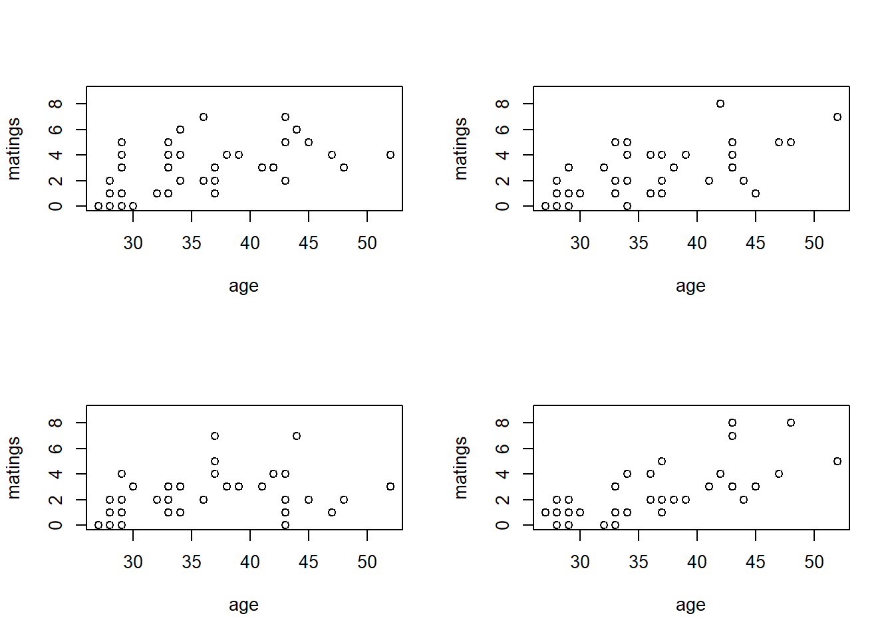
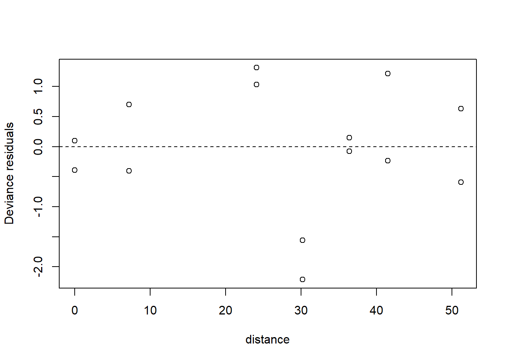

# Generalized linear models


Generalized linear modes allow us to extend the machinery of the "general linear model" (regression and ANOVA) to data sets in which the response variable may have a non-Gaussian distribution.  Generalized linear models do not encompass all possible distributions for the response variable.  Instead, the distribution of the response variable must belong to a group of distributions known as the "exponential family".  (Note that there is also such a thing as an exponential distribution.  The exponential distribution is one of the distributions in the exponential family, but it is not the only one.)  The exponential family of distributions includes many of the distributions that we encounter in practical data analysis, including Poisson, negative binomial, binomial, gamma, and beta distributions. The Gaussian distribution is included in the exponential family as well. One notable distribution that is not part of the exponential family is the $t$-distribution.  Distributions in the exponential family all give rise to likelihoods that share the same general form, and thus can be handled with a unified fitting scheme.

In practice, logistic regression (with binomial responses) and Poisson regression are far and away the two most common forms of generalized linear models that one encounters.  

## Poisson regression

We will begin with an example of Poisson regression.  These data are originally from Poole, Anim. Behav. 37 (1989):842-49, and were analyzed in the second edition of Ramsey \& Schafer's *Statistical Sleuth*.  They describe an observational study of 41 male elephants  over 8 years at Amboseli National Park in Kenya.  Each record in this data set gives the age of a male elephant at the beginning of a study and the number of successful matings for the elephant over the study's duration.  The number of matings is a count variable.  Our goal is to characterize how the number of matings is related to the elephant's age.  We'll start by fitting a model with the canonical log link.


```r
elephant <- read.table("data/elephant.txt", head = T)
head(elephant)
```

```
##   age matings
## 1  27       0
## 2  28       1
## 3  28       1
## 4  28       1
## 5  28       3
## 6  29       0
```

```r
with(elephant, plot(matings ~ age))
```


```r
fm1 <- glm(matings ~ age, 
           family = poisson(link = "log"), 
           data   = elephant)  # log link is the default

summary(fm1)
```

```
## 
## Call:
## glm(formula = matings ~ age, family = poisson(link = "log"), 
##     data = elephant)
## 
## Coefficients:
##             Estimate Std. Error z value Pr(>|z|)    
## (Intercept) -1.58201    0.54462  -2.905  0.00368 ** 
## age          0.06869    0.01375   4.997 5.81e-07 ***
## ---
## Signif. codes:  0 '***' 0.001 '**' 0.01 '*' 0.05 '.' 0.1 ' ' 1
## 
## (Dispersion parameter for poisson family taken to be 1)
## 
##     Null deviance: 75.372  on 40  degrees of freedom
## Residual deviance: 51.012  on 39  degrees of freedom
## AIC: 156.46
## 
## Number of Fisher Scoring iterations: 5
```
Thus the so-called pseudo-$R^2$ for the model with the log link is
$$
\mathrm{pseudo}-R^2 = 1 - \frac{51.012}{75.372} = 32.3\%
$$
We can visualize the fit by plotting a best-fitting line with a 95\% confidence interval.  Because the scale parameter is not estimated here, we will use a critical value from a standard normal distribution.  Later, when we estimate the scale parameter based on data, we will use a critical value from a $t$-distribution instead. 


```r
new.data <- data.frame(age = seq(from = min(elephant$age),
                                 to   = max(elephant$age),
                                 length = 100))

predict.fm1 <- predict(fm1, newdata = new.data, type = "response", se.fit = TRUE)

with(elephant, plot(matings ~ age))
lines(x = new.data$age, y = predict.fm1$fit, col = "red")

# add lines for standard errors

lines(x   = new.data$age, 
      y   = predict.fm1$fit - 1.96 * predict.fm1$se.fit, 
      col = "red",
      lty = "dashed")

lines(x   = new.data$age, 
      y   = predict.fm1$fit + 1.96 * predict.fm1$se.fit, 
      col = "red",
      lty = "dashed")
```


While the canonical link is a natural starting point, we are free to try other link functions as well.  Below, we try the identity link and plot the fit.


```r
fm2 <- glm(matings ~ age, family = poisson(link = "identity"), data = elephant)  

summary(fm2)
```

```
## 
## Call:
## glm(formula = matings ~ age, family = poisson(link = "identity"), 
##     data = elephant)
## 
## Coefficients:
##             Estimate Std. Error z value Pr(>|z|)    
## (Intercept) -4.55205    1.33916  -3.399 0.000676 ***
## age          0.20179    0.04023   5.016 5.29e-07 ***
## ---
## Signif. codes:  0 '***' 0.001 '**' 0.01 '*' 0.05 '.' 0.1 ' ' 1
## 
## (Dispersion parameter for poisson family taken to be 1)
## 
##     Null deviance: 75.372  on 40  degrees of freedom
## Residual deviance: 50.058  on 39  degrees of freedom
## AIC: 155.5
## 
## Number of Fisher Scoring iterations: 5
```

```r
predict.fm2 <- predict(fm2, newdata = new.data, type = "response", se.fit = TRUE)

with(elephant, plot(matings ~ age))
lines(x = new.data$age, y = predict.fm2$fit, col = "blue")

lines(x   = new.data$age, 
      y   = predict.fm2$fit - 1.96 * predict.fm2$se.fit, 
      col = "blue",
      lty = "dashed")

lines(x   = new.data$age, 
      y   = predict.fm2$fit + 1.96 * predict.fm2$se.fit, 
      col = "blue",
      lty = "dashed")
```


Note that the choice of the link function has a substantial impact on the shape of the fit.  The canonical (log) link suggests that the average number of matings increases with age at an accelerating rate, while the identity link suggests that the average number of matings increases steadily with age.  The AIC favors the identity link here.

We can also have a look at the residuals to see if they suggest any model deficiencies.  In general, we prefer the deviance residuals, so we will look at them.


```r
plot(x = elephant$age, 
     y = residuals(fm2, type = "deviance"),
     xlab = "age",
     ylab = "Deviance residuals")

abline(h = 0, lty = "dashed")
```


The residuals do not suggest any deficiency in the fit.

For this fit, the residual deviance suggests a small amount of overdispersion.  To be on the safe side, we can fit a quasi-Poisson model in which the scale (overdispersion) parameter is estimated from the data.  Note that when we estimate the overdispersion parameter, the estimates of the model parameters do not change, but their standard errors increase.  Consequently, the uncertainty in the fit increases as well.  In this case, however, the increase is so slight that it is barely noticeable.


```r
fm3 <- glm(matings ~ age, family = quasipoisson(link = "identity"), data = elephant)  

summary(fm3)
```

```
## 
## Call:
## glm(formula = matings ~ age, family = quasipoisson(link = "identity"), 
##     data = elephant)
## 
## Coefficients:
##             Estimate Std. Error t value Pr(>|t|)    
## (Intercept) -4.55205    1.42164  -3.202  0.00272 ** 
## age          0.20179    0.04271   4.725 2.97e-05 ***
## ---
## Signif. codes:  0 '***' 0.001 '**' 0.01 '*' 0.05 '.' 0.1 ' ' 1
## 
## (Dispersion parameter for quasipoisson family taken to be 1.126975)
## 
##     Null deviance: 75.372  on 40  degrees of freedom
## Residual deviance: 50.058  on 39  degrees of freedom
## AIC: NA
## 
## Number of Fisher Scoring iterations: 5
```

```r
predict.fm3 <- predict(fm3, newdata = new.data, type = "response", se.fit = TRUE)

with(elephant, plot(matings ~ age))
lines(x = new.data$age, y = predict.fm3$fit, col = "blue")

lines(x   = new.data$age, 
      y   = predict.fm3$fit + qt(0.025, df = 39) * predict.fm3$se.fit, 
      col = "blue",
      lty = "dashed")

lines(x   = new.data$age, 
      y   = predict.fm3$fit + qt(0.975, df = 39) * predict.fm3$se.fit, 
      col = "blue",
      lty = "dashed")
```


As an alternative, we could fit a model that uses a negative binomial distribution for the response.  Negative binomial distributions belong to the exponential family, so we can fit them using the GLM framework.  However, the authors of `glm` did not include a negative binomial family in their initial code.  Venables & Ripley's `MASS` package includes a program called `glm.nb` which is specifically designed for negative binomial responses.  `MASS::glm.nb` uses the parameterization familiar to ecologists, although they use the parameter $\theta$ instead of $k$.  So, in their notation, if $y \sim \mathrm{NB}(\mu, \theta)$, then $\mathrm{Var}(y) = \mu + \mu^2/\theta$.


```r
require(MASS)
```

```
## Loading required package: MASS
```

```r
fm4 <- glm.nb(matings ~ age, link = identity, data = elephant)  

summary(fm4)
```

```
## 
## Call:
## glm.nb(formula = matings ~ age, data = elephant, link = identity, 
##     init.theta = 15.80269167)
## 
## Coefficients:
##             Estimate Std. Error z value Pr(>|z|)    
## (Intercept) -4.56939    1.45770  -3.135  0.00172 ** 
## age          0.20232    0.04428   4.569  4.9e-06 ***
## ---
## Signif. codes:  0 '***' 0.001 '**' 0.01 '*' 0.05 '.' 0.1 ' ' 1
## 
## (Dispersion parameter for Negative Binomial(15.8027) family taken to be 1)
## 
##     Null deviance: 64.836  on 40  degrees of freedom
## Residual deviance: 43.214  on 39  degrees of freedom
## AIC: 156.87
## 
## Number of Fisher Scoring iterations: 1
## 
## 
##               Theta:  15.8 
##           Std. Err.:  23.0 
## 
##  2 x log-likelihood:  -150.872
```

```r
predict.fm4 <- predict(fm4, newdata = new.data, type = "response", se.fit = TRUE)

with(elephant, plot(matings ~ age))
lines(x = new.data$age, y = predict.fm4$fit, col = "blue")

lines(x   = new.data$age, 
      y   = predict.fm4$fit + 1.96 * predict.fm4$se.fit, 
      col = "blue",
      lty = "dashed")

lines(x   = new.data$age, 
      y   = predict.fm4$fit - 1.96 * predict.fm4$se.fit, 
      col = "blue",
      lty = "dashed")
```


Notice that $\hat{\theta} = 15.8$, again indicating that the extra-Poisson variation is mild.  Notice also that the error bounds on the fitted curve are ever so slightly larger than the error bounds from the Poisson fit, and nearly identical to the error bounds from the quasi-Poisson fit.

## Bayesian interlude

### rstanarm

We will take a look at how Poisson regression can be handled from a Bayesian perspective.  This interlude will also allow us to introduce a few more Bayesian concepts.  

We'll first fit the Poisson regression with identity link using `rstanarm::stan_glm`.


```r
require(rstanarm)
```

```
## Loading required package: rstanarm
```

```
## Loading required package: Rcpp
```

```
## This is rstanarm version 2.21.4
```

```
## - See https://mc-stan.org/rstanarm/articles/priors for changes to default priors!
```

```
## - Default priors may change, so it's safest to specify priors, even if equivalent to the defaults.
```

```
## - For execution on a local, multicore CPU with excess RAM we recommend calling
```

```
##   options(mc.cores = parallel::detectCores())
```

```r
fm5 <- stan_glm(matings ~ age, 
                family = poisson(link = "identity"), 
                data   = elephant,
                seed   = 1)  
```

```r
print(fm5, digits = 3)
```

```
## stan_glm
##  family:       poisson [identity]
##  formula:      matings ~ age
##  observations: 41
##  predictors:   2
## ------
##             Median MAD_SD
## (Intercept) -4.420  1.358
## age          0.198  0.041
## 
## ------
## * For help interpreting the printed output see ?print.stanreg
## * For info on the priors used see ?prior_summary.stanreg
```

We can visualize the marginal posterior of the slope using `bayesplot::mcmc_areas`:


```r
posterior.fm5 <- as.matrix(fm5)

bayesplot::mcmc_areas(posterior.fm5,
                      pars = c("age"),
                      prob = 0.95) 
```


Notice that the slope of the fitted regression line is slightly attenuated relative to the ML fit from the frequentist analysis.  The reason is that the default priors selected by `rstanarm` are actually reasonably strong:

```r
prior_summary(fm5)
```

```
## Priors for model 'fm5' 
## ------
## Intercept (after predictors centered)
##  ~ normal(location = 0, scale = 2.5)
## 
## Coefficients
##   Specified prior:
##     ~ normal(location = 0, scale = 2.5)
##   Adjusted prior:
##     ~ normal(location = 0, scale = 0.38)
## ------
## See help('prior_summary.stanreg') for more details
```

`rstanarm` parameterizes the normal distribution by its mean and standard deviation.  Thus, the prior for the slope has a mean of 0 and standard deviation of 2.5.  (I think: I don't yet understand the difference between the 'specified prior' and the 'adjusted prior'.)  This relatively strong prior reflects the views of the developers of `rstanarm`, who think there is benefit to shrinking most estimated effects slightly towards 0.  If we want to override this default and use weaker priors, we can do so as follows.  

```r
fm5 <- stan_glm(matings ~ age, 
                family = poisson(link = "identity"), 
                data   = elephant,
                prior  = normal(0, 100), 
                prior_intercept = normal(0, 100),
                seed   = 1)  
```

```r
print(fm5, digits = 3)
```

```
## stan_glm
##  family:       poisson [identity]
##  formula:      matings ~ age
##  observations: 41
##  predictors:   2
## ------
##             Median MAD_SD
## (Intercept) -4.444  1.320
## age          0.200  0.039
## 
## ------
## * For help interpreting the printed output see ?print.stanreg
## * For info on the priors used see ?prior_summary.stanreg
```

Weakening the prior results in a posterior mean for the slope that is closer to the MLE from the frequentist analysis.

We can visualize the fit in the usual way, by plotting sample draws from the MCMC sampler.

```r
mcmc.sims <- as.matrix(fm5)

with(elephant, plot(matings ~ age, type = "n"))

sample.sims <- sample(nrow(mcmc.sims), size = 100)
for (i in sample.sims) {
   abline(a = mcmc.sims[i, 1], b = mcmc.sims[i, 2], col = "skyblue")
}

abline(a = coef(fm5)['(Intercept)'], b = coef(fm5)['age'], col = "blue", lwd = 2)

with(elephant, points(matings ~ age, pch = 16))
```


### Posterior predictive checks

How might we assess the quality of this fit?  A Bayesian approach to assessing the quality of fit is to generate posterior predictive distributions.  A "posterior predictive" data set is a new data set of hypothetical observations simulated using the parameter values from one of the samples of the MCMC sampler.  By creating many such data sets, we can build up a distribution of data sets predicted by the posterior distribution of the model parameters.  By comparing the actual observed data to this distribution, we can gain a sense of whether our data are consistent with the posterior fit.

The authors of `rstanarm` advocate using posterior predictive checks extensively to assess model adequacy.  For that reason, they have included a number of tools that make posterior predictive checking simple.  For example, the command `rstanarm::posterior_predict` generates a collection of hypothetical data sets by randomly sampling from the posterior distribution of the parameters. The default behavior is to generate a collection of 1000 such data sets.


```r
post.predict <- posterior_predict(fm5)
```

For example, we can have a look at a few of these hypothetical data sets.

```r
par(mfrow = c(2, 2))

for(i in 1:4) {
  
  with(elephant, plot(matings ~ age, type = "n"))
  points(elephant$age, post.predict[i, ], pch = 1)
}
```



Our task is to determine if the real data set that we actually observed is consistent with this collection of hypothetical data sets.  To do so, we can calculate a summary statistic that captures an interesting feature of each data set, and compare the value of that summary statistic for the real data set to the distribution of values across the simulated data sets.

What summary statistic would you use to compare the real elephant data set to these simulated ones?  We'll use the marginal standard deviation of the number of matings below, but there might be other or better examples that you could think of.  Typically, one uses several posterior predictive statistics, not just one.  First, we calculate the distribution of marginal standard deviations across the collection of simulated data sets.  This R code illustrates the use of the handy R command `apply`, which applies a function to one of the margins (rows or columns) of an array.  Here, because the individual data sets are stored as the rows of `post.predict`, we will calculate the standard deviation of the contents of each row.


```r
post.predict.sd <- apply(post.predict, 1, sd)
```

Now we plot a histogram of these standard deviations and compare the distribution to the marginal standard deviation of the real data.


```r
hist(post.predict.sd, breaks = 20, xlab = "Marginal SD of response")
abline(v = sd(elephant$matings), col = "red", lwd = 2)
```


The actual standard deviation, shown by the red line, is consistent with the standard deviations of the simulated data sets, indicating that the model provides a reasonable description of the data, at least with regard to the marginal SD of the response variable.  This is consistent with our previous conclusions that the extra-Poisson variation in these data is quite mild.

The authors of `rstanarm` have provided the function `pp_check` (for [p]osterior [p]redictive check) to do all of this in one fell swoop.


```r
pp_check(fm5, plotfun = "stat", stat = "sd", binwidth = .1)
```


### JAGS

We can also code the model up directly in JAGS.  Notice that the code here is barely more complicated than OLS regression.  The code below shows the JAGS implementation of the elephant GLM with a Poisson distribution for the response and a log link.


```r
require(R2jags)
```

```
## Loading required package: R2jags
```

```
## Loading required package: rjags
```

```
## Loading required package: coda
```

```
## Linked to JAGS 4.3.1
```

```
## Loaded modules: basemod,bugs
```

```
## 
## Attaching package: 'R2jags'
```

```
## The following object is masked from 'package:coda':
## 
##     traceplot
```

```r
elephant.model <- function() {
   
   for (j in 1:J) {             # J = number of data points
      
      y[j] ~ dpois(mu[j])      # data model:  the likelihood 
      
      mu[j] <- exp(eta[j])      # inverse link
      eta[j] <- a + b * x[j]  # linear predictor
   }
   
   a ~ dnorm (0.0, 1E-6)       # prior for intercept
   b ~ dnorm (0.0, 1E-6)       # prior for slope
}

jags.data <- list(y = elephant$matings, 
                  x = elephant$age,
                  J = nrow(elephant))

jags.params <- c("a", "b")

jags.inits <- function(){
   list("a" = rnorm(1), "b" = rnorm(1))
}

set.seed(1)

jagsfit <- jags(data               = jags.data, 
                inits              = jags.inits, 
                parameters.to.save = jags.params,
                model.file         = elephant.model,
                n.chains           = 3,
                n.iter             = 5E4,
                n.thin             = 5)
```

```
## module glm loaded
```
Let's have a look at the posterior summaries:

```r
mcmc.output <- as.data.frame(jagsfit$BUGSoutput$sims.list)
apply(mcmc.output, 2, mean)
```

```
##            a            b     deviance 
##  -1.59257609   0.06871434 154.47531083
```

```r
HPDinterval(as.mcmc(mcmc.output), prob = 0.95)
```

```
##                 lower        upper
## a         -2.64905619  -0.54223141
## b          0.04194793   0.09511553
## deviance 152.45783408 158.39245393
## attr(,"Probability")
## [1] 0.95
```

Compare these to the values generated by the `glm` fit with the log link.  We can also visualize the uncertainty in the fit by plotting the fit implied by a random sample of parameters from the posterior:

```r
plot(matings ~ age, data = elephant, type = "n")

subset.samples <- sample(nrow(mcmc.output), size = 100)

for(i in subset.samples) {
   
   a <- mcmc.output$a[i]
   b <- mcmc.output$b[i]
   
   my.fit <- function(x) exp(a + b * x)
   
   curve(my.fit, 
         from = min(elephant$age), 
         to   = max(elephant$age),
         col  = "deepskyblue", 
         lwd  = 1, 
         add  = TRUE)
}

with(elephant, points(matings ~ age, pch = 16))

post.means <- apply(mcmc.output, 2, mean)

my.fit <- function(x) exp(post.means['a'] + post.means['b'] * x)

curve(my.fit, 
      from = min(elephant$age), 
      to   = max(elephant$age),
      col  = "blue", 
      lwd  = 2, 
      add  = TRUE)
```


Suppose we wanted to fit this model using JAGS with the identity link, so that the relationship between mean matings and age was linear.  To do so, we would have to be careful, because we would have to make sure that the MCMC sampler did not stray into regions that generated negative values for the observation-level mean, $\mu$.  Mathematically, we simply want to construct a likelihood that evaluates to 0 whenever $\mu \leq 0$.  However, as of this writing, I haven't figured out what the best approach is for implementing such a model in JAGS.

### Observation-level random effects

We use this opportunity to introduce an alternative approach to accommodating overdispersion in models with non-Gaussian responses.  This alternative approach entails adding a latent Gaussian-distributed random effect to the linear predictor.  Because this random effect takes a unique value for each observation, it is known as a "observation-level random effect".  Observation-level random effects are motivated by the idea that overdispersion is caused by additional inputs or factors that vary among observations and re not included in the model.  For example, knowing next to nothing about elephants, we might speculate that there are additional factors that influence a male elephant's mating success above and beyond age, such as (say) nutrition. The observation-level random effects are meant to capture this additional variation.  Importantly, if we use an observation-level random effect, then we have no control on the sign of the linear predictor $\eta$.  Consequently, we must use a link function that maps any value of the linear predictor ($\eta$) to a valid value of the observation-level mean ($\mu$).  (In other words, we can't use the identity link for a Poisson response.)  For the elephant data, adding an observation-level random effect changes the model to:
\begin{align*}
y_i & \sim \mathrm{Pois}(\mu_i)\\
\mu_i  & = \exp({\eta_i}) \\
\eta_i & \sim \mathcal{N}(a + b x_i, \sigma^2_\eta).
\end{align*}

Priors on $a$, $b$, and $\sigma^2_\eta$ would complete the Bayesian specification.  Implemeting the model in JAGS is straightforward:

```r
elephant.model.2 <- function() {
   
   for (j in 1:J) {             # J = number of data points
      
      y[j] ~ dpois(mu[j])      # data model:  the likelihood 
      
      mu[j] <- exp(eta[j])      # inverse link
      eta[j] ~ dnorm(a + b * x[j], tau_eps)  # linear predictor, includes observation-level random effect
   }
   
   a ~ dnorm (0.0, 1E-6)       # prior for intercept
   b ~ dnorm (0.0, 1E-6)       # prior for slope
   tau_eps ~ dgamma (0.01, 0.01)
   
   sd_eps <- pow(tau_eps, -1/2)
}

jags.data <- list(y = elephant$matings, 
                  x = elephant$age,
                  J = nrow(elephant))

jags.params <- c("a", "b", "sd_eps")

jags.inits <- function(){
   list("a" = rnorm(1), "b" = rnorm(1), "tau_eps" = runif(1))
}

set.seed(1)

jagsfit2 <- jags(data               = jags.data, 
                 inits              = jags.inits, 
                 parameters.to.save = jags.params,
                 model.file         = elephant.model.2,
                 n.chains           = 3,
                 n.iter             = 5E4,
                 n.thin             = 5)
```

Again, we can have a look at the posterior summaries.

```r
mcmc.output <- as.data.frame(jagsfit2$BUGSoutput$sims.list)
apply(mcmc.output, 2, mean)
```

```
##            a            b     deviance       sd_eps 
##  -1.65360318   0.06934144 147.14813848   0.27075058
```

```r
HPDinterval(as.mcmc(mcmc.output), prob = 0.95)
```

```
##                 lower       upper
## a         -2.85901410  -0.4407061
## b          0.03818321   0.1005042
## deviance 133.86486164 158.2878871
## sd_eps     0.06376511   0.5261329
## attr(,"Probability")
## [1] 0.95
```

Plotting the posterior fit in this case is more subtle.  With the observation-level random effect, we now have a model that includes a random effect behind a non-linear link function.  In other words, we have a generalizd linear mixed model (GLMM).  The combination of a random effect and a non-linear link function means that there are two different ways to calculate the fitted value --- the so-called "marginal means" and the "conditional means".  We will defer a discussion of this distinction until we discuss GLMMs in greater detail.  Accordingly, we defer the plot as well.

<!-- ```{r}
plot(matings ~ age, data = elephant, type = "n")

subset.samples <- sample(nrow(mcmc.output), size = 100)

for(i in subset.samples) {
   
   a <- mcmc.output$a[i]
   b <- mcmc.output$b[i]
   
   my.fit <- function(x) exp(a + b * x)
   
   curve(my.fit, 
         from = min(elephant$age), 
         to   = max(elephant$age),
         col  = "deepskyblue", 
         lwd  = 1, 
         add  = TRUE)
}

with(elephant, points(matings ~ age, pch = 16))

post.means <- apply(mcmc.output, 2, mean)

my.fit <- function(x) exp(post.means['a'] + post.means['b'] * x)

curve(my.fit, 
      from = min(elephant$age), 
      to   = max(elephant$age),
      col  = "blue", 
      lwd  = 2, 
      add  = TRUE)
```

Because the extra-Poisson variation in the elephant data is small, the effect of the observation-level random effect is slight.  However, an eagle-eyed observer might notice the following differences.  First, the posterior uncertainty in the slope parameter that captures the effect of age has increased slightly.  Second, and perhaps more meaningfully, the fitted curve has dropped slightly.    This makes sense, as the model with the observation-level random effect doesn't have to strain quite as hard to accommodate the few elephants with large and positive residuals.  Thus, adding an observation-level random effect has had the same effect on the fit as other approaches to accommodating extra-Poisson variaton.  
-->

Formally, we can assess the need for the observation-level random effect by comparing the two models with the deviance information criterion (DIC), an information criterion that can be used to compare Bayesian models in the same way that AIC can be used to compare frequentist fits.  DIC is provided as a portion to the output from the `print` command applied to a JAGS model fit.


```r
print(jagsfit)
```

```
## Inference for Bugs model at "C:/Users/krgross/AppData/Local/Temp/RtmpgZYVMt/model14705d217627.txt", fit using jags,
##  3 chains, each with 50000 iterations (first 25000 discarded), n.thin = 5
##  n.sims = 15000 iterations saved
##          mu.vect sd.vect    2.5%     25%     50%     75%   97.5%  Rhat n.eff
## a         -1.593   0.544  -2.656  -1.961  -1.582  -1.223  -0.546 1.001 12000
## b          0.069   0.014   0.042   0.059   0.069   0.078   0.095 1.001  9200
## deviance 154.475   2.737 152.508 153.036 153.848 155.210 159.742 1.001 15000
## 
## For each parameter, n.eff is a crude measure of effective sample size,
## and Rhat is the potential scale reduction factor (at convergence, Rhat=1).
## 
## DIC info (using the rule, pD = var(deviance)/2)
## pD = 3.7 and DIC = 158.2
## DIC is an estimate of expected predictive error (lower deviance is better).
```

```r
print(jagsfit2)
```

```
## Inference for Bugs model at "C:/Users/krgross/AppData/Local/Temp/RtmpgZYVMt/model14706e2723b.txt", fit using jags,
##  3 chains, each with 50000 iterations (first 25000 discarded), n.thin = 5
##  n.sims = 15000 iterations saved
##          mu.vect sd.vect    2.5%     25%     50%     75%   97.5%  Rhat n.eff
## a         -1.654   0.622  -2.913  -2.065  -1.640  -1.233  -0.482 1.004   680
## b          0.069   0.016   0.039   0.059   0.069   0.080   0.101 1.003   850
## sd_eps     0.271   0.132   0.081   0.167   0.252   0.352   0.574 1.001 15000
## deviance 147.148   6.377 133.573 142.883 147.837 151.760 158.083 1.001 15000
## 
## For each parameter, n.eff is a crude measure of effective sample size,
## and Rhat is the potential scale reduction factor (at convergence, Rhat=1).
## 
## DIC info (using the rule, pD = var(deviance)/2)
## pD = 20.3 and DIC = 167.5
## DIC is an estimate of expected predictive error (lower deviance is better).
```

In this case, the DIC favors the model without the observation-level random effect. 

Before moving on, it is worth noting that this Poisson regression with an observation-level random effect is the type of model that is much easier to fit from a Bayesian perspective.  To approach this model from the frequentist perspective, we would have to write down, and maximize, the likelihood, which is a function of the model's three parameters: $a$, $b$, and $\sigma^2_\eta$.  However, to write down the likelihood, we would have to integrate out the observation-level random effects. For the elephant data, this would correspond to an integral with 41 dimensions!  While we could conceivably write this down, for all intents and purposes the likelihood would be impossible to compute, let alone to maximize.  From a Bayesian perspective, though, adding latent random effects to a model with a non-normal response is nearly trivial.

The above discussion begs the question of just how programs like `lme4::lmer` fit mixed-effect models in the first place.  It turns out that, with a Gaussian response, the high-dimensional integral in the likelihood can be simplified without having to compute the entire integral numerically.  This simplification flows from the fact that Gaussian random variates have a natural multivariate form.  With a non-Gaussian response, things become substantially harder.  When we study generalized linear mixed models, we will see some ideas for computing these likelihood functions, but all such approaches ultimately rely on computational approximations instead of evaluating the underlying integrals directly.

## Binary responses

We generally distinguish between two types of data with binary responses: Data in which each individual record is a separate a binary response, and data in which each record consists of a group of binary observations.  The same methods can be used for either type of data.  We will begin by studying a data set with individual binary responses, and then use the industrial melanism data to illustrate grouped binary responses.

### Individual binary responses: TB in boar

To illustrate individual binary data, we will use a data set analyzed by Zuur et al. (2009) in their Ch. 10.  As explained by Zuur et al., these data describe the incidence of "tuberculosis-like lesions in wild boar *Sus scrofa*" in southern Spain, and were originally collected by Vicente et al. (2006).  The potential explanatory variables in the data set include a measure of the animal's size, it's sex, and a grouping into one of four age classes.

Preparatory work:

```r
boar <- read.table("data/boar.txt", head = T)

# remove incomplete records
boar <- na.omit(boar)

# convert sex to a factor
boar$SEX <- as.factor(boar$SEX)

names(boar) <- c("tb", "sex", "age", "length")
summary(boar)
```

```
##        tb         sex          age            length     
##  Min.   :0.0000   1:206   Min.   :1.000   Min.   : 46.5  
##  1st Qu.:0.0000   2:288   1st Qu.:3.000   1st Qu.:107.0  
##  Median :0.0000           Median :3.000   Median :122.0  
##  Mean   :0.4575           Mean   :3.142   Mean   :117.3  
##  3rd Qu.:1.0000           3rd Qu.:4.000   3rd Qu.:130.4  
##  Max.   :1.0000           Max.   :4.000   Max.   :165.0
```

We'll fit the usual logistic regression model first, considering only the animal's size as a predictor.  Size in this case is a measure of the length of the animal, in cm.

```r
fm1 <- glm(tb ~ length, family = binomial(link = "logit"), data = boar)
summary(fm1)
```

```
## 
## Call:
## glm(formula = tb ~ length, family = binomial(link = "logit"), 
##     data = boar)
## 
## Coefficients:
##              Estimate Std. Error z value Pr(>|z|)    
## (Intercept) -4.137107   0.695381  -5.949 2.69e-09 ***
## length       0.033531   0.005767   5.814 6.09e-09 ***
## ---
## Signif. codes:  0 '***' 0.001 '**' 0.01 '*' 0.05 '.' 0.1 ' ' 1
## 
## (Dispersion parameter for binomial family taken to be 1)
## 
##     Null deviance: 681.25  on 493  degrees of freedom
## Residual deviance: 641.23  on 492  degrees of freedom
## AIC: 645.23
## 
## Number of Fisher Scoring iterations: 4
```


```r
with(boar, plot(tb ~ length))

# add a line for the fitted probabilities of tb

new.data <- data.frame(length = seq(from = min(boar$length),
                                    to   = max(boar$length),
                                    length = 100))

predict.fm1 <- predict(fm1, newdata = new.data, type = "response", se.fit = TRUE)

lines(x = new.data$length, y = predict.fm1$fit, col = "red")

# add lines for standard errors
# use critical value from z distribution here because
# the scale parameter is not estimated

lines(x   = new.data$length, 
      y   = predict.fm1$fit - 1.96 * predict.fm1$se.fit, 
      col = "red",
      lty = "dashed")

lines(x   = new.data$length, 
      y   = predict.fm1$fit + 1.96 * predict.fm1$se.fit, 
      col = "red",
      lty = "dashed")
```


Regression coefficients in logistic regression can be a bit hard to interpret.  One interpretation flows from exponentiating the regression coefficient to obtain an odds ratio.  For the boar data, the regression coefficient of 0.0335 corresponds to an odds ratio of $e^{0.0335}$ = 1.034.  This means that for two boars that differ by one cm in length, the larger boar's odds of having a TB-like lesion will be 1.034 times the smaller boar's odds of having such a lesion.  

Overdispersion is typically not an issue with individual binary response data.  Nonetheless, the pseudo-$R^2$ here is fairly low.  We can try the probit and complementary log-log links to see if we obtain a better fit:


```r
# probit link

fm1a <- glm(tb ~ length, family = binomial(link = "probit"), data = boar)

# complementary log-log link

fm1b <- glm(tb ~ length, family = binomial(link = "cloglog"), data = boar)
AIC(fm1, fm1a, fm1b)
```

```
##      df      AIC
## fm1   2 645.2265
## fm1a  2 645.2665
## fm1b  2 645.6100
```

```r
# make a plot to compare the fits with the different links

predict.fm1a <- predict(fm1a, newdata = new.data, type = "response", se.fit = TRUE)
predict.fm1b <- predict(fm1b, newdata = new.data, type = "response", se.fit = TRUE)

with(boar, plot(tb ~ length))

lines(x = new.data$length, y = predict.fm1$fit, col = "red", lwd = 2)
lines(x = new.data$length, y = predict.fm1a$fit, col = "blue", lwd = 2)
lines(x = new.data$length, y = predict.fm1b$fit, col = "forestgreen", lwd = 2)

legend("left", 
       leg = c("logit", "probit", "cloglog"), 
       col = c("red", "blue", "forestgreen"), 
       pch = 16)
```


The logit and probit links are nearly identical.  The complementary log-log link differs slightly, but the logit link is AIC-best.

Try adding sex and age class as predictors.  Some of the MLEs cannot be found, because none of the individuals with \texttt{sex = 1} and \texttt{age = 1} are infected, thus the MLE of the log odds of infection for this group (which happens to be the baseline) is $-\infty$.  This phenomenon is known as "complete separation".


```r
# fit a model with sex, age (as a categorical predictor) and their interaction

fm2 <- glm(tb ~ length + sex * as.factor(age),
           family = binomial,
           data = boar)

summary(fm2)
```

```
## 
## Call:
## glm(formula = tb ~ length + sex * as.factor(age), family = binomial, 
##     data = boar)
## 
## Coefficients:
##                       Estimate Std. Error z value Pr(>|z|)
## (Intercept)          -16.55356  724.50177  -0.023    0.982
## length                 0.01840    0.01253   1.469    0.142
## sex2                  14.19739  724.50190   0.020    0.984
## as.factor(age)2       13.83446  724.50169   0.019    0.985
## as.factor(age)3       14.31136  724.50191   0.020    0.984
## as.factor(age)4       14.68141  724.50219   0.020    0.984
## sex2:as.factor(age)2 -14.53254  724.50204  -0.020    0.984
## sex2:as.factor(age)3 -14.36861  724.50196  -0.020    0.984
## sex2:as.factor(age)4 -14.53354  724.50196  -0.020    0.984
## 
## (Dispersion parameter for binomial family taken to be 1)
## 
##     Null deviance: 681.25  on 493  degrees of freedom
## Residual deviance: 635.43  on 485  degrees of freedom
## AIC: 653.43
## 
## Number of Fisher Scoring iterations: 14
```

```r
with(boar, table(tb, age, sex))
```

```
## , , sex = 1
## 
##    age
## tb   1  2  3  4
##   0  4 37 37 28
##   1  0 14 34 52
## 
## , , sex = 2
## 
##    age
## tb   1  2  3  4
##   0  7 40 62 53
##   1  2 11 48 65
```

There are several possible remedies here.  The first is to try to reduce the number of parameters in the model, perhaps by eliminating the interaction between sex and age class.

```r
# fit a model with sex, age (as a categorical predictor) and their interaction

fm3 <- glm(tb ~ length + sex + as.factor(age),
            family = binomial,
            data = boar)

summary(fm3)
```

```
## 
## Call:
## glm(formula = tb ~ length + sex + as.factor(age), family = binomial, 
##     data = boar)
## 
## Coefficients:
##                 Estimate Std. Error z value Pr(>|z|)  
## (Intercept)     -2.67730    1.07306  -2.495   0.0126 *
## length           0.01959    0.01237   1.584   0.1133  
## sex2            -0.24297    0.19354  -1.255   0.2093  
## as.factor(age)2 -0.19847    0.92641  -0.214   0.8304  
## as.factor(age)3  0.33908    1.06938   0.317   0.7512  
## as.factor(age)4  0.59041    1.20582   0.490   0.6244  
## ---
## Signif. codes:  0 '***' 0.001 '**' 0.01 '*' 0.05 '.' 0.1 ' ' 1
## 
## (Dispersion parameter for binomial family taken to be 1)
## 
##     Null deviance: 681.25  on 493  degrees of freedom
## Residual deviance: 637.41  on 488  degrees of freedom
## AIC: 649.41
## 
## Number of Fisher Scoring iterations: 4
```
A second option is to use so-called ``exact'' methods for inference.  There doesn't appear to be a good package available for implementing these methods in R.  Other software packages might be necessary. 

### Grouped binary data: Industrial melanism

We'll start with the standard logistic regression model for the industrial melanism data.  We are primarily interested in determining if the effect of color morph on removal rate changes with distance from Liverpool.  For grouped binary data, we need to specify both the number of "successes" and number of "failures" as the response variable in the model.  Here, we use `cbind` to create a two-column matrix with the number of "successes" (moths removed) in the first column, and the number of "failures" (moths not removed) in the second column.  See the help documentation for `glm` for more details.


```r
moth <- read.table("data/moth.txt", head = TRUE, stringsAsFactors = TRUE)

fm1 <- glm(cbind(removed, placed - removed) ~ morph * distance, 
           family = binomial(link = "logit"),
           data = moth)

summary(fm1)
```

```
## 
## Call:
## glm(formula = cbind(removed, placed - removed) ~ morph * distance, 
##     family = binomial(link = "logit"), data = moth)
## 
## Coefficients:
##                      Estimate Std. Error z value Pr(>|z|)    
## (Intercept)         -1.128987   0.197906  -5.705 1.17e-08 ***
## morphlight           0.411257   0.274490   1.498 0.134066    
## distance             0.018502   0.005645   3.277 0.001048 ** 
## morphlight:distance -0.027789   0.008085  -3.437 0.000588 ***
## ---
## Signif. codes:  0 '***' 0.001 '**' 0.01 '*' 0.05 '.' 0.1 ' ' 1
## 
## (Dispersion parameter for binomial family taken to be 1)
## 
##     Null deviance: 35.385  on 13  degrees of freedom
## Residual deviance: 13.230  on 10  degrees of freedom
## AIC: 83.904
## 
## Number of Fisher Scoring iterations: 4
```

Grouped binary data are often overdispersed relative to the variance implied by a binomial distribution.  In this case, we would call the overdispersion "extra-binomial" variation.  As with count data, we can deal with overdispersion through a quasi-likelihood approach:


```r
fm1q <- glm(cbind(removed, placed - removed) ~ morph * distance, 
           family = quasibinomial(link = "logit"),
           data = moth)

summary(fm1q)
```

```
## 
## Call:
## glm(formula = cbind(removed, placed - removed) ~ morph * distance, 
##     family = quasibinomial(link = "logit"), data = moth)
## 
## Coefficients:
##                      Estimate Std. Error t value Pr(>|t|)    
## (Intercept)         -1.128987   0.223104  -5.060 0.000492 ***
## morphlight           0.411257   0.309439   1.329 0.213360    
## distance             0.018502   0.006364   2.907 0.015637 *  
## morphlight:distance -0.027789   0.009115  -3.049 0.012278 *  
## ---
## Signif. codes:  0 '***' 0.001 '**' 0.01 '*' 0.05 '.' 0.1 ' ' 1
## 
## (Dispersion parameter for quasibinomial family taken to be 1.270859)
## 
##     Null deviance: 35.385  on 13  degrees of freedom
## Residual deviance: 13.230  on 10  degrees of freedom
## AIC: NA
## 
## Number of Fisher Scoring iterations: 4
```

As with count data, using quasi-likelihood to estimate the scale (or dispersion) parameter increases the estimates of the standard errors of the coefficients by an amount equal to the square root of the estimated scale parameter.  

The $t$-test of the interaction between color morph and distance indicates that there is a statistically significant difference in how the proportion of moth removes changes over the distance transect between the two color morphs.


```r
plot(x = moth$distance, 
     y = residuals(fm1q, type = "deviance"),
     xlab = "distance",
     ylab = "Deviance residuals")

abline(h = 0, lty = "dashed")
```


The plot of the residuals suggests that we should include a random effect for the sampling station.  This makes complete sense.  The data for the two color morphs at each station share whatever other characteristics make the station unique, and are thus correlated.  To account for this correlation, we need to introduce a random effect for the station.  This again gets us into the world of generalized linear mixed models.  Before proceeding, we'll write the model down.  Let $i=1,2$ index the two color morphs, and let $j = 1, \ldots, 7$ index the stations.  Let $y_{ij}$ be the number of moths removed, let $n_{ij}$ be the number of moths placed, and let $x_j$ be the distance of the station from Liverpool.  We wish to fit the model
\begin{align*}
y_{ij} & \sim \mathrm{Binom}(p_{ij}, n_{ij})\\
\mathrm{logit}(p_{ij})  & = \eta_{ij} \\
\eta_{ij} & = a_i + b_i x_j + L_j \\
L_j & \sim \mathcal{N}(0, \sigma^2_L)
\end{align*}

The $L_j$'s are our [l]ocation-specific random effects that capture any other station-to-station differences above and beyond the station's distance from Liverpool.  (It turns out that an observation-level random effect does not improve the model, at least as indicated by DIC.)  Because this model includes both a random effect for the station and a non-Gaussian response, it is a generalized linear mixed model (GLMM).  We postpone our discussion accordingly.

<!-- We have already mentioned that the $t$-statistics reported in `summary.glm` are based on standard errors calculated from the curvature (Hessian) of the negative log-likelihood at the MLEs, with df determined by the df available for the residual deviance.  An alternative approach for testing for the significance of model terms is to use the residual deviance to compare nested models, much as one would use $F$-tests to compare nested models in ordinary least squares.  Here is a bit of theory.  Let $D$ denote the residual deviance for a model.  Suppose we are comparing two nested models: a parameter poor model that we call model 0, and a parameter rich model that we call model 1.  The parameter-rich model nests the parameter poor model.  Let $p_0$ and $p_1$ be the number of estimated parameters in the linear predictor of models 0 and 1, respectively, and let $D_0$ and $D_1$ denote the (residual) deviances of both models.  In the usual way, we wish to test whether or not the parameter-rich model provides a statistically significant improvement in fit over the parameter-poor model. -->

<!-- There are two separate approaches here depending on whether the scale parameter is known, or is estimated from the data.  If the scale parameter is known to be $\phi$, then define the scaled deviance as $D^* = D / \phi$.  The LRT to compare the two models is equal to the drop in the scaled deviance, $D^*_0 - D^*_1$.  Under the null hypothesis that the parameter-poor model generated the data, the test statistic has a $\chi^2$ distribution with $p_1 - p_0$ degrees of freedom. -->

<!-- If the scale parameter is estimated from the data, then we work with the (residual) deviances directly.  In this case, we calculate the $F$-statistic -->
<!-- $$ -->
<!-- F = \frac{(D_0 - D_1)/(p_1 - p_0)}{D_1 / (n - p_1)}. -->
<!-- $$ -->

<!-- Note that this is generalization of the usual $F$-statistic for comparing nested models from OLS.  Under the null hypothesis, the test statistic has an $F_{p_1 - p_0, n - p_1}$ distribution. -->


<!-- # test for interaction between distance and morph -->

<!-- ```{r} -->
<!-- fm2q <- glm(cbind(removed, placed - removed) ~ morph + distance,  -->
<!--             family = quasibinomial(link = "logit"), -->
<!--             data = moth) -->

<!-- anova(fm2q, fm1q, test = "F") -->
<!-- ``` -->

## Zero-adjusted models for count data

In count data, the frequency of zeros often differs from what the standard Poisson or negative binomial distributions would predict.  This occurs because the processes that lead to zero counts are often separate from the processes that govern the intensity of non-zero counts.  For example, when counting parasite loads of animals, one process may determine if an individual animal is infected at all, and a second process may determine the intensity of the parasite load for those animals that are infected.  This section discusses models for count data in which the proportion of zeros is modeled separately from the rest of the distribution.  Any of these models may be paired with Poisson or negative binomial models for the non-zero counts.

### Zero-truncated models

Zero-truncated distributions are simply those that condition on the count variable being greater than 0.  They are appropriate when the sampling procedure makes zeros unobservable.  Zero-truncated Poisson and negative binomial distributions are available as something of a side benefit the R library `VGAM` (an acronym for vector generalized additive models).  This package provides the function `vglm` (a version of `glm` that allows for vector-valued responses), which in turn accommodates the distribution families `pospoisson` and `posnegbinomial`.  The "pos" portion of each refers to the fact that the counts must be strictly positive.

We illustrate the use of a zero-truncated distribution with a species-abundance data set for butterflies provided in the `VGAM` package.  The description of the data set in `VGAM` reads: "About 3300 individual butterflies were caught in Malaya by naturalist Corbet trapping butterflies. They were classified to about 500 species."  The data give the frequencies in a species abundance distribution.


```r
require(VGAM)
```


```r
data(corbet)
head(corbet)
```

```
##   ofreq species
## 1     1     118
## 2     2      74
## 3     3      44
## 4     4      24
## 5     5      29
## 6     6      22
```

```r
with(corbet, barplot(species, names = ofreq,
                     xlab = "no. of individuals",
                     ylab = "frequency"))
```



We will fit a zero-truncated negative binomial distribution to these data, and compare the fitted zero-truncated distribution to the data.

<!-- Note: Something is weird here.  The ratio of the first two fitted probabilities is NOT the same as the ratio of the probability masses obtained by dnbinom evaluated at the parameter estimates.  Check into this. -->


```r
corbet.fit <- vglm(ofreq ~ 1, family = posnegbinomial, weights = species, data = corbet)
Coef(corbet.fit)
```

```
##      munb      size 
## 4.4802271 0.4906395
```

```r
mu.hat <- Coef(corbet.fit)["munb"]
k.hat  <- Coef(corbet.fit)["size"]

# 2023-05-26: dgainnbinom seems to have been deprecated from VGAM

# fitted.probs <- dgaitnbinom(x = corbet$ofreq, k.hat, munb.p = fitted(corbet.fit), truncate = 0)
# fitted.vals <- sum(corbet$species) * fitted.probs

# barplot(cbind(corbet$species, fitted.vals), beside = T, names = c("actual", "fitted"))
```


### Zero-inflated models

As the name suggests, zero-inflated (henceforth ZI) models are appropriate when zeros are more frequent than the distribution of the non-zero counts would suggest.  ZI models have two components.  In the "zero-inflation" component, a logistic regression (or some other generalized linear model for a binary response) captures whether the response is a "false" zero or a realization from a proper count distribution.  In the "count" component, a generalized linear model for count data (such as Poisson regression) is used to model the distribution of the non-false-zero counts.  The ZI model accords with the thinking that the data arise from a combination of two separate mechanisms: a first mechanism that determines whether or not the count is a "false" zero, and a second that determines the count if it is not a false zero.  In ecology, the zero-inflation component might correspond to (true) presence vs.\ absence, and the count component might correspond to the detected intensity conditional on presence.

To illustrate ZI models, we will use the cod parasite data described in $\S$ 11.3.2 of @zuur2009.  These data are counts of the number of trypanosome blood parasites in individual cod, and were initially reported in Hemmingsen et al.\ (2005).  First we load the data and do some housekeeping.


```r
cod <- read.table("data/ParasiteCod.txt", head = T)

# remove observations with missing data
cod <- na.omit(cod)
summary(cod)
```

```
##      Sample         Intensity         Prevalence          Year     
##  Min.   :   1.0   Min.   :  0.000   Min.   :0.0000   Min.   :1999  
##  1st Qu.: 299.5   1st Qu.:  0.000   1st Qu.:0.0000   1st Qu.:1999  
##  Median : 598.0   Median :  0.000   Median :0.0000   Median :2000  
##  Mean   : 613.7   Mean   :  6.209   Mean   :0.4534   Mean   :2000  
##  3rd Qu.: 955.5   3rd Qu.:  4.000   3rd Qu.:1.0000   3rd Qu.:2001  
##  Max.   :1254.0   Max.   :257.000   Max.   :1.0000   Max.   :2001  
##      Depth           Weight         Length            Sex       
##  Min.   : 50.0   Min.   :  34   Min.   : 17.00   Min.   :0.000  
##  1st Qu.:110.0   1st Qu.: 769   1st Qu.: 44.00   1st Qu.:1.000  
##  Median :180.0   Median :1446   Median : 54.00   Median :1.000  
##  Mean   :176.3   Mean   :1718   Mean   : 53.53   Mean   :1.427  
##  3rd Qu.:236.0   3rd Qu.:2232   3rd Qu.: 62.00   3rd Qu.:2.000  
##  Max.   :293.0   Max.   :9990   Max.   :101.00   Max.   :2.000  
##      Stage            Age              Area      
##  Min.   :0.000   Min.   : 0.000   Min.   :1.000  
##  1st Qu.:1.000   1st Qu.: 3.000   1st Qu.:2.000  
##  Median :1.000   Median : 4.000   Median :3.000  
##  Mean   :1.426   Mean   : 4.118   Mean   :2.568  
##  3rd Qu.:2.000   3rd Qu.: 5.000   3rd Qu.:3.000  
##  Max.   :4.000   Max.   :10.000   Max.   :4.000
```

There are a large number of potential predictors.  Following the analysis in Zuur et al., we will focus on the effects of length (a measure of the fish's size), year (which we will treat as a categorical predictor for flexibility), and "area", a categorical predictor for one of four areas in which the fish was sampled.  Before beginning, we will plot the data.  In the plot below, each row of the plot corresponds to a year, and each column (unlabeled) corresponds to one of the four areas, going from area 1 (the leftmost column) to area 4 (the rightmost column).  Because most of the parasite loads are zero or close to zero, we plot parasite load on a log(y + 1) scale. 


```r
par(mfrow = c(3, 4), mar = c(2, 2, 1, 1), oma = c(3, 7, 0, 0), las = 1)

for (i in unique(cod$Year)) {
  for (j in sort(unique(cod$Area))) {
    
    with(subset(cod, Year == i & Area == j), 
         plot(log(Intensity + 1) ~ Length, xlim = range(cod$Length), ylim = log(range(cod$Intensity) + 1),
              xlab = "", ylab = "", yaxt = "n"))
    
    axis(2, at = log(c(0, 10, 100) + 1), lab = c(0, 10, 100))
    
    if (j == 1) mtext(i, side = 2, line  = 3)
  }
}

mtext("length", side = 1, outer = T, line = 2)
mtext("parasite intensity", side = 2, outer = T, line = 5, las = 0)
```


With ZI models, one can use separate model combinations of predictors for the two components.  Indeed, if we think of the two components as capturing two different natural processes, then there is no reason that the predictors should have the same affect on both components.  Following Zuur et al., however, we will start with a ZINB model that includes length, year, area, and an interaction between year and area for both components.  Because both components are generalized linear models, both include a link function.  Here, we will use the default logit link for the zero-inflation component and log link for the count component.

To fit ZI models, we will use the `pscl` library from R.  The name `pscl` is an acronym for political science computing laboratory.  The `pscl` library includes functions for ZI poisson and negative binomial models (henceforth abbreviated ZIP and ZINB models).  


```r
require(pscl)
```

```
## Loading required package: pscl
```

```
## Classes and Methods for R developed in the
## Political Science Computational Laboratory
## Department of Political Science
## Stanford University
## Simon Jackman
## hurdle and zeroinfl functions by Achim Zeileis
```

```r
formula.1 <- formula(Intensity ~ Length + as.factor(Year) * as.factor(Area))

cod.nb.fm1 <- zeroinfl(formula.1, data  = cod, dist = "negbin") 
summary(cod.nb.fm1)
```

```
## 
## Call:
## zeroinfl(formula = formula.1, data = cod, dist = "negbin")
## 
## Pearson residuals:
##     Min      1Q  Median      3Q     Max 
## -0.6142 -0.4429 -0.3581 -0.1252 11.4529 
## 
## Count model coefficients (negbin with log link):
##                                       Estimate Std. Error z value Pr(>|z|)    
## (Intercept)                           3.733905   0.344398  10.842  < 2e-16 ***
## Length                               -0.036410   0.005108  -7.128 1.02e-12 ***
## as.factor(Year)2000                   0.063894   0.295639   0.216  0.82889    
## as.factor(Year)2001                  -0.939183   0.606056  -1.550  0.12122    
## as.factor(Area)2                      0.197761   0.329133   0.601  0.54794    
## as.factor(Area)3                     -0.646736   0.277793  -2.328  0.01991 *  
## as.factor(Area)4                      0.707493   0.252266   2.805  0.00504 ** 
## as.factor(Year)2000:as.factor(Area)2 -0.653983   0.535418  -1.221  0.22192    
## as.factor(Year)2001:as.factor(Area)2  0.967305   0.718165   1.347  0.17801    
## as.factor(Year)2000:as.factor(Area)3  1.024957   0.429599   2.386  0.01704 *  
## as.factor(Year)2001:as.factor(Area)3  1.002732   0.677502   1.480  0.13886    
## as.factor(Year)2000:as.factor(Area)4  0.534524   0.414976   1.288  0.19772    
## as.factor(Year)2001:as.factor(Area)4  0.855195   0.654394   1.307  0.19126    
## Log(theta)                           -0.966631   0.096345 -10.033  < 2e-16 ***
## 
## Zero-inflation model coefficients (binomial with logit link):
##                                        Estimate Std. Error z value Pr(>|z|)    
## (Intercept)                             0.19094    0.78133   0.244 0.806941    
## Length                                 -0.03884    0.01203  -3.227 0.001249 ** 
## as.factor(Year)2000                    -1.07163    2.00007  -0.536 0.592100    
## as.factor(Year)2001                     3.29316    0.71043   4.635 3.56e-06 ***
## as.factor(Area)2                        2.01367    0.57289   3.515 0.000440 ***
## as.factor(Area)3                        1.90528    0.54988   3.465 0.000530 ***
## as.factor(Area)4                       -0.73626    0.86228  -0.854 0.393187    
## as.factor(Year)2000:as.factor(Area)2    0.46531    2.07876   0.224 0.822883    
## as.factor(Year)2001:as.factor(Area)2   -3.20740    0.83596  -3.837 0.000125 ***
## as.factor(Year)2000:as.factor(Area)3   -0.79465    2.15756  -0.368 0.712642    
## as.factor(Year)2001:as.factor(Area)3   -3.50409    0.83000  -4.222 2.42e-05 ***
## as.factor(Year)2000:as.factor(Area)4  -13.65190 1572.67468  -0.009 0.993074    
## as.factor(Year)2001:as.factor(Area)4   -2.91045    1.10462  -2.635 0.008419 ** 
## ---
## Signif. codes:  0 '***' 0.001 '**' 0.01 '*' 0.05 '.' 0.1 ' ' 1 
## 
## Theta = 0.3804 
## Number of iterations in BFGS optimization: 50 
## Log-likelihood: -2450 on 27 Df
```

The neatly organized output gives coefficients for each component of the model, with the count component presented first and the zero-inflation component presented second. The output for the zero-inflation component shows a very large standard error associated with the coefficient for area 4 in the year 2000. Let's take a look at the frequency of zeros, as broken down by year and area.


```r
with(cod, table(Year, Area, Intensity > 0))
```

```
## , ,  = FALSE
## 
##       Area
## Year     1   2   3   4
##   1999  57  65 121  34
##   2000  16  31  32   6
##   2001  63  72 112  42
## 
## , ,  = TRUE
## 
##       Area
## Year     1   2   3   4
##   1999  89  27  45  69
##   2000  39  18  43  44
##   2001   7  34  45  80
```

We see that there are only a few zeros in area 4 for 2000.  Thus, the zero-inflation component is trying to fit a zero probability of zero inflation for area 4 in year 2000, leading to complete separation.  We need to reduce the number of parameters somehow.  Lacking any better ideas, we'll follow Zuur et al. and remove the interaction between year and area for the zero-inflation portion of the model. To do so, we need a model formula that differs between the two model components.  In `pscl`, we implement this model by providing a model formula where the differing predictor combinations for the two components are separated by a vertical bar.


```r
formula.2 <- formula(Intensity ~ Length + as.factor(Year) * as.factor(Area) | Length 
                     + as.factor(Year) + as.factor(Area))

cod.nb.fm2 <- zeroinfl(formula.2, data  = cod, dist = "negbin")
summary(cod.nb.fm2)
```

```
## 
## Call:
## zeroinfl(formula = formula.2, data = cod, dist = "negbin")
## 
## Pearson residuals:
##     Min      1Q  Median      3Q     Max 
## -0.5911 -0.4480 -0.3794 -0.1258 12.0795 
## 
## Count model coefficients (negbin with log link):
##                                      Estimate Std. Error z value Pr(>|z|)    
## (Intercept)                           3.78614    0.34093  11.105  < 2e-16 ***
## Length                               -0.03669    0.00502  -7.309 2.70e-13 ***
## as.factor(Year)2000                   0.03438    0.29188   0.118  0.90624    
## as.factor(Year)2001                  -2.32204    0.38125  -6.091 1.12e-09 ***
## as.factor(Area)2                      0.12404    0.32906   0.377  0.70621    
## as.factor(Area)3                     -0.82582    0.27838  -2.966  0.00301 ** 
## as.factor(Area)4                      0.65502    0.25266   2.592  0.00953 ** 
## as.factor(Year)2000:as.factor(Area)2 -0.75547    0.50817  -1.487  0.13711    
## as.factor(Year)2001:as.factor(Area)2  2.39047    0.52066   4.591 4.41e-06 ***
## as.factor(Year)2000:as.factor(Area)3  1.21457    0.42003   2.892  0.00383 ** 
## as.factor(Year)2001:as.factor(Area)3  2.52720    0.45772   5.521 3.36e-08 ***
## as.factor(Year)2000:as.factor(Area)4  0.59338    0.41572   1.427  0.15347    
## as.factor(Year)2001:as.factor(Area)4  2.23077    0.44602   5.001 5.69e-07 ***
## Log(theta)                           -1.01444    0.09655 -10.507  < 2e-16 ***
## 
## Zero-inflation model coefficients (binomial with logit link):
##                     Estimate Std. Error z value Pr(>|z|)    
## (Intercept)          0.92837    0.70657   1.314 0.188873    
## Length              -0.04686    0.01252  -3.744 0.000181 ***
## as.factor(Year)2000 -1.25039    0.50281  -2.487 0.012889 *  
## as.factor(Year)2001  0.25485    0.32785   0.777 0.436962    
## as.factor(Area)2     1.62679    0.48056   3.385 0.000711 ***
## as.factor(Area)3     1.19153    0.49143   2.425 0.015324 *  
## as.factor(Area)4    -1.26323    0.64393  -1.962 0.049792 *  
## ---
## Signif. codes:  0 '***' 0.001 '**' 0.01 '*' 0.05 '.' 0.1 ' ' 1 
## 
## Theta = 0.3626 
## Number of iterations in BFGS optimization: 29 
## Log-likelihood: -2460 on 21 Df
```

There's a lot of output here to process.  One observation we might make is that there seems to be a strongly significant negative association between length and both the probability of a false zero in the first model component, and the parasite abundance in the second model component.  To visualize the model, we might plot the fitted probability of a false zero vs.\ length for each combination of area and year, and then plot the fitted intensity (mean) of the count process vs.\ length, also for each combination of area and year.  See Ch. 11 of Zuur et al.\ for such plots.

Alternatively, we might merge the two model components to generate predicted values as a function of length for each year and area.  The library `pscl` provides methods to extract predicted values directly; see the help documentation for `pscl::predict.zeroinfl`.  We use that method here to generate predicted mean parasite counts (merging the zero-inflation and count components) for each combination of year and area.  In the plot below, bear in mind that because the data are shown on a log scale, the fitted line will not necessarily pass through the center of the plotted data cloud.


```r
length.vals <- seq(from = min(cod$Length), to = max(cod$Length), length = 100)
par(mfrow = c(3, 4), mar = c(2, 2, 1, 1), oma = c(3, 7, 0, 0), las = 1)

for (i in unique(cod$Year)) {
  for (j in sort(unique(cod$Area))) {
   
    new.data <- data.frame(Length = length.vals, Year = i, Area = j)
    predicted.vals <- predict(cod.nb.fm2, newdata = new.data, type = "response")
    
    plot(x = range(cod$Length), y = log(range(cod$Intensity) + 1), xlab = "", ylab = "", type = "n", yaxt = "n")
    lines(log(predicted.vals + 1) ~ length.vals)
    
    with(subset(cod, Year == i & Area == j), points(log(Intensity + 1) ~ Length))
    axis(2, at = log(c(0, 10, 100) + 1), lab = c(0, 10, 100))
    
    if (j == 1) mtext(i, side = 2, line  = 3)
  }
}

mtext("length", side = 1, outer = T, line = 2)
mtext("parasite intensity", side = 2, outer = T, line = 6, las = 0)
```


### Zero-altered, or "hurdle", models

Zero-altered (ZA) models, also known as hurdle models, are similar to ZI models in the sense that there are two components.  However, in ZA models, the binary component models whether the response is 0 or greater than 0.  This binary component of the model is called the hurdle component.  The count component is then modeled using a zero-truncated distribution.  Consequently, in ZA models, the proportion of zeros may be either greater or less than the distribution of the non-zero counts suggests.  

The analysis path for ZA models is the same as it is for ZI models.  The two components of the model can be contemplated independently of one another, and either a zero-truncated Poisson or negative binomial distribution can be used for the count component.

The `pscl` library contains the `hurdle` function for fitting ZA modes.  However, in ZA models, the two components are entirely separate from one another, so one doesn't really need additional specialized software.  ZA models could be fit just as readily by bolting together a logistic regression for the hurdle component with a model for zero-truncated responses in the count component.  This is not true for ZI models, though.  For ZI models, the estimated proportion of false zeros affects the estimate of the intensity for the non-false-zero counts, so the two components cannot be fit separately from one another.

We will use the cod parasite data to illustrate hurdle models also.  This is something of an artificial example, however, because the fact that some infected fish will probably yield samples with zero counts suggests that a ZI model has a more natural ecological interpretation.  We will proceed directly to the final model chosen by Zuur et al., which includes additive effects of length, year, and area in the intensity component, and an interaction between area and year (but no effect of length) in the hurdle component.


```r
formula.3 <- formula(Intensity ~ Length + as.factor(Year) + as.factor(Area) | as.factor(Year) * as.factor(Area))

cod.hurdle.fm3 <- hurdle(formula.3, data = cod, dist = "negbin")
summary(cod.hurdle.fm3)
```

```
## 
## Call:
## hurdle(formula = formula.3, data = cod, dist = "negbin")
## 
## Pearson residuals:
##     Min      1Q  Median      3Q     Max 
## -0.6387 -0.3825 -0.3312 -0.1209 11.9366 
## 
## Count model coefficients (truncated negbin with log link):
##                      Estimate Std. Error z value Pr(>|z|)    
## (Intercept)          3.127498   0.387197   8.077 6.62e-16 ***
## Length              -0.036524   0.005678  -6.432 1.26e-10 ***
## as.factor(Year)2000  0.384774   0.202231   1.903   0.0571 .  
## as.factor(Year)2001 -0.153655   0.198692  -0.773   0.4393    
## as.factor(Area)2     0.404208   0.265277   1.524   0.1276    
## as.factor(Area)3     0.021424   0.231773   0.092   0.9264    
## as.factor(Area)4     1.060123   0.223756   4.738 2.16e-06 ***
## Log(theta)          -1.591345   0.256348  -6.208 5.37e-10 ***
## Zero hurdle model coefficients (binomial with logit link):
##                                      Estimate Std. Error z value Pr(>|z|)    
## (Intercept)                            0.4456     0.1696   2.627  0.00863 ** 
## as.factor(Year)2000                    0.4454     0.3419   1.303  0.19273    
## as.factor(Year)2001                   -2.6428     0.4330  -6.103 1.04e-09 ***
## as.factor(Area)2                      -1.3241     0.2850  -4.647 3.37e-06 ***
## as.factor(Area)3                      -1.4347     0.2434  -5.893 3.78e-09 ***
## as.factor(Area)4                       0.2622     0.2696   0.972  0.33085    
## as.factor(Year)2000:as.factor(Area)2  -0.1105     0.5071  -0.218  0.82758    
## as.factor(Year)2001:as.factor(Area)2   2.7711     0.5322   5.207 1.92e-07 ***
## as.factor(Year)2000:as.factor(Area)3   0.8392     0.4493   1.868  0.06182 .  
## as.factor(Year)2001:as.factor(Area)3   2.7201     0.4991   5.450 5.05e-08 ***
## as.factor(Year)2000:as.factor(Area)4   0.8393     0.5918   1.418  0.15612    
## as.factor(Year)2001:as.factor(Area)4   2.5794     0.5174   4.985 6.19e-07 ***
## ---
## Signif. codes:  0 '***' 0.001 '**' 0.01 '*' 0.05 '.' 0.1 ' ' 1 
## 
## Theta: count = 0.2037
## Number of iterations in BFGS optimization: 21 
## Log-likelihood: -2448 on 20 Df
```

## Generalized additive models (GAMs)

Recall that splines are essentially just another way of specifying the predictors in a regression model.  Generalized additive models (GAMs) are to additive models what generalized linear models are to (general) linear models.  In other words, GAMs use splines to create a linear predictor in a GLM that is a smooth function of a covariate.

We illustrate GAMs by considering a data set that gives the size and annual survival of colonies of the stony coral *Acropora millepora*.  (Recall that stony corals are a colonial organism, so here a coral "colony" means a colony of polyps.  A colony is what most naive observers would recognize as an individual coral.)  We wish to understand how the size of the colony is related to its survival.  The size of the colony is measured as planar (top-down) area.  The units of area are unclear; perhaps it is m$^2$?  In the data file, the variable "mortality" is  a binary response coded as a 0 if the colony survived, and as a 1 if the colony died.  The size data have been log-transformed.  These data are from @madin2014.  In R, we fit the GAM with the function `mgcv::gam`.

<!-- Note: The original data file has size labeled as "ln_area_cm2", but if this is true, some of the colonies would be <0.01 cm^2 in size.  Can this be true?  Goddammit, Josh. -->


```r
require(mgcv)
```

```
## Loading required package: mgcv
```

```
## Loading required package: nlme
```

```
## This is mgcv 1.8-42. For overview type 'help("mgcv-package")'.
```

```
## 
## Attaching package: 'mgcv'
```

```
## The following object is masked from 'package:VGAM':
## 
##     s
```

```r
coral <- read.csv("data/coral.csv", head = TRUE, stringsAsFactors = TRUE)
head(coral)
```

```
##              species growth_form   ln_area mortality
## 1 Acropora millepora   corymbose -3.427419         0
## 2 Acropora millepora   corymbose -3.964138         0
## 3 Acropora millepora   corymbose -3.682131         0
## 4 Acropora millepora   corymbose -5.144650         0
## 5 Acropora millepora   corymbose -3.814405         0
## 6 Acropora millepora   corymbose -3.661057         0
```

```r
with(coral, plot(jitter(mortality, amount = 0.02) ~ ln_area, xlab = "log area", ylab = "mortality"))
```


We fit a GAM with a binomial response, logit link, and use a smoothing spline to capture the relationship between log size and (the log odds of) mortality.  Recall that a smoothing spline determines the degree of smoothness by generalized cross-validation.


```r
fm1 <- gam(mortality ~ s(ln_area), family = binomial(link = "logit"), data = coral)

summary(fm1)
```

```
## 
## Family: binomial 
## Link function: logit 
## 
## Formula:
## mortality ~ s(ln_area)
## 
## Parametric coefficients:
##             Estimate Std. Error z value Pr(>|z|)    
## (Intercept)  -1.6068     0.1667  -9.636   <2e-16 ***
## ---
## Signif. codes:  0 '***' 0.001 '**' 0.01 '*' 0.05 '.' 0.1 ' ' 1
## 
## Approximate significance of smooth terms:
##              edf Ref.df Chi.sq p-value   
## s(ln_area) 1.921  2.433  10.52  0.0089 **
## ---
## Signif. codes:  0 '***' 0.001 '**' 0.01 '*' 0.05 '.' 0.1 ' ' 1
## 
## R-sq.(adj) =  0.0532   Deviance explained = 4.79%
## UBRE = -0.098118  Scale est. = 1         n = 270
```

```r
# plot data with fit overlaid

with(coral, plot(jitter(mortality, amount = 0.02) ~ ln_area, xlab = "log area", ylab = "mortality"))

x.vals <- with(coral, seq(from = min(ln_area), to = max(ln_area), length = 100))
fm1.fit <- predict(fm1, newdata = data.frame(ln_area = x.vals), se = TRUE)

inv.logit <- function(x) exp(x) / (1 + exp(x))

lines(x.vals, inv.logit(fm1.fit$fit))
lines(x.vals, inv.logit(fm1.fit$fit + 1.96 * fm1.fit$se.fit), lty = "dashed")
lines(x.vals, inv.logit(fm1.fit$fit - 1.96 * fm1.fit$se.fit), lty = "dashed")
```


We might also try a complementary log-log link.


```r
fm2 <- gam(mortality ~ s(ln_area), family = binomial(link = "cloglog"), data = coral)

with(coral, plot(jitter(mortality, amount = 0.02) ~ ln_area, xlab = "log area", ylab = "mortality"))

fm2.fit <- predict(fm2, newdata = data.frame(ln_area = x.vals), se = TRUE)

lines(x.vals, inv.logit(fm2.fit$fit), col = "red")
lines(x.vals, inv.logit(fm2.fit$fit + 1.96 * fm2.fit$se.fit), col = "red", lty = "dashed")
lines(x.vals, inv.logit(fm2.fit$fit - 1.96 * fm2.fit$se.fit), col = "red", lty = "dashed")
```


```r
AIC(fm1, fm2)
```

```
##           df      AIC
## fm1 2.920822 243.5082
## fm2 2.947335 243.0539
```

The AIC slightly favors the complementary log-log link.
