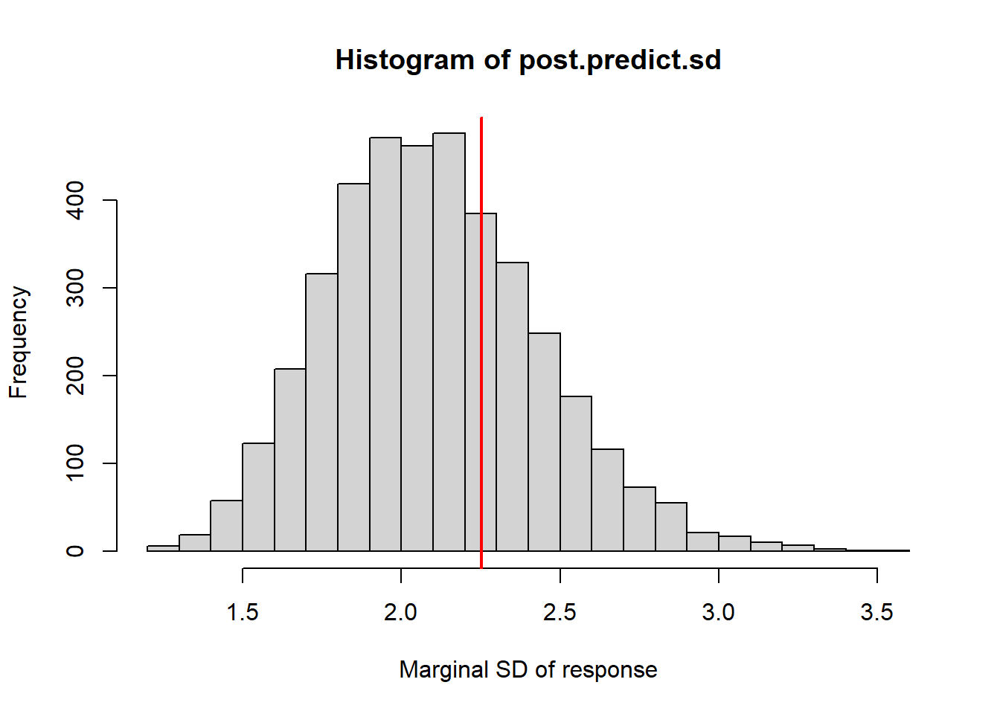
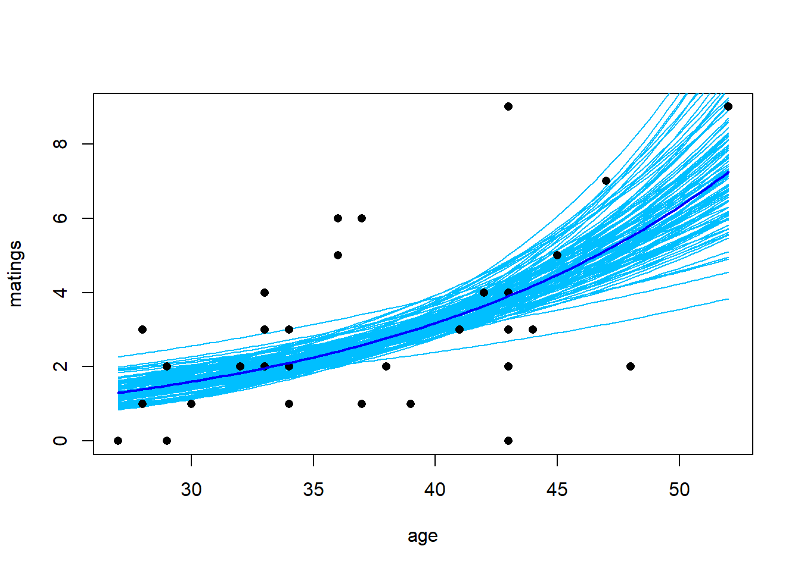

# Generalized linear models


Generalized linear modes allow us to extend the machinery of the "general linear model" (regression and ANOVA) to data sets in which the response variable may have a non-Gaussian distribution.  Generalized linear models do not encompass all possible distributions for the response variable.  Instead, the distribution of the response variable must belong to a group of distributions known as the "exponential family".  (Note that there is also such a thing as an exponential distribution.  The exponential distribution is one of the distributions in the exponential family, but it is not the only one.)  The exponential family of distributions includes many of the distributions that we encounter in practical data analysis, including Poisson, negative binomial, binomial, gamma, and beta distributions. The Gaussian distribution is included in the exponential family as well. One notable distribution that is not part of the exponential family is the $t$-distribution.  Distributions in the exponential family all give rise to likelihoods that share the same general form, and thus can be handled with a unified fitting scheme.

In practice, logistic regression (with binomial responses) and Poisson regression are far and away the two most common forms of generalized linear models that one encounters.  

## Poisson regression

We will begin with an example of Poisson regression.  These data are originally from Poole, Anim. Behav. 37 (1989):842-49, and were analyzed in the second edition of Ramsey \& Schafer's *Statistical Sleuth*.  They describe an observational study of 41 male elephants  over 8 years at Amboseli National Park in Kenya.  Each record in this data set gives the age of a male elephant at the beginning of a study and the number of successful matings for the elephant over the study's duration.  The number of matings is a count variable.  Our goal is to characterize how the number of matings is related to the elephant's age.  We'll start by fitting a model with the canonical log link.


```r
elephant <- read.table("data/elephant.txt", head = T)
head(elephant)
```

```
##   age matings
## 1  27       0
## 2  28       1
## 3  28       1
## 4  28       1
## 5  28       3
## 6  29       0
```

```r
with(elephant, plot(matings ~ age))
```


```r
fm1 <- glm(matings ~ age, 
           family = poisson(link = "log"), 
           data   = elephant)  # log link is the default

summary(fm1)
```

```
## 
## Call:
## glm(formula = matings ~ age, family = poisson(link = "log"), 
##     data = elephant)
## 
## Deviance Residuals: 
##      Min        1Q    Median        3Q       Max  
## -2.80798  -0.86137  -0.08629   0.60087   2.17777  
## 
## Coefficients:
##             Estimate Std. Error z value Pr(>|z|)    
## (Intercept) -1.58201    0.54462  -2.905  0.00368 ** 
## age          0.06869    0.01375   4.997 5.81e-07 ***
## ---
## Signif. codes:  0 '***' 0.001 '**' 0.01 '*' 0.05 '.' 0.1 ' ' 1
## 
## (Dispersion parameter for poisson family taken to be 1)
## 
##     Null deviance: 75.372  on 40  degrees of freedom
## Residual deviance: 51.012  on 39  degrees of freedom
## AIC: 156.46
## 
## Number of Fisher Scoring iterations: 5
```
Thus the so-called pseudo-$R^2$ for the model with the log link is
$$
\mathrm{pseudo}-R^2 = 1 - \frac{51.012}{75.372} = 32.3\%
$$
We can visualize the fit by plotting a best-fitting line with a 95\% confidence interval.  Because the scale parameter is not estimated here, we will use a critical value from a standard normal distribution.  Later, when we estimate the scale parameter based on data, we will use a critical value from a $t$-distribution instead. 


```r
new.data <- data.frame(age = seq(from = min(elephant$age),
                                 to   = max(elephant$age),
                                 length = 100))

predict.fm1 <- predict(fm1, newdata = new.data, type = "response", se.fit = TRUE)

with(elephant, plot(matings ~ age))
lines(x = new.data$age, y = predict.fm1$fit, col = "red")

# add lines for standard errors

lines(x   = new.data$age, 
      y   = predict.fm1$fit - 1.96 * predict.fm1$se.fit, 
      col = "red",
      lty = "dashed")

lines(x   = new.data$age, 
      y   = predict.fm1$fit + 1.96 * predict.fm1$se.fit, 
      col = "red",
      lty = "dashed")
```


While the canonical link is a natural starting point, we are free to try other link functions as well.  Below, we try the identity link and plot the fit.


```r
fm2 <- glm(matings ~ age, family = poisson(link = "identity"), data = elephant)  

summary(fm2)
```

```
## 
## Call:
## glm(formula = matings ~ age, family = poisson(link = "identity"), 
##     data = elephant)
## 
## Deviance Residuals: 
##      Min        1Q    Median        3Q       Max  
## -2.87228  -0.97171  -0.09509   0.57794   2.07192  
## 
## Coefficients:
##             Estimate Std. Error z value Pr(>|z|)    
## (Intercept) -4.55205    1.33916  -3.399 0.000676 ***
## age          0.20179    0.04023   5.016 5.29e-07 ***
## ---
## Signif. codes:  0 '***' 0.001 '**' 0.01 '*' 0.05 '.' 0.1 ' ' 1
## 
## (Dispersion parameter for poisson family taken to be 1)
## 
##     Null deviance: 75.372  on 40  degrees of freedom
## Residual deviance: 50.058  on 39  degrees of freedom
## AIC: 155.5
## 
## Number of Fisher Scoring iterations: 5
```

```r
predict.fm2 <- predict(fm2, newdata = new.data, type = "response", se.fit = TRUE)

with(elephant, plot(matings ~ age))
lines(x = new.data$age, y = predict.fm2$fit, col = "blue")

lines(x   = new.data$age, 
      y   = predict.fm2$fit - 1.96 * predict.fm2$se.fit, 
      col = "blue",
      lty = "dashed")

lines(x   = new.data$age, 
      y   = predict.fm2$fit + 1.96 * predict.fm2$se.fit, 
      col = "blue",
      lty = "dashed")
```


Note that the choice of the link function has a substantial impact on the shape of the fit.  The canonical (log) link suggests that the average number of matings increases with age at an accelerating rate, while the identity link suggests that the average number of matings increases steadily with age.  The AIC favors the identity link here.

We can also have a look at the residuals to see if they suggest any model deficiencies.  In general, we prefer the deviance residuals, so we will look at them.


```r
plot(x = elephant$age, 
     y = residuals(fm2, type = "deviance"),
     xlab = "age",
     ylab = "Deviance residuals")

abline(h = 0, lty = "dashed")
```


The residuals do not suggest any deficiency in the fit.

For this fit, the residual deviance suggests a small amount of overdispersion.  To be on the safe side, we can fit a quasi-Poisson model in which the scale (overdispersion) parameter is estimated from the data.  Note that when we estimate the overdispersion parameter, the estimates of the model parameters do not change, but their standard errors increase.  Consequently, the uncertainty in the fit increases as well.  In this case, however, the increase is so slight that it is barely noticeable.


```r
fm3 <- glm(matings ~ age, family = quasipoisson(link = "identity"), data = elephant)  

summary(fm3)
```

```
## 
## Call:
## glm(formula = matings ~ age, family = quasipoisson(link = "identity"), 
##     data = elephant)
## 
## Deviance Residuals: 
##      Min        1Q    Median        3Q       Max  
## -2.87228  -0.97171  -0.09509   0.57794   2.07192  
## 
## Coefficients:
##             Estimate Std. Error t value Pr(>|t|)    
## (Intercept) -4.55205    1.42164  -3.202  0.00272 ** 
## age          0.20179    0.04271   4.725 2.97e-05 ***
## ---
## Signif. codes:  0 '***' 0.001 '**' 0.01 '*' 0.05 '.' 0.1 ' ' 1
## 
## (Dispersion parameter for quasipoisson family taken to be 1.126975)
## 
##     Null deviance: 75.372  on 40  degrees of freedom
## Residual deviance: 50.058  on 39  degrees of freedom
## AIC: NA
## 
## Number of Fisher Scoring iterations: 5
```

```r
predict.fm3 <- predict(fm3, newdata = new.data, type = "response", se.fit = TRUE)

with(elephant, plot(matings ~ age))
lines(x = new.data$age, y = predict.fm3$fit, col = "blue")

lines(x   = new.data$age, 
      y   = predict.fm3$fit + qt(0.025, df = 39) * predict.fm3$se.fit, 
      col = "blue",
      lty = "dashed")

lines(x   = new.data$age, 
      y   = predict.fm3$fit + qt(0.975, df = 39) * predict.fm3$se.fit, 
      col = "blue",
      lty = "dashed")
```


As an alternative, we could fit a model that uses a negative binomial distribution for the response.  Negative binomial distributions belong to the exponential family, so we can fit them using the GLM framework.  However, the authors of `glm` did not include a negative binomial family in their initial code.  Venables & Ripley's `MASS` package includes a program called `glm.nb` which is specifically designed for negative binomial responses.  `MASS::glm.nb` uses the parameterization familiar to ecologists, although they use the parameter $\theta$ instead of $k$.  So, in their notation, if $y \sim \mathrm{NB}(\mu, \theta)$, then $\mathrm{Var}(y) = \mu + \mu^2/\theta$.


```r
require(MASS)
```

```
## Loading required package: MASS
```

```r
fm4 <- glm.nb(matings ~ age, link = identity, data = elephant)  

summary(fm4)
```

```
## 
## Call:
## glm.nb(formula = matings ~ age, data = elephant, link = identity, 
##     init.theta = 15.80269167)
## 
## Deviance Residuals: 
##      Min        1Q    Median        3Q       Max  
## -2.70899  -0.92077  -0.08966   0.54500   1.78248  
## 
## Coefficients:
##             Estimate Std. Error z value Pr(>|z|)    
## (Intercept) -4.56939    1.45770  -3.135  0.00172 ** 
## age          0.20232    0.04428   4.569  4.9e-06 ***
## ---
## Signif. codes:  0 '***' 0.001 '**' 0.01 '*' 0.05 '.' 0.1 ' ' 1
## 
## (Dispersion parameter for Negative Binomial(15.8027) family taken to be 1)
## 
##     Null deviance: 64.836  on 40  degrees of freedom
## Residual deviance: 43.214  on 39  degrees of freedom
## AIC: 156.87
## 
## Number of Fisher Scoring iterations: 1
## 
## 
##               Theta:  15.8 
##           Std. Err.:  23.0 
## 
##  2 x log-likelihood:  -150.872
```

```r
predict.fm4 <- predict(fm4, newdata = new.data, type = "response", se.fit = TRUE)

with(elephant, plot(matings ~ age))
lines(x = new.data$age, y = predict.fm4$fit, col = "blue")

lines(x   = new.data$age, 
      y   = predict.fm4$fit + 1.96 * predict.fm4$se.fit, 
      col = "blue",
      lty = "dashed")

lines(x   = new.data$age, 
      y   = predict.fm4$fit - 1.96 * predict.fm4$se.fit, 
      col = "blue",
      lty = "dashed")
```


Notice that $\hat{\theta} = 15.8$, again indicating that the extra-Poisson variation is mild.  Notice also that the error bounds on the fitted curve are ever so slightly larger than the error bounds from the Poisson fit, and nearly identical to the error bounds from the quasi-Poisson fit.

## Bayesian interlude

### rstanarm

We will take a look at how Poisson regression can be handled from a Bayesian perspective.  This interlude will also allow us to introduce a few more Bayesian concepts.  

We'll first fit the Poisson regression with identity link using `rstanarm::stan_glm`.


```r
require(rstanarm)
```

```
## Loading required package: rstanarm
```

```
## Loading required package: Rcpp
```

```
## This is rstanarm version 2.21.1
```

```
## - See https://mc-stan.org/rstanarm/articles/priors for changes to default priors!
```

```
## - Default priors may change, so it's safest to specify priors, even if equivalent to the defaults.
```

```
## - For execution on a local, multicore CPU with excess RAM we recommend calling
```

```
##   options(mc.cores = parallel::detectCores())
```

```r
fm5 <- stan_glm(matings ~ age, 
                family = poisson(link = "identity"), 
                data   = elephant,
                seed   = 1)  
```

```r
print(fm5, digits = 3)
```

```
## stan_glm
##  family:       poisson [identity]
##  formula:      matings ~ age
##  observations: 41
##  predictors:   2
## ------
##             Median MAD_SD
## (Intercept) -4.420  1.358
## age          0.198  0.041
## 
## ------
## * For help interpreting the printed output see ?print.stanreg
## * For info on the priors used see ?prior_summary.stanreg
```

We can visualize the marginal posterior of the slope using `bayesplot::mcmc_areas`:


```r
posterior.fm5 <- as.matrix(fm5)

bayesplot::mcmc_areas(posterior.fm5,
                      pars = c("age"),
                      prob = 0.95) 
```


Notice that the slope of the fitted regression line is slightly attenuated relative to the ML fit from the frequentist analysis.  The reason is that the default priors selected by `rstanarm` are actually reasonably strong:

```r
prior_summary(fm5)
```

```
## Priors for model 'fm5' 
## ------
## Intercept (after predictors centered)
##  ~ normal(location = 0, scale = 2.5)
## 
## Coefficients
##   Specified prior:
##     ~ normal(location = 0, scale = 2.5)
##   Adjusted prior:
##     ~ normal(location = 0, scale = 0.38)
## ------
## See help('prior_summary.stanreg') for more details
```

`rstanarm` parameterizes the normal distribution by its mean and standard deviation.  Thus, the prior for the slope has a mean of 0 and standard deviation of 2.5.  (I think: I don't yet understand the difference between the 'specified prior' and the 'adjusted prior'.)  This relatively strong prior reflects the views of the developers of `rstanarm`, who think there is benefit to shrinking most estimated effects slightly towards 0.  If we want to override this default and use weaker priors, we can do so as follows.  

```r
fm5 <- stan_glm(matings ~ age, 
                family = poisson(link = "identity"), 
                data   = elephant,
                prior  = normal(0, 100), 
                prior_intercept = normal(0, 100),
                seed   = 1)  
```

```r
print(fm5, digits = 3)
```

```
## stan_glm
##  family:       poisson [identity]
##  formula:      matings ~ age
##  observations: 41
##  predictors:   2
## ------
##             Median MAD_SD
## (Intercept) -4.588  1.390
## age          0.204  0.042
## 
## ------
## * For help interpreting the printed output see ?print.stanreg
## * For info on the priors used see ?prior_summary.stanreg
```

Weakening the prior results in a posterior mean for the slope that is closer to the MLE from the frequentist analysis.

We can visualize the fit in the usual way, by plotting sample draws from the MCMC sampler.

```r
mcmc.sims <- as.matrix(fm5)

with(elephant, plot(matings ~ age, type = "n"))

sample.sims <- sample(nrow(mcmc.sims), size = 100)
for (i in sample.sims) {
   abline(a = mcmc.sims[i, 1], b = mcmc.sims[i, 2], col = "skyblue")
}

abline(a = coef(fm5)['(Intercept)'], b = coef(fm5)['age'], col = "blue", lwd = 2)

with(elephant, points(matings ~ age, pch = 16))
```


### Posterior predictive checks

How might we assess the quality of this fit?  A Bayesian approach to assessing the quality of fit is to generate posterior predictive distributions.  A "posterior predictive" data set is a new data set of hypothetical observations simulated using the parameter values from one of the samples of the MCMC sampler.  By creating many such data sets, we can build up a distribution of data sets predicted by the posterior distribution of the model parameters.  By comparing the actual observed data to this distribution, we can gain a sense of whether our data are consistent with the posterior fit.

The authors of `rstanarm` advocate using posterior predictive checks extensively to assess model adequacy.  For that reason, they have included a number of tools that make posterior predictive checking simple.  For example, the command `rstanarm::posterior_predict` generates a collection of hypothetical data sets by randomly sampling from the posterior distribution of the parameters. The default behavior is to generate a collection of 1000 such data sets.


```r
post.predict <- posterior_predict(fm5)
```

For example, we can have a look at a few of these hypothetical data sets.

```r
par(mfrow = c(2, 2))

for(i in 1:4) {
  
  with(elephant, plot(matings ~ age, type = "n"))
  points(elephant$age, post.predict[i, ], pch = 1)
}
```


Our task is to determine if the real data set that we actually observed is consistent with this collection of hypothetical data sets.  To do so, we can calculate a summary statistic that captures an interesting feature of each data set, and compare the value of that summary statistic for the real data set to the distribution of values across the simulated data sets.

What summary statistic would you use to compare the real elephant data set to these simulated ones?  We'll use the marginal standard deviation of the number of matings below, but there might be other or better examples that you could think of.  Typically, one uses several posterior predictive statistics, not just one.  First, we calculate the distribution of marginal standard deviations across the collection of simulated data sets.  This R code illustrates the use of the handy R command `apply`, which applies a function to one of the margins (rows or columns) of an array.  Here, because the individual data sets are stored as the rows of `post.predict`, we will calculate the standard deviation of the contents of each row.


```r
post.predict.sd <- apply(post.predict, 1, sd)
```

Now we plot a histogram of these standard deviations and compare the distribution to the marginal standard deviation of the real data.


```r
hist(post.predict.sd, breaks = 20, xlab = "Marginal SD of response")
abline(v = sd(elephant$matings), col = "red", lwd = 2)
```



The actual standard deviation, shown by the red line, is consistent with the standard deviations of the simulated data sets, indicating that the model provides a reasonable description of the data, at least with regard to the marginal SD of the response variable.  This is consistent with our previous conclusions that the extra-Poisson variation in these data is quite mild.

The authors of `rstanarm` have provided the function `pp_check` (for [p]osterior [p]redictive check) to do all of this in one fell swoop.


```r
pp_check(fm5, plotfun = "stat", stat = "sd", binwidth = .1)
```


### JAGS

We can also code the model up directly in JAGS.  Notice that the code here is barely more complicated than OLS regression.  The code below shows the JAGS implementation of the elephant GLM with a Poisson distribution for the response and a log link.


```r
require(R2jags)
```

```
## Loading required package: R2jags
```

```
## Warning: package 'R2jags' was built under R version 4.1.1
```

```
## Loading required package: rjags
```

```
## Warning: package 'rjags' was built under R version 4.1.1
```

```
## Loading required package: coda
```

```
## Linked to JAGS 4.3.0
```

```
## Loaded modules: basemod,bugs
```

```
## 
## Attaching package: 'R2jags'
```

```
## The following object is masked from 'package:coda':
## 
##     traceplot
```

```r
elephant.model <- function() {
   
   for (j in 1:J) {             # J = number of data points
      
      y[j] ~ dpois(mu[j])      # data model:  the likelihood 
      
      mu[j] <- exp(eta[j])      # inverse link
      eta[j] <- a + b * x[j]  # linear predictor
   }
   
   a ~ dnorm (0.0, 1E-6)       # prior for intercept
   b ~ dnorm (0.0, 1E-6)       # prior for slope
}

jags.data <- list(y = elephant$matings, 
                  x = elephant$age,
                  J = nrow(elephant))

jags.params <- c("a", "b")

jags.inits <- function(){
   list("a" = rnorm(1), "b" = rnorm(1))
}

set.seed(1)

jagsfit <- jags(data               = jags.data, 
                inits              = jags.inits, 
                parameters.to.save = jags.params,
                model.file         = elephant.model,
                n.chains           = 3,
                n.iter             = 5E4,
                n.thin             = 5)
```

```
## module glm loaded
```
Let's have a look at the posterior summaries:

```r
mcmc.output <- as.data.frame(jagsfit$BUGSoutput$sims.list)
apply(mcmc.output, 2, mean)
```

```
##            a            b     deviance 
##  -1.59257609   0.06871434 154.47531083
```

```r
HPDinterval(as.mcmc(mcmc.output), prob = 0.95)
```

```
##                 lower        upper
## a         -2.64905619  -0.54223141
## b          0.04194793   0.09511553
## deviance 152.45783408 158.39245393
## attr(,"Probability")
## [1] 0.95
```

Compare these to the values generated by the `glm` fit with the log link.  We can also visualize the uncertainty in the fit by plotting the fit implied by a random sample of parameters from the posterior:

```r
plot(matings ~ age, data = elephant, type = "n")

subset.samples <- sample(nrow(mcmc.output), size = 100)

for(i in subset.samples) {
   
   a <- mcmc.output$a[i]
   b <- mcmc.output$b[i]
   
   my.fit <- function(x) exp(a + b * x)
   
   curve(my.fit, 
         from = min(elephant$age), 
         to   = max(elephant$age),
         col  = "deepskyblue", 
         lwd  = 1, 
         add  = TRUE)
}

with(elephant, points(matings ~ age, pch = 16))

post.means <- apply(mcmc.output, 2, mean)

my.fit <- function(x) exp(post.means['a'] + post.means['b'] * x)

curve(my.fit, 
      from = min(elephant$age), 
      to   = max(elephant$age),
      col  = "blue", 
      lwd  = 2, 
      add  = TRUE)
```


Suppose we wanted to fit this model using JAGS with the identity link, so that the relationship between mean matings and age was linear.  To do so, we would have to be careful, because we would have to make sure that the MCMC sampler did not stray into regions that generated negative values for the observation-level mean, $\mu$.  Mathematically, we simply want to construct a likelihood that evaluates to 0 whenever $\mu \leq 0$.  However, as of this writing, I haven't figured out what the best approach is for implementing such a model in JAGS.

### Observation-level random effects

We use this opportunity to introduce an alternative approach to accommodating overdispersion in models with non-Gaussian responses.  This alternative approach entails adding a latent Gaussian-distributed random effect to the linear predictor.  Because this random effect takes a unique value for each observation, it is known as a "observation-level random effect".  Observation-level random effects are motivated by the idea that overdispersion is caused by additional inputs or factors that vary among observations and re not included in the model.  For example, knowing next to nothing about elephants, we might speculate that there are additional factors that influence a male elephant's mating success above and beyond age, such as (say) nutrition. The observation-level random effects are meant to capture this additional variation.  Importantly, if we use an observation-level random effect, then we have no control on the sign of the linear predictor $\eta$.  Consequently, we must use a link function that maps any value of the linear predictor ($\eta$) to a valid value of the observation-level mean ($\mu$).  (In other words, we can't use the identity link for a Poisson response.)  For the elephant data, adding an observation-level random effect changes the model to:
\begin{align*}
y_i & \sim \mathrm{Pois}(\mu_i)\\
\mu_i  & = \exp({\eta_i}) \\
\eta_i & \sim \mathcal{N}(a + b x_i, \sigma^2_\eta).
\end{align*}

Priors on $a$, $b$, and $\sigma^2_\eta$ would complete the Bayesian specification.  Implemeting the model in JAGS is straightforward:

```r
elephant.model.2 <- function() {
   
   for (j in 1:J) {             # J = number of data points
      
      y[j] ~ dpois(mu[j])      # data model:  the likelihood 
      
      mu[j] <- exp(eta[j])      # inverse link
      eta[j] ~ dnorm(a + b * x[j], tau_eps)  # linear predictor, includes observation-level random effect
   }
   
   a ~ dnorm (0.0, 1E-6)       # prior for intercept
   b ~ dnorm (0.0, 1E-6)       # prior for slope
   tau_eps ~ dgamma (0.01, 0.01)
   
   sd_eps <- pow(tau_eps, -1/2)
}

jags.data <- list(y = elephant$matings, 
                  x = elephant$age,
                  J = nrow(elephant))

jags.params <- c("a", "b", "sd_eps")

jags.inits <- function(){
   list("a" = rnorm(1), "b" = rnorm(1), "tau_eps" = runif(1))
}

set.seed(1)

jagsfit2 <- jags(data               = jags.data, 
                 inits              = jags.inits, 
                 parameters.to.save = jags.params,
                 model.file         = elephant.model.2,
                 n.chains           = 3,
                 n.iter             = 5E4,
                 n.thin             = 5)
```

Again, we can have a look at the posterior summaries, and plot a random sample of fits from the posterior:

```r
mcmc.output <- as.data.frame(jagsfit2$BUGSoutput$sims.list)
apply(mcmc.output, 2, mean)
```

```
##            a            b     deviance       sd_eps 
##  -1.65360318   0.06934144 147.14813848   0.27075058
```

```r
HPDinterval(as.mcmc(mcmc.output), prob = 0.95)
```

```
##                 lower       upper
## a         -2.85901410  -0.4407061
## b          0.03818321   0.1005042
## deviance 133.86486164 158.2878871
## sd_eps     0.06376511   0.5261329
## attr(,"Probability")
## [1] 0.95
```

```r
plot(matings ~ age, data = elephant, type = "n")

subset.samples <- sample(nrow(mcmc.output), size = 100)

for(i in subset.samples) {
   
   a <- mcmc.output$a[i]
   b <- mcmc.output$b[i]
   
   my.fit <- function(x) exp(a + b * x)
   
   curve(my.fit, 
         from = min(elephant$age), 
         to   = max(elephant$age),
         col  = "deepskyblue", 
         lwd  = 1, 
         add  = TRUE)
}

with(elephant, points(matings ~ age, pch = 16))

post.means <- apply(mcmc.output, 2, mean)

my.fit <- function(x) exp(post.means['a'] + post.means['b'] * x)

curve(my.fit, 
      from = min(elephant$age), 
      to   = max(elephant$age),
      col  = "blue", 
      lwd  = 2, 
      add  = TRUE)
```



Because the extra-Poisson variation in the elephant data is small, the effect of the observation-level random effect is slight.  However, an eagle-eyed observer might notice the following differences.  First, the posterior uncertainty in the slope parameter that captures the effect of age has increased slightly.  Second, and perhaps more meaningfully, the fitted curve has dropped slightly.    This makes sense, as the model with the observation-level random effect doesn't have to strain quite as hard to accommodate the few elephants with large and positive residuals.  Thus, adding an observation-level random effect has had the same effect on the fit as other approaches to accommodating extra-Poisson variaton.  

Before moving on, it is worth noting that this Poisson regression with an observation-level random effect is the type of model that is much easier to fit from a Bayesian perspective.  To approach this model from the frequentist perspective, we would have to write down, and maximize, the likelihood, which is a function of the model's three parameters: $a$, $b$, and $\sigma^2_\eta$.  However, to write down the likelihood, we would have to integrate out the observation-level random effects. For the elephant data, this would correspond to an integral with 41 dimensions!  While we could conceivably write this down, for all intents and purposes the likelihood would be impossible to compute, let alone to maximize.  From a Bayesian perspective, though, adding latent random effects to a model with a non-normal response is nearly trivial.

The above discussion begs the question of just how programs like `lme4::lmer` fit mixed-effect models in the first place.  It turns out that, with a Gaussian response, the high-dimensional integral in the likelihood can be simplified without having to compute the entire integral numerically.  This simplification flows from the fact that Gaussian random variates have a natural multivariate form.  With a non-Gaussian response, things become substantially harder.  When we study generalized linear mixed models, we will see some ideas for computing these likelihood functions, but all such approaches ultimately rely on computational approximations instead of evaluating the underlying integrals directly.
