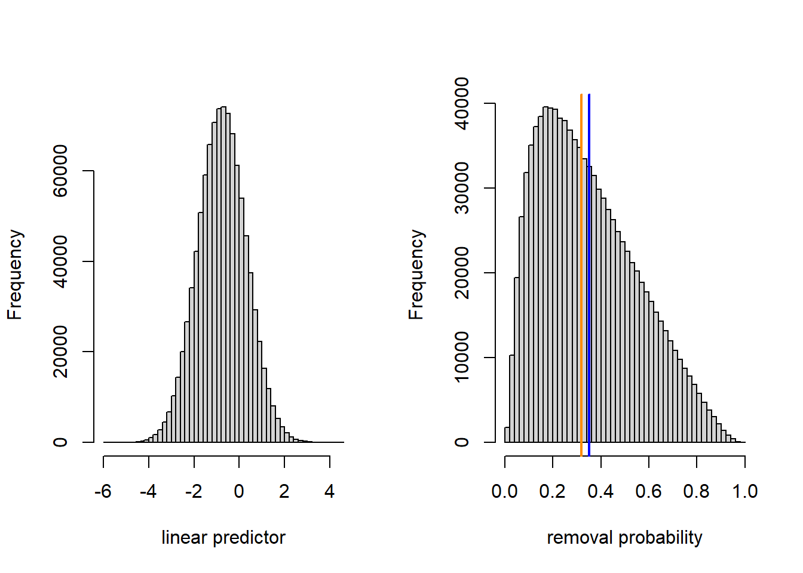
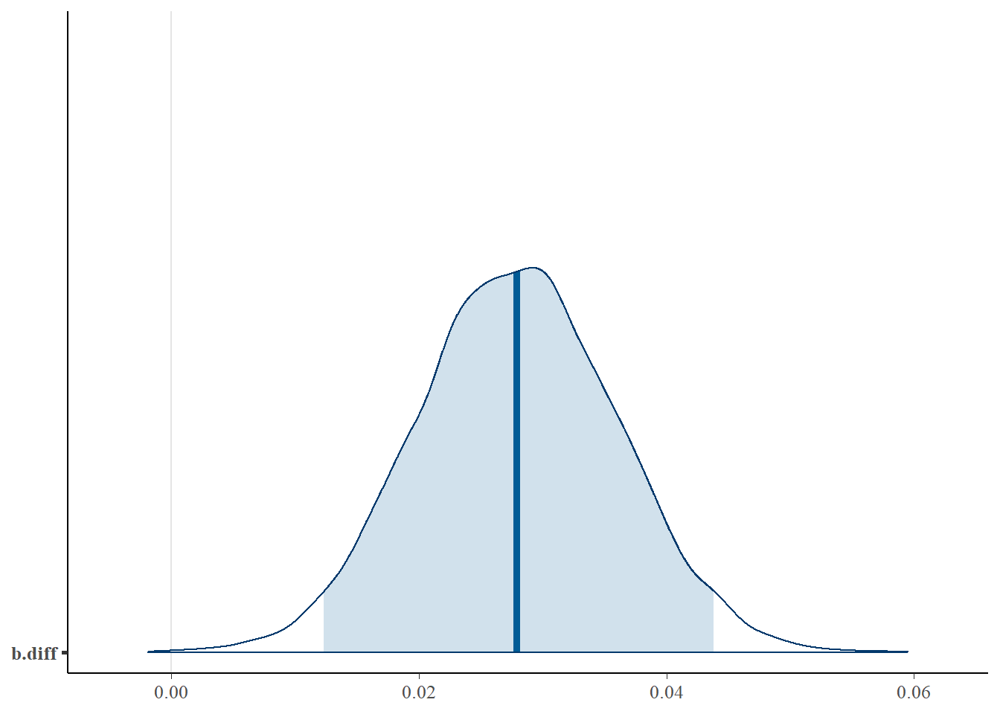
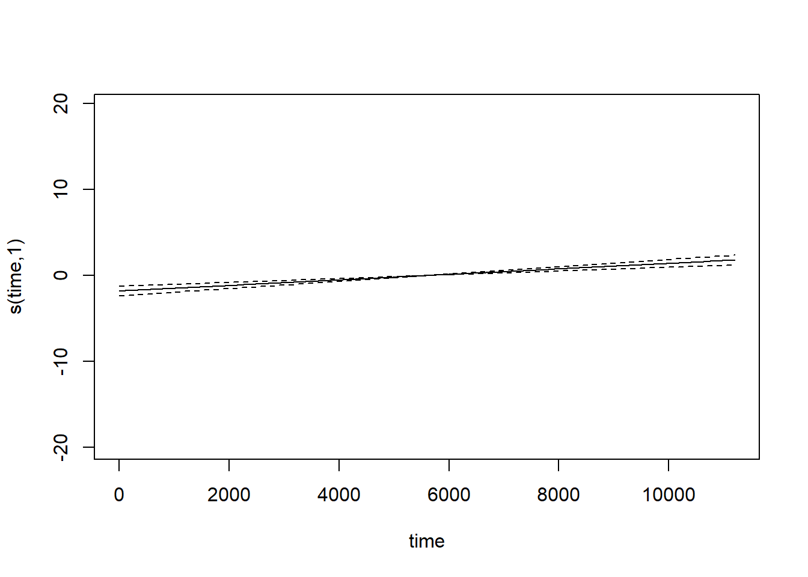
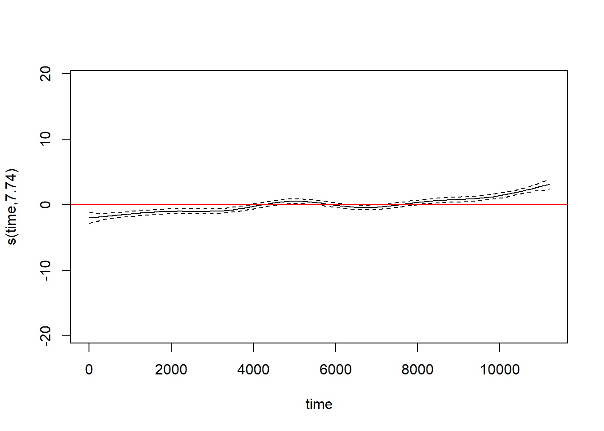
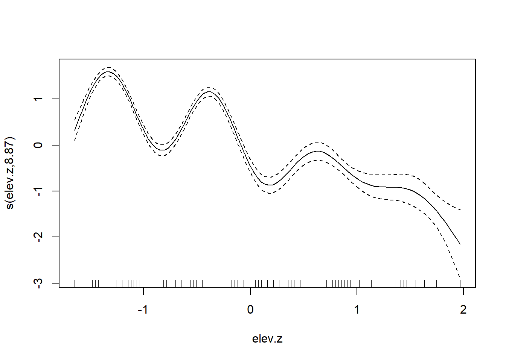

# Generalized linear mixed models


## Example 1: Industrial melanism data

We will examine several possible approaches to analyzing the industrial melanism data.  The original source for these data is @bishop1972; I obtained them from @ramsey2002. Recall that these data consist of paired binomial responses with two covariates: distance from Liverpool (a station-level covariate) and color morph (an observation-level covariate).  In notation, the model that we seek to fit is
\begin{align*}
y_{ij} & \sim \mathrm{Binom}(p_{ij}, n_{ij})\\
\mathrm{logit}(p_{ij}) & = \eta_{ij} \\
\eta_{ij} & = a_i + b_i x_j + L_j \\
L_j & \sim \mathcal{N}(0, \sigma^2_L)
\end{align*}
where $i=1,2$ indexes the two color morphs, $j = 1, \ldots, 7$ indexes the stations, $y_{ij}$ is the number of moths removed, $n_{ij}$ is the number of moths placed, and let $x_j$ is the distance of the station from Liverpool.  We are most interested in learning about the difference $b_1 - b_2$, which quantifies how the relationship between log odds of removal and distance differs between the two color morphs, and determining whether there is evidence that this difference $\neq 0$.  Alternatively, we might prefer to consider the quantity $e^{b_1 - b_2} = e^{b_1} / e^{b_2}$, which tells us how the odds ratio for removal changes between the two morphs as distance increases.  This odds ratio is a bit closer to something that we can mentall grasp.  In terms of the odds ratio, we are interested in learning if the odds ratio $\neq 1$.

Before proceeding, we note that one approach is simply to regress the difference of the empirical logits vs.\ distance.  This reduces the problem to a simple regression.  We try this approach first and use it as a benchmark.  The data set used here is reformatted to include one record for each of the 7 stations.


``` r
moth2 <- read.table("data/moth2.txt", head = TRUE, stringsAsFactors = TRUE)

head(moth2, n = 3)
```

```
##   location distance morph l.placed l.removed d.placed d.removed
## 1       sp      0.0 light       56        17       56        14
## 2       ef      7.2 light       80        28       80        20
## 3       ha     24.1 light       52        18       52        22
```

``` r
elogit <- function(x) log(x / (1 - x))

moth2$elogit.diff <- with(moth2, elogit(d.removed / d.placed) - elogit(l.removed / l.placed))

fm1 <- lm(elogit.diff ~ distance, data = moth2)

with(moth2, plot(elogit.diff ~ distance,
                xlab = "distance from city center (km)",
                ylab = "difference in log odds of removal, dark - light"))

abline(h = 0, lty = "dashed")
abline(fm1)
```


``` r
summary(fm1)
```

```
## 
## Call:
## lm(formula = elogit.diff ~ distance, data = moth2)
## 
## Residuals:
##        1        2        3        4        5        6        7 
##  0.10557 -0.30431  0.03501  0.26395 -0.09387  0.29714 -0.30349 
## 
## Coefficients:
##              Estimate Std. Error t value Pr(>|t|)   
## (Intercept) -0.373830   0.192503  -1.942  0.10980   
## distance     0.027579   0.005997   4.599  0.00585 **
## ---
## Signif. codes:  0 '***' 0.001 '**' 0.01 '*' 0.05 '.' 0.1 ' ' 1
## 
## Residual standard error: 0.2698 on 5 degrees of freedom
## Multiple R-squared:  0.8088,	Adjusted R-squared:  0.7706 
## F-statistic: 21.15 on 1 and 5 DF,  p-value: 0.005846
```

``` r
confint(fm1)
```

```
##                   2.5 %     97.5 %
## (Intercept) -0.86867531 0.12101544
## distance     0.01216371 0.04299419
```

This approach tells us that the difference in log-odds slopes (defined as dark morph - light morph) is 0.0276, with a 95\% confidence interval of (0.012, 0.043).   This corresponds to an odds ratio of 1.028, with a 95\% confidence interval of (1.012, 1.044).  In other words, with every additional km from the city center, the odds ratio for a dark moth's removal vs.\ a light moth's removal increases by about 2.8\%.

The major disadvantage to the approach above is that it doesn't account for the fact that differing numbers of moths were placed at the different stations.  We could try to account for this with a weighted regression, but it's not clear what the weights should be.  We were also fortunate in the sense that there were no instances of either none or all of the moths being removed at a particular station, which would have led to an infinite empirical logit.

### GEEs

Next we try a GEE with a compound symmetry ("exchangable") correlation structure imposed on the pair of measurements at each station.  Because there are only two data records for each station, there is no loss of generality in assuming this correlation structure.  We fit the model using `geepack::geeglm`. 


``` r
require(geepack)
```

```
## Loading required package: geepack
```


``` r
moth <- read.table("data/moth.txt", head = TRUE, stringsAsFactors = TRUE)
contrasts(moth$morph) <- contr.treatment(n = 2, base = 2)

fm2 <- geeglm(cbind(removed, placed - removed) ~ distance * morph, 
              family = binomial(link = "logit"), 
              data   = moth,
              id     = location, 
              corstr = "exchangeable")

summary(fm2)
```

```
## 
## Call:
## geeglm(formula = cbind(removed, placed - removed) ~ distance * 
##     morph, family = binomial(link = "logit"), data = moth, id = location, 
##     corstr = "exchangeable")
## 
##  Coefficients:
##                  Estimate   Std.err   Wald Pr(>|W|)    
## (Intercept)     -0.714717  0.129102 30.648 3.09e-08 ***
## distance        -0.009385  0.003221  8.489  0.00357 ** 
## morph1          -0.410238  0.163953  6.261  0.01234 *  
## distance:morph1  0.027762  0.005812 22.815 1.78e-06 ***
## ---
## Signif. codes:  0 '***' 0.001 '**' 0.01 '*' 0.05 '.' 0.1 ' ' 1
## 
## Correlation structure = exchangeable 
## Estimated Scale Parameters:
## 
##             Estimate  Std.err
## (Intercept)  0.01313 0.006935
##   Link = identity 
## 
## Estimated Correlation Parameters:
##       Estimate Std.err
## alpha   0.3911   0.298
## Number of clusters:   7  Maximum cluster size: 2
```

The estimate of the difference between slopes on the log-odds scale is 0.0278, with an approximate 95\% confidence interval of (0.0164, 0.0391).  This corresponds to an odds ratio of 1.028, with an approximate 95\% confidence interval of (1.017, 1.040).  To visualize the model, we might plot the fitted proportion removed vs.\ distance for both color morphs.  Bear in mind that fitted values here correspond to marginal mean removal rates.


``` r
inv.logit <- function(x) exp(x) / (1 + exp(x))
light.fit <- function(d) inv.logit(-0.71472 - 0.00938 * d)
dark.fit <- function(d) inv.logit(-0.71472 - 0.41024 + (-0.00938 + 0.02776) * d)

curve(dark.fit, from = min(moth$distance), to = max(moth$distance),
      xlab = "distance from city center (km)",
      ylab = "proportion removed",
      ylim = c(0.15, 0.5))

curve(light.fit, from = min(moth$distance), to = max(moth$distance),
      xlab = "distance from city center (km)",
      ylab = "proportion removed",
      add = TRUE,
      lty = "dashed")

with(subset(moth, morph == "dark"), points(removed / placed ~ distance, pch = 16))
with(subset(moth, morph == "light"), points(removed / placed ~ distance, pch = 1))
```


For the sake of comparing marginal means to conditional means, we will consider the predicted removal rate of dark morphs at a hypothetical location 20 km from the city center.  This predicted removal rate is 0.319.


``` r
dark.fit(20)
```

```
## [1] 0.3192197
```

### GLMMs

Next, we will fit the same model with `lme4::glmer`.


``` r
require(lme4)
```

```
## Loading required package: lme4
```

```
## Loading required package: Matrix
```

``` r
fm3 <- glmer(cbind(removed, placed - removed) ~ distance * morph + (1 | location), 
             family = binomial(link = "logit"), 
             data = moth)

summary(fm3)
```

```
## Generalized linear mixed model fit by maximum likelihood (Laplace
##   Approximation) [glmerMod]
##  Family: binomial  ( logit )
## Formula: cbind(removed, placed - removed) ~ distance * morph + (1 | location)
##    Data: moth
## 
##       AIC       BIC    logLik -2*log(L)  df.resid 
##      85.7      88.9     -37.8      75.7         9 
## 
## Scaled residuals: 
##      Min       1Q   Median       3Q      Max 
## -1.73965 -0.41890  0.02967  0.66584  1.08052 
## 
## Random effects:
##  Groups   Name        Variance Std.Dev.
##  location (Intercept) 0.01148  0.1072  
## Number of obs: 14, groups:  location, 7
## 
## Fixed effects:
##                  Estimate Std. Error z value Pr(>|z|)    
## (Intercept)     -0.719786   0.205488  -3.503 0.000460 ***
## distance        -0.009341   0.006270  -1.490 0.136243    
## morph1          -0.411128   0.274765  -1.496 0.134578    
## distance:morph1  0.027819   0.008094   3.437 0.000588 ***
## ---
## Signif. codes:  0 '***' 0.001 '**' 0.01 '*' 0.05 '.' 0.1 ' ' 1
## 
## Correlation of Fixed Effects:
##             (Intr) distnc morph1
## distance    -0.843              
## morph1      -0.641  0.538       
## dstnc:mrph1  0.558 -0.660 -0.859
```

``` r
confint(fm3, parm = c("distance:morph1"))
```

```
## Computing profile confidence intervals ...
```

```
##                      2.5 %     97.5 %
## distance:morph1 0.01201418 0.04377205
```

Nothing here is radically different.  The parameter estimates are so similar to those from the GEE that a plot of the GEE and GLMM fits would be indistinguishable to the eye.  

Although `summary.glmer` doesn't report the deviance, functions exist to obtain this information.  We can use the deviance to assess overdispersion in the same way that we would in a GLM.  

<!-- Note: Is this true?  I'm not sure. -->

``` r
deviance(fm3)
```

```
## [1] 9.250077
```

``` r
df.residual(fm3)
```

```
## [1] 9
```

The ratio of the deviance to the residual df is approximately 1, suggesting that the data are not overdispersed.  Note that including the location random effect in the GLMM has eliminated the mild overdispersion that we detected in the GLM without the location random effect.

To get a sense of how the conditional means compare to the marginal means, we will compute the conditional mean removal rate of dark morphs at a distance 20 km from the city center.  


``` r
dark.linpred.glmm <- function(d) -0.71979 - 0.41113 + (-0.00934 + 0.02782) * d
dark.fit.glmm <- function(d) inv.logit(dark.linpred.glmm(d))
dark.fit.glmm(20)
```

```
## [1] 0.3183597
```

The conditional mean of the predicted removal rate is 0.318.

Here, the difference between the marginal and conditional means is tiny.  Nevertheless, we can gain a deeper understanding of the difference by taking a look at the fitted population of possible locations at 20 km distance on both the linear predictor scale and the data scale.


``` r
linpred.sample <- rnorm(1e6, mean = dark.linpred.glmm(20), sd = 0.1072)
prob.sample <- inv.logit(linpred.sample)

(conditional.mean <- inv.logit(dark.linpred.glmm(20)))
```

```
## [1] 0.3183597
```

``` r
(marginal.mean <- mean(prob.sample))
```

```
## [1] 0.3187808
```

``` r
par(mfrow = c(1, 2))
hist(linpred.sample, breaks = 50, xlab = "linear predictor", main = "")
hist(prob.sample, breaks = 50, xlab = "removal probability", main = "")
abline(v = conditional.mean, col = "darkorange", lwd =2)
abline(v = marginal.mean, col = "blue", lwd = 2)
```



We see that the variance of the location-level random effect is small enough that the inverse logit transformation is effectively linear. Thus, the distribution of removal probabilities across locations is nearly normal, and the conditional and marginal means nearly coincide.  The estimate of the marginal mean that we have generated by simulation is not quite the same as the marginal mean generated by the GEE, which could either be due to the stochastic sampling that we have used above, and/or small numerical differences in the estimation.

For the sake of illustration, we repeat these calculations by supposing that the location-to-location standard deviation was 10 times larger.


``` r
linpred.sample <- rnorm(1e6, mean = dark.linpred.glmm(20), sd = 10 * 0.1072)
prob.sample <- inv.logit(linpred.sample)

(conditional.mean <- inv.logit(dark.linpred.glmm(20)))
```

```
## [1] 0.3183597
```

``` r
(marginal.mean <- mean(prob.sample))
```

```
## [1] 0.3503592
```

``` r
par(mfrow = c(1, 2))
hist(linpred.sample, breaks = 50, xlab = "linear predictor", main = "")
hist(prob.sample, breaks = 50, xlab = "removal probability", main = "")
abline(v = conditional.mean, col = "darkorange", lwd =2)
abline(v = marginal.mean, col = "blue", lwd = 2)
```


### Bayesian fit

We now fit the model using JAGS and vague priors.


``` r
require(R2jags)
```


```r
moth.model <- function() {
   
   for (j in 1:J) {             # J = number of data points
      
      y[j]   ~ dbin(p[j], n[j])      # data distribution
      
      p[j]   <- ilogit(eta[j])      # inverse link
      eta[j] <- a[morph[j]] + b[morph[j]] * dist[j] + L[loc[j]]  # linear predictor,
   }
   
   for (j in 1:7){  # random effects for location
    
     L[j] ~ dnorm(0, tau_L)
   }
  
   a[1] ~ dnorm (0.0, 1E-6)       # priors for intercept
   a[2] ~ dnorm (0.0, 1E-6)       # priors for intercept
   b[1] ~ dnorm (0.0, 1E-6)       # prior for slope
   b[2] ~ dnorm (0.0, 1E-6)       # prior for slope
   
   tau_L   ~ dgamma (0.01, 0.01)    # prior for location-level random effect
   
   sd_L   <- pow(tau_L, -1/2)
   
   b.diff <- b[1] - b[2]
}

jags.data <- list(y     = moth$removed, 
                  n     = moth$placed,
                  dist  = moth$distance,
                  loc   = as.numeric(moth$location),
                  morph = as.numeric(moth$morph),
                  J     = nrow(moth))

jags.params <- c("a[1]", "a[2]", "b[1]", "b[2]", "b.diff", "sd_L")

jags.inits <- function(){
   list("tau_L" = runif(1))
}

set.seed(1)

jagsfit <- jags(data               = jags.data, 
                inits              = jags.inits, 
                parameters.to.save = jags.params,
                model.file         = moth.model,
                n.chains           = 3,
                n.iter             = 5E4,
                n.thin             = 5)
```

```
## module glm loaded
```

For some reason this works without specifying initial values for $a$ and $b$ (now both vectors).  Maybe the initial values are drawn from the prior?

<!-- 8-20-25: For some crazy reason, I'm getting an error ("Error in `round()`: ! non-numeric argument to mathematical function") here when compiling for bookdown.  It all works fine from the command line; I have no idea. -->


``` r
mcmc.output <- as.data.frame(jagsfit$BUGSoutput$sims.list)
(post.mean   <- apply(mcmc.output, 2, mean))
```

```
##          a.1          a.2       b.diff          b.1          b.2     deviance 
## -1.140722211 -0.734757896  0.027796240  0.018614882 -0.009181358 75.257872581 
##         sd_L 
##  0.249026857
```

``` r
HPDinterval(as.mcmc(mcmc.output['b.diff']))
```

```
##             lower      upper
## b.diff 0.01168872 0.04370766
## attr(,"Probability")
## [1] 0.95
```

The posterior mean of the difference in the log-odds slopes --- 0.0278 --- is essentially the same value that we have seen in every analysis.  We can have a look at the full posterior distribution for this difference, and calculate the posterior probability that the difference is $>0$.  


``` r
bayesplot::mcmc_areas(mcmc.output,
                      pars = c("b.diff"),
                      prob = 0.95) 
```




``` r
table(mcmc.output$b.diff > 0)
```

```
## 
## FALSE  TRUE 
##     4 14996
```

Thus we would say that there is a 0.9997 posterior probability that the proportion of dark moths removed increases more rapidly with increasing distance from Liverpool than the proportion of light moths removed.

We can plot the fit of the model using draws from the posterior distribution of the parameters.  The heavy lines below show the fits using the posterior means of the parameters.  Do these fits correspond to the marginal or conditional means?  (There's little difference here, but it's a useful thought exercise.)

``` r
subset.samples <- sample(nrow(mcmc.output), size = 100)

moth$prop.removed <- with(moth, removed / placed)

light <- subset(moth, morph == "light")
dark  <- subset(moth, morph == "dark")

par(mfrow = c(1, 2))

#------ light morph

plot(prop.removed ~ distance,
     data = moth,
     type = "n",
     main = "Light morph",
     ylab = "proprotion removed")

points(x = light$distance, y = light$prop.removed, pch = 16)

for(i in subset.samples) {

  a <- mcmc.output$a.2[i]
  b <- mcmc.output$b.2[i]

  fitted.curve <- function(x) inv.logit(a + b * x)

  curve(fitted.curve,
        from = min(moth$distance),
        to   = max(moth$distance),
        add  = TRUE,
        col  = "deepskyblue")
}

fitted.mean.curve <- function(x) inv.logit(post.mean['a.2'] + post.mean['b.2'] * x)

curve(fitted.mean.curve,
        from = min(moth$distance),
        to   = max(moth$distance),
        add  = TRUE,
        col  = "darkblue",
        lwd  = 2)

points(x = light$distance, y = light$prop.removed, pch = 16)

#--------- dark morph

plot(prop.removed ~ distance,
     data = moth,
     type = "n",
     main = "Dark morph",
     ylab = "proprotion removed")

for(i in subset.samples) {

  a <- mcmc.output$a.1[i]
  b <- mcmc.output$b.1[i]

  fitted.curve <- function(x) inv.logit(a + b * x)

  curve(fitted.curve,
        from = min(moth$distance),
        to   = max(moth$distance),
        add  = TRUE,
        col  = "deepskyblue")
}

fitted.mean.curve <- function(x) inv.logit(post.mean['a.1'] + post.mean['b.1'] * x)

curve(fitted.mean.curve,
        from = min(moth$distance),
        to   = max(moth$distance),
        add  = TRUE,
        col  = "darkblue",
        lwd  = 2)

points(x = dark$distance, y = dark$prop.removed, pch = 16)
```


## Example 2: Ticks on red grouse

This example comes from Ben Bolker's chapter in @fox2015.  Bolker describes the data as follows:

> "@elston2001 used data on numbers of ticks sampled from the heads of red grouse chicks in Scotland to explore patterns of aggregation. Ticks have potentially large fitness and demographic consequences on red grouse individuals and populations, but Elston et al.'s goal was just to decompose patterns of variation into different scales (within-brood, within-site, by altitude and year). The response is the tick count (TICKS, again Poisson or negative binomial); altitude (HEIGHT, treated as continuous) and year (YEAR, treated as categorical) are fixed predictor variables. Individual within brood (INDEX) and brood within location are nested random-effect grouping variables, with the baseline expected number of ticks (intercept) varying among groups."

An alternative analysis of these data can be found on Bolker's Github page at https://bbolker.github.io/mixedmodels-misc/ecostats_chap.html.

The data include 3 years and 63 locations.  Location and year are crossed (some locations are sampled in multiple years), but not every location is sampled every year.  There are 118 broods, and each brood is nested within a year-location pair.  Each observation corresponds to one of 403 individuals.  Individuals are nested within broods.  We also know each location's elevation.

To develop notation, let $i=1, \ldots, 3$ index the years, let $j = 1, \ldots, 63$ index the locations, let $k = 1, \ldots, n_{ij}$ index the broods sampled in each year-location pair, and let $l = 1, \ldots, n_{ijk}$ index the separate individuals in each brood.  Note that almost all year-location pairs will be represented by at most 1 brood ($n_{ij}=0$ or $=1$ for almost all combination of years and locations) but there is at least one year-location pair with multiple broods ($n_{ij} > 1$). Let $y_{ijkl}$ (the response) be the number of ticks found on individual $l$ of brood $k$ at location $j$ in year $i$, and let $x_j$ be the elevation of location $j$.  We are interested in characterizing how tick load varies among locations, among broods within locations, and among individuals within broods.  We are also interested in characterizing the relationship between elevation and tick load.  It seems unlikely that 3 years are enough to estimate year-to-year variation, so we will use fixed-effect parameters to capture the differences among years.  We will begin by assuming that the tick load takes a Poisson distribution, and use the canonical log link.  We include an observation-level random effect so that we have a variance parameter that captures individual-to-individual variation among individuals in the same brood.

In notation, our GLMM is
\begin{align*}
y_{ijkl} & \sim \mathrm{Pois}(\mu_{ijkl})\\
\log(\mu_{ijkl}) & = \eta_{ijkl} \\
\eta_{ijkl} & = a_i + b x_j + L_j + B_{ijk} + \varepsilon_{ijkl} \\
L_j & \sim \mathcal{N}(0, \sigma^2_L) \\
B_{ijk} & \sim \mathcal{N}(0, \sigma^2_B) \\
\varepsilon_{ijkl} & \sim \mathcal{N}(0, \sigma^2_\varepsilon) \\
\end{align*}


``` r
require(lme4)
require(lattice)
```

```
## Loading required package: lattice
```

``` r
tick <- read.table("data/tick.txt", head = T)

names(tick) <- c("index", "ticks", "brood", "elevation", "yr", "loc")

tick$index <- as.factor(tick$index)
tick$brood <- as.factor(tick$brood)
tick$yr    <- as.factor(tick$yr)
tick$loc   <- as.factor(tick$loc)

# center and scale elevation

tick$elev.z <- with(tick, (elevation - mean(elevation)) / sd(elevation))
```

Model fitting:


```r
fm1  <- glmer(ticks ~ yr + elev.z + (1 | loc) + (1 | brood) + (1 | index),
              family = "poisson",
              data = tick)

summary(fm1)
```

```
## Generalized linear mixed model fit by maximum likelihood (Laplace
##   Approximation) [glmerMod]
##  Family: poisson  ( log )
## Formula: ticks ~ yr + elev.z + (1 | loc) + (1 | brood) + (1 | index)
##    Data: tick
## 
##      AIC      BIC   logLik deviance df.resid 
##   1794.5   1822.5   -890.3   1780.5      396 
## 
## Scaled residuals: 
##     Min      1Q  Median      3Q     Max 
## -1.6123 -0.5536 -0.1486  0.2850  2.4430 
## 
## Random effects:
##  Groups Name        Variance Std.Dev.
##  index  (Intercept) 0.2932   0.5415  
##  brood  (Intercept) 0.5625   0.7500  
##  loc    (Intercept) 0.2796   0.5287  
## Number of obs: 403, groups:  index, 403; brood, 118; loc, 63
## 
## Fixed effects:
##             Estimate Std. Error z value Pr(>|z|)    
## (Intercept)   0.3728     0.1964   1.898 0.057639 .  
## yr96          1.1804     0.2381   4.957 7.15e-07 ***
## yr97         -0.9787     0.2628  -3.724 0.000196 ***
## elev.z       -0.8543     0.1236  -6.910 4.83e-12 ***
## ---
## Signif. codes:  0 '***' 0.001 '**' 0.01 '*' 0.05 '.' 0.1 ' ' 1
## 
## Correlation of Fixed Effects:
##        (Intr) yr96   yr97  
## yr96   -0.728              
## yr97   -0.610  0.514       
## elev.z  0.011  0.048  0.047
```

<!-- We'll conduct some residual diagnostics by pulling out the deviance residuals and plotting them against elevation. -->

<!-- ```{r} -->
<!-- d.resid <- residuals(fm1, type = "deviance") -->

<!-- plot(tick$elev.z, d.resid) -->
<!-- abline(h = 0, lty = "dashed") -->
<!-- ``` -->

We can have a look at the profile confidence intervals and profile confidence regions for each of the model parameters.


```r
pp <- profile(fm1)

confint(pp)
```

```
##                   2.5 %     97.5 %
## .sig01       0.45148400  0.6451853
## .sig02       0.52127907  1.0569688
## .sig03       0.00000000  0.8928761
## (Intercept) -0.02822382  0.7485777
## yr96         0.71308911  1.6583691
## yr97        -1.50239867 -0.4606278
## elev.z      -1.10589101 -0.6090505
```

```r
xyplot(pp, absVal = TRUE)
```


```r
splom(pp)
```


We see that the standard deviation of the location-level random effect (".sig03") has a 95\% confidence interval that includes 0.  We might conclude that the location-level random effect is unnecessary. In other words, there is no evidence that different broods from the same location are more strongly (positively) correlated than two broods at different locations at the same elevation.  The bivariate confidence regions show us that the estimated SD of the location-level random effect is negatively correlated with the estimated SD of the brood-level random effect (".sig02").  Thus, the location-to-location variability (above and beyond the elevation effect) from brood-to-brood variability are confounded, which makes sense, given that most locations are represented by a small number of broods. 

It is something of a judgment call as to whether it would make sense at this point to drop the location-level random effect.  We could retain it on the grounds that one expects some location-to-location variation beyond the effect of elevation, even if that variation is small.  

<!-- Further, some (such as Bolker) would argue that model selection on the random effects is risky.  In his GLMM FAQ page, Bolker writes: -->

<!-- > Consider *not* testing the significance of random effects. If the random effect is part of the experimental design, this procedure may be considered ‘sacrificial pseudoreplication’ (@hurlbert1984). Using stepwise approaches to eliminate non-significant terms in order to squeeze more significance out of the remaining terms is dangerous in any case. -->

<!-- However, these red grouse data do not come from a designed experiment.   -->

To test for the significance of a random effect, the usual approach is to conduct a likelihood-ratio test to compare models with and without the random effect.  In this case, the null hypothesis is that the variance of the tested random effect is 0, which is on the boundary of the allowable values for a variance.  Thus, the $p$-value from a LRT is conservative (too big).  In simple models, the $p$-value for the LRT is twice as big as it should be, suggesting that the appropriate correction is to divide the $p$-value by 2 (@pinheiro2000).  For more complex models, however, the divide-by-2 rule is only a rough rule of thumb.  We illustrate by comparing a model with the location-level random effect to one without it.  (In notation, we are testing $\sigma^2_L = 0$.)


``` r
fm2  <- glmer(ticks ~ yr + elev.z + (1 | brood) + (1 | index),
              family = "poisson",
              data = tick)

anova(fm2, fm1)
```

```
## Data: tick
## Models:
## fm2: ticks ~ yr + elev.z + (1 | brood) + (1 | index)
## fm1: ticks ~ yr + elev.z + (1 | loc) + (1 | brood) + (1 | index)
##     npar    AIC    BIC  logLik -2*log(L)  Chisq Df Pr(>Chisq)
## fm2    6 1794.0 1818.0 -891.02    1782.0                     
## fm1    7 1794.5 1822.5 -890.27    1780.5 1.4973  1     0.2211
```

If we use the rough divide-by-2 rule, the approximate $p$-value is $p \approx 0.11$.  Thus, the model with the location-level random effect does not improve significantly on the model without the location-level random effect.  We might conclude that the location-level random effect is unnecessary.

Although this analysis focused on how different random effects contributed to the overall variation in tick load, it is also helpful to visualize the fit of the model.  The plot below shows the tick load for each individual (plotted on a log + 1 scale) vs.\ the centered and scaled elevation variable, along with the fitted mean line for each year.  Note that the curvature in the fit appears because the response is shown as the log + 1 instead of the log.  The fits would be straight lines on the log scale.


``` r
par(mfrow = c(1, 3))

plot.subset <- function(year, a, b) {
   
   with(tick, plot(log(ticks + 1) ~ elev.z, type = "n", main = year))
   
   with(subset(tick, yr == year), points(jitter(log(ticks + 1)) ~ elev.z))
   
   fit <- function(x) log(1 + exp(a + b * x))
   curve(fit, from = min(tick$elev.z), to = max(tick$elev.z), add = TRUE, col = "red")
}

plot.subset("95", a = 0.3728, b = -0.8543)
plot.subset("96", a = 0.3728 + 1.1804, b = -0.8543)
plot.subset("97", a = 0.3728 - 0.9787, b = -0.8543)
```


<!-- In any case, all of this seems to beg the question: What is the cost, if any, of overspecifying the random effects? -->

<!-- # model without observation-level random effect -->

<!-- fm2  <- glmer(ticks ~ yr + elev.z + (1 | loc / brood),  -->
<!--               family = "poisson", -->
<!--               data = tick) -->

<!-- anova(fm1, fm2) -->

<!-- d.resid.2 <- residuals(fm2, type = "deviance") -->
<!-- sum(d.resid.2^2) -->

<!-- df.residual(fm2) -->

<!-- # Interaction between year and elevation -->

<!-- fm3  <- glmer(ticks ~ yr * elev.z + (1 | loc / brood / index),  -->
<!--               family = "poisson", -->
<!--               data = tick) -->

<!-- anova(fm1, fm3)  # can use LRT because models are nested, and both have been fit with ML -->
<!-- ``` -->

## GAMMs {#GAMMs}

Generalized additive mixed models (GAMMs) include just about every model feature we've discussed: splines to capture smooth effects of predictors, non-Gaussian responses, and correlated errors.  There are two software routines available for fitting GAMMs in R: `mgcv::gamm` and `gamm4::gamm4`.  The routine `mgcv::gamm` is based on `lme`, and thus provides access to the non-constant variance and correlation structures that we saw when discussing generalized least squares.  The routine `gamm4::gamm4` is based on `lme4`, and thus provides access to the same fitting syntax as `lmer` and `glmer`.  We will illustrate each in turn.

As we have seen, serial data usually have a serial dependence structure.  They are also data for which one might want to use splines to capture the underlying trend.  Time series provide a prime example.  Below, we will analyze daily average temperature data from RDU from Jan 1 1995 to May 13 2020.^[This analysis is inspired by and modeled after a comparable analysis in section 7.7.2 of @wood2017generalized.]  I downloaded these data from Kelly Kissock's website at the University of Dayton, although that website no longer seems to be maintained.  First, some housekeeping and exploratory analysis.


``` r
rdu <- read.table("data/rdu-temperature.txt", head = T)

# remove NA's, coded as -99
with(rdu, table(temp == -99))
```

```
## 
## FALSE  TRUE 
## 10508    15
```

``` r
rdu <- subset(rdu, temp > -99)

with(rdu, plot(temp ~ time, type = "l", xlab = "day"))
```


We will fit a model that is the sum of two splines: a cyclic spine to capture the within-year trend in temperature, and a smoothing spline to capture the among-year trend in temperature.  We also include an AR(1) structure on the errors.  The AR(1) structure really should pertain to the entire time series, but the fitting takes too long if we do so.  Instead, we just fit the AR(1) structure to the errors within each year, which is only a minimal modification of the model (the only consequence is that we have assumed the errors on Dec 31 and the following Jan 1 are independent), but it allows the model to be fit more quickly.


``` r
require(mgcv)
```

```
## Loading required package: mgcv
```

```
## Loading required package: nlme
```

```
## 
## Attaching package: 'nlme'
```

```
## The following object is masked from 'package:lme4':
## 
##     lmList
```

```
## This is mgcv 1.9-3. For overview type 'help("mgcv-package")'.
```

```r
fm1 <- gamm(temp ~ s(doy, bs = "cc", k = 20) + s(time), data = rdu, correlation = corAR1(form = ~ 1 | yr))
```

The output of `mgcv::gamm` is a list of two parts.  The first part, named `lme`, includes the output of the model that includes most of the model fit except the smooth terms.  The second part, named `gam`, includes any smoothing splines.  For the model above, most of the interesting elements are in the `gam` portion.  We'll look at the `lme` portion, too, as this contains the estimate of the correlation parameter between consecutive days.

``` r
summary(fm1$lme)
```

```
## Linear mixed-effects model fit by maximum likelihood
##   Data: strip.offset(mf) 
##        AIC     BIC   logLik
##   58047.81 58090.6 -29017.9
## 
## Random effects:
##  Formula: ~Xr - 1 | g
##  Structure: pdIdnot
##               Xr1       Xr2       Xr3       Xr4       Xr5       Xr6       Xr7
## StdDev: 0.5311296 0.5311296 0.5311296 0.5311296 0.5311296 0.5311296 0.5311296
##               Xr8       Xr9      Xr10      Xr11      Xr12      Xr13      Xr14
## StdDev: 0.5311296 0.5311296 0.5311296 0.5311296 0.5311296 0.5311296 0.5311296
##              Xr15      Xr16      Xr17      Xr18
## StdDev: 0.5311296 0.5311296 0.5311296 0.5311296
## 
##  Formula: ~Xr.0 - 1 | g.0 %in% g
##  Structure: pdIdnot
##               Xr.01       Xr.02       Xr.03       Xr.04       Xr.05       Xr.06
## StdDev: 0.001644904 0.001644904 0.001644904 0.001644904 0.001644904 0.001644904
##               Xr.07       Xr.08 Residual
## StdDev: 0.001644904 0.001644904 7.596932
## 
## Correlation Structure: AR(1)
##  Formula: ~1 | g/g.0/yr 
##  Parameter estimate(s):
##       Phi 
## 0.6815075 
## Fixed effects:  y ~ X - 1 
##                 Value Std.Error   DF  t-value p-value
## X(Intercept) 60.55577 0.1805467 9248 335.4022   0e+00
## Xs(time)Fx1   0.70615 0.1804134 9248   3.9140   1e-04
##  Correlation: 
##             X(Int)
## Xs(time)Fx1 0     
## 
## Standardized Within-Group Residuals:
##          Min           Q1          Med           Q3          Max 
## -4.071281352 -0.648513253 -0.002229428  0.590788103  3.645626473 
## 
## Number of Observations: 9250
## Number of Groups: 
##          g g.0 %in% g 
##          1          1
```

``` r
summary(fm1$gam)
```

```
## 
## Family: gaussian 
## Link function: identity 
## 
## Formula:
## temp ~ s(doy, bs = "cc", k = 20) + s(time)
## 
## Parametric coefficients:
##             Estimate Std. Error t value Pr(>|t|)    
## (Intercept)  60.5558     0.1805   335.4   <2e-16 ***
## ---
## Signif. codes:  0 '***' 0.001 '**' 0.01 '*' 0.05 '.' 0.1 ' ' 1
## 
## Approximate significance of smooth terms:
##           edf Ref.df      F  p-value    
## s(doy)  10.13     18 310.51  < 2e-16 ***
## s(time)  1.00      1  15.32 9.15e-05 ***
## ---
## Signif. codes:  0 '***' 0.001 '**' 0.01 '*' 0.05 '.' 0.1 ' ' 1
## 
## R-sq.(adj) =   0.76   
##   Scale est. = 57.713    n = 9250
```

``` r
plot(fm1$gam)
```



Intriguingly, but not surprisingly, the fit to the within-year trend clearly shows that the spring warm-up in Raleigh is decidedly more gradual than the fall cool-down.  Fall in the Piedmont is ever fleeting.

Less substantially, but still interestingly, the estimate of the correlation between temperature anomalies on consecutive days is $\approx$ 0.68, which matches lived experience.

The best-fitting smoothing spline for the among-year trend is linear.  Let's replace the smoothing spline by a linear term so that it is easier to extract the slope, which will now be contained in the `lme` portion.


```r
fm2 <- gamm(temp ~ s(doy, bs = "cc", k = 20) + time, data = rdu, correlation = corAR1(form = ~ 1 | yr))

summary(fm2$lme)
```

```
## Linear mixed-effects model fit by maximum likelihood
##   Data: strip.offset(mf) 
##        AIC      BIC   logLik
##   58045.81 58081.47 -29017.9
## 
## Random effects:
##  Formula: ~Xr - 1 | g
##  Structure: pdIdnot
##               Xr1       Xr2       Xr3       Xr4       Xr5       Xr6       Xr7
## StdDev: 0.5311421 0.5311421 0.5311421 0.5311421 0.5311421 0.5311421 0.5311421
##               Xr8       Xr9      Xr10      Xr11      Xr12      Xr13      Xr14
## StdDev: 0.5311421 0.5311421 0.5311421 0.5311421 0.5311421 0.5311421 0.5311421
##              Xr15      Xr16      Xr17      Xr18 Residual
## StdDev: 0.5311421 0.5311421 0.5311421 0.5311421 7.596946
## 
## Correlation Structure: AR(1)
##  Formula: ~1 | g/yr 
##  Parameter estimate(s):
##       Phi 
## 0.6815089 
## Fixed effects:  y ~ X - 1 
##                 Value Std.Error   DF   t-value p-value
## X(Intercept) 59.33167 0.3611717 9248 164.27550   0e+00
## Xtime         0.00026 0.0000675 9248   3.91405   1e-04
##  Correlation: 
##       X(Int)
## Xtime -0.866
## 
## Standardized Within-Group Residuals:
##          Min           Q1          Med           Q3          Max 
## -4.071273712 -0.648512192 -0.002229388  0.590786427  3.645621019 
## 
## Number of Observations: 9250
## Number of Groups: 1
```

The temperature trend is estimated as an increase of 2.64\times 10^{-4} $^\circ$F per day.  That equates to a trend of 0.0964 $^\circ$F per year, or 0.964 per decade.  Yikes!

To see the effect of the AR(1) correlation structure, let's compare our model fit to one that doesn't account for autocorrelated errors.


``` r
fm1a <- gam(temp ~ s(doy, bs = "cc", k = 20) + s(time), data = rdu)

plot(fm1a)
```


``` r
abline(h = 0, col = "red")
```



Without the autocorrelated errors, both smoothing splines are quite a bit wigglier.  The confidence intervals around the fit are also too small.  Both indicate overfitting. Accounting for the serial correlations in the errors has provided a substantially improved description of the trends in the data.

Finally, we will use `gamm4::gamm4` to fit a new model to the tick data from @elston2001, this time using a smoothing spline to estimate the effect of elevation on tick abundance.  Like `mgcv::gamm`, `gamm4::gamm4` returns models with two compoments: one called `mer` that contains output from the portion of the model that invokes `lme4::(g)lmer`, and one called `gam` that contains the smoothing terms.


```r
require(gamm4)

fm4  <- gamm4(ticks ~ yr + s(elev.z), random = ~ (1 | loc) + (1 | brood) + (1 | index), 
             family = "poisson",
             data = tick)

summary(fm4$mer)
```

```
## Generalized linear mixed model fit by maximum likelihood (Laplace
##   Approximation) [glmerMod]
##  Family: poisson  ( log )
## 
##      AIC      BIC   logLik deviance df.resid 
##   1796.5   1828.5   -890.3   1780.5      395 
## 
## Scaled residuals: 
##     Min      1Q  Median      3Q     Max 
## -1.6123 -0.5536 -0.1486  0.2849  2.4430 
## 
## Random effects:
##  Groups Name        Variance  Std.Dev. 
##  index  (Intercept) 2.932e-01 0.5415175
##  brood  (Intercept) 5.625e-01 0.7499952
##  loc    (Intercept) 2.796e-01 0.5287786
##  Xr     s(elev.z)   1.359e-08 0.0001166
## Number of obs: 403, groups:  index, 403; brood, 118; loc, 63; Xr, 8
## 
## Fixed effects:
##               Estimate Std. Error z value Pr(>|z|)    
## X(Intercept)    0.3727     0.1964   1.898 0.057694 .  
## Xyr96           1.1805     0.2381   4.958 7.14e-07 ***
## Xyr97          -0.9787     0.2628  -3.724 0.000196 ***
## Xs(elev.z)Fx1  -0.8533     0.1235  -6.910 4.84e-12 ***
## ---
## Signif. codes:  0 '***' 0.001 '**' 0.01 '*' 0.05 '.' 0.1 ' ' 1
## 
## Correlation of Fixed Effects:
##             X(Int) Xyr96  Xyr97 
## Xyr96       -0.728              
## Xyr97       -0.610  0.514       
## Xs(lv.z)Fx1  0.011  0.048  0.047
```

```r
summary(fm4$gam)
```

```
## 
## Family: poisson 
## Link function: log 
## 
## Formula:
## ticks ~ yr + s(elev.z)
## 
## Parametric coefficients:
##             Estimate Std. Error z value Pr(>|z|)    
## (Intercept)   0.3727     0.1904   1.958 0.050278 .  
## yr96          1.1805     0.2356   5.010 5.44e-07 ***
## yr97         -0.9787     0.2630  -3.722 0.000198 ***
## ---
## Signif. codes:  0 '***' 0.001 '**' 0.01 '*' 0.05 '.' 0.1 ' ' 1
## 
## Approximate significance of smooth terms:
##           edf Ref.df Chi.sq p-value    
## s(elev.z)   1      1  48.03  <2e-16 ***
## ---
## Signif. codes:  0 '***' 0.001 '**' 0.01 '*' 0.05 '.' 0.1 ' ' 1
## 
## R-sq.(adj) =  0.156   
## glmer.ML = 220.92  Scale est. = 1         n = 403
```

```r
plot(fm4$gam)
```


Our best fitting model continues to contain a linear association between elevation and tick abundance.  Again, it is interesting to compare this fit to one without the random effects for brood or location, and to see how the absence of these random effects produces a substantially different (and presumably much over-fit) relationship between elevation and tick abundance.


```r
fm5  <- gam(ticks ~ yr + s(elev.z), 
              family = "poisson",
              data = tick)

plot(fm5)
```


