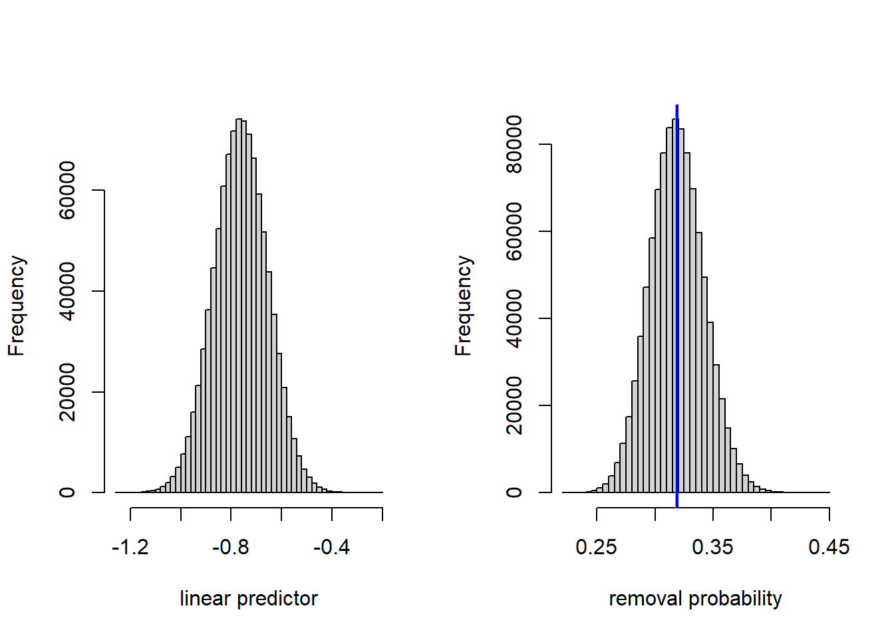
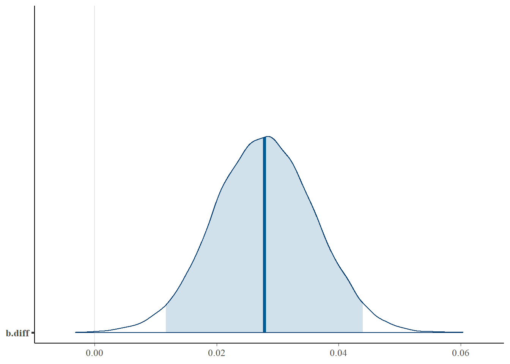

# Generalized linear mixed models


We will examine several possible approaches to analyzing the industrial melanism data.  Recall that these data consist of paired binomial responses with two covariates: distance from Liverpool (a station-level covariate) and color morph (an observation-level covariate).  In notation, the model that we seek to fit is
\begin{align*}
y_{ij} & \sim \mathrm{Binom}(p_{ij}, n_{ij})\\
\mathrm{logit}(p_{ij}) & = \eta_{ij} \\
\eta_{ij} & = a_i + b_i x_j + L_j \\
L_j & \sim \mathcal{N}(0, \sigma^2_L)
\end{align*}
where $i=1,2$ indexes the two color morphs, $j = 1, \ldots, 7$ indexes the stations, $y_{ij}$ is the number of moths removed, $n_{ij}$ is the number of moths placed, and let $x_j$ is the distance of the station from Liverpool.  We are most interested in learning about the difference $b_1 - b_2$, which quantifies how the relationship between log odds of removal and distance differs between the two color morphs, and determining whether there is evidence that this difference $\neq 0$.  Alternatively, we might prefer to consider the quantity $e^{b_1 - b_2} = e^{b_1} / e^{b_2}$, which tells us how the odds ratio for removal changes between the two morphs as distance increases.  This odds ratio is a bit closer to something that we can mentall grasp.  In terms of the odds ratio, we are interested in learning if the odds ratio $\neq 1$.

Before proceeding, we note that one approach is simply to regress the difference of the empirical logits vs.\ distance.  This reduces the problem to a simple regression.  We try this approach first and use it as a benchmark.  The data set used here is reformatted to include one record for each of the 7 stations.


```r
moth2 <- read.table("data/moth2.txt", head = TRUE, stringsAsFactors = TRUE)

head(moth2, n = 3)
```

```
##   location distance morph l.placed l.removed d.placed d.removed
## 1       sp      0.0 light       56        17       56        14
## 2       ef      7.2 light       80        28       80        20
## 3       ha     24.1 light       52        18       52        22
```

```r
elogit <- function(x) log(x / (1 - x))

moth2$elogit.diff <- with(moth2, elogit(d.removed / d.placed) - elogit(l.removed / l.placed))

fm1 <- lm(elogit.diff ~ distance, data = moth2)

with(moth2, plot(elogit.diff ~ distance,
                xlab = "distance from city center (km)",
                ylab = "difference in log odds of removal, dark - light"))

abline(h = 0, lty = "dashed")
abline(fm1)
```


```r
summary(fm1)
```

```
## 
## Call:
## lm(formula = elogit.diff ~ distance, data = moth2)
## 
## Residuals:
##        1        2        3        4        5        6        7 
##  0.10557 -0.30431  0.03501  0.26395 -0.09387  0.29714 -0.30349 
## 
## Coefficients:
##              Estimate Std. Error t value Pr(>|t|)   
## (Intercept) -0.373830   0.192503  -1.942  0.10980   
## distance     0.027579   0.005997   4.599  0.00585 **
## ---
## Signif. codes:  0 '***' 0.001 '**' 0.01 '*' 0.05 '.' 0.1 ' ' 1
## 
## Residual standard error: 0.2698 on 5 degrees of freedom
## Multiple R-squared:  0.8088,	Adjusted R-squared:  0.7706 
## F-statistic: 21.15 on 1 and 5 DF,  p-value: 0.005846
```

```r
confint(fm1)
```

```
##                   2.5 %     97.5 %
## (Intercept) -0.86867531 0.12101544
## distance     0.01216371 0.04299419
```

This approach tells us that the difference in log-odds slopes (defined as dark morph - light morph) is 0.0276, with a 95\% confidence interval of (0.012, 0.043).   This corresponds to an odds ratio of 1.028, with a 95\% confidence interval of (1.012, 1.044).  In other words, with every additional km from the city center, the odds ratio for a dark moth's removal vs.\ a light moth's removal increases by about 2.8\%.

The major disadvantage to the approach above is that it doesn't account for the fact that differing numbers of moths were placed at the different stations.  We could try to account for this with a weighted regression, but it's not clear what the weights should be.  We were also fortunate in the sense that there were no instances of either none or all of the moths being removed at a particular station, which would have led to an infinite empirical logit.

## GEEs

Next we try a GEE with a compound symmetry ("exchangable") correlation structure imposed on the pair of measurements at each station.  Because there are only two data records for each station, there is no loss of generality in assuming this correlation structure.  We fit the model using `geepack::geeglm`. 


```r
require(geepack)
```

```
## Loading required package: geepack
```


```r
moth <- read.table("data/moth.txt", head = TRUE, stringsAsFactors = TRUE)
contrasts(moth$morph) <- contr.treatment(n = 2, base = 2)

fm2 <- geeglm(cbind(removed, placed - removed) ~ distance * morph, 
              family = binomial(link = "logit"), 
              data   = moth,
              id     = location, 
              corstr = "exchangeable")

summary(fm2)
```

```
## 
## Call:
## geeglm(formula = cbind(removed, placed - removed) ~ distance * 
##     morph, family = binomial(link = "logit"), data = moth, id = location, 
##     corstr = "exchangeable")
## 
##  Coefficients:
##                  Estimate   Std.err   Wald Pr(>|W|)    
## (Intercept)     -0.714717  0.129102 30.648 3.09e-08 ***
## distance        -0.009385  0.003221  8.489  0.00357 ** 
## morph1          -0.410238  0.163953  6.261  0.01234 *  
## distance:morph1  0.027762  0.005812 22.815 1.78e-06 ***
## ---
## Signif. codes:  0 '***' 0.001 '**' 0.01 '*' 0.05 '.' 0.1 ' ' 1
## 
## Correlation structure = exchangeable 
## Estimated Scale Parameters:
## 
##             Estimate  Std.err
## (Intercept)  0.01313 0.006935
##   Link = identity 
## 
## Estimated Correlation Parameters:
##       Estimate Std.err
## alpha   0.3911   0.298
## Number of clusters:   7  Maximum cluster size: 2
```

The estimate of the difference between slopes on the log-odds scale is 0.0278, with an approximate 95\% confidence interval of (0.0164, 0.0391).  This corresponds to an odds ratio of 1.028, with an approximate 95\% confidence interval of (1.017, 1.040).  To visualize the model, we might plot the fitted proportion removed vs.\ distance for both color morphs.  Bear in mind that fitted values here correspond to marginal mean removal rates.


```r
inv.logit <- function(x) exp(x) / (1 + exp(x))
light.fit <- function(d) inv.logit(-0.71472 - 0.00938 * d)
dark.fit <- function(d) inv.logit(-0.71472 - 0.41024 + (-0.00938 + 0.02776) * d)

curve(dark.fit, from = min(moth$distance), to = max(moth$distance),
      xlab = "distance from city center (km)",
      ylab = "proportion removed",
      ylim = c(0.15, 0.5))

curve(light.fit, from = min(moth$distance), to = max(moth$distance),
      xlab = "distance from city center (km)",
      ylab = "proportion removed",
      add = TRUE,
      lty = "dashed")

with(subset(moth, morph == "dark"), points(removed / placed ~ distance, pch = 16))
with(subset(moth, morph == "light"), points(removed / placed ~ distance, pch = 1))
```


For the sake of comparing marginal means to conditional means, we will consider the predicted removal rate of dark morphs at a hypothetical location 20 km from the city center.  This predicted removal rate is 0.319.


```r
dark.fit(20)
```

```
## [1] 0.3192197
```

## GLMMs

Next, we will fit the same model with `lme4::glmer`.


```r
require(lme4)
```

```
## Loading required package: lme4
```

```
## Loading required package: Matrix
```

```r
fm3 <- glmer(cbind(removed, placed - removed) ~ distance * morph + (1 | location), 
             family = binomial(link = "logit"), 
             data = moth)

summary(fm3)
```

```
## Generalized linear mixed model fit by maximum likelihood (Laplace
##   Approximation) [glmerMod]
##  Family: binomial  ( logit )
## Formula: cbind(removed, placed - removed) ~ distance * morph + (1 | location)
##    Data: moth
## 
##      AIC      BIC   logLik deviance df.resid 
##     85.7     88.9    -37.8     75.7        9 
## 
## Scaled residuals: 
##      Min       1Q   Median       3Q      Max 
## -1.73965 -0.41890  0.02967  0.66584  1.08052 
## 
## Random effects:
##  Groups   Name        Variance Std.Dev.
##  location (Intercept) 0.01148  0.1072  
## Number of obs: 14, groups:  location, 7
## 
## Fixed effects:
##                  Estimate Std. Error z value Pr(>|z|)    
## (Intercept)     -0.719786   0.205488  -3.503 0.000460 ***
## distance        -0.009341   0.006270  -1.490 0.136243    
## morph1          -0.411128   0.274765  -1.496 0.134578    
## distance:morph1  0.027819   0.008094   3.437 0.000588 ***
## ---
## Signif. codes:  0 '***' 0.001 '**' 0.01 '*' 0.05 '.' 0.1 ' ' 1
## 
## Correlation of Fixed Effects:
##             (Intr) distnc morph1
## distance    -0.843              
## morph1      -0.641  0.538       
## dstnc:mrph1  0.558 -0.660 -0.859
```

```r
confint(fm3, parm = c("distance:morph1"))
```

```
## Computing profile confidence intervals ...
```

```
##                      2.5 %     97.5 %
## distance:morph1 0.01201418 0.04377205
```

Nothing here is radically different.  The parameter estimates are so similar to those from the GEE that a plot of the GEE and GLMM fits would be indistinguishable to the eye.  To get a sense of how the conditional means compare to the marginal means, we will compute the conditional mean removal rate of dark morphs at a distance 20 km from the city center.  


```r
dark.linpred.glmm <- function(d) -0.71979 - 0.41113 + (-0.00934 + 0.02782) * d
dark.fit.glmm <- function(d) inv.logit(dark.linpred.glmm(d))
dark.fit.glmm(20)
```

```
## [1] 0.3183597
```

The conditional mean of the predicted removal rate is 0.318.

Here, the difference between the marginal and conditional means is tiny.  Nevertheless, we can gain a deeper understanding of the difference by taking a look at the fitted population of possible locations at 20 km distance on both the linear predictor scale and the data scale.


```r
linpred.sample <- rnorm(1e6, mean = dark.linpred.glmm(20), sd = 0.1072)
prob.sample <- inv.logit(linpred.sample)

(conditional.mean <- inv.logit(dark.linpred.glmm(20)))
```

```
## [1] 0.3183597
```

```r
(marginal.mean <- mean(prob.sample))
```

```
## [1] 0.3188324
```

```r
par(mfrow = c(1, 2))
hist(linpred.sample, breaks = 50, xlab = "linear predictor", main = "")
hist(prob.sample, breaks = 50, xlab = "removal probability", main = "")
abline(v = conditional.mean, col = "darkorange", lwd =2)
abline(v = marginal.mean, col = "blue", lwd = 2)
```



We see that the variance of the location-level random effect is small enough that the inverse logit transformation is effectively linear. Thus, the distribution of removal probabilities across locations is nearly normal, and the conditional and marginal means nearly coincide.  The estimate of the marginal mean that we have generated by simulation is not quite the same as the marginal mean generated by the GEE, which could either be due to the stochastic sampling that we have used above, and/or small numerical differences in the estimation.

For the sake of illustration, we repeat these calculations by supposing that the location-to-location standard deviation was 10 times larger.


```r
linpred.sample <- rnorm(1e6, mean = dark.linpred.glmm(20), sd = 10 * 0.1072)
prob.sample <- inv.logit(linpred.sample)

(conditional.mean <- inv.logit(dark.linpred.glmm(20)))
```

```
## [1] 0.3183597
```

```r
(marginal.mean <- mean(prob.sample))
```

```
## [1] 0.3502449
```

```r
par(mfrow = c(1, 2))
hist(linpred.sample, breaks = 50, xlab = "linear predictor", main = "")
hist(prob.sample, breaks = 50, xlab = "removal probability", main = "")
abline(v = conditional.mean, col = "darkorange", lwd =2)
abline(v = marginal.mean, col = "blue", lwd = 2)
```


## Bayesian fit

We now fit the model using JAGS and vague priors.


```r
require(R2jags)
```

```
## Warning: package 'R2jags' was built under R version 4.1.1
```

```
## Warning: package 'rjags' was built under R version 4.1.1
```


```r
moth.model <- function() {
   
   for (j in 1:J) {             # J = number of data points
      
      y[j]   ~ dbin(p[j], n[j])      # data distribution
      
      p[j]   <- ilogit(eta[j])      # inverse link
      eta[j] <- a[morph[j]] + b[morph[j]] * dist[j] + L[loc[j]]  # linear predictor,
   }
   
   for (j in 1:7){  # random effects for location
    
     L[j] ~ dnorm(0, tau_L)
   }
  
   a[1] ~ dnorm (0.0, 1E-6)       # priors for intercept
   a[2] ~ dnorm (0.0, 1E-6)       # priors for intercept
   b[1] ~ dnorm (0.0, 1E-6)       # prior for slope
   b[2] ~ dnorm (0.0, 1E-6)       # prior for slope
   
   tau_L   ~ dgamma (0.01, 0.01)    # prior for location-level random effect
   
   sd_L   <- pow(tau_L, -1/2)
   
   b.diff <- b[1] - b[2]
}

jags.data <- list(y     = moth$removed, 
                  n     = moth$placed,
                  dist  = moth$distance,
                  loc   = as.numeric(moth$location),
                  morph = as.numeric(moth$morph),
                  J     = nrow(moth))

jags.params <- c("a[1]", "a[2]", "b[1]", "b[2]", "b.diff", "sd_L")

jags.inits <- function(){
   list("tau_L" = runif(1))
}

set.seed(1)

jagsfit <- jags(data               = jags.data, 
                inits              = jags.inits, 
                parameters.to.save = jags.params,
                model.file         = moth.model,
                n.chains           = 3,
                n.iter             = 5E4,
                n.thin             = 5)
```

```
## module glm loaded
```

For some reason this works without specifying initial values for $a$ and $b$ (now both vectors).  Maybe the initial values are drawn from the prior?


```r
print(jagsfit)
```

```
## Inference for Bugs model at "C:/Users/krgross/AppData/Local/Temp/RtmpU5mLkn/model17c4a0a6cf8.txt", fit using jags,
##  3 chains, each with 50000 iterations (first 25000 discarded), n.thin = 5
##  n.sims = 15000 iterations saved
##          mu.vect sd.vect   2.5%    25%    50%    75%  97.5%  Rhat n.eff
## a[1]      -1.141   0.290 -1.720 -1.320 -1.135 -0.963 -0.577 1.001 13000
## a[2]      -0.735   0.282 -1.295 -0.908 -0.733 -0.559 -0.185 1.001 15000
## b.diff     0.028   0.008  0.012  0.022  0.028  0.033  0.044 1.001 15000
## b[1]       0.019   0.009  0.002  0.013  0.019  0.024  0.036 1.001  6800
## b[2]      -0.009   0.009 -0.026 -0.015 -0.009 -0.004  0.008 1.001  9700
## sd_L       0.249   0.147  0.080  0.151  0.215  0.306  0.620 1.002  2200
## deviance  75.258   4.136 68.632 72.242 74.782 77.723 84.621 1.002  2700
## 
## For each parameter, n.eff is a crude measure of effective sample size,
## and Rhat is the potential scale reduction factor (at convergence, Rhat=1).
## 
## DIC info (using the rule, pD = var(deviance)/2)
## pD = 8.5 and DIC = 83.8
## DIC is an estimate of expected predictive error (lower deviance is better).
```


```r
mcmc.output <- as.data.frame(jagsfit$BUGSoutput$sims.list)
(post.mean   <- apply(mcmc.output, 2, mean))
```

```
##          a.1          a.2       b.diff          b.1          b.2     deviance 
## -1.140722211 -0.734757896  0.027796240  0.018614882 -0.009181358 75.257872581 
##         sd_L 
##  0.249026857
```

```r
HPDinterval(as.mcmc(mcmc.output['b.diff']))
```

```
##             lower      upper
## b.diff 0.01168872 0.04370766
## attr(,"Probability")
## [1] 0.95
```

The posterior mean of the difference in the log-odds slopes --- 0.0278 --- is essentially the same value that we have seen in every analysis.  We can have a look at the full posterior distribution for this difference, and calculate the posterior probability that the difference is $>0$.  


```r
bayesplot::mcmc_areas(mcmc.output,
                      pars = c("b.diff"),
                      prob = 0.95) 
```




```r
table(mcmc.output$b.diff > 0)
```

```
## 
## FALSE  TRUE 
##     4 14996
```

Thus we would say that there is a 0.9997 posterior probability that the proportion of dark moths removed increases more rapidly with increasing distance from Liverpool than the proportion of light moths removed.


We can plot the fit of the model using draws from the posterior distribution of the parameters.  The heavy lines below show the fits using the posterior means of the parameters.  Do these fits correspond to the marginal or conditional means?  (There's little difference here, but it's a useful thought exercise.)

```r
subset.samples <- sample(nrow(mcmc.output), size = 100)

moth$prop.removed <- with(moth, removed / placed)

light <- subset(moth, morph == "light")
dark  <- subset(moth, morph == "dark")

par(mfrow = c(1, 2))

#------ light morph

plot(prop.removed ~ distance,
     data = moth,
     type = "n",
     main = "Light morph",
     ylab = "proprotion removed")

points(x = light$distance, y = light$prop.removed, pch = 16)

for(i in subset.samples) {

  a <- mcmc.output$a.2[i]
  b <- mcmc.output$b.2[i]

  fitted.curve <- function(x) inv.logit(a + b * x)

  curve(fitted.curve,
        from = min(moth$distance),
        to   = max(moth$distance),
        add  = TRUE,
        col  = "deepskyblue")
}

fitted.mean.curve <- function(x) inv.logit(post.mean['a.2'] + post.mean['b.2'] * x)

curve(fitted.mean.curve,
        from = min(moth$distance),
        to   = max(moth$distance),
        add  = TRUE,
        col  = "darkblue",
        lwd  = 2)

points(x = light$distance, y = light$prop.removed, pch = 16)

#--------- dark morph

plot(prop.removed ~ distance,
     data = moth,
     type = "n",
     main = "Dark morph",
     ylab = "proprotion removed")

for(i in subset.samples) {

  a <- mcmc.output$a.1[i]
  b <- mcmc.output$b.1[i]

  fitted.curve <- function(x) inv.logit(a + b * x)

  curve(fitted.curve,
        from = min(moth$distance),
        to   = max(moth$distance),
        add  = TRUE,
        col  = "deepskyblue")
}

fitted.mean.curve <- function(x) inv.logit(post.mean['a.1'] + post.mean['b.1'] * x)

curve(fitted.mean.curve,
        from = min(moth$distance),
        to   = max(moth$distance),
        add  = TRUE,
        col  = "darkblue",
        lwd  = 2)

points(x = dark$distance, y = dark$prop.removed, pch = 16)
```


