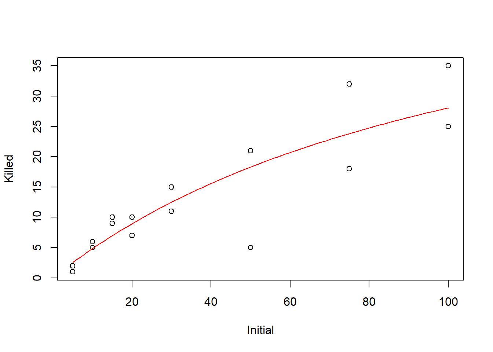

--- 
title: "Applied statistical analysis of non-normal and/or correlated data"
author: "Kevin Gross"
date: "2025-10-29"
output: 
  bookdown::gitbook:
    config:
      toc:
        collapse: section
      fontsettings:
        theme: white
        family: serif
        size: 2
documentclass: book
bibliography: [bma590.bib]
biblio-style: apalike
link-citations: yes
description: "This is a proto-textbook for BMA / ST 590, Statistical Modeling in Ecology."
---

\renewcommand{\Pr}[1]{\mathrm{Pr}\!\left\{#1\right\}}
\DeclareMathOperator*{\argmax}{arg\,max}
\newcommand{\L}[1]{\mathcal{L}\!\left(#1\right)}
\newcommand{\vecy}{\mathbf{Y}}
\newcommand{\vecyhat}{\mathbf{\hat{Y}}}
\newcommand{\X}{\mathbf{X}}
\newcommand{\vecx}{\mathbf{x}}
\newcommand{\vecX}{\mathbf{X}}
\newcommand{\vecb}{\mathbf{\beta}}
\newcommand{\vecbhat}{\hat{\mathbf{\beta}}}
\newcommand{\veceps}{\mathbf{\epsilon}}
\newcommand{\vece}{\mathbf{e}}
\newcommand{\Exp}[1]{\mathrm{E}\left[#1\right]}
\newcommand{\Var}[1]{\mbox{Var}\left(#1\right)}
\newcommand{\SD}[1]{\mbox{SD}\left(#1\right)}
\newcommand{\Cov}[2]{\mbox{Cov}\left(#1, #2\right)}
\newcommand{\Cor}[2]{\mbox{Cor}\left(#1, #2\right)}
\newcommand{\vcov}[1]{\mbox{Cov}\left(#1\right)}
\newcommand{\vcor}[1]{\mbox{Cor}\left(#1\right)}

# Maximum likelihood estimation {#ML}

The *likelihood function* is the mathematical object that underlies many of the methods that we will study in this course.  In this chapter, we will study the properties of the likelihood function for some simple models and data sets.  We will see that the likelihood can be used to generate parameter estimates and associated measures of uncertainty (e.g., standard errors and confidence intervals). For most of the methods that we study later in this course, we will use software in which someone else has written code to analyze the likelihood function; thus we won't have to worry about coding the likelihood function ourselves.  However, it is helpful to know how to derive and analyze a likelihood function when needed, because likelihood analysis is flexible and can often be applied in specialized situations where code for a specific analysis may not already exist.

## Mathematical basics

The mathematical expression for a likelihood function is identical to the mathematical expression that one would use to find the probability mass or density associated with a particular value of a random variable.  For example, suppose that we have a very simple data set that consists of only one observation from a Poisson distribution.  Let $X$ denote the value of the single data point, and let $\lambda$ denote the parameter of the Poisson distribution.  In a probability class, we learn that we can find the probability mass associated with any particular value of $X$ using the formula
\[
\Pr{X=x; \lambda} = \dfrac{e^{-\lambda} \lambda^x}{x!}.
\]
In R, we can access this probability mass function using the `dpois` function.  For example, if we wanted to find the probability mass associated with $X=1$ when $\lambda = 1.5$, we could use

``` r
dpois(x = 1, lambda = 1.5)
```

```
## [1] 0.3346952
```

In likelihood analysis, we use the same mathematical expression for the probability mass function (pmf) of a data set, but we change our perspective.  Instead of regarding the parameter as a known quantity and computing the probability associated with various possible values for the data, in likelihood analysis we regard the data as the known quantity and evaluate the same mathematical expression for different parameter values.  In notation, this logic translates into an expression that we can write as
\[
\L{\lambda; x} = \Pr{X=x; \lambda}.
\]
where we have used $\L{\lambda; x}$ to denote the likelihood function for $\lambda$ when we have a data set with value $x$.  The expression above seems strange, because nothing seems to be happening; we are simply taking the same mathematical expression and calling it two different things depending on the context.  But that is all there is to it, at least with regard to constructing the likelihood function.

Because a likelihood function uses the same mathematical formulas as a probability mass function, we can use the same functions that `R` provides for computing probability masses for discretely valued data (or probability densities for continuously valued data) to compute the a likelihood function. Let's return to our simple example of observing a single observation from a Poisson distribution.  Suppose that observation is $X=2$.  We can use the `dpois` function to evaluate the likelihood for this single observation.  For example, we can evaluate the likelihood at $\lambda = 1.5$:

``` r
dpois(x = 2, lambda = 1.5)
```

```
## [1] 0.2510214
```
Or we could evaluate the likelihood at $\lambda = 2$ or $\lambda = 2.5$:

``` r
dpois(x = 2, lambda = c(2, 2.5))
```

```
## [1] 0.2706706 0.2565156
```
Now let's evaluate the likelihood at a sequence of $\lambda$ values:

``` r
my.lhood <- function(lambda) dpois(x = 2, lambda = lambda)

curve(my.lhood, from = 0, to = 5,
      xlab = expression(lambda), 
      ylab = "Likelihood")
```


We might guess that the likelihood is maximized at $\lambda = 2$.  We'd be right, as the plot below suggests.

``` r
curve(my.lhood, from = 0, to = 5,
      xlab = expression(lambda), 
      ylab = "Likelihood")

abline(v = 2, col = "red")
```


## Horse-kick data {#horse}

Most real data sets contain more than a single observation.  Here is a data set that we can use to illustrate maximum likelihood estimation with a single parameter.  Famously, Ladislaus van Bortkewitsch (1868 -- 1931) published how many members of the Prussian army were killed by horse kicks in each of 20 years, for each of 14 army corps.  In this analysis, we will ignore both the temporal structure and the grouping among corps and treat the data as just a simple random sample^[Recall that when we refer to a data set as a "simple random sample", we mean that the data are independent and identically distributed.  That is, they are independent draws from the same underlying probability distribution.] from a Poisson distribution with $n=280$ data points.  As a caveat, these data are often used to illustrate the Poisson distribution, as we will use them.  They match the Poisson distribution more neatly than we might expect for most data sets.

First import the data.  Note that the path name used here is specific to the file directory that was used to create this file.  The path name that you use will likely differ.

``` r
horse <- read.table("data/horse.txt", header = TRUE)
```
Ask for a `summary` of the data to make sure the data have been imported correctly.

``` r
summary(horse)
```

```
##       year         corps               deaths   
##  Min.   :1875   Length:280         Min.   :0.0  
##  1st Qu.:1880   Class :character   1st Qu.:0.0  
##  Median :1884   Mode  :character   Median :0.0  
##  Mean   :1884                      Mean   :0.7  
##  3rd Qu.:1889                      3rd Qu.:1.0  
##  Max.   :1894                      Max.   :4.0
```
We can also learn about the data by asking to see the first few records using the `head` command

``` r
head(horse)
```

```
##   year corps deaths
## 1 1875    GC      0
## 2 1876    GC      2
## 3 1877    GC      2
## 4 1878    GC      1
## 5 1879    GC      0
## 6 1880    GC      0
```
or we can see the last few records using the `tail` command:

``` r
tail(horse)
```

```
##     year corps deaths
## 275 1889   C15      2
## 276 1890   C15      2
## 277 1891   C15      0
## 278 1892   C15      0
## 279 1893   C15      0
## 280 1894   C15      0
```
Another useful function to keep in mind is the `str` function which tells you about the [str]ucture of an R object:

``` r
str(horse)
```

```
## 'data.frame':	280 obs. of  3 variables:
##  $ year  : int  1875 1876 1877 1878 1879 1880 1881 1882 1883 1884 ...
##  $ corps : chr  "GC" "GC" "GC" "GC" ...
##  $ deaths: int  0 2 2 1 0 0 1 1 0 3 ...
```

Let's plot a histogram of the values:

``` r
hist(horse$deaths,
     breaks = seq(from = min(horse$deaths) - 0.5, 
                  to = max(horse$deaths) + 0.5, 
                  by = 1))
```


### Calculate and plot the log-likelihood function

The first step in likelihood analysis is to construct the likelihood function.  The likelihood function is given by the same mathematical expression as the expression for the joint probability mass function of the data.  This joint pmf should follow from our probability model for the data.

In this case, we will assume that the data are an iid sample from a Poisson distribution with parameter $\lambda$.  Denoting the random sample as $X_1, X_2, \ldots, X_n$, we might write this model as
\[
X_i \stackrel{\text{iid}}{\sim} \mathrm{Pois}(\lambda).
\]
To make the notation a bit easier, we'll write the entire data set as a vector $\mathbf{X} = \left[ X_1  \;  X_2 \; \cdots \;  X_n\right]^T$, where we use uppercase $\mathbf{X}$ to denote the unobserved random vector and lowercase $\mathbf{x}$ to denote a single realization of $\mathbf{X}$.  The likelihood function is then given by
\begin{align*}
\mathcal{L}(\lambda; \mathbf{x}) & = \Pr{\mathbf{X} = \mathbf{x}; \lambda} \\
& = \Pr{X_1 = x_1, X_2 = x_2, \ldots X_n = x_n; \lambda} \\
& = \Pr{X_1 = x_1; \lambda} \times \Pr{X_2 = x_2; \lambda} \times \cdots \times \Pr{X_n = x_n; \lambda} \\
& = \prod_{i=1}^n \Pr{X_i = x_i; \lambda}.
\end{align*}
The third equality above follows from the independence of the data points.

Here's a function that we can use to compute likelihood for any particular value of $\lambda$ for the horse data:

``` r
horse.lhood <- function(my.lambda){
  
  ll.vals <- dpois(x = horse$deaths, lambda = my.lambda)
  prod(ll.vals)
}
```

Notice, however, that the values of the likelihood are very close to zero, even for reasonable choices of $\lambda$:

``` r
horse.lhood(0.75)
```

```
## [1] 2.275728e-137
```
Small values of the likelihood create the risk of *numerical underflow*.  Numerical underflow occurs when positive numbers become too close to zero for the computer to perform sufficiently precise calculations.^[In `R`, we can find the smallest positive value that meets the IEEE technical standard using `.Machine$double.xmin`.  Although `R` may show answers for computations involving values less than this value, those computations are not trustworthy and may generate strange results.]

To prevent numerical underflow, we'll work on the log-likelihood instead of the likelihood itself.  Throughout these notes, we'll use lowercase $\ell = \ln \mathcal{L}$ to denote the log likelihood. Note that when we use the log likelihood, the product of the marginal pmfs above becomes a sum:
\begin{align*}
\ell(\lambda; \mathbf{x}) & = \ln \prod_{i=1}^n \Pr{X_i = x_i; \lambda} \\
& = \sum_{i=1}^n \ln \Pr{X_i = x_i; \lambda}
\end{align*}

Let's create a function that calculates the log-likelihood for a value of $\lambda$:


``` r
horse.ll <- function(my.lambda){
  
  ll.vals <- dpois(x = horse$deaths, lambda = my.lambda, log = TRUE)
  sum(ll.vals)
}
```
We can use this function to calculate the log-likelihood for any value of $\lambda$, such as $\lambda = 1$:

``` r
horse.ll(1)
```

```
## [1] -328.2462
```

Let's calculate the log-likelihood for many values of $\lambda$, in preparation for making a plot.  We'll use a loop here, and not worry about vectorization.  


``` r
# create a vector of lambda values using the 'seq'uence command
lambda.vals <- seq(from = 0.01, to = 2.0, by = 0.01)  

# create an empty vector to store the values of the log-likelihood
ll.vals <- double(length = length(lambda.vals))  

# use a loop to find the log-likelihood for each value in lambda.vals
for (i.lambda in 1:length(lambda.vals)) {
  ll.vals[i.lambda] <- horse.ll(lambda.vals[i.lambda])
}
```

Now plot the log-likelihood values vs.\ the values of $\lambda$:

``` r
plot(ll.vals ~ lambda.vals, xlab = "lambda", ylab = "log likelihood", type = "l")
abline(v = 0.7, col = "red")
```


### Find the MLE numerically using 'optimize'

Bolker's book illustrates numerical optimization using the `optim` function.  The R documentation recommends using `optimize` for one-dimensional optimization, and `optim` for optimizing a function in several dimensions.  So, we will use `optimize` here.  We will enclose the entire call to `optimize` in parentheses so that the output is dumped to the command line in addition to being stored as `horse.mle`.

``` r
(horse.mle <- optimize(f = horse.ll, interval = c(0.1, 2), maximum = TRUE))
```

```
## $maximum
## [1] 0.7000088
## 
## $objective
## [1] -314.1545
```

The `optimize` function returns a 'list'.  A list is an R object that contains components of different types. The numerically calculated MLE is $\hat{\lambda} \approx 0.7$.  The 'objective' component of `horse.mle` gives the value of the log-likelihood at that point.

## Pulse rate data

The data set `pulse.csv` contains the heights (in cm) and resting pulse rates (in beats per minute) of 43 graduate students at NCSU.  We will use the pulse-rate data as an example to illustrate estimating the mean and variance of a Gaussian distribution from a simple random sample.  The purpose of this example is two-fold: first, to illustrate maximum-likelihood estimation with more than one parameter, and second, to illustrate an important result about the MLE of the variance for normally distributed data. 

<!-- The myxomatosis data are in Bolker's library `emdbook`.  First load the library.  If the library is not found, you will first have to download and install the library on your computer, using the Packages tab in RStudio.  The call to `data` loads the particular myxomatosis data set that we want into memory. -->

``` r
pulse <- read.csv("data/pulse.csv", head = T)
```
Inspect the data to make sure they have been imported correctly.

``` r
summary(pulse)
```

```
##      height           rate    
##  Min.   :152.0   Min.   : 52  
##  1st Qu.:163.0   1st Qu.: 66  
##  Median :168.0   Median : 72  
##  Mean   :168.2   Mean   : 72  
##  3rd Qu.:173.0   3rd Qu.: 78  
##  Max.   :185.0   Max.   :100
```

``` r
head(pulse)
```

```
##   height rate
## 1    152   68
## 2    173   68
## 3    165   82
## 4    160   60
## 5    168   74
## 6    170   80
```
For the sake of illustration, we will estimate the mean and variance of the normal distribution using the `optim` function in R.

First, we write a function to calculate the log likelihood.

``` r
pulse.ll <- function(m, v){

  ll.vals <- dnorm(pulse$rate, mean = m, sd = sqrt(v), log = TRUE)
  sum(ll.vals)
}
```
Note that R's function for the pdf of a normal distribution --- `dnorm` --- is parameterized by the mean and standard deviation (SD) of the normal distribution.  Although it would be just as easy to find the MLE of the standard deviation $\sigma$, for the sake of illustration, we will seek the MLE of the variance, $\sigma^2$.  (It turns out that, if we write the MLE of the standard deviation as $\hat{\sigma}$ and the MLE of the variance as $\hat{\sigma}^2$, then $\hat{\sigma} = \sqrt{\hat{\sigma}^2}$.  This is an example of the *invariance property* of MLEs.)

We can use our function to calculate the likelihood for any choice of mean and variance.  For example, let's try $\mu = 60$ and $\sigma^2 = 100$.

``` r
pulse.ll(m = 60, v = 100)
```

```
## [1] -189.6155
```
We want to maximize the likelihood using `optim`.  Unfortuantely, `optim` is a little finicky.  To use `optim`, we have to re-write our function `pulse.ll` so that the parameters to be estimated are passed to the function as a single vector.  Also, by default, `optim` performs minimization instead of maximization.  We can change this behavior when we call `optim`.  Alternatively, we can just re-define the function to return the negative log likelihood.  

``` r
pulse.neg.ll <- function(pars){

  m <- pars[1]
  v <- pars[2]
  
  ll.vals <- dnorm(pulse$rate, mean = m, sd = sqrt(v), log = TRUE)
  -sum(ll.vals)
}
```
Now we can use `optim`:

``` r
(pulse.mle <- optim(par = c(60, 100),  # starting values, just a ballpark guess 
                  fn  = pulse.neg.ll))
```

```
## $par
## [1] 71.99897 93.65332
## 
## $value
## [1] 158.6099
## 
## $counts
## function gradient 
##       51       NA 
## 
## $convergence
## [1] 0
## 
## $message
## NULL
```
Note that the MLE of the variance is
\[
\hat{\sigma}^2 = \frac{\sum_i (x_i - \bar{x})}{n}.
\]
Let's verify this by calculating the same quantity at the command line:

``` r
residuals <- with(pulse, rate - mean(rate))
ss <- sum(residuals^2)
n <- nrow(pulse)
ss / n
```

```
## [1] 93.62791
```

Compare this to the answer given by `var`, and to the more usual calculation of the variance as
$$
s^2 = \frac{\sum_i (x_i - \bar{x})}{n-1}.
$$

``` r
(var.usual <- ss / (n - 1))
```

```
## [1] 95.85714
```

``` r
var(pulse$rate)
```

```
## [1] 95.85714
```

One main take-home of this example is that when we use maximum likelihood to estimate variances for normally distributed data, the MLE is biased low.  In other words, it underestimates the true variance.  When we study hierarchical models later in the semester, we will regularly find ourselves estimating variances for normally distributed effects, and will have to deal with the consequences of the fact that the MLEs of these variances are biased low.

For models with 2 parameters, we can visualize the likelihood surface with a contour plot.  To do so, the first step is to define a lattice of values at which we want to calculate the log-likelihood.  We'll do so by defining vectors for $\mu$ and $\sigma^2$:

``` r
m.vals <- seq(from = 60, to = 80, by = 0.5)
v.vals <- seq(from = 70, to = 125, by = 0.5)
```

<!-- Here is some fancy R code that shows this lattice.  Don't worry about how this plot is created, as it isn't critical for what follows. -->
<!-- ```{r} -->
<!-- plot(rep(m.vals, length(v.vals)), rep(v.vals, rep(length(m.vals), length(v.vals))), -->
<!--      xlab = expression(mu), -->
<!--      ylab = expression(sigma^2)) -->
<!-- ``` -->

Now we will define the matrix that will store the values of the log-likelihood for each combination of $\mu$ and $\sigma^2$ in the lattice shown above.

``` r
ll.vals <- matrix(nrow = length(m.vals), ncol = length(v.vals))
```

Next, we will write a nested loop that cycles through the lattice points, calculates the log-likelihood for each, and stores the value of the log likelihood in the matrix `ll.vals` that we just created.

``` r
for (i.m in 1:length(m.vals)) {
  for(i.v in 1:length(v.vals)) {
    ll.vals[i.m, i.v] <- pulse.ll(m = m.vals[i.m], v = v.vals[i.v])
  }
}
```

Now we will use the `contour` function to build the contour plot, and then add a red dot for the MLE.

``` r
contour(x = m.vals, y = v.vals, z = ll.vals, nlevels = 100,
        xlab = expression(mu), ylab = expression(sigma^2))

# show the MLE
points(x = pulse.mle$par[1], y = pulse.mle$par[2], col = "red")
```


## Tadpole data

Finally, we'll take a look at the data from the functional response experiment of @vonesh2005compensatory, described in section 6.3.1.1 of Bolker's book.  This is another example of using likelihood to estimate parameters in a two-parameter model.  This example differs from the previous two examples because we won't assume that the data constitute a simple random sample from some known distribution like the Gaussian or Poisson distribution.  Instead, we'll build a somewhat more customized model for these data that incorporates some ecological ideas.  This process of building a customized model is more typical of how one would analyze a "real" data set. 


First, we'll read in the data and explore them in various ways.


``` r
library(emdbook)
data("ReedfrogFuncresp")

# rename something shorter

frog <- ReedfrogFuncresp
rm(ReedfrogFuncresp)

summary(frog)
```

```
##     Initial           Killed     
##  Min.   :  5.00   Min.   : 1.00  
##  1st Qu.: 13.75   1st Qu.: 5.75  
##  Median : 25.00   Median :10.00  
##  Mean   : 38.12   Mean   :13.25  
##  3rd Qu.: 56.25   3rd Qu.:18.75  
##  Max.   :100.00   Max.   :35.00
```

``` r
head(frog)
```

```
##   Initial Killed
## 1       5      1
## 2       5      2
## 3      10      5
## 4      10      6
## 5      15     10
## 6      15      9
```

``` r
plot(Killed ~ Initial, data = frog)
```


Following Bolker, we'll assume that the number of individuals killed takes a binomial distribution, where the number of trials equals the initial tadpole density, and the probability that a tadpole is killed is given by the expression
$$
p_i = \dfrac{a}{1 + a h N_i}.
$$
The two parameters to estimate are $a$, which we interpret as the attack rate when the prey density is low, and $h$, which is the handling time.  This model is motivated by the so-called "Type II" functional response of predator-prey ecology, in which the prey consumption rate saturates as prey density grows.  In this case, using the Type II functional curve for these data is a pedagogical simplification, because as @vonesh2005compensatory observe, prey densities declined over the two weeks of the experiment. A more appropriate analysis, and one that @vonesh2005compensatory pursue in their paper, takes account of the declining prey densities.  For the purposes of this example, though, we'll ignore this aspect of the analysis (as @bolker2008 does) and fit the data assuming that the probability of predation is given by the Type II functional response.

If we write the number of individuals killed in each trial as $Y_i$, The full model can then be written as 
\begin{align*}
Y_i & \sim \mathrm{Binom}\left(p_i, N_i \right) \\
p_i & = \dfrac{a}{1 + a h N_i}.
\end{align*}

We'll first construct the negative log-likelihood function.

``` r
# negative log-likelihood, for use with optim

frog.neg.ll <- function(params){
  
  a <- params[1]
  h <- params[2]
  
  prob.vals <- a / (1 + a * h * frog$Initial)
  
  ll.vals <- dbinom(frog$Killed, size = frog$Initial, prob = prob.vals, log = TRUE)
  
  -1 * sum(ll.vals)
}
```

Now we'll find the MLE using `optim`

``` r
(frog.mle <- optim(par = c(0.5, 1/40),
                   fn  = frog.neg.ll))
```

```
## Warning in dbinom(frog$Killed, size = frog$Initial, prob = prob.vals, log =
## TRUE): NaNs produced
```

```
## $par
## [1] 0.52592567 0.01660454
## 
## $value
## [1] 46.72136
## 
## $counts
## function gradient 
##       59       NA 
## 
## $convergence
## [1] 0
## 
## $message
## NULL
```
Why did this code produce warnings?  Should we care?  See section \@ref(transformable-constraints) below.

Let's extract the MLEs and add a fitted to our data plot.

We'll plot the data and overlay a fitted line.

``` r
a.mle <- frog.mle$par[1]
h.mle <- frog.mle$par[2]

# add a line to our plot to show the fitted curve

plot(Killed ~ Initial, data = frog)

init.values <- with(frog, seq(from = min(Initial), to = max(Initial), length = 100))
pred.values <- a.mle * init.values / (1 + a.mle * h.mle * init.values)

lines(x = init.values, y = pred.values, col = "red")
```



Finally, we'll plot the likelihood contours.

``` r
# plot negative likelihood contours

a.vals <- seq(from = 0.3, to = 0.75, by = 0.01)
h.vals <- seq(from = 0.001, to = 0.03, by = 0.001)

ll.vals <- matrix(nrow = length(a.vals), ncol = length(h.vals))

for (i.a in 1:length(a.vals)) {
  for(i.h in 1:length(h.vals)) {
    ll.vals[i.a, i.h] <- frog.neg.ll(c(a.vals[i.a], h.vals[i.h]))
  }
}

contour(x = a.vals, y = h.vals, z = ll.vals, nlevels = 100,
        xlab = "a", ylab = "h")

points(x = a.mle, y = h.mle, col = "red")
```


Note that, in contrast to the pulse-rate data, here the likelihood contours form regions whose major axes are not parallel to the parameter axes.  We'll reflect on the implications of this shape in the next section.

## Transformable constraints {#transformable-constraints}

So far, we have not thought much about the numerical optimization routines that R uses to find MLEs.  If time allowed, we really should think more deeply about how these routines work.  Indeed, Bolker devotes an entire chapter (his chapter 7) to numerical optimization.  Because time is short, we won't go that deeply into understanding these methods now, although Bolker's chapter is worth a read if you are so inclined.  

There is one topic that deserves more of our attention, which is the issue of constriants on the allowable parameter space.  (Bolker touches on this in his $\S$ 7.4.5.)  Many times, we write down models with parameters that only make biological sense in a certain range.  For example, in the horse-kick data, we know that $\lambda$ must be positive.  However, most numerical optimization routines are not terribly well suited to optimizing over a constrained space.  (The presence of constraints is one of the reasons why it is important to initiate numerical optimization routines with reasonable starting values.)  One exception is the `L-BFGS-B` method, available in `optim`, which will permit so-called rectangular constraints.  An alternative approach that will work with any numerical optimization scheme is to transform the constraints away.  That is, transform the parameterization to a new scale that is unconstrained.  Because of the invariance principle of MLEs, these transformations won't change the MLEs that we eventually find, as long as the MLEs are not on the edge of the original, constrained space.

To illustrate, consider the parameters in the tadpole predation data again.  Clearly, both the parameters $a$ and $h$ must be positive.  However, there is another constraint on $a$.  The probability that a tadpole is eaten must be $\leq 1$, and thus we must have $a \leq 1 +ahN$ for all $N$.  A little algebra shows that this is equivalent to 
\[
a \leq \dfrac{1}{1-hN}.
\]
The right-hand side above is increasing in $N$, and thus if the above expression is to be true for all $N>0$, then we must have $a \leq 1$.^[The upper bound on $a$ is odd and possibly confusing.  In standard predation models, there is no upper bound on $a$.  The reason why we have an upper bound on $a$ in this case is because we've taken the usual functional expression for Type II predation --- which gives a predation *rate* --- and re-interpreted it as the *number* of tadpoles eaten over a finite time interval.  This was probably never a great idea to begin with, and now we are seeing the cost.  The $a \leq 1$ constraint arises in this case because the number of tadpoles eaten in this experiment can't exceed the number that were originally placed in the experimental mesocosm.  This emphasizes that we're really only using the Type II functional response here for pedagogical convenience.  If we really wanted to learn something about the underlying predation *rate*, then we have to account for the prey depletion over the course of the experiment, as @vonesh2005compensatory do in their study.]

Thus we will illustrate two handy transformations here.  For parameters that are constrained to lie on the unit interval, such as $a$ in this case, we can re-define the model in terms of the logit (or log-odds) of $a$.  In fact, the logit transformation will work for any parameter that is constrained to lie on an interval; we just have to rescale the transformation accordingly.  For a parameter that is constrained to be positive, such as $h$, we can use the log transformation.  That is, define
\begin{align*}
a^* & = \ln \left(\dfrac{a}{1-a}\right) \\
k^* & = \ln (k). \\
\end{align*}
Fitting proceeds in the usual way.  Note that we supply starting values on the transformed scale, and that we invert the transformation before evaluating the likelihood:

``` r
logit <- function(p) log(p / (1 - p))
invLogit <- function(x) exp(x) / (1 + exp(x))

# negative log-likelihood, for use with optim

frog.neg.ll <- function(params){
  
  a <- invLogit(params[1])
  h <- exp(params[2])
  
  prob.vals <- a / (1 + a * h * frog$Initial)
  
  ll.vals <- with(frog, dbinom(Killed, 
                               size = Initial, 
                               prob = prob.vals, 
                               log  = TRUE))
  -1 * sum(ll.vals)
}

(frog.mle <- optim(par = c(logit(0.5), log(1/60)),
                   fn  = frog.neg.ll))
```

```
## $par
## [1]  0.1038349 -4.0981694
## 
## $value
## [1] 46.72136
## 
## $counts
## function gradient 
##       43       NA 
## 
## $convergence
## [1] 0
## 
## $message
## NULL
```

Note that we no longer receive the warnings that we had received previously, because now we are guaranteed that the model will yield probabilities between 0 and 1.  Back-transforming to the original scale recovers the previous MLEs:

``` r
(a.mle <- invLogit(frog.mle$par[1]))
```

```
## [1] 0.5259354
```

``` r
(h.mle <- exp(frog.mle$par[2]))
```

```
## [1] 0.01660304
```

<!-- Finally, one might also encounter parameters whose sum must lie between 0 and 1.  For example, in size-based demographic modeling, it is common to describe the demographic fates of individuals in a particular age or size class by two parameters --- survival without growth (say) and survival with growth.  Writing these two parameters as  -->

