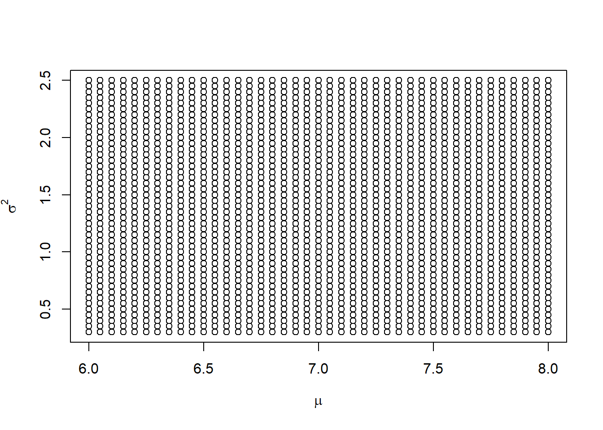
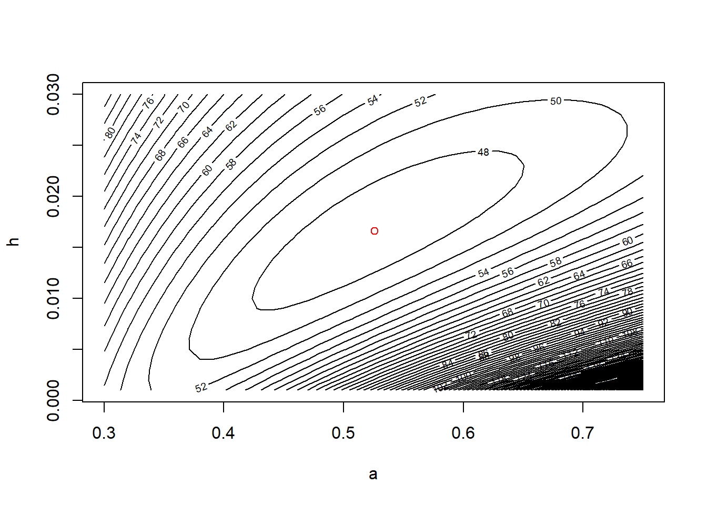

--- 
title: "BMA / ST 590 computing companion"
author: "Kevin Gross"
date: "2021-11-15"
output: bookdown::gitbook
documentclass: book
bibliography: [bma590.bib]
biblio-style: apalike
link-citations: yes
description: "This is a proto-textbook for BMA / ST 590, Statistical Modeling in Ecology, taught at NCSU in Fall 2021."
---

# Maximum likelihood estimation

## A very simple example with a single observation

Suppose we observe a single observation from a Poisson distribution.  Suppose that observation is $X=2$.  We can use the `dpois` function to evaluate the likelihood for this single observation.  For example, we can evaluate the likelihood at $\lambda = 1.5$:

```r
dpois(x = 2, lambda = 1.5)
```

```
## [1] 0.2510214
```
Or we could evaluate the likelihood at $\lambda = 2$ or $\lambda = 2.5$:

```r
dpois(x = 2, lambda = c(2, 2.5))
```

```
## [1] 0.2706706 0.2565156
```
Now let's evaluate the likelihood at a sequence of $\lambda$ values:

```r
lambda.vals <- seq(from = 0, to = 5, by = 0.01)
my.lhood <- dpois(x = 2, lambda = lambda.vals)
plot(lambda.vals, my.lhood, xlab = expression(lambda), ylab = "Likelihood", type = "l")
```


We might guess that the likelihood is maximized at $\lambda = 2$.  We'd be right.

```r
plot(lambda.vals, my.lhood, xlab = expression(lambda), ylab = "Likelihood", type = "l")
abline(v = 2, col = "red")
```


## Horse-kick data

Most real data sets contain more than a single observation.  Here is a data set that we can use to illustrate maximum likelihood estimation with a single parameter.  Famously, Ladislaus van Bortkewitsch (1868 - 1931) published how many members of the Prussiam army were killed by horse kicks in each of 20 years, for each of 14 army corps.  As a caveat, these data are often used to illustrate the Poisson distribution, as we will use them.  They match the Poisson distribution more neatly than we might expect for most data sets.

First import the data.  Note that the path name used here is specific to the file directory that was used to create this file.  The path name that you use will likely differ.

```r
horse <- read.table("data/horse.txt", header = TRUE)
```
Ask for a `summary` of the data to make sure the data have been imported correctly.

```r
summary(horse)
```

```
##       year         corps               deaths   
##  Min.   :1875   Length:280         Min.   :0.0  
##  1st Qu.:1880   Class :character   1st Qu.:0.0  
##  Median :1884   Mode  :character   Median :0.0  
##  Mean   :1884                      Mean   :0.7  
##  3rd Qu.:1889                      3rd Qu.:1.0  
##  Max.   :1894                      Max.   :4.0
```
We can also learn about the data by asking to see the first few records using the `head` command

```r
head(horse)
```

```
##   year corps deaths
## 1 1875    GC      0
## 2 1876    GC      2
## 3 1877    GC      2
## 4 1878    GC      1
## 5 1879    GC      0
## 6 1880    GC      0
```
or we can see the last few records using the `tail` command:

```r
tail(horse)
```

```
##     year corps deaths
## 275 1889   C15      2
## 276 1890   C15      2
## 277 1891   C15      0
## 278 1892   C15      0
## 279 1893   C15      0
## 280 1894   C15      0
```
Another useful function to keep in mind is the `str' function which tells you about the [str]ucture of an R object:

```r
str(horse)
```

```
## 'data.frame':	280 obs. of  3 variables:
##  $ year  : int  1875 1876 1877 1878 1879 1880 1881 1882 1883 1884 ...
##  $ corps : chr  "GC" "GC" "GC" "GC" ...
##  $ deaths: int  0 2 2 1 0 0 1 1 0 3 ...
```

Let's plot a histogram of the values:

```r
hist(horse$deaths,
     breaks = seq(from = min(horse$deaths) - 0.5, 
                  to = max(horse$deaths) + 0.5, 
                  by = 1))
```


### Calculate and plot the log-likelihood function

Create a function that calculates the log-likelihood for a value of $\lambda$:


```r
horse.ll <- function(my.lambda){
  
  ll.vals <- dpois(x = horse$deaths, lambda = my.lambda, log = TRUE)
  sum(ll.vals)
}
```
We can use this function to calculate the log-likelihood for any value of $\lambda$, such as $\lambda = 1$:

```r
horse.ll(1)
```

```
## [1] -328.2462
```

Let's calculate the log-likelihood for many values of $\lambda$, in preparation for making a plot.  We'll use a loop here, and not worry about vectorization.  


```r
# create a vector of lambda values using the 'seq'uence command
lambda.vals <- seq(from = 0.01, to = 2.0, by = 0.01)  

# create an empty vector to store the values of the log-likelihood
ll.vals <- double(length = length(lambda.vals))  

# use a loop to find the log-likelihood for each value in lambda.vals
for (i.lambda in 1:length(lambda.vals)) {
  ll.vals[i.lambda] <- horse.ll(lambda.vals[i.lambda])
}
```

Now plot the log-likelihood values vs.\ the values of $\lambda$:

```r
plot(ll.vals ~ lambda.vals, xlab = "lambda", ylab = "log likelihood", type = "l")
abline(v = 0.7, col = "red")
```


### Find the MLE numerically using 'optimize'

Bolker's book illustrates numerical optimization using the `optim` function.  The R documentation recommends using `optimize` for one-dimensional optimization, and `optim` for optimizing a function in several dimensions.  So, we will use `optimize` here.  We will enclose the entire call to `optimize` in parentheses so that the output is dumped to the command line in addition to being stored as `horse.mle`.

```r
(horse.mle <- optimize(f = horse.ll, interval = c(0.1, 2), maximum = TRUE))
```

```
## $maximum
## [1] 0.7000088
## 
## $objective
## [1] -314.1545
```

The `optimize` function returns a 'list'.  A list is an R object that contains components of different types. The numerically calculated MLE is $\hat{\lambda} \approx 0.7$.  The 'objective' component of \texttt{horse.mle} gives the value of the log-likelihood at that point.

## Myxomatosis data

The myxomatosis data are in Bolker's library `emdbook`.  First load the library.  If the library is not found, you will first have to download and install the library on your computer, using the Packages tab in RStudio.  The call to `data` loads the particular myxomatosis data set that we want into memory.

```r
library(emdbook)
data(MyxoTiter_sum)
```
Inspect the data to make sure they have been imported correctly.

```r
summary(MyxoTiter_sum)
```

```
##      grade            day             titer      
##  Min.   :1.000   Min.   : 2.000   Min.   :1.958  
##  1st Qu.:3.000   1st Qu.: 4.000   1st Qu.:5.400  
##  Median :4.000   Median : 8.000   Median :6.612  
##  Mean   :3.604   Mean   : 9.564   Mean   :6.331  
##  3rd Qu.:5.000   3rd Qu.:13.000   3rd Qu.:7.489  
##  Max.   :5.000   Max.   :28.000   Max.   :9.021
```

```r
head(MyxoTiter_sum)
```

```
##   grade day titer
## 1     1   2 5.207
## 2     1   2 5.734
## 3     1   2 6.613
## 4     1   3 5.997
## 5     1   3 6.612
## 6     1   3 6.810
```
Extract the subset of the data that corresponds to the "grade 1" viral strain.

```r
myxo <- subset(MyxoTiter_sum, grade == 1)
summary(myxo)
```

```
##      grade        day            titer      
##  Min.   :1   Min.   :2.000   Min.   :4.196  
##  1st Qu.:1   1st Qu.:3.500   1st Qu.:6.556  
##  Median :1   Median :5.000   Median :7.112  
##  Mean   :1   Mean   :5.037   Mean   :6.924  
##  3rd Qu.:1   3rd Qu.:6.000   3rd Qu.:7.543  
##  Max.   :1   Max.   :9.000   Max.   :8.499
```
Out of curiosity, let's make a scatterplot of the titer vs.\ the day

```r
with(myxo, plot(titer ~ day))
```


For the sake of this example, we will ignore the apparent (and unsurprising) relationship between titer and day, and instead will consider only the titer data.  We will regard these data as a random sample from a normal distribution.  For the sake of illustration, we will estimate the mean and variance of the normal distribution using the `optim` function in R.

First, we write a function to calculate the log likelihood.

```r
myxo.ll <- function(m, v){

  ll.vals <- dnorm(myxo$titer, mean = m, sd = sqrt(v), log = TRUE)
  sum(ll.vals)
}
```
Note that R's function for the pdf of a normal distribution --- `dnorm` --- is parameterized by the mean and standard deviation (SD) of the normal distribution.  Although it would be just as easy to find the MLE of the standard deviation $\sigma$, for the sake of illustration, we will seek the MLE of the variance, $\sigma^2$.  (It turns out that, if we write the MLE of the standard deviation as $\hat{\sigma}$ and the MLE of the variance as $\hat{\sigma}^2$, then $\hat{\sigma} = \sqrt{\hat{\sigma}^2}$.  This is an example of the {\em invarance property} of MLEs.)

We can use our function to calculate the likelihood for any choice of mean and variance.  For example, let's try $\mu = 6$ and $\sigma^2 = 1$.

```r
myxo.ll(m = 6, v = 1)
```

```
## [1] -47.91229
```
We want to maximize the likelihood using `optim`.  Unfortuantely, `optim` is a little finicky.  To use `optim`, we have to re-write our function `myxo.ll` so that the parameters to be estimated are passed to the function as a single vector.  Also, by default, `optim` performs minimization instead of maximization.  We can change this behavior when we call `optim`.  Alternatively, we can just re-define the function to return the negative log likelihood.  

```r
myxo.neg.ll <- function(pars){

  m <- pars[1]
  v <- pars[2]
  
  ll.vals <- dnorm(myxo$titer, mean = m, sd = sqrt(v), log = TRUE)
  -sum(ll.vals)
}
```
Now we can use `optim`:

```r
(myxo.mle <- optim(par = c(7, 1),  # starting values, just a ballpark guess 
                  fn  = myxo.neg.ll))
```

```
## $par
## [1] 6.9241029 0.8571471
## 
## $value
## [1] 36.23228
## 
## $counts
## function gradient 
##       55       NA 
## 
## $convergence
## [1] 0
## 
## $message
## NULL
```
Note that the MLE of the variance is
\[
\hat{\sigma}^2 = \frac{\sum_i (x_i - \bar{x})}{n}.
\]
Let's verify this by calculating the same quantity at the command line:

```r
residuals <- with(myxo, titer - mean(titer))
ss <- sum(residuals^2)
n <- length(myxo$titer)
ss / n
```

```
## [1] 0.8572684
```

Compare this to the answer given by `var`, and to the more usual calculation of the variance as
$$
s^2 = \frac{\sum_i (x_i - \bar{x})}{n-1}.
$$

```r
(var.usual <- ss / (n - 1))
```

```
## [1] 0.8902403
```

```r
var(myxo$titer)
```

```
## [1] 0.8902403
```

One main take-home of this example is that when we use maximum likelihood to estimate variances for normally distributed data, the MLE is biased low.  In other words, it underestimates the true variance.  When we study hierarchical models later in the semester, we will regularly find ourselves estimating variances for normally distributed effects, and will have to deal with the consequences of the fact that the MLEs of these variances are biased low.

For models with 2 parameters, we can visualize the likelihood surface with a contour plot.  To do so, the first step is to define a lattice of values at which we want to calculate the log-likelihood.  We'll do so by defining vectors for $\mu$ and $\sigma^2$:

```r
m.vals <- seq(from = 6, to = 8, by = 0.05)
v.vals <- seq(from = 0.3, to = 2.5, by = 0.05)
```

Here is some fancy R code that shows this lattice.  Don't worry about how this plot is created, as it isn't critical for what follows.

```r
plot(rep(m.vals, length(v.vals)), rep(v.vals, rep(length(m.vals), length(v.vals))),
     xlab = expression(mu),
     ylab = expression(sigma^2))
```



Now we will define the matrix that will store the values of the log-likelihood for each combination of $\mu$ and $\sigma^2$ in the lattice shown above.

```r
ll.vals <- matrix(nrow = length(m.vals), ncol = length(v.vals))
```

Next, we will write a nested loop that cycles through the lattice points, calculates the log-likelihood for each, and stores the value of the log likelihood in the matrix `ll.vals` that we just created.

```r
for (i.m in 1:length(m.vals)) {
  for(i.v in 1:length(v.vals)) {
    ll.vals[i.m, i.v] <- myxo.ll(m = m.vals[i.m], v = v.vals[i.v])
  }
}
```

Now we will use the `contour` function to build the contour plot, and then add a red dot for the MLE.

```r
contour(x = m.vals, y = v.vals, z = ll.vals, nlevels = 100,
        xlab = expression(mu), ylab = expression(sigma^2))

# show the MLE
points(x = myxo.mle$par[1], y = myxo.mle$par[2], col = "red")
```


## Tadpole data

Finally, we'll take a look at the data from the functional response experiment of Vonesh \& Bolker (2005), described in section 6.3.1.1 of Bolker's book.  This is another example of using likelihood to estimate parameters in a two-parameter model.  This example differs from the previous two examples because we won't assume that the data constitute a simple random sample from some known distribution like the Gaussian or Poisson distribution.  Instead, we'll build a somewhat more customized model for these data that incorporates some ecological ideas.  This process of building a customized model is more typical of how one would analyze a "real" data set.  We'll start by using the `rm` command to clean up the workspace.

```r
rm(list = ls())
```
First, we'll read in the data and explore them in various ways.


```r
library(emdbook)
data("ReedfrogFuncresp")

# rename something shorter

frog <- ReedfrogFuncresp
rm(ReedfrogFuncresp)

summary(frog)
```

```
##     Initial           Killed     
##  Min.   :  5.00   Min.   : 1.00  
##  1st Qu.: 13.75   1st Qu.: 5.75  
##  Median : 25.00   Median :10.00  
##  Mean   : 38.12   Mean   :13.25  
##  3rd Qu.: 56.25   3rd Qu.:18.75  
##  Max.   :100.00   Max.   :35.00
```

```r
head(frog)
```

```
##   Initial Killed
## 1       5      1
## 2       5      2
## 3      10      5
## 4      10      6
## 5      15     10
## 6      15      9
```

```r
plot(Killed ~ Initial, data = frog)
```


Following Bolker, we'll assume that the number of individuals killed takes a binomial distribution, where the number of trials equals the initial tadpole density, and the probability that a tadpole is killed is given by the expression
$$
p_i = \dfrac{a}{1 + a h N_i}
$$
The two parameters to estimate are $a$, which we interpret as the attack rate when the prey density is low, and $h$, which is the handling time.  We'll first construct the negative log-likelihood function.

```r
# negative log-likelihood, for use with optim

frog.neg.ll <- function(params){
  
  a <- params[1]
  h <- params[2]
  
  prob.vals <- a / (1 + a * h * frog$Initial)
  
  ll.vals <- dbinom(frog$Killed, size = frog$Initial, prob = prob.vals, log = TRUE)
  
  -1 * sum(ll.vals)
}
```

Now we'll find the MLE using `optim`

```r
(frog.mle <- optim(par = c(0.5, 1/40),
                   fn  = frog.neg.ll))
```

```
## Warning in dbinom(frog$Killed, size = frog$Initial, prob = prob.vals, log =
## TRUE): NaNs produced
```

```
## $par
## [1] 0.52592567 0.01660454
## 
## $value
## [1] 46.72136
## 
## $counts
## function gradient 
##       59       NA 
## 
## $convergence
## [1] 0
## 
## $message
## NULL
```

```r
# note the warnings

a.mle <- frog.mle$par[1]
h.mle <- frog.mle$par[2]
```

We'll plot the data and overlay a fitted line.

```r
# add a line to our plot to show the fitted curve

plot(Killed ~ Initial, data = frog)

init.values <- with(frog, seq(from = min(Initial), to = max(Initial), length = 100))
pred.values <- a.mle * init.values / (1 + a.mle * h.mle * init.values)

lines(x = init.values, y = pred.values, col = "red")
```


Finally, we'll plot the likelihood contours.

```r
# plot negative likelihood contours

a.vals <- seq(from = 0.3, to = 0.75, by = 0.01)
h.vals <- seq(from = 0.001, to = 0.03, by = 0.001)

ll.vals <- matrix(nrow = length(a.vals), ncol = length(h.vals))

for (i.a in 1:length(a.vals)) {
  for(i.h in 1:length(h.vals)) {
    ll.vals[i.a, i.h] <- frog.neg.ll(c(a.vals[i.a], h.vals[i.h]))
  }
}

contour(x = a.vals, y = h.vals, z = ll.vals, nlevels = 100,
        xlab = "a", ylab = "h")

points(x = a.mle, y = h.mle, col = "red")
```



Note that, in contrast to the Myxomatosis data, here the likelihood contours form regions whose major axes are not parallel to the parameter axes.  We'll reflect on the implications of this shape in the next section.
